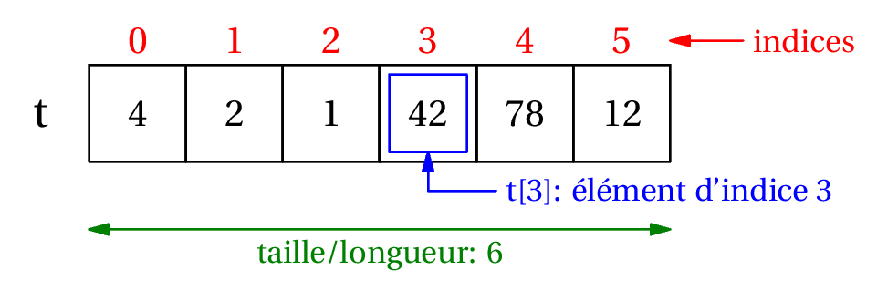
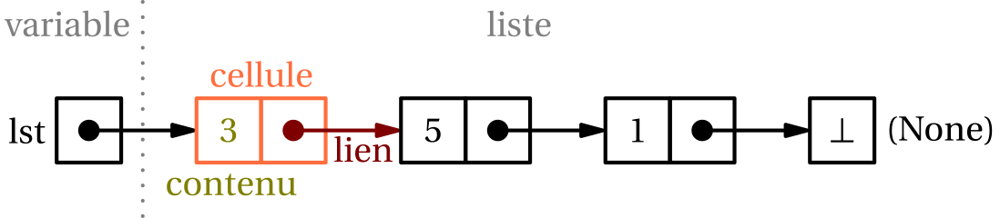
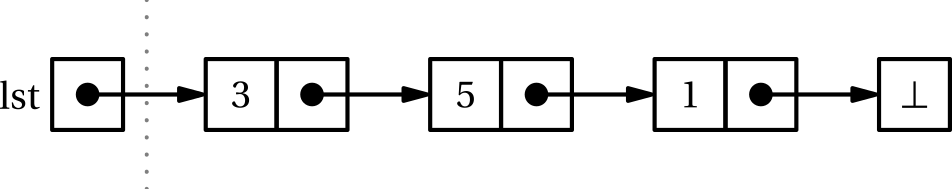

# T1.1 Listes chaînées
{{ initexo(0) }}

## 1.1.1 Retour sur les tableaux

Dans une structure de **tableau** (**array** en anglais), les données (ou une référence vers les données) sont organisées de manière séquentielle en mémoire, où chaque élément (ou référence) est de même type. On peut donc calculer la position de l’élément (ou de la référence) en mémoire en fonction de son numéro d’ordre dans la séquence.

En règle générale, la taille du tableau est connue à la déclaration. Dans ce cas, on ne peut pas ajouter d’élément au delà de la dernière case prévue.

{: .center width=480} 

Quelques propriétés des tableaux :

- création d'un tableau de taille donnée
- accès à un élément à partir de son indice en temps constant ($O(1)$)
- modification d’un élément à partir de son indice  en temps constant ($O(1)$)

En revanche, l'insertion d'un élément dans le tableau impose de décaler tous les élements d'un indice, elle se fait donc en temps linéaire, soit $O(n)$...

## 1.1.2 Liste chaînée

{: .center  width=480} 

Avec une structure de **liste (chaînée)**, on représente à nouveau une séquence d'éléments (à nouveau le plus souvent homogènes), mais les données ne sont pas nécessairement séquentielles en mémoire. On dispose en revanche d'un moyen permettant de passer d'un élément au suivant, d'où le terme *chaîné*.

Chaque élément est donc stocké dans un bloc mémoire **avec** une deuxième information: l'adresse de l'élément suivant. On parle de **maillon ou cellule** (ou encore **node**) pour désigner ces blocs.

{: .center width=640} 

On peut généralement ajouter de nouveaux éléments pour augmenter la taille de la structure dynamiquement.


Et finalement, une liste chaînée est soit vide, soit n'est qu'un lien vers une cellule, qui contient une valeur et un lien vers une cellule, qui est soit vide, soit n'est qu'un lien vers une cellule, qui contient une valeur et un lien vers une cellule, qui... On parle donc de *définition récursive* d'une liste chaînée.

!!! abstract "Interface"
    On dispose (ou souhaite disposer) sur une liste chaînée des méthodes/primitives suivantes:

    - construire une liste vide, souvent nommée `nil`
    - déterminer si la liste est vide (`est_vide`, `is_empty`)
    - insérer un élément en tête de liste (`insert`)
    - récupérer l'élément en tête de liste (`tete`, `head`)
    - récupérer la liste privée de son premier élément, appelée la **queue** (`queue`, `tail`)

    Ces opérations doivent être réalisées **en temps constant**, soit en $O(1)$.

    {: .center width=640} 

!!! warning "Accès à un élément"
    Pour accéder à un élément quelconque, il faut parcourir toute la liste jusqu'à trouver l'élément: le temps d'accès est linéaire, c'est-à-dire proportionnel à la taille de la liste (en $O(n)$) et donc non constant.


## 1.1.3 Implémentation d'une liste chaînée
queue


On va donc implémenter deux classes `Cellule` et `Liste` qui nous permettront de respecter l'interface demandée, ainsi qu'une fonction `construire` et la constante `nil` représentant la liste vide.

!!! code "Implémentation"

    On ne définit la méthode spéciale `__str__` uniquement pour vérifier et afficher de façon pratique la liste.

    ```python linenums='1'
    class Cellule:
        def __init__(self, v, p):
            self.valeur = v
            self.pointeur = p


    class Liste:
        def __init__(self, c):
            self.cellule = c

        def est_vide(self):
            return self.cellule == None

        def tete(self):
            return self.cellule.valeur

        def queue(self):
            return self.cellule.pointeur

        def __str__(self):
            l = []
            while not self.est_vide():
                l.append(str(self.tete()))
                self = self.queue()
            return ' -> '.join(l)

    def construire(tete, queue):
        return Liste(Cellule(tete, queue))

    nil = Liste(None)

    ```

    Il est important de bien séparer les deux classes `Liste` et `Cellule`, car l'attribut `pointeur` d’une cellule n’est pas une cellule mais bien une liste, c’est-à-dire, sur le schéma, un lien vers une cellule.
    
## 1.1.4 Exercices

!!! example "{{ exercice() }}"
    === "Énoncé" 
        Utiliser la fonction `construire` pour créer la liste `lst` de l'exemple:
        {: .center width=640}

        Vous devez avoir ensuite:
        ```python
        >>> print(l)
        3 -> 5 -> 1
        >>> l.tete()
        3
        >>> l.queue()
        <__main__.Liste object at 0x...>
        >>> print(l.queue())
        5 -> 1
        >>> l.queue().tete()
        5
        >>> l.queue().queue().tete()
        1
        ```
        

    === "Correction" 
        {{ correction(False, 
        "
        "
        ) }}


!!! example "{{ exercice() }}"
    === "Énoncé" 
        Écrire une fonction `longueur` qui renvoie la longueur d'une liste en paramètre (ou ajouter la méthode spéciale `__len__` à la classe `Liste`)

        Quelle est la complexité de cette fonction?
    === "Correction" 
        {{ correction(False, 
        "
        "
        ) }}

!!! example "{{ exercice() }}"
    === "Énoncé" 
        Ajouter la méthode `insert` à la classe `Liste`, qui insère une valeur **en tête** de liste.
    === "Correction"  
        {{ correction(False, 
        "
        "
        ) }}


!!! example "{{ exercice() }}"
    === "Énoncé" 
        Écrire les fonctions suivantes (récursivement si possible):
        
        1. `concat(lst1, lst2)` : fonction qui opère une concaténation de deux listes, c'est-à-dire les mettre bout à bout.
        2. `nieme(lst)` : fonction qui renvoie le n-ième élément de la liste.
        3. `occurences(x, lst)` : fonction qui renvoie le nombre d'occurences de la valeur `x` dans `lst`.

        Quelle est la complexité de ces fonctions?
    === "Correction" 
        {{ correction(False, 
        "
        "
        ) }}


