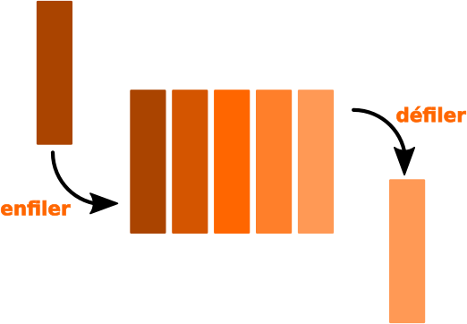

# T1.2 Piles et Files 

{{ initexo(0) }}

## 1.2.1 Les piles

Une **pile** (stack) est une structure de données *linéaire* contenant des éléments généralement *homogènes* fondée sur le principe «dernier arrivé, premier sorti» (en anglais **LIFO** : Last In, First Out).

{: .center width=320} 


**Exemples de situations utilisant une pile:**

- historiques: de navigation sur le Web, d'annulation d'instructions (Ctrl+Z)
- appels de fonctions récursives
- la Chandeleur

!!! abstract "Interface"
    On dispose (ou souhaite disposer) sur une pile des méthodes/primitives suivantes:

    - déterminer si la pile est vide (`est_vide`, `is_empty`)
    - **empiler** un nouvel élément au sommet de la pile (`empiler`, `push`)
    - **dépiler** l'élément du sommet de la pile (`depiler`, `pop`) et le renvoyer

    Ces opérations doivent être réalisées **en temps constant**, soit en $O(1)$.

    {: .center } 


## 1.2.2 Les files

Une **file** (queue) est une structure de données *linéaire* contenant des éléments généralement *homogènes* fondée sur le principe «premier arrivé, premier sorti» (en anglais **FIFO** : Fast In, First Out).

{: .center  width=320} 


**Exemples de situations utilisant une file:**

- file d'attente : documents soumis à impression, élèves à la cantine...
- gestion des processus

!!! abstract "Interface"
    On dispose (ou souhaite disposer) sur une file des méthodes/primitives suivantes:

    - déterminer si la file est vide (`is_empty`)
    - **enfiler** (ajouter) un nouvel élément dans la file (`enqueue`)
    - **défiler** l'élément de tête de la file (`dequeue`) et le renvoyer

    Ces opérations doivent être réalisées **en temps constant**, soit en $O(1)$.

    {: .center } 

## 1.2.3 Implémentations

### 1.2.3.1 Implémentations d'une pile

!!! code "Liste Python"
    L’implémentation Python du type `list` en fait un bon candidat pour la structure de pile :`append` (pour `push`) et `pop` sont les deux opérations utilisables sur les piles, toutes les deux en $O(1)$.


!!! note "Test de l'implémentation"
    Dans les deux exercices qui suivent, quelle que soit l'implémentation de la pile, le code suivant:

    ```python linenums='1'
    p = Pile()
    p.empiler("prems")
    p.empiler("deuz")
    print(p.depiler())
    p.empiler("troiz")
    while not p.est_vide():
        print(p.depiler())
    ```
    doit afficher:
    ```python
    deuz
    troiz
    prems
    ```
    
    
!!! example "{{ exercice() }}: avec une liste de Python"
    === "Énoncé" 
        Implémenter une classe `Pile` contenant les méthodes `est_vide`, `empiler` et `depiler` à l'aide des méthodes natives sur les listes de Python.

    === "Correction" 
        {{ correction(False, 
        "
        ```python linenums='1'
        class Pile:
            def __init__(self):
                self.contenu = []

            def est_vide(self):
                return self.contenu == []

            def empiler(self, valeur):
                self.contenu.append(valeur)

            def depiler(self):
                if self.est_vide():
                    raise IndexError('dépiler sur une pile vide')
                return self.contenu.pop()

        ```
        
        "
        ) }}

!!! example "{{ exercice() }}: avec une liste chaînée"
    === "Énoncé" 
        Implémenter une classe `Pile` contenant les méthodes `est_vide`, `empiler` et `depiler` à l'aide d'une liste chaînée:

        - empiler un nouvel élément revient à ajouter un élément en tête de liste;
        - dépiler un élément revient à supprimer l'élément de tête.

        La classe `Pile` contient ainsi un seul attribut `contenu` associé à la liste chaînée contenant les éléments de la pile.

    === "Correction" 
        {{ correction(False, 
        "
        ```python linenums='1'

        ```

        "
        ) }}

### 1.2.3.2 Implémentations d'une file

!!! note "Test de l'implémentation"
    Dans les trois exercices qui suivent, quelle que soit l'implémentation de la file, le code suivant:

    ```python linenums='1'
    f = File()
    f.enfiler("prems")
    f.enfiler("deuz")
    print(f.defiler())
    f.enfiler("troiz")
    while not f.est_vide():
        print(f.defiler())
    ```
    doit afficher:
    ```python
    prems
    deuz
    troiz
    ```


=== "Liste Python"

    !!! example "{{ exercice() }}"
        === "Énoncé" 
            Implémenter une classe `File` contenant les méthodes `est_vide`, `enfiler` et `defiler` à l'aide des méthodes natives sur les listes de Python (consulter l'aide sur la méthode `pop`).

        === "Correction" 
            {{ correction(False, 
            "
            ```python linenums='1'
            class File:
                def __init__(self):
                    self.contenu = []

                def est_vide(self):
                    return self.contenu == []

                def enfiler(self, valeur):
                    self.contenu.append(valeur)

                def defiler(self):
                    return self.contenu.pop(0)
            ```
            
            "
            ) }}

    !!! warning "Liste Python"
        Pour une file en revanche, le type `list`  de Python ne fournit pas une bonne implémentation d'une file, car la suppression en début de liste ne se fait pas en temps constant mais en temps linéaire $O(n)$ : il faut décaler les éléments un à un.


=== "Avec deux piles"
    Le principe est de disposer d'une pile d'entrée et d'une pile de sortie...

    !!! example "{{ exercice() }}"
        === "Énoncé" 
            Terminer l'implémentation d'une classe `File` ayant comme attributs une pile d'entrée et une pile de sortie.

            ```python linenums='1'
            class File:
                def __init__(self):
                    self.entree = Pile()
                    self.sortie = Pile()
            ```

            Cette implémentation respecte-t-elle la contrainte de complexité sur l'insertion en fin de file? la suppression en début de file?
        === "Correction" 
            {{ correction(False, 
            "
            ```python linenums='1'
            class File:
                def __init__(self):
                    self.entree = Pile()
                    self.sortie = Pile()

                def est_vide(self):
                    return self.entree.est_vide() and self.sortie.est_vide()

                def enfiler(self, valeur):
                    self.entree.empiler(valeur)

                def defiler(self):
                    if self.sortie.est_vide():
                        while not self.entree.est_vide():
                            self.sortie.empiler(self.entree.depiler())
                    return self.sortie.depiler()
            ```
            
            "
            ) }}

=== "Avec une liste chaînée (modifiée)"

    Comme pour une pile, on peut vouloir implémenter une file à l'aide d'une liste chaînée: si la suppression en tête de file (`defiler`) se fait en temps constant, en revanche l'ajout d'un élément en queue de liste se fait en temps linéaire... Il est donc nécessaire de modifier la structure de liste chaînée en lui attribuant également une référence vers le dernier élément de la liste: c'est une structure de type **deque** (*double-ended queue*).

    !!! code "Implémentation d'une file avec une deque"
        La principale différence avec une liste chaînée est qu'il doit y avoir un attribut référençant le dernier élément:

        ```python linenums='1'
        class File:
            """ Implémentation d'une file à partir d'une liste
                chainée
            """
            def __init__(self):
                self._first = None
                self._last = None
        ```
        
        Pour les méthodes `enfiler` et `defiler`, il faut gérer les références à la tête **et** à la fin de la liste.


## 1.2.4 Exercices

