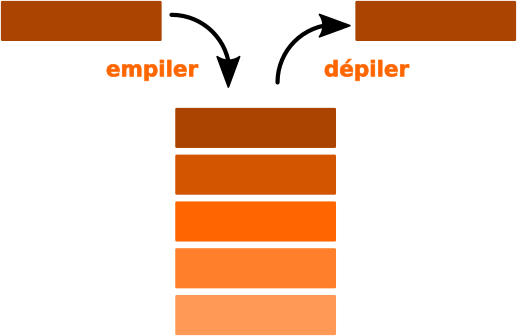

# T1.2 Piles et Files 

{{ initexo(0) }}

## 1.2.1 Les piles

Une **pile** (stack) est une structure de données *linéaire* contenant des éléments généralement *homogènes* fondée sur le principe «dernier arrivé, premier sorti» (en anglais **LIFO** : Last In, First Out).

{: .center width=320} 


**Exemples de situations utilisant une pile:**

- historiques: de navigation sur le Web, d'annulation d'instructions (Ctrl+Z)
- appels de fonctions récursives
- la Chandeleur
- parcours en profondeur d'un arbre/graphe (plus tard...)

!!! abstract "Interface"
    On dispose (ou souhaite disposer) sur une pile des méthodes/primitives suivantes:

    - déterminer si la pile est vide (`est_vide`, `is_empty`)
    - **empiler** un nouvel élément au sommet de la pile (`empiler`, `push`)
    - **dépiler** l'élément du sommet de la pile (`depiler`, `pop`) et le renvoyer

    Ces opérations doivent être réalisées **en temps constant**, soit en $O(1)$.

    {: .center } 


## 1.2.2 Les files

Une **file** (queue) est une structure de données *linéaire* contenant des éléments généralement *homogènes* fondée sur le principe «premier arrivé, premier sorti» (en anglais **FIFO** : Fast In, First Out).

{: .center  width=320} 


**Exemples de situations utilisant une file:**

- file d'attente : documents soumis à impression, élèves à la cantine...
- gestion des processus
- parcours en largeur d'un arbre/graphe (plus tard...)

!!! abstract "Interface"
    On dispose (ou souhaite disposer) sur une file des méthodes/primitives suivantes:

    - déterminer si la file est vide (`is_empty`)
    - **enfiler** (ajouter) un nouvel élément dans la file (`enqueue`)
    - **défiler** l'élément de tête de la file (`dequeue`) et le renvoyer

    Ces opérations doivent être réalisées **en temps constant**, soit en $O(1)$.

    {: .center } 

## 1.2.3 Implémentations

### 1.2.3.1 Implémentations d'une pile

!!! code "Liste Python"
    L’implémentation Python du type `list` en fait un bon candidat pour la structure de pile :`append` (pour `push`) et `pop` sont les deux opérations utilisables sur les piles, toutes les deux en $O(1)$.


!!! note "Test de l'implémentation"
    Dans les deux exercices qui suivent, quelle que soit l'implémentation de la pile, le code suivant:

    ```python linenums='1'
    p = Pile()
    p.empiler("prems")
    p.empiler("deuz")
    print(p.depiler())
    p.empiler("troiz")
    while not p.est_vide():
        print(p.depiler())
    ```
    doit afficher:
    ```python
    deuz
    troiz
    prems
    ```
    
    
!!! example "{{ exercice() }}: avec une liste de Python"
    === "Énoncé" 
        Implémenter une classe `Pile` contenant les méthodes `est_vide`, `empiler` et `depiler` à l'aide des méthodes natives sur les listes de Python.

    === "Correction" 
        {{ correction(True, 
        "
        ```python linenums='1'
        class Pile:
            def __init__(self):
                self.contenu = []

            def est_vide(self):
                return self.contenu == []

            def empiler(self, valeur):
                self.contenu.append(valeur)

            def depiler(self):
                if self.est_vide():
                    raise IndexError('dépiler sur une pile vide')
                return self.contenu.pop()

        ```
        
        "
        ) }}

!!! example "{{ exercice() }}: avec une liste chaînée"
    === "Énoncé" 
        Implémenter une classe `Pile` contenant les méthodes `est_vide`, `empiler` et `depiler` à l'aide d'une liste chaînée:

        - empiler un nouvel élément revient à ajouter un élément en tête de liste;
        - dépiler un élément revient à supprimer l'élément de tête.

        La classe `Pile` contient ainsi un seul attribut `contenu` associé à la liste chaînée contenant les éléments de la pile.

    === "Correction" 
        {{ correction(True, 
        "
        ```python linenums='1'
        class Pile:
            def __init__(self):
                self.contenu = Liste(None)

            def est_vide(self):
                return self.contenu.est_vide()

            def empiler(self, valeur):
                self.contenu.insert(valeur)

            def depiler(self):
                valeur = self.contenu.tete()
                self.contenu = self.contenu.queue()
                return valeur

        ```

        "
        ) }}

### 1.2.3.2 Implémentations d'une file

!!! note "Test de l'implémentation"
    Dans les trois exercices qui suivent, quelle que soit l'implémentation de la file, le code suivant:

    ```python linenums='1'
    f = File()
    f.enfiler("prems")
    f.enfiler("deuz")
    print(f.defiler())
    f.enfiler("troiz")
    while not f.est_vide():
        print(f.defiler())
    ```
    doit afficher:
    ```python
    prems
    deuz
    troiz
    ```


=== "Liste Python"

    !!! example "{{ exercice() }}"
        === "Énoncé" 
            Implémenter une classe `File` contenant les méthodes `est_vide`, `enfiler` et `defiler` à l'aide des méthodes natives sur les listes de Python (consulter l'aide sur la méthode `pop`).

        === "Correction" 
            {{ correction(True, 
            "
            ```python linenums='1'
            class File:
                def __init__(self):
                    self.contenu = []

                def est_vide(self):
                    return self.contenu == []

                def enfiler(self, valeur):
                    self.contenu.append(valeur)

                def defiler(self):
                    return self.contenu.pop(0)
            ```
            
            "
            ) }}

    !!! warning "Liste Python"
        Pour une file en revanche, le type `list`  de Python ne fournit pas une bonne implémentation d'une file, car la suppression en début de liste ne se fait pas en temps constant mais en temps linéaire $O(n)$ : il faut décaler les éléments un à un.


=== "Avec deux piles"
    Le principe est de disposer d'une pile d'entrée et d'une pile de sortie...

    !!! example "{{ exercice() }}"
        === "Énoncé" 
            Terminer l'implémentation d'une classe `File` ayant comme attributs une pile d'entrée et une pile de sortie.

            ```python linenums='1'
            class File:
                def __init__(self):
                    self.entree = Pile()
                    self.sortie = Pile()
            ```

            Cette implémentation respecte-t-elle la contrainte de complexité sur l'insertion en fin de file? la suppression en début de file?
        === "Correction" 
            {{ correction(True, 
            "
            ```python linenums='1'
            class File:
                def __init__(self):
                    self.entree = Pile()
                    self.sortie = Pile()

                def est_vide(self):
                    return self.entree.est_vide() and self.sortie.est_vide()

                def enfiler(self, valeur):
                    self.entree.empiler(valeur)

                def defiler(self):
                    if self.sortie.est_vide():
                        while not self.entree.est_vide():
                            self.sortie.empiler(self.entree.depiler())
                    return self.sortie.depiler()
            ```
            
            "
            ) }}

=== "Avec une liste chaînée (modifiée)"

    Comme pour une pile, on peut vouloir implémenter une file à l'aide d'une liste chaînée: si la suppression en tête de file (`defiler`) se fait en temps constant, en revanche l'ajout d'un élément en queue de liste se fait en temps linéaire... Il est donc nécessaire de modifier la structure de liste chaînée en lui attribuant également une référence vers le dernier élément de la liste: c'est une structure de type **deque** (*double-ended queue*).

    !!! code "Implémentation d'une file avec une deque"
        La principale différence avec une liste chaînée est qu'il doit y avoir un attribut référençant le dernier élément:

        ```python linenums='1'
        class File:
            """ Implémentation d'une file à partir d'une liste
                chainée
            """
            def __init__(self):
                self._first = None
                self._last = None
        ```
        
        Pour les méthodes `enfiler` et `defiler`, il faut gérer les références à la tête **et** à la fin de la liste.

    !!! example "{{ exercice() }}"
        === "Énoncé" 
            Terminer l'implémentation de la classe `File`.
        === "Correction" 
            {{ correction(False, 
            "
            class File:
            def __init__(self):
                self.first = None
                self.last = None

            def est_vide(self):
                return self.first == None

            def enfiler(self, valeur):
                c = Cellule(valeur, None)
                if self.last == None:
                    self.first = c
                else:
                    self.last.queue = c
                self.last = c

            def defiler(self):
                valeur = self.first.valeur
                self.first = self.first.pointeur
                if self.first == None:
                    self.last = None
                return valeur
            "
            ) }}


## 1.2.4 Exercices

!!! example "{{ exercice() }}: calculatrice polonaise inverse"
    === "Énoncé" 
        L'écriture polonaise inverse des expressions arithmétiques place l'opérateur après ses opérandes. Cette notation ne nécessite aucune parenthèse ni aucune règle de priorité.
        
        Ainsi l'expression polonaise inverse décrite par la chaîne de caractères: `'1 2 3 * + 4 *'` désigne l'expression traditionnellement notée $(1+2\times3)\times4$.
        
        Écrire une fonction `eval_pol_inv` prenant en paramètre une chaîne de caractères représentant une expression en notation polonaise inverse composée d'additions et de multiplications de nombres entiers et renvoyant la valeur de cette expression. On supposera que les éléments de l'expression sont séparés par des espaces.
        
        Attention: cette fonction ne doit pas renvoyer de résultat (ou `None`) si l'expression est mal écrite.

        **Quelques tests:**
        ```python linenums='1'
        assert eval_pol_inv('2 1 7 + 5 * +') == 42
        assert eval_pol_inv('1 + 2') == None
        ```


    === "Indication"
        La valeur d'une telle expression peut être calculée facilement en utilisant une pile pour stocker les résultats intermédiaires. Pour cela, on observe un à un les éléments de l'expression et on effectue les actions suivantes :

        - si on voit un nombre, on le place sur la pile;
        - si on voit un opérateur binaire, on récupère les deux nombres au sommet de la pile, on leur applique l'opérateur, et on replace le résultat sur la pile.

        Si l'expression était bien écrite, il y a bien toujours deux nombres sur la pile lorsque l'on voit un opérateur, et à la fin du processus il reste exactement un nombre sur la pile, qui est le résultat.
        
    === "Correction" 
        {{ correction(False, 
        "
        ```python linenums='1'
        from TAD import Pile


        def eval_pol_inv(expression:str) -> float:
            '''
            renvoie l'évaluation d'une expression artithmétique donnée en notation 
            polonaise inverse
            - expression : chaîne de caractère (avec opérandes entiers)
            - retour None si expression non valide
            '''
            operandes = Pile()
            for element in expression.split():
                if element.isdecimal():
                    operandes.empiler(int(element))
                else:
                    if operandes.est_vide():
                        return None
                    else:
                        y = operandes.depiler()
                    if operandes.est_vide():
                        return None
                    else:
                        x = operandes.depiler()
                    if element == '+':
                        resultat = x + y
                    elif element == '-':
                        resultat = x - y
                    elif element == '*':
                        resultat = x * y
                    elif element == '/':
                        resultat = x / y
                    else:
                        return None
                    operandes.empiler(resultat)
            return operandes.depiler()


        assert eval_pol_inv('1 2 3 * + 4 *') == 28
        assert eval_pol_inv('2 1 7 + 5 * +') == 42
        assert eval_pol_inv('1 + 2') == None
        ```
        
        **Astuce pour aller plus vite:** on associe dans un dictionnaire une fonction `lambda` à chaque symbole opératoire...

        ```python
        operations = {'+':(lambda x,y:x+y), '-':(lambda x,y:x-y), '*':(lambda x,y:x*y), '/':(lambda x,y:x/y)}
        ```
        
        "
        ) }}

!!! example "{{ exercice() }}"
    === "Énoncé" 
        Dans cet exercice, on utilise une classe `Pile` implémentée avec une liste de Python et possédant ses quatre éléments d'interface usuels:

        - Un constructeur qui permet de créer une pile vide, représentée par `[]` ;
        - La méthode `est_vide()` qui renvoie `True` si l'objet est une pile ne contenant aucun élément, et `False` sinon ;
        - La méthode `empiler` qui prend un objet quelconque en paramètre et ajoute cet objet au sommet de la pile. Dans la représentation de la pile dans la console, cet objet apparaît à droite des autres éléments de la pile ;
        - La méthode `depiler` qui renvoie l'objet présent au sommet de la pile et le retire de la pile.

        **Exemples:**
        ```python
        >>> mapile = Pile()
        >>> mapile.empiler(2)
        >>> mapile
        [2]
        >>> mapile.empiler(3)
        >>> mapile.empiler(50)
        >>> mapile
        [2, 3, 50]
        >>> mapile.depiler()
        50
        >>> mapile
        [2, 3]
        ```
        
        1. La méthode `est_triee` ci-dessous renvoie `True` si, en dépilant tous les éléments un par un , ils
        sont traités dans l'ordre croissant, et `False` sinon. Compléter les lignes 6 et 8.

            ```python linenums='1'
            def est_triee(self):
                if not self.est_vide() :
                    e1 = self.depiler()
                    while not self.est_vide():
                        e2 = self.depiler()
                        if e1 ... e2 :
                            return False
                        e1 = ...
                return True
            ```
        
        2. On crée dans la console la pile `A` représentée par `[1, 2, 3, 4]`.

            **a.** Donner la valeur renvoyée par l'appel `A.est_triee()`.

            **b.** Donner le contenu de la pile `A` après l'exécution de cette instruction.

        3. On souhaite maintenant écrire le code d'une méthode `depileMax` d'une pile non vide
        ne contenant que des nombres entiers et renvoyant le plus grand élément de cette pile
        en le retirant de la pile.

            Après l'exécution de `p.depileMax()`, le nombre d'éléments de la pile `p` diminue donc de 1.
            
            Compléter les lignes 9 et 11 :

            ```python linenums='1'
            def depileMax(self):
                assert not self.est_vide(), "Pile vide"
                q = Pile()
                maxi = self.depiler()
                while not self.est_vide() :
                    elt = self.depiler()
                    if maxi < elt :
                        q.empiler(maxi)
                        maxi = ...
                    else :
                        ...
                while not q.est_vide():
                    self.empiler(q.depiler())
                return maxi
            ```
        4. On crée la pile `B` représentée par `[9, -7, 8, 12, 4]` et on effectue l’appel `B.depileMax()`.
        
            **a.** Donner le contenu des piles `B` et `q` à la fin de chaque itération de la boucle `while` de la ligne 5.
            
            **b.** Donner le contenu des piles `B` et `q` avant l’exécution de la ligne 14.

            **c.** Donner un exemple de pile qui montre que l'ordre des éléments restants n’est pas préservé après l’exécution de `depileMax`.
            
    === "Correction" 
        {{ correction(False, 
        "
        "
        ) }}

!!! example "{{ exercice() }}: files d'attente"
    === "Énoncé" 
        Dans cet exercice, on se propose d'évaluer le temps d'attente de clients à des guichets, en comparant la solution d'une unique file d'attente et la solution d'une file d'attente par guichet.
        
        Pour cela, on modélise le temps par une variable globale, qui est incrémentée à chaque tour de boucle. Lorsqu'un nouveau client arrive, il est placé dans une file sous la forme d'un entier égal à la valeur de l'horloge, c'est-à-dire égal à son heure d'arrivée. Lorsqu'un client est servi, c'est-à-dire lorsqu'il sort de sa file d'attente, on obtient son temps d'attente en faisant la soustraction de la valeur courante de l'horloge et de la valeur qui vient d'être retirée de la file.
        
        L'idée est de faire tourner une telle simulation relativement longtemps, tout en totalisant le nombre de clients servis et le temps d'attente cumulé sur tous les clients. Le rapport de ces deux quantités nous donne le temps d'attente moyen. On peut alors comparer plusieurs stratégies (une ou plusieurs files, choix d'une file au hasard quand il y en a plusieurs, choix de la file où il y a le moins de clients, etc.).

        On se donne un nombre N de guichets (par exemple, N = 5). Pour simuler la disponibilité d'un guichet, on peut se donner un tableau d'entiers `dispo` de taille N. La valeur de `dispo[i]` indique le nombre de tours d'hor loge où le guichet `i` sera occupé. En particulier, lorsque cette valeur vaut 0, cela veut dire que le guichet est libre et peut donc servir un nouveau client. Lorsqu'un client est servi par le guichet 1, on choisit un temps de traitement pour ce client, au hasard entre 0 et N, et on l'affecte à `dispo[i]`.
        
        À chaque tour d'horloge, on réalise deux opérations:
        
        - on fait apparaître un nouveau client;
        - pour chaque guichet `i`:
            * s'il est disponible, il sert un nouveau client (pris dans sa propre file ou dans l'unique file, selon le modèle), le cas échéant;
            * sinon, on décrémente `dispo[i]`.

        Écrire un programme qui effectue une telle simulation, sur 100 tours d'horloge, et affiche au final le temps d'attente moyen. Comparer avec différentes stratégies.

    === "Correction" 
        {{ correction(False, 
        "
        "
        ) }}