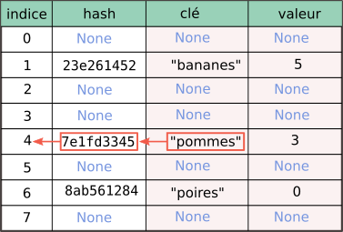

# T1.3 Dictionnaires

{{ initexo(0) }}

## 1. Retour sur les dictionnaires

Au préalable, on peut relire le [chapitre de Première](https://cgouygou.github.io/1NSI/T02_TypesConstruits/T2.3_Dictionnaires/T2.3_Dictionnaires/){:target="_blank"}.

En Python, un dictionnaire (`<class 'dict'>`) est une structure de données native qui permet de représenter le type abstrait de données appelé *tableau associatif* ou *p-uplet nommé* qui correspond à un tableau dont les valeurs sont indexées par des clés, et dont l'interface contient généralement les opérations:

- **ajout** : association d'une nouvelle valeur à une nouvelle clé ;
- **modification** : association d'une nouvelle valeur à une ancienne clé ;
- **suppression** : suppression d'une clé (et donc de la valeur);
- **recherche** : détermination de la valeur associée à une clé, si elle existe.

Puisqu'un tableau associatif est un ensemble de couples *clé:valeur*, on pourrait penser l'implémenter simplement avec une simple liste de couples. Mais ainsi la recherche d'une clé (pour modification, suppression ou recherche) ne correspondrait plus à l'indice du couple dans la liste. Il faudrait donc pour chaque clé faire une recherche dans la liste.

!!! example "`list` vs. `dict` : comparaison des temps d'exécution d'une recherche"
    === "Énoncé" 
        On se propose de mesurer le temps d'exécution d'une recherche d'un élément dans une liste, et dans un dictionnaire. Pour cela on se place dans «le pire des cas», c'est-à-dire où la valeur recherchée n'appartient pas à la structure étudiée (liste ou dictionnaire).

        On crée donc deux fonctions:

        - `timeit_lst` : construit une liste d'entiers de taille `N` donnée en paramètre;
        - `timeit_dct` : construit un dictionnaire de taille `N` donnée en paramètre dont les clés sont des entiers, puis qui y recherche ensuite le `str` `"a"`... un certain nombre de fois (`nbloop`) en mesurant le temps d'exécution à l'aide de la fonction `time` du module `time` pour obtenir une moyenne.

        ```python linenums='1'
        import time

        def timeit_lst(N, nbloop=10000):
            lst = list(range(N))
            total_time = 0
            for _ in range(nbloop):
                t0 = time.time()
                "a" in lst
                total_time += time.time() - t0
            return total_time / nbloop

        def timeit_dct(N, nbloop=10000):
            dct = {k: 42 for k in range(N)}
            total_time = 0
            for _ in range(nbloop):
                t0 = time.time()
                "a" in dct
                total_time += time.time() - t0
            return total_time / nbloop
        ```

        1. Exécuter chacune de ces deux fonctions pour les valeurs de `N` : 10, 100, 1000, 10000. Noter un ordre de grandeur des temps moyens obtenus.
        2. Comment augmente le temps moyen d'exécution de recherche **dans une liste** lorsque `N` est multiplié par 10? par 100? par 1000? En déduire la *complexité* de la recherche dans une liste.
        3. Même question que précédemment pour la recherche dans un dictionnaire.

        !!! tip "Construire un graphique"

            Pour illustrer (ou observer) ces complexités, on peut tracer un graphique représentant l'évolution du temps d'exécution en fonction de `N`.

            Pour cela, on utilise le module `matplotlib` en reliant des points dont les abscisses sont dans une première liste (`tailles` par ex.) et les ordonnées dans une autre (`temps` par ex.):

            ```python linenums='1'
            import matplotlib.pyplot as plt

            ...
            
            plt.plot(tailles, temps)
            plt.show()

            ```


    === "Correction" 
        {{ correction(True, 
        "
        Commençons par créer une liste contenant les valeurs de N demandées, puis les temps obtenus pour chaque fonction:
        ```python linenums='1'
        tailles = [10**k for k in range(1, 5)]
        temps_lst = [timeit_lst(t) for t in tailles]
        temps_dct = [timeit_dct(t) for t in tailles]
        ```
        On consulte les résultats:

        ```python linenums='1'
        >>> temps_lst
        [4.877660751342774e-07, 1.0341405868530274e-06, 9.165668487548829e-06, 9.01775360107422e-05]

        >>> temps_dct
        [1.1785030364990235e-07, 1.2145042419433593e-07, 1.1537075042724609e-07, 1.226663589477539e-07]
        ```

        On constate les temps d'exécution suivants (en ordre de grandeur, c'est-à-dire la puissance de 10 la plus proche)

        | N| 10 | 100 | 1000 | 10000 |
        |-|:-:|:-:|:-:|:-:|
        |Temps d'exécution pour la recherche dans une liste| $10^{-7}$ |$10^{-6}$ |$10^{-5}$ |$10^{-4}$ |
        |Temps d'exécution pour la recherche dans un dictionnaire| $10^{-7}$ |$10^{-7}$ |$10^{-7}$ |$10^{-7}$ |
        

        Autrement dit, pour la recherche dans une liste, lorsqu'on multiplie N par 10, le temps d'exécution est lui aussi multiplié par 10, ce qui exprime la proportionnalité du temps d'exécution par rapport à N : la complexité est linéaire, en $O(n)$.

        En revanche, pour la recherche dans une dictionnaire, le temps d'exécution ne varie pas: la complexité est en temps constant, en $O(1)$.

        Cela s'illustre assez bien avec un graphique:

        ```python linenums='1'
        import matplotlib.pyplot as plt

        # insérer ici les fonctions et listes précédentes

        plt.plot(tailles, temps_lst, tailles, temps_dct)
        plt.show()
        ```

        {: .center width=320} 
        "
        ) }}


## 2. Table de hachage

Puisqu'un tableau classique ne convient pas, il existe principalement deux méthodes pour implémenter **correctement** un tableau associatif:

- un arbre binaire de recherche;
- une table de hachage.

Python, avec le type `dict`, utilise une table de hachage.

!!! abstract "Principe d'une table de hachage"
    Une table de hachage est un **tableau couplé à une [fonction de hachage](https://cgouygou.github.io/TNSI/T09_Extras/Hachage/){:target="_blank"}**.
    
    Le dictionnaire `#!py d = {"pommes":3, "poires":0, "bananes":5}`  sera implémenté dans un tableau comme celui-ci:

    {: .center} 

    - À chaque nouvelle clé, la fonction de hachage calcule un nombre entier (le «haché», ou «condensé»): par exemple `"pommes"` sera haché en `7e1fd3345`;
    - un calcul sur cet entier donne un indice correspondant à la clé dans le tableau, généralement en prenant le reste de la
    division euclidienne de la valeur de hachage par la taille du tableau: `7e1fd3345` devient l'indice `4`;
    - On obtient ainsi la position du couple (clé, valeur) dans le tableau, pour l’ajout ou pour la recherche.
    
    Le calcul de l’indice à partir de la clé s’effectue donc en temps constant. Et Python sait où chercher une clé: soit il la trouve à l'indice calculé, soit il n'y a rien et la clé n'appartient pas au dictionnaire.


!!! warning "Collisions"
    En théorie, toutes les clés peuvent être associées au même indice et terminer dans la même alvéole (case
    du tableau, bucket en anglais). La recherche d’une clé s’effectue alors en $O(n)$. C’est le pire des cas.

    En pratique, le semblant d’aléatoire de la fonction de hachage permet généralement une répartition
    équilibrée dans le tableau avec un petit nombre de couples dans chaque alvéole. Si le nombre de collisions
    (couples dans chaque alvéole) est majoré par une constante (au plus quatre couples dans chaque alvéole
    par exemple), l’ajout ou la recherche d’une clé sont en temps constant.

    En résumé, avec une table de hachage, l’ajout ou la recherche d’une valeur sont généralement en temps
    constant, en $O(1)$, mais peuvent être en $O(n)$ dans le pire des cas. Cela dépend des collisions.

!!! danger "Clé non mutables"
    On ne peut pas utiliser un objet mutable comme clé: un dictionnaire a besoin d'avoir des clés dont les hachés sont définitifs.

    Or si on prend une liste par exemple comme clé, on pourrait la modifier en dehors et donc ne plus la trouver dans le dictionnaire puisque son haché (et donc son indice dans le tableau) aurait changé!

    On dit également que le type `list` n'est pas hachable.

    ```python
    >>> lst = ["non", "hachable"]
    >>> dico = {lst : "non non non"}
    Traceback (most recent call last):
      File "<console>", line 1, in <module>
    TypeError: unhashable type: 'list'
    ```

## 3. Exercices

!!! example "{{ exercice() }}"
    === "Énoncé" 
        L’ARN contient le codage des protéines, composées de chaines d’acides aminés.
        
        Le dictionnaire ci-dessous donne les correspondances entre les codons, des séquences d’ARN constitués de trois nucléotides, et les acides aminés.

        La séquence AUG, par exemple, correspond à la méthionine, notée M.

        ```python linenums='1'
        dico_gen = {'UUU' : 'F', 'UUC' : 'F', 'UUG' : 'L', 'UUA' : 'L', 'UCU' : 'S',
        'UCC' : 'S', 'UCG' : 'S', 'UCA' : 'S', 'UAU' : 'Y', 'UAC' : 'Y',
        'UAG' : 'X', 'UAA' : 'X', 'UGU' : 'C', 'UGC' : 'C', 'UGG' : 'W',
        'UGA' : 'X', 'CUU' : 'L', 'CUC' : 'L', 'CUG' : 'L', 'CUA' : 'L',
        'CCU' : 'P', 'CCC' : 'P', 'CCG' : 'P', 'CCA' : 'P', 'CGU' : 'R',
        'CGC' : 'R', 'CGG' : 'R', 'CGA' : 'R', 'CAU' : 'H', 'CAC' : 'H',
        'CAG' : 'Q', 'CAA' : 'Q', 'ACU' : 'T', 'ACC' : 'T', 'ACG' : 'T',
        'ACA' : 'T', 'AUG' : 'M', 'AUU' : 'I', 'AUC' : 'I', 'AUA' : 'I',
        'AAU' : 'N', 'AAC' : 'N', 'AAG' : 'K', 'AAA' : 'K', 'AGU' : 'S',
        'AGC' : 'S', 'AGG' : 'R', 'AGA' : 'R', 'GUU' : 'V', 'GUC' : 'V',
        'GUG' : 'V', 'GUA' : 'V', 'GCU' : 'A', 'GCC' : 'A', 'GCG' : 'A',
        'GCA' : 'A', 'GGU' : 'G', 'GGC' : 'G', 'GGG' : 'G', 'GGA' : 'G',
        'GAU' : 'D', 'GAC' : 'D', 'GAG' : 'E', 'GAA' : 'E'}
        ```
                
        Écrire une fonction `traduction` qui traduit une chaine d’ARN en protéine. On suppose que la longueur
        de la chaine d’ARN est un multiple de trois. Ainsi, `traduction('UUCAGUGGG')` renverra `'FSG'`.
        
    === "Correction" 
        {{ correction(False, 
        "
        ```python linenums='1'
        def traduction(arn:str) -> str:
            '''
            traduit la chaîne arn en suite d'acides aminés.
            '''
            proteine = ''
            for i in range(0, len(arn), 3):
                codon = arn[i] + arn[i+1] + arn[i+2] # ou arn[i:i+3]
                acide = dico_gen[codon]
                proteine += acide
            return proteine

        assert traduction('UUCAGUGGG') == 'FSG'
        ```
        
        "
        ) }}

!!! example "{{ exercice() }}"
    === "Énoncé" 

        Une ville souhaite gérer son parc de vélos en location partagée. L’ensemble de la flotte de vélos est stocké dans une table de données représentée en langage Python par un dictionnaire contenant des associations de type `id_velo : dict_velo` où `id_velo` est un nombre entier compris entre 1 et 199 qui correspond à l'identifiant unique du vélo et `dict_velo` est un dictionnaire dont les clés sont : `"type"`, `"etat"`, `"station"`.
        Les valeurs associées aux clés `"type"`, `"etat"`, `"station"` de `dict_velo` sont de type chaînes de caractères ou nombre entier :

        - `"type"` : chaîne de caractères qui peut prendre la valeur `"electrique"` ou `"classique"`;
        - `"état"` : nombre entier qui peut prendre la valeur 1 si le vélo est disponible, 0 si le vélo est en déplacement, -1 si le vélo est en panne;
        - `"station"` : chaînes de caractères qui identifie la station où est garé le vélo.

        Dans le cas où le vélo est en déplacement ou en panne, `"station"` correspond à celle
        où il a été dernièrement stationné.
        Voici un extrait de la table de données :

        ```python
        flotte = {
            12 : {"type" : "electrique", "etat" : 1, "station" : "Prefecture"},
            80 : {"type" : "classique", "etat" : 0, "station" : "Saint-Leu"},
            45 : {"type" : "classique", "etat" : 1, "station" : "Baraban"},
            41 : {"type" : "classique", "etat" : -1, "station" : "Citadelle"},
            26 : {"type" : "classique", "etat" : 1, "station" : "Coliseum"},
            28 : {"type" : "electrique", "etat" : 0, "station" : "Coliseum"},
            74 : {"type" : "electrique", "etat" : 1, "station" : "Jacobins"},
            13 : {"type" : "classique", "etat" : 0, "station" : "Citadelle"},
            83 : {"type" : "classique", "etat" : -1, "station" : "Saint-Leu"},
            22 : {"type" : "electrique", "etat" : -1, "station" : "Joffre"}
        }
        ```


        `flotte` étant une variable globale du programme.

        Toutes les questions de cet exercice se réfèrent à l'extrait de la table flotte fourni ci-dessus.


        1. **a.** Que renvoie l'instruction `flotte[26]` ?

            **b.** Que renvoie l'instruction `flotte[80]["etat"]` ?

            **c.** Que renvoie l'instruction `flotte[99]["etat"]` ?

        2. Voici le script d'une fonction :
            ```python
            def proposition(choix):
                for v in flotte:
                    if flotte[v]["type"] == choix and flotte[v]["etat"] == 1:
                        return flotte[v]["station"]
            ```

            **a.** Quelles sont les valeurs possibles de la variable `choix` ?

            **b.** Expliquer ce que renvoie la fonction lorsque l'on choisit comme paramètre l'une des valeurs possibles de la variable `choix`.

        3. **a.** Écrire un script en langage Python qui affiche les identifiants `(id_velo)` de tous les vélos disponibles à la station` "Citadelle"`.

            **b.** Écrire un script en langage Python qui permet d'afficher l'identifiant `(id_velo)` et la station de tous les vélos électriques qui ne sont pas en panne.

        4. On dispose d'une table de données des positions GPS de toutes les stations, dont un extrait est donné ci-dessous. Cette table est stockée sous forme d’un dictionnaire.
            Chaque élément du dictionnaire est du type: `#!py 'nom de la station' : (latitude, longitude)`:

            ```python 
            stations = {
                'Prefecture' : (49.8905, 2.2967) ,
                'Saint-Leu' : (49.8982, 2.3017),
                'Coliseum' : (49.8942, 2.2874),
                'Jacobins' : (49.8912, 2.3016)
            }
            ```


            On **admet** que l'on dispose d'une fonction `distance` permettant de renvoyer la distance en mètres entre deux positions données par leurs coordonnées GPS (latitude et longitude).

            Cette fonction prend en paramètre deux tuples représentant les coordonnées des
            deux positions GPS et renvoie un nombre entier représentant cette distance en
            mètres.

            Par exemple, `distance((49.8905, 2.2967), (49.8912, 2.3016))` renvoie `9591`.

            Écrire une fonction qui prend en paramètre les coordonnées GPS de l'utilisateur
            sous forme d’un tuple et qui renvoie, pour chaque station située à moins de 800
            mètres de l'utilisateur :

            - le nom de la station ;
            - la distance entre l'utilisateur et la station ;
            - les identifiants des vélos disponibles dans cette station.

            Une station où aucun vélo n’est disponible ne doit pas être affichée.
    === "Correction" 
        {{ correction(False, 
        "
        "
        ) }}

    

!!! example "{{ exercice() }}"
    === "Énoncé" 
        La cryptographie est un ensemble de techniques permettant de chiffrer un message.

        Une technique de cryptographie consiste à mélanger les lettres d'un alphabet et à réécrire le message avec ces permutations. En Python, on peut créer un dictionnaire dans lequel les clés sont les lettres de l'alphabet et les valeurs sont celles de l'alphabet mélangé.

        !!! note "Exemple"
            Par exemple, si l'alphabet contient les 4 lettres A, B, C et D, et si le dictionnaire de l'alphabet mélangé est 
            
            ```python
            alpha = {"A": "B", "B": "D", "C": "A", "D": "C"}
            ```
            la chaine de caractères `"BAC"` sera chiffrée `"DBA"`.

            Un tel dictionnaire sera appelé **dictionnaire de chiffrement**.

        1. On souhaite chiffrer un message écrit avec l'alphabet A, B, C, D, E, F, G à l'aide du dictionnaire `#!py alpha ={"A": "B", "B": "D", "C": "A", "D": "C", "E": "F", "F": "G", "G": "E"}`

            **a.** Quelle est la valeur associée à la clé `"D"` ? En Python, comment l'obtenir ?

            **b.** Chiffrer la chaine de caractères `"BAGAGE"` avec le dictionnaire `alpha`.

        2. On considère qu'un mot est une chaine de caractères (un objet de type `str`) écrite uniquement avec les 26 lettres de l'alphabet en majuscule. Par exemple, `"ARBRE"` est un mot et `"L'ARBRE !"` n'est pas un mot à cause des caractères : `"'"`, `" "`(espace) et `"!"`.

            Écrire une fonction `chiffre` qui prend en paramètres `mot` un mot et `alpha` un dictionnaire de chiffrement, telle que `chiffre(mot, alpha)` renvoie `mot` sous forme de chaine chiffrée avec le dictionnaire de chiffrement `alpha`.


        3. On souhaite déchiffrer un mot chiffré avec cette méthode.

            **a.** Si un mot est chiffré avec le dictionnaire de chiffrement `#!py alpha = {"A": "B", "B": "D", "C": "A", "D": "C", "E": "F", "F": "G", "G": "E"}`, donner un dictionnaire permettant de le déchiffrer.

            **b.** Écrire une fonction en Python appelée `dico_dechiffrement` qui prend en paramètre `dico` un dictionnaire de chiffrement et qui renvoie un dictionnaire permettant le déchiffrement. On pourra s'inspirer du code incomplet ci-dessous ou proposer une autre solution :

            ```python
            def dico_dechiffrement(dico):
                nouveau = {}
                for lettre in dico:
                    code = dico[...]
                    nouveau[...] = ...
                return nouveau
            ```

            **c.** Écrire une fonction telle que `dechiffre(mot_chiffre, dico)` renvoie le mot décodé, quand `mot_chiffre` est chiffré par le dictionnaire de chiffrement `dico`. On utilisera les fonctions écrites dans les questions précédentes.

        4. On souhaite à présent créer un dictionnaire de chiffrement. Écrire une fonction `dico_chiffrement` qui prend en paramètre `alphabet` un tableau de lettres et qui renvoie un dictionnaire de chiffrement dont les clés sont les lettres du tableau `alphabet` et les valeurs sont les lettres du tableau alphabet mélangées.

            On pourra utiliser la fonction `shuffle` du module `random` qui mélange en place un tableau. Par exemple, on a :

            ```python
            >>> tableau = ["A", "B", "C", "D"]
            >>> shuffle(tableau)
            >>> tableau
            ["B", "A", "D", "C"]
            ```

    === "Correction" 
        {{ correction(False, 
        "
        "
        ) }}

!!! example "{{ exercice() }}"
    === "Énoncé" 
        Afin d'organiser les répertoires et les fichiers sur un disque dur, une structure arborescente est utilisée. Les fichiers sont dans des répertoires qui sont eux-mêmes dans d'autres répertoires, etc.

        Dans une arborescence, chaque répertoire peut contenir des fichiers et des répertoires, qui sont identifiés par leur nom. Le contenu d'un répertoire est modélisé par la structure de données **dictionnaire**. Les clés de ce dictionnaire sont des chaines de caractères donnant le nom des fichiers et des répertoires contenus.

        !!! note "Un répertoire"
            Un répertoire est représenté par un dictionnaire dont chaque clé est :

            - soit un nom de sous répertoire : la valeur associée est alors un dictionnaire représentant le contenu de ce sous répertoire.
            - soit un nom de fichier : la valeur associée est alors un entier, représentant la taille du fichier en ko.

            Un fichier est donc une clé d'un répertoire(dictionnaire) dont la valeur associée est un entier.


        !!! example "Exemple illustré"
            Le répertoire appelé `Téléchargements` contient deux fichiers `rapport.pdf` et `jingle.mp3` ainsi qu'un répertoire `Images` contenant simplement le fichier `logo.png`.

            Il est représenté ci-dessous.

            {: .center} 

            Ce répertoire `Téléchargements` est modélisé en Python par le dictionnaire suivant :

            `#!py {"Images": {"logo.png": 36}, "rapport.pdf": 450, "jingle.mp3": 4800}`

            Les valeurs numériques sont exprimées en ko (kilo-octets).

            `#!py "logo.png": 36` signifie que le fichier `logo.png` occupe un espace mémoire de 36 ko sur le disque dur.

        On rappelle, ci-dessous, quelques commandes sur l'utilisation d'un dictionnaire :

        * `#!py dico = dict()` crée un dictionnaire vide appelé `dico`,
        * `#!py dico[cle] = contenu` met la valeur `contenu` pour la clé `cle` dans le dictionnaire `dico`,
        * `#!py dico[cle]` renvoie la valeur associée à la clé `cle` dans le dictionnaire `dico`,
        * `#!py cle in dico` renvoie un booléen indiquant si la clé `cle` est présente dans le dictionnaire `dico`.
        * `#!py for cle in dico:` permet d'itérer sur les clés d'un dictionnaire.
        * `#!py len(dico)` renvoie le nombre de clés d'un dictionnaire.


        L'**adresse** d'un fichier ou d'un répertoire correspond au nom de tous les répertoires à parcourir depuis la racine afin d'accéder au fichier ou au répertoire. Cette adresse est modélisée en Python par la liste des noms de répertoire à parcourir pour y accéder.

        Par exemple, l'adresse du répertoire : `/home/pierre/Documents/` est modélisée par la liste `["home", "pierre", "Documents"]`.

        1. Dessiner l'arbre donné par le dictionnaire `docs` suivant, qui correspond au répertoire `"Documents"`.

            ```python
            docs = {
                "Administratif":{
                    "certificat_JDC.pdf": 1500,
                    "attestation_recensement.pdf": 850
                },
                "Cours": {
                    "NSI": {
                        "TP.html": 60,
                        "dm.odt": 345
                    },
                    "Philo": {
                        "Tractatus_logico-philosophicus.epub": 2600
                    }
                },
                "liste_de_courses.txt": 24
            }
            ```


        2. On donne la fonction `parcourt` suivante qui prend en paramètres un répertoire racine et une liste représentant une adresse, et qui renvoie le contenu du répertoire cible correspondant à l'adresse.

            Exemple : Si la variable `docs` contient le dictionnaire de l'exemple de la question 1 alors `parcourt(docs, ["Cours", "Philo"])` renvoie le dictionnaire `#!py {"Tractatus_logico-philosophicus.epub": 2600}`.

            **a.** Recopier et compléter la ligne 4:

            ```python linenums='1'
            def parcourt(racine, adr):
                repertoire = racine
                for nom_repertoire in adr:
                    repertoire = ...
                return repertoire
            ```


            **b.** Soit la fonction suivante :

            ```python
            def affiche(racine, adr, nom_fichier):
                repertoire = parcourt(racine, adr)
                print(repertoire[nom_fichier])
            ```

            Qu'affiche l'instruction `#!py affiche(docs, ["Cours", "NSI"], "TP.html")` sachant que la variable `docs` contient le dictionnaire de la question 1 ?


        3. **a.** La fonction `ajoute_fichier` suivante, de paramètres `racine`, `adr`, `nom_fichier` et `taille`, ajoute au dictionnaire `racine`, à l'adresse `adr`, la clé `nom_fichier` associé à la valeur `taille`.

            Une ligne de la fonction donnée ci-dessous contient une erreur. Laquelle ? Proposer une correction.

            ```python linenums='1'
            def ajoute_fichier(racine, adr, nom_fichier, taille):
                repertoire = parcourt(racine, adr)
                taille = repertoire[nom_fichier]
            ```


            **b.** Écrire une fonction `ajoute_repertoire` de paramètres `racine`, `adr` et `nom_repertoire` qui crée un dictionnaire représentant un répertoire vide appelé `nom_repertoire` dans le dictionnaire `racine` à l'adresse `adr`.


        4. **a.** 

            !!! info "`isinstance` pour vérifier le type d'une variable"
                `#!py isinstance(variable, A)` renvoie `True` si `variable` est de type `A` et `False` sinon.

                `A` peut être le type `int`, `dict` ou tout autre type Python.

            Écrire une fonction `est_fichier` de paramètres `repertoire` et `cle`, où `cle` est une clé du dictionnaire `repertoire`, qui détermine si `cle` correspond à un fichier ou non. Si `cle` n'est pas une clé de `repertoire`, la fonction doit provoquer une erreur.

            On pourra compléter le code suivant ou en proposer un autre.

            ```python
            def est_fichier(repertoire, cle):
                return ...
            ```


            **b.** Écrire une fonction `taille` de paramètre `racine` qui prend en paramètre un dictionnaire `racine` modélisant un répertoire et qui renvoie le total d'espace mémoire occupé par les fichiers contenus dans ce répertoire et ceux qu'il contient, de manière récursive.

    === "Correction" 
        {{ correction(False, 
        "
        "
        ) }}