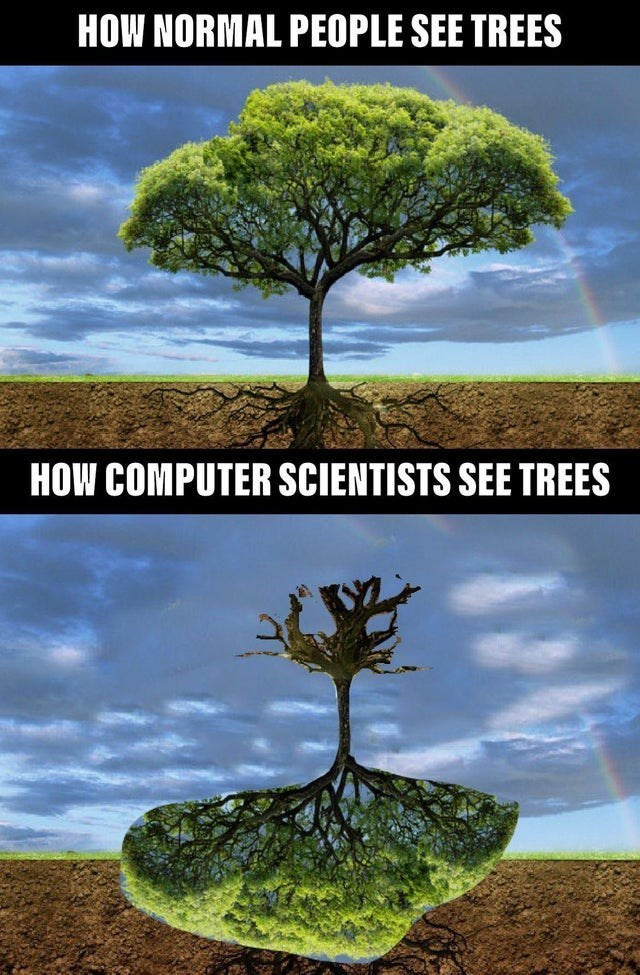
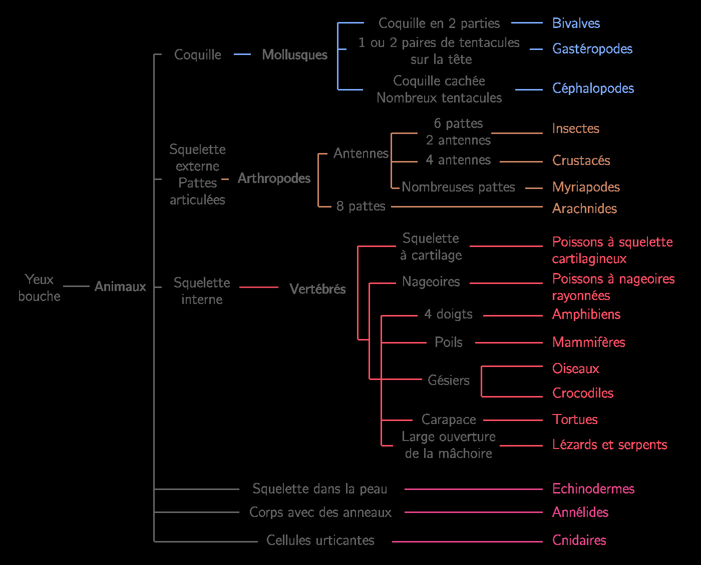
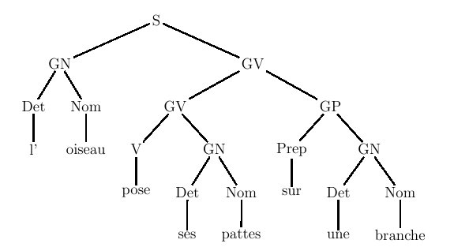
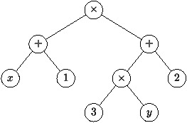
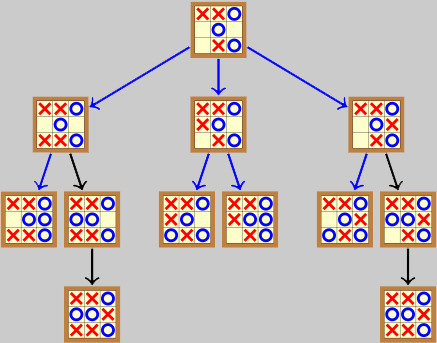
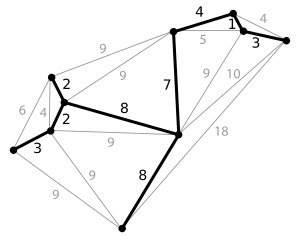
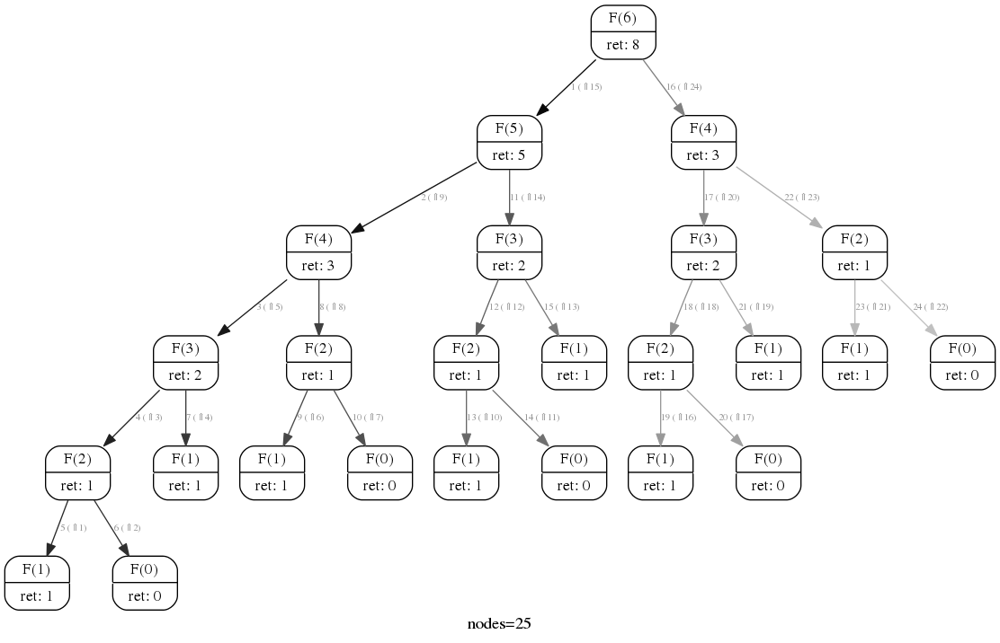
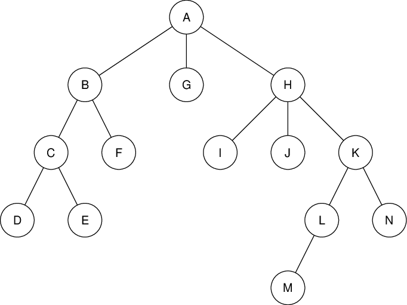
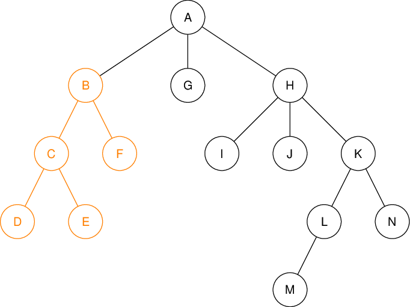

# Généralités sur les arbres

## 1. Notion d'arbre

{: .center width=480} 

Un **arbre** est une structure de données qui permet de représenter des données structurées de façon *hiérarchique*. On trouve beaucoup d'applications en informatique...

!!! note "Exemples"
    === "Exemple 1"
        Arbre de classification des espèces animales
        
        {: .center width=480} 
    
    === "2"
        [DOM](https://fr.wikipedia.org/wiki/Document_Object_Model){:target="_blank"}  d'une page web
        {: .center width=480} 
    
    === "3"
        Arborescence de fichiers
        {: .center width=480} 

    === "4"
        Analyse grammaticale d'une phrase
        {: .center width=480} 
    
    === "5"
        Analyse d'une expression algébrique $(x+1) \times (3\times y+2)$
        {: .center width=480}
    
    === "6"
        Arbre de jeu
        {: .center width=480}

    === "7"
        Arbre minimal couvrant (graphes)
        {: .center width=480} 

    === "8"
        Arbre des appels d'une fonction récursive
        {: .center width=480} 

!!! abstract "Vocabulaire"
    Un arbre est un ensemble de *nœuds* reliés par des *arêtes*, de sorte que chaque nœud possède un unique parent, sauf un, appelé *racine* de l'arbre.

    On parle aussi d'arbre *enraciné*.

    Il existe deux types de nœuds:

    - les *nœuds internes* qui possèdent des successeurs (*fils*);
    - les *feuilles* (ou nœuds externes) qui ne possèdent pas de fils.

    À chaque sommet est associé une *étiquette* ou *valeur*.

    {: .center  width=480} 

    ??? note "Exemples"
        Dans l'arbre précédent,

        - la racine est le sommet étiqueté A;
        - les nœuds internes sont : B, C, H, K et L;
        - ls feuilles sont : D, E, F, G, I, J, M et N;
        - par exemple, B est le père de C et F;
        - par exemple, L et N sont les fils de K.

## 2. Sous-arbre

En ne considérant que le nœud B et ses descendants, on obtient un nouvel arbre qu'on appelle **sous-arbre de racine B**.

{: .center width=480} 

!!! info "Structure récursive"
    On peut donc voir un arbre comme une structure de données récursive (ce sera utile pour les algorithmes utilisant des arbres): 

    - soit l'arbre est réduit à un seul nœud, sa racine (cas de base);
    - soit l'arbre est consitué d'une racine R et d'un ensemble de sous-arbres dont les racines sont les fils de R.

## 3. Caractéristiques

!!! abstract "Définitions"

    - la **taille** d'un arbre est le nombre de ses nœuds (un arbre sans nœud est un arbre vide, de taille 0);
    -