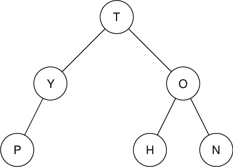
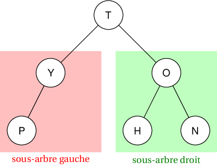
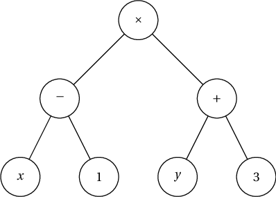
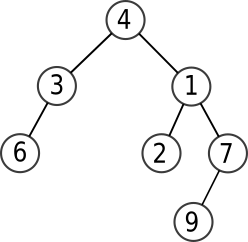
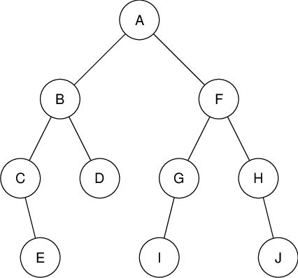
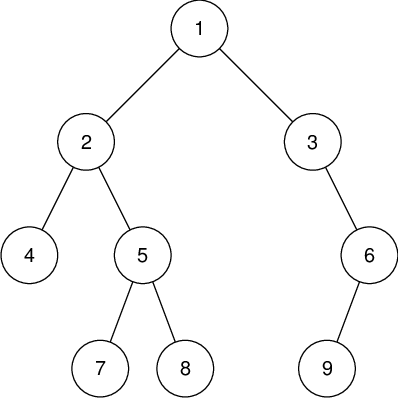
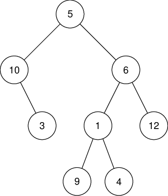

# T1.4.2 Arbres binaires

{{ initexo(0) }}

!!! abstract "Vocabulaire"
    === "Arbre binaire"
        Un arbre est **binaire** si chacun de ses nœuds possède **au plus deux fils**: un fils gauche et un fils droit.

        {: .center width=320} 

        - L'arbre est dit *complet* si tous les nœuds internes possèdent exactement deux fils (ce qui n'est pas le cas de l'arbre précédent, le nœud Y n'ayant qu'un fils gauche).

        - L'arbre est dit *équilibré* si seul le dernier niveau est (éventuellement) incomplet, sa hauteur est donc minimale par rapport à sa taille. C'est le cas de l'arbre précédent.

        - L'arbre est *parfait* si son dernier niveau est complet: il est de taille maximale par rapport à sa hauteur.

    === "Sous-arbres" 
        Les sous-arbres sont alors appelés sous-arbre gauche et  sous-arbre droit.

        {: .center width=320}

!!! example "{{ exercice() }}"
    === "Énoncé" 
        1. Dessiner un arbre binaire équilibré (non parfait) de hauteur 4.
        2. Dessiner un arbre binaire parfait de hauteur 4.

    === "Correction" 
        {{ correction(False, 
        "
        "
        ) }}
## 1. Taille et hauteur d'un arbre binaire

!!! example "{{ exercice() }}"
    === "Énoncé" 
        1. Construire un arbre binaire de hauteur $h$ (par exemple $h=4$) possédant le moins de nœuds possibles.

            Quelle est sa taille $n$?
        2. Construire un arbre binaire de hauteur $h$ (par exemple $h=4$) possédant le plus de nœuds possibles.
        
            Quelle est sa taille $n$?

    === "Correction" 
        {{ correction(False, 
        "
        "
        ) }}


??? abstract "Encadrement de la taille d'un arbre"
    Pour un arbre binaire de taille $n$ et de hauteur $h$:
    
    $$h \leqslant n \leqslant 2^{h} - 1$$

!!! example "{{ exercice() }}"
    === "Énoncé" 
        1. Donner un encadrement de la taille d'un arbre de hauteur 6.
        2. Donner un encadrement de la **hauteur** d'un arbre de taille 24.
    === "Correction" 
        {{ correction(True, 
        "
        1. Pour $h=6$, on a $2^6-1=63$ donc on obtient $6 \leqslant n \leqslant 63$.
        2. Pour $n=24$, on a $h \leqslant 24 \leqslant 2^h-1$, donc on a tout de suite $h \leqslant 24$.
            Ensuite, en essayant plusieurs valeurs de $h$, on trouve que la plus petite valeur de $h$ telle que $24 \leqslant 2^h-1$ est 5.

            Donc $5 \leqslant h \leqslant 24$.
        "
        ) }}

## 2. Parcours d'un arbre binaire

L'intérêt des arbres est de stocker de l'information - les *étiquettes* - de façon structurée. Il est donc important de savoir comment parcourir un arbre pour avoir accès à tous les nœuds et les *traiter*.


### 2.1 Parcours en largeur (BFS)

!!! gear "Parcours en largeur"
    Le parcours en largeur d'abord (ou BFS pour Breadth-First Search) consiste  à parcourir l'arbre **niveau par niveau**.
    
    Les nœuds de niveau 0 sont sont d'abord parcourus puis les nœuds de niveau 1 et ainsi de suite.
    
    Dans chaque niveau, les nœuds sont parcourus de la gauche vers la droite.
    
    {: .center width=320} 

    ??? note "Exemple"
        Le parcours en largeur de l'arbre ci-dessus parcourt les nœuds dans l'ordre T-Y-O-P-H-N.

!!! code "Algorithme de parcours en largeur"
    Le principe est d'utiliser **une file**:
    
    - on commence par enfiler la racine de l'arbre;
    - puis tant que la file n'est pas vide:
        - on défile un nœud;
        - on traite le nœud;
        - on enfile les fils du nœud (s'il en possède)

    
### 2.2 Parcours en profondeur (DFS)

!!! gear "Parcours en profondeur"
    Le parcours en profondeur d'abord( ou DFS pour Depth-First Search) consiste à poursuivre un chemin jusqu'à rencontrer une feuille, puis revenir au dernier nœud où l'on pouvait explorer un autre chemin, etc.
    Il se définit de manière récursive sur les sous-arbres de l'arbre.

    Il existe plusieurs parcours d'arbres en profondeur, selon que le traitement de la racine a lieu avant l'exploration des sous-arbres (parcours *préfixe*), entre celle du sous-arbre gauche et celle du sous-arbre droit (parcours *infixe*) ou après l'exploration des sous-arbres (parcours *postfixe/suffixe*).

!!! code "Algorithmes de parcours en profondeur"
    === "Parcours préfixe"
        En pseudo-code:
        ```
        fonction parcours(A: arbre):
            si A est non vide alors:
                traiter(A.racine)       # préfixe: traitement de la racine avant les appels récursifs
                parcours(A.fils_gauche)
                parcours(A.fils_droit)
        
        ```
        
        {: .center width=320} 

        Sur cet arbre, le parcours préfixe donne : $\quad\times \quad - \quad x \quad1\quad+\quad y\quad3$

    === "Parcours infixe"
        En pseudo-code:
        ```
        fonction parcours(A: arbre):
            si A est non vide alors:
                parcours(A.fils_gauche)
                traiter(A.racine)       # infixe: traitement de la racine entre les appels récursifs
                parcours(A.fils_droit)

        ```

        {: .center width=320} 

        Sur cet arbre, le parcours infixe donne : $\quad x\quad -\quad1 \quad \times \quad y \quad+\quad 3$

    === "Parcours postfixe"
        En pseudo-code:
        ```
        fonction parcours(A: arbre):
            si A est non vide alors:
                parcours(A.fils_gauche)
                parcours(A.fils_droit)
                traiter(A.racine)       # postfixe: traitement de la racine après les appels récursifs

        ```

        {: .center width=320} 

        Sur cet arbre, le parcours postfixe donne : $\quad x\quad 1\quad-\quad y\quad3\quad+\quad\times$


## 3. Implémentation d'un arbre binaire

Python ne propose pas de façon native l’implémentation des arbres binaires.

On va utiliser la POO pour créer une classe `AB` (pour Arbre Binaire), en utilisant le caractère récursif d'un arbre: une racine, et éventuellement un sous-arbre gauche et un sous-arbre droit.

!!! code "Classe `AB`"
    ```python linenums='1'
    class AB:
        def __init__(self, racine=None):
            self.racine = racine
            if self.racine is not None:
                self.gauche = AB()
                self.droit = AB()
    ```

On peut alors créer l'arbre ci-après de cette manière:

```python linenums='1'
a = AB(4)
a.gauche = AB(3)
a.droit = AB(1)
a.droit.gauche = AB(2)
a.droit.droit = AB(7)
a.gauche.gauche = AB(6)
a.droit.droit.gauche = AB(9)
```

{: .center} 

Pour contrôler la construction de nos arbres binaires, on utilisera les méthodes suivantes à insérer dans la classe `AB`:

```python linenums='1'
def affiche(self, indent = 0):
    s = ' '*2*indent + '|_' + str(self.racine) + '\n'
    if not self.gauche.est_vide():
        s += self.gauche.affiche(indent + 1)
    if self.gauche.est_vide() and not self.droit.est_vide():
        s += ' '*(2*indent+2) + '|' + '_' + 'None' + '\n'     

    if not self.droit.est_vide():
        s += self.droit.affiche(indent + 1)
    if self.droit.est_vide() and not self.gauche.est_vide():
        s += ' '*(2*indent+2) + '|' + '_' + 'None' + '\n'  
    return s

def __repr__(self):
    return self.affiche(0)
```

Ainsi, une fois l'arbre `a` précédent créé, on peut l'afficher rapidement en console grâce à la méthode magique `__repr__`:
```python 
>>> a
|_4
    |_3
        |_6
        |_None
    |_1
        |_2
        |_7
            |_9
            |_None
```
!!! example "À faire!"
    La méthode d'affichage `affiche` utilise une méthode  `est_vide` manquante pour l'instant dans la classe `AB`.

    Implémenter cette méthode, puis tester les codes précédents dans un fichier `arbre_binaire.py` par exemple.

    
## 4. Exercices

!!! example "{{ exercice() }}"
    === "Énoncé" 
        Dessiner:

        1. les arbres binaires à 1 nœud;
        1. les arbres binaires à 2 nœuds;
        1. les arbres binaires à 3 nœuds;
        1. les arbres binaires à 4 nœuds;
        5. Sans les dessiner, dénombrer le nombre d'arbres binaires à 5 nœuds.
    === "Correction" 
        {{ correction(True, 
        "
        Compter récursivement le nombre d'arbres binaires à $n$ nœuds:

        ```python linenums='1' 
        def nb_arbre(n:int) -> int:
            '''
            renvoie le nombre d'arbres différents de taille n
            '''
            if n == 0:
                return 1
            else:
                s = 0
                for g in range(n): # g est la taille du sous-arbre gauche
                    d = n - 1 - g  # d est la taille du sous-arbre droit
                    s += nb_arbre(g) * nb_arbre(d)
                return s
        ```
        
        **Remarque:** on peut utiliser la fonction `sum` sur une liste en compréhension pour condenser (mais est-ce plus lisible?) le bloc du `else`:

        ```python linenums='1'
        def nb_arbre(n:int) -> int:
            '''
            renvoie le nombre d'arbres différents de taille n
            '''
            if n == 0:
                return 1
            else:
                return sum([nb_arbre(g) * nb_arbre(n-1-g) for g in range(n)])

        ```
        
        "
        ) }}
!!! example "{{ exercice() }}"
    === "Énoncé" 
        Effectuer sur l'arbre suivant:

        {: .center width=320} 
        
        1. un parcours préfixe
        2. un parcours infixe
        3. un parcours postfixe

    === "Correction" 
        {{ correction(True, 
        "
        1. T-Y-P-O-H-N
        2. P-Y-T-H-O-N
        3. P-Y-H-N-O-T
        "
        ) }}

!!! example "{{ exercice() }}"
    === "Arbre 1"
        Sur l'arbre suivant:

        {: .center width=320} 

        1. Donner sa taille et sa hauteur.
        2. Donner l'ordre des nœuds visités dans un parcours en largeur.
        3. Donner l'ordre des nœuds visités dans un parcours préfixe, puis dans un parcours infixe et enfin dans un parcours postfixe.
    
    === "Arbre 2"
        Sur l'arbre suivant:

        {: .center width=320} 

        1. Donner sa taille et sa hauteur.
        2. Donner l'ordre des nœuds visités dans un parcours en largeur.
        3. Donner l'ordre des nœuds visités dans un parcours préfixe, puis dans un parcours infixe et enfin dans un parcours postfixe.
    === "Correction" 
        {{ correction(True, 
        "
        **Arbre 1**

        1. Cet arbre a 10 comme taille et 4 comme hauteur.
        2. A-B-F-C-D-G-H-E-I-J
        3. Préfixe: A-B-C-E-D-F-G-I-H-J, Infixe : C-E-B-D-A-I-G-F-H-J, Postfixe : E-C-D-B-I-G-J-H-F-A


        "
        ) }}


!!! example "{{ exercice() }}"
    === "Énoncé" 
        Créer une instance d'`AB` représentant l'arbre:

        {: .center width=320} 

    === "Correction" 
        {{ correction(True, 
        "
        ```python linenums='1'
        a = AB('T')
        a.gauche = AB('Y')
        a.gauche.gauche = AB('P')
        a.droit = AB('O')
        a.droit.gauche = AB('H')
        a.droit.droit = AB('N')

        ```
        
        "
        ) }}


!!! example "{{ exercice() }}"
    === "Énoncé" 
        1. Dessiner les arbres `sag` et `sad` définis par les instructions:   
        ```python linenums='1'
        sag = AB(10)
        sag.droit = AB(3)

        sad = AB(6)
        sad.gauche = AB(1)
        sad.droit = AB(12)
        sad.gauche.gauche = AB(9)
        sad.gauche.droit = AB(4)
        ```
             
        2. En utilisant les arbres précédents, donner les instructions permettant de représenter l'arbre:

            {: .center width=320} 
       
        
    === "Correction" 
        {{ correction(True, 
        "
        1. On obtient les sous-arbres gauche et droit de l'arbre illustré à la question 2.

        2. Il suffit donc de créer un nouvel arbre dont ces arbres sont les sous-arbres gauche et droit.
        ```python linenums='1'
        a = AB(5)
        a.gauche = sag
        a.droit = sad
        ```
        
        "
        ) }}
!!! example "{{ exercice() }}"
    [Centres étrangers 2024 Jour 2 - Exercice 2:material-download:](../data/24_NSIJ2G11.pdf){.center .md-button }
