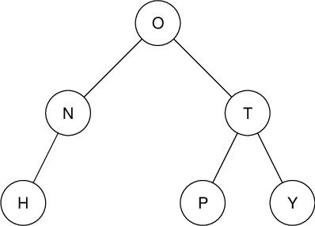
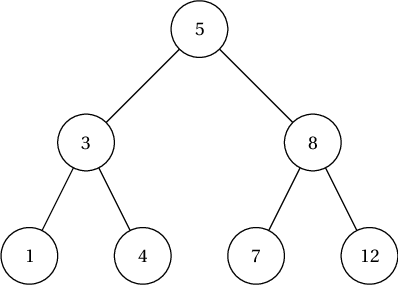
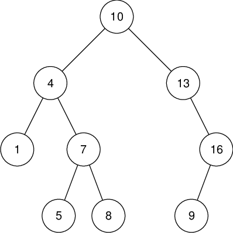
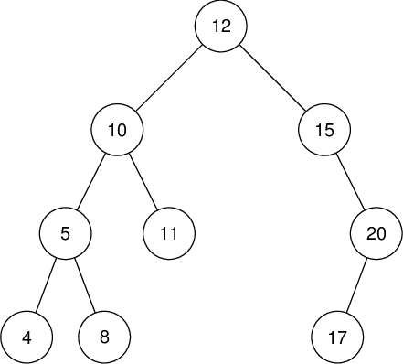
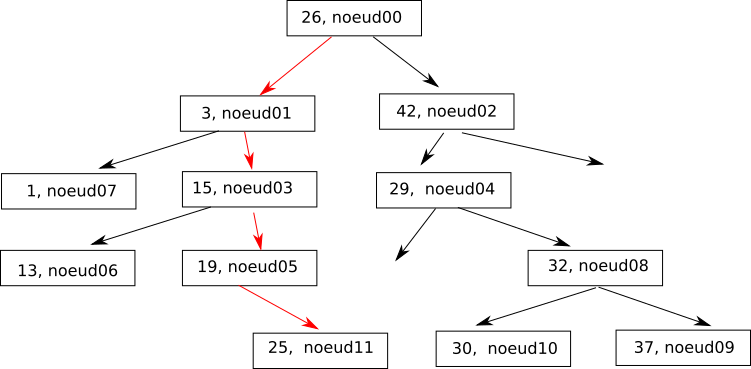
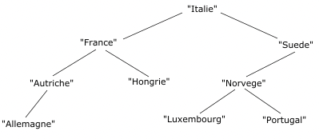

# T1.4.3 Arbres Binaires de Recherche (ABR)
{{ initexo(0) }}


!!! abstract "Définition"
    Un arbre binaire de recherche (ABR en abrégé) est un cas particulier d'arbre binaire, où les valeurs des nœuds (appelées plutôt *clés*) sont nécessairement ordonnables entre elles: elles sont toutes de même type `int` ou `str` par exemple.

    De plus, **pour tous** les nœuds de l'arbre, la clé est :

    - strictement supérieure à toutes les clés du sous-arbre gauche;
    - inférieure ou égale à toutes les clés du sous-arbre droit;

!!! note "ABR or not ABR ?"
    === "Exemple 1"
        {: .center} 

    === "Exemple 2"
        {: .center} 

    === "Exemple 3"
        {: .center} 
    
    === "Exemple 4"
        {: .center} 

??? info "Important: parcours et ordre croissant"
    **Le parcours infixe d'un ABR donne un tri des clés dans l'ordre croissant.**

    Sauriez-vous l'expliquer?

## 1. Recherche dans un ABR

La structure d'ABR va permettre de rechercher efficacement une clé. En effet, en fonction du résultat de la comparaison d'une clé avec la valeur recherchée, on sait dans quel sous-arbre poursuivre récursivement la recherche...

!!! code "Classe `ABR`"
    Un ABR étant un cas particulier d'un arbre binaire, on peut reprendre l'implémentation déjà existante de la classe `AB` en adaptant seulement le constructeur de la classe:

    ```python linenums='1'
    class ABR:
        def __init__(self, cle=None):
            self.cle = cle
            if self.cle is not None:
                self.gauche = ABR()
                self.droit = ABR()
    ```
    Ainsi que la méthode `rechercher`:

    ```python linenums='1' title='À compléter'
        def rechercher(self, valeur):
            if ... :
                return False
            elif ... :
                return True
            elif valeur < self.cle:
                return ...
            else:
                return ...

    ```
    
!!! abstract "Complexité de la recherche dans un ABR équilibré"
    Imaginons faire une recherche dans un ABR **équilibré** de taille $n$. Combien d'étapes faudra-t-il, dans le pire des cas, pour trouver (ou pas) une clé particulière dans cet arbre ?

    {: .center} 

    Un peu comme l'algorithme de dichotomie vue en classe de Première, à chaque nœud on ne considère que la moitié des nœuds restants à explorer. Le nombre de nœuds à explorer est donc égal à la hauteur $h$ de l'arbre (dans le pire des cas).

    Or on sait que pour un arbre parfait $n = 2^h -1$, c'est-à-dire que $2^h = n +1$.

    En général, le coût de cette recherche est donc *de l'ordre* de ce nombre de puissance de 2 que l'on peut mettre dans $n+1$. Ce nombre s'appelle le logarithme de base 2 est se note $\log_2$. La complexité est donc en $O(\log_2(n))$.

    ??? info "Binaire et $\log_2$"
        On a pour tout entier $n$ que $\log_2(2^n) = n$. Donc par exemple $\log_2(8) = 3$ puisque $2^3=8$ ou $\log_2(128) = 7$ puisque $2^7=128$.

        Or en binaire,  $2^n$ s'écrit avec un 1 suivi de $n$ zéros: le logarithme de base 2 d'une puissance de 2 donne son nombre de zéros dans son écriture en binaire.

        Le $\log_2$ permet donc de récupérer le nombre de chiffres dans l'écriture binaire d'un nombre entier, c'est-à-dire sa taille en bits, par la formule :
        
        $$\lfloor \log_2(n) \rfloor +1$$
    
        
## 2. Ajout dans un ABR

L'insertion d'un nœud dans un ABR va permettre de *construire* un ABR. Mais il faut bien évidemment conserver la cohérence des clés des nœuds: on doit insérer un nœud en construisant des sous-arbres qui sont aussi des ABR.

Pour cela, on va construire uniquement un ABR vide, puis insérer un nœud/sous-arbre sur les feuilles, c'est-à-dire uniquement sur un sous-arbre vide: le gauche ou le droit, selon la valeur de la clé à insérer.

!!! note "Exemple"
    Dessiner l'ABR obtenu en partant d'un arbre vide, puis en insérant successivement les clés 12, 10, 15, 5, 20, 4, 8, 11, 17.

    ??? check "Solution"
        {: .center} 


!!! code "Implémentation de la méthode"
    Compléter les deux méthodes ci-dessous:

    ```python linenums='1'
        def inserer_cle(self, cle):
            if self.est_vide():
                self.cle = ...
                self.gauche = ...
                self.droit = ...
            elif ...
                self.droit.inserer_cle(cle)
            else:
                ...
        
        def inserer_cles(self, liste_cles):
            ...
    ```
    

## 3. Exercices


!!! example "{{ exercice() }}"
    === "Énoncé" 
        Dans un ABR, où  se trouve le plus petit élément? En déduire une méthode `minimum` qui renvoie le plus petit élément de l'ABR, et `None` si l'ABR est vide.
    === "Correction" 
        {{ correction(True, 
        "
        ```python linenums='1'
        def minimum(self):
            if self.est_vide():
                return None
            elif self.gauche.est_vide():
                return self.cle
            else:
                return self.gauche.minimum()
        ```
        
        "
        ) }}

!!! example "{{ exercice() }}"
    === "Énoncé" 
        Écrire une fonction qui prend en paramètre un arbre binaire et qui renvoie `True` si l'arbre est un ABR et `False` sinon.

    === "Indications"
        On pourra au choix:

        - utiliser le fait que le parcours infixe donne sur un ABR une liste triée dans l'ordre croissant de ses clés (mais attention il faut modifier correctement la méthode `infixe` pour récupérer les clés dans une liste);
        - vérifier récursivement en le parcourant que l'arbre binaire vérifie la définition d'un ABR.
        
    === "Correction" 
        {{ correction(True, 
        "
        ```python linenums='1'
        def est_ABR(self):
            parcours = self.parcours_infixe()
            for i in range(len(parcours)-1):
                if parcours[i] > parcours[i+1]:
                    return False
            return True
        ```
        "
        ) }}

!!! example "{{ exercice() }}"
    === "Énoncé" 
        Écrire une méthode `compte` qui renvoie le nombre d'occurrences d'une clé dans un ABR.
    === "Correction" 
        {{ correction(True, 
        "
        ```python linenums='1'
        def compte(self, valeur):
            if self.est_vide():
                return 0
            elif self.cle == valeur:
                return 1 + self.droit.compte(valeur)
            elif self.cle < valeur:
                return  self.droit.compte(valeur)
            else:
                return self.gauche.compte(valeur)
        ```
        "
        ) }}

!!! example "Exercices Type BAC"
    <span class='centre'>
    [Énoncé 1 :material-download:](../data/21NSIJ1G11_ex3.pdf){.center .md-button }
    [Énoncé 2 :material-download:](../data/22NSIJ1AN1_ex3.pdf){.center .md-button }
    [Énoncé 3 :material-download:](../data/21NSIJ2ME2_Ex3.pdf){.center .md-button }
    </span>

    === "Correction Énoncé 1"
        {: .center with=480} 

        1. On désire insérer le noeud11 (valeur 25).
            
            - On part de la racine (noeud00 de valeur 26), 25 est plus petit que 26, on considère donc le sous-arbre gauche et on se retrouve au niveau du noeud01 (valeur 3).
            - 25 est plus grand que 3, on considère donc le sous-arbre droit aunoeud01 et on se retrouve au niveau du noeud03 (valeur 15).
            - 25 est plus grand que 15, on considère donc le sous-arbre droit au noeud03 et on se retrouve au niveau du noeud05 (valeur 19).
            - 25 est plus grand que 19, on considère donc le sous-arbre droit du noeud05, ce sous-arbre droit est vide et on insère donc le noeud11 à cet emplacement.
            
            Le noeud11 est donc inséré sous le noeud5 en fils droit.
        
        2. Il est possible de stocker toutes les valeurs comprises entre 26 et 29, c’est à dire : 26, 27 et
        28 (on peut prendre 26 car il est précisé dans l’énoncé que «les valeurs de tous les nœuds
        du sous-arbre droit sont supérieures **ou égales** à la valeur du nœud X»)

        3. **a.** On obtient : 26 - 3 - 1 - 15 - 13 - 19 - 25 - 42 - 29 - 32 - 30 - 37

            **b.** C'est un parcours préfixe (le nœud est traité **avant** les appels récursifs dans les sous-arbres).
        
        4. Sur un arbre binaire de recherche, c'est le parcours **infixe** qui permet de parcourir les nœuds dans l'ordre croissant des valeurs.
        On obtient donc:

            ```
            Parcours2(A)
                Parcours2(A.fils.gauche)
                Afficher(A.valeur)
                Parcours2(A.fils.droit)
            ```
        
    === "Correction Énoncé 2"
        1. **a.** La hauteur de l'arbre est 3.

            **b.** La valeur booléenne de l'expression est `True`.

            **c.** {: .center width=480} 
        
        2. Parcours en largeur: `"Italie" - "France" - "Suede" - "Autriche" - "Hongrie" - "Norvege"`.

        3.  Il faut utiliser le fait que l'arbre est un ABR et ne chercher que dans le bon sous-arbre selon la comparaison de la valeur avec la racine de l'arbre.
        
            ```python linenums='1'
            def recherche(arb, val):
                """la fonction renvoie True si val est dans l'arbre
                et False dans le cas contraire"""
                if est_vide(arb):
                    return False
                if val == racine(arb):
                    return True
                if val < racine(arb):
                    return recherche(gauche(arb), val)
                else :
                    return recherche(droite(arb), val)
            ```
        
        4. Attention à ne pas confondre **fonction** et **méthode**.

            ```python linenums='1'
            def taille(arb):
                if est_vide(arb):
                    return 0
                else :
                    return 1 + taille(gauche(arb)) + taille(droite(arb))
            ```
            
        
    === "Correction Énoncé 3"
        1. **a.** La taille est le nombre de nœuds : ici 7.

            **b.** La hauteur est le nombre de nœuds du plus long chemin qui joint le nœud racine à l'une des feuilles : ici 4.

        2. {: .center} 

        3. {: .center} 

        4. !!! failure "Implémentation bancale"
            L'implémentation proposée ici n'est pas satisfaisante, car on peut très bien créer un arbre vide à l'aide de `#!py Arbre(None)` qui aura une hauteur égale à 1, tout comme un arbre réduit à un nœud...

            ```python 
            class Arbre:
                ...

                def hauteur(self):
                    return self.racine.hauteur()
            ```


        5. On s'inspire de la méthode `hauteur`.
        
            ```python 
            class Noeud:
                ...

                def taille(self):
                    if self.gauche == None and self.droit == None:
                        return 1
                    if self.gauche == None:
                        return 1 + self.droit.taille()
                    elif self.droit == None:
                        return 1 + self.gauche.taille()
                    else:
                    return 1 + self.gauche.taille() + self.droit.taille()
            


            class Arbre:
                ...

                def taille(self):
                    return self.racine.taille()
            ```

            !!! failure "Implémentation bancale"
                Ici aussi on aura une horreur :

                ```python linenums='1'
                >>> Arbre(None).taille()
                1
                ```
            
        

        6. **a.** La taille minimale d'un arbre bien construit de hauteur $h$ est $2^{h-1}$.
            
            En effet pour être bien construit, un arbre de hauteur $h$ doit avoir une taille strictement supérieure à la taille maximale d'un arbre de hauteur $h-1$, sinon on peut réduire sa hauteur à $h-1$. 

            Comme la taille maximale d'un ABR de hauteur $h-1$ est $2^{h-1}-1$, on obtient $t_{min} = 2^{h-1}-1+1=2^{h-1}$.

            **b.** Il suffit donc de vérifier que la taille est supérieure ou égalle à $t_{min}$.

            ```python linenums='1'
            def bien_construit(self):
                h = self.hauteur()
                t = self.taille()
                return t >= 2**(h-1)
            ```
                    
