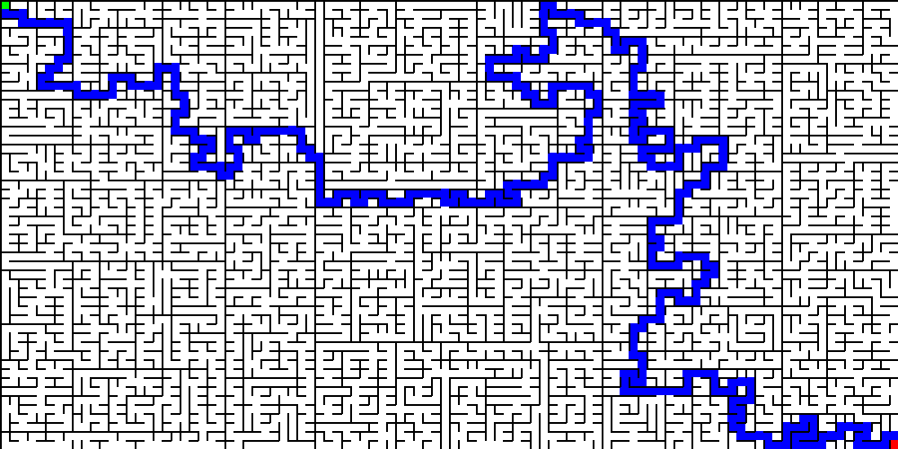

# ▶ TP Labyrinthe

!!! gear "Objectif"
    L'objectif de ce TP est de trouver et d'afficher le chemin le plus court entre une entrée (en vert sur l'illustration ci-dessous) et une sortie (en rouge) d'un labyrinthe, créé aléatoirement comme on l'a fait [ici](https://cgouygou.github.io/TNSI/T03_Algorithmique/T3.1_Diviser/T3.1_Diviser/#3-generation-dun-labyrinthe){:target="_blank"}. 

    {: .center width=640} 

    Le principe est de représenter le labyrinthe comme un graphe, puis d'utiliser la recherche d'un chemin entre le départ et l'arrivée à l'aide d'un parcours BFS.

Vous pouvez tout faire *from scratch*, ou bien utiliser [ce fichier](../data/tp_labyrinthe_graphe.py){:target="_blank"} qui contient:

- les classes `#!py Graphe`, `#!py Cellule` et `#!py Labyrinthe` écrites précédemment;
- les constantes et l'affichage utilisées dans l'activité de génération du labyrinthe;
- les instructions et la boucle des événements de Pygame.

!!! code "Travail à réaliser"
    1. Dans la partie *Fonctions*, copier les fonctions `#!py recupere_chemin` et `#!py trouve_chemin` écrites dans l'activité précédente.
    2. Adapter la fonction `#!py recupere_chemin` pour qu'elle renvoie une liste (des sommets du chemin entre la source et la cible), et non une chaîne de caractères.
    3. Compléter la fonction `#!py affiche_chemin` .
    4. Choisir une adresse pour le départ et l'arrivée dans la partie *Constantes*.
    5. Le labyrinthe doit maintenant être modélisé par un graphe selon ce principe: chaque cellule (c'est-à-dire un tuple (ligne i, colonne j)) est un sommet du graphe et deux sommets sont reliés par une arête s'il n'y a pas de mur entre les cellules qu'ils représentent. En pratique on parcourt la grille du labyrinthe et pour chaque cellule, s'il n'y a pas de mur nord alors on ajoute une arête avec la cellule/sommet du dessus, s'il n'y pas de mur ouest alors on ajoute une arête avec la cellule/sommet de gauche, etc.

        Compléter la partie *Graphe*, puis affecter à la variable `#!py chemin` le chemin entre la source et la cible.
    6. Passer les bons arguments à l'appel de la fonction `#!py affiche_chemin` dans la partie *Pygame*.
    7. F5

!!! code "Si vous avez fini..."
    Modifier le programme pour qu'il affiche cellule par cellule l'avancée dans le labyrinthe du départ vers l'arrivée...

    <gif-player src="https://cgouygou.github.io/TNSI/T01_StructuresDonnees/images/chemin_laby.gif" speed="1" play></gif-player>
