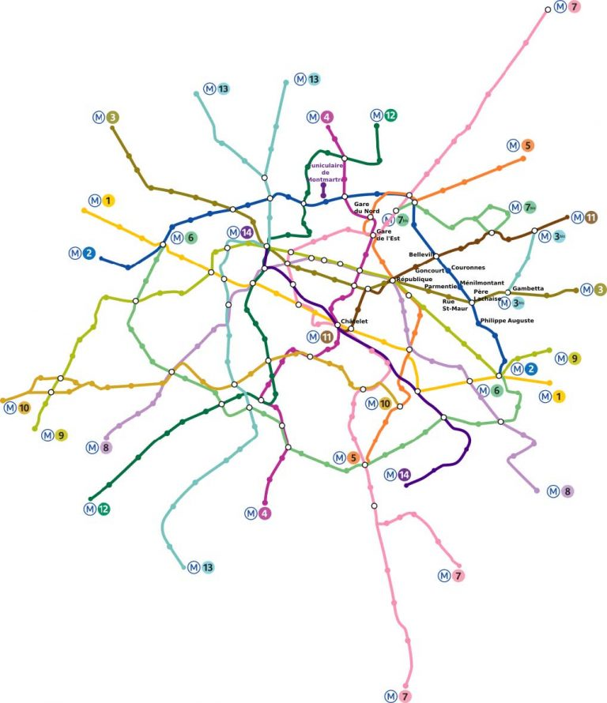
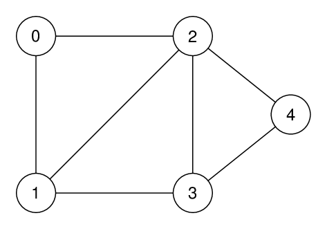
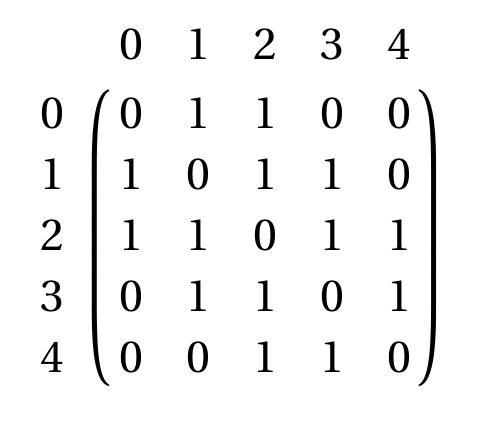
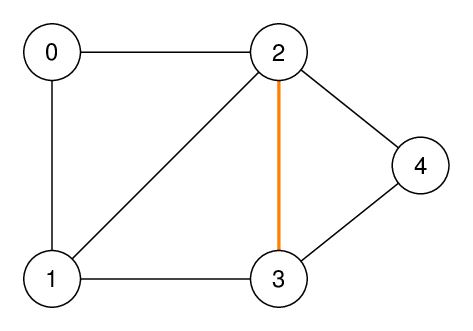
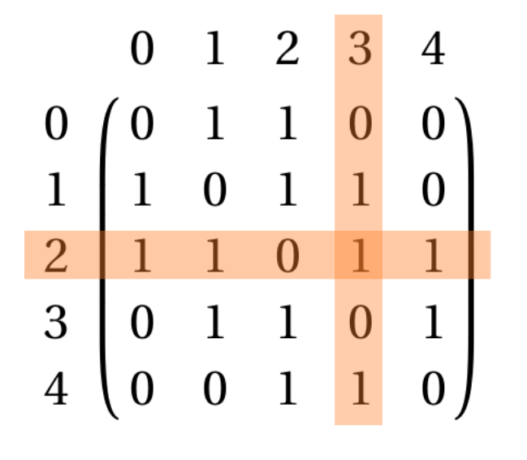

# T1.5.1 Graphes
{{ initexo(0) }}

{: .center} 

## 1. Notion de graphe et vocabulaire

Le concept de graphe permet de résoudre de nombreux problèmes en mathématiques comme en informatique. C'est un outil de représentation très courant, et nous l'avons déjà rencontré à plusieurs reprises, en particulier lors de l'étude de réseaux.


!!! note "Exemples de situations" 
    === "Réseau informatique"
        {: .center width=640} 
    === "Réseau de transport"

        {: .center width=640} 

    === "Réseau social"
        {: .center width=640} 

    === "Mais aussi"
        On trouve également des applications de la théorie des graphes dans bien d'autres domaines: probabilités, biologie, physique, chimie, génétique...

!!! abstract "Vocabulaire des graphes"
    En général, un graphe est un ensemble d'objets, appelés *sommets* ou parfois *nœuds* (*vertex* or *nodes* en anglais) reliés par des *arêtes* ou *arcs* selon que le graphe est **non orienté** ou **orienté** (*edge* en anglais).

    === "Graphe non orienté"
        {: .center width=480} 

        Dans un graphe **non orienté**, les *arêtes* peuvent être empruntées dans les deux sens, et une *chaîne* est une suite de sommets reliés par des arêtes, comme C - B - A - E par exemple. La *longueur* de cette chaîne est alors 3, soit le nombre d'arêtes.

        Les sommets B et E sont *adjacents* au sommet A, ce sont les *voisins* de A.

    === "Graphe orienté"
        {: .center width=480} 

        Dans un graphe **orienté**, les *arcs* ne peuvent être empruntés que dans le sens de la flèche, et un *chemin* est une suite de sommets reliés par des arcs, comme B → C → D → E par exemple.

        Les sommets C et D sont *adjacents* au sommet B (mais pas A !), ce sont les *voisins* de B.

    === "Graphe pondéré"
        {: .center width=480} 

        Un graphe est **pondéré** (ou valué) si on attribue à chaque arête une valeur numérique (la plupart du temps positive), qu'on appelle *mesure*, *poids*, *coût* ou *valuation*.
        
        Par exemple:
        
        - dans le protocole OSPF, on pondère les liaisons entre routeurs par le coût;
        - dans un réseau routier entre plusieurs villes, on pondère par les distances.

!!! abstract "Connexité"
    Un graphe est **connexe** s'il est d'un seul tenant: c'est-à-dire si n'importe quelle paire de sommets peut toujours être reliée par une chaîne. Autrement un graphe est connexe s'il est «en un seul morceau».

    Par exemple, le graphe précédent est connexe. Mais le suivant ne l'est pas: il n'existe pas de chaîne entre les sommets A et F par exemple.

    {: .center width=480} 

    Il possède cependant deux **composantes connexes** : le sous-graphe composé des sommets A, B, C, D et E d'une part et le sous-grpahe composé des sommets F, G et H.


## 2. Modélisations d'un graphe

Nous allons voir les deux principales façon de représenter un graphe, c'est-à-dire par les sommets et leurs arêtes sortantes vers leur voisins (d'où le terme d'**adjacence**).

### 2.1 Représentation par matrice d'adjacence

!!! abstract "Principe"
    - On numérote les sommets de 0 à $n-1$.
    - on représente les arêtes (ou les arcs) dans une matrice, c'est-à-dire un tableau à deux dimensions où on inscrit un 1 en ligne `i` et colonne `j` si les sommets `i` et `j` sont voisins.
    
    === "Graphe et matrice"

        {: .center width=320}
        {: .center width=320} 

    === "Arête reliant deux sommets"

        {: .center width=320}
        {: .center width=320} 


!!! info "Remarques"
    - La matrice d'adjacence d'un graphe **non orienté** est symétrique.
    - Pour un graphe pondéré, on indique la *valuation* de l'arête plutôt qu'un 1.
    - Pour un graphe à $n$ sommets, la complexité spatiale (place en mémoire) est en $O(n^2)$.
    - Tester si un sommet est isolé (ou connaître ses voisins) est en $O(n)$ puisqu'il faut parcourir une ligne, mais tester si deux sommets sont adjacents (voisins) est en $O(1)$, c'est un simple accès au tableau.


!!! code "En Python"
    Une matrice se représente naturellement par une liste de listes.

    **Exemple:**

    ```python linenums='1'
    mat = [[0, 1, 1, 0, 0],
           [1, 0, 1, 1, 0],
           [1, 1, 0, 1, 1],
           [0, 1, 1, 0, 1],
           [0, 0, 1, 1, 0]] 
    ```
    
Cette représentation possède un gros avantage lorsqu'on souhaite trouver le nombre de chaînes (ou de chemins dans le cas orienté) entre deux sommets, d'une longueur donnée.

Pour cela, il suffit de calculer la puissance de cette matrice (le calcul du produit de matrices n'est pas au programme, demandez à vos camarades de maths expertes si vous êtes curieux) dont *l'exposant est la longueur souhaitée*.

Par exemple, si on souhaite le nombre de chaînes de longueur 3 entre les sommets 2 et 4 dans le graphe précédent de matrice d'adjacence $M$, on calcule $M^3$ et on regarde le coefficient en ligne 2 et colonne 4.

!!! note "Exemple avec le module `#!py numpy`"

    ```python linenums='1'
    # Module numpy de calcul scientifique, notamment le calcul matriciel
    import numpy as np

    mat = [[0, 1, 1, 0, 0],
          [1, 0, 1, 1, 0],
          [1, 1, 0, 1, 1],
          [0, 1, 1, 0, 1],
          [0, 0, 1, 1, 0]] 

    def puissance_matrice(m:list, n:int) -> np.array:
        '''
        calcule et renvoie le puissance n-ième d'une matrice, à l'aide
        de la méthode dot qui fait le produit de deux matrices (au format np.array)
        '''
        p = np.array(m)  # on transforme en tableau numpy
        for _ in range(n):
            p = np.dot(p, m)
        return p
    ```

    Puis en console:

    ```python
    >>> puissance_matrice(mat, 3)
    array([[11, 11, 13, 14,  9],
           [11, 19, 19, 14, 14],
           [13, 19, 26, 19, 13],
           [14, 14, 19, 19, 11],
           [ 9, 14, 13, 11, 11]])
    ```
    
    Il y a donc 13 chaînes de longueur 3 entre les sommets 2 et 4.


### 2.2 Représentation par listes d'adjacence


!!! abstract "Principe"
    - On associe à chaque sommet sa liste des voisins (c'est-à-dire les sommets adjacents). On utilise pour cela un dictionnaire dont les clés sont les sommets et les valeurs les listes des voisins.

    - Dans le cas d'un graphe **orienté** on associe à chaque sommet la liste des *successeurs* (ou bien des *prédécesseurs*, au choix).

    Par exemple, le graphe précédent s'écrira en Python:

    ```python linenums='1'
    G = {0: [1, 2],
         1: [0, 2, 3],
         2: [0, 1, 3, 4],
         3: [1, 2, 4],
         4: [2, 3]
        }
    ```
    
!!! info "Remarques"
    - Pour un graphe pondéré, on associera un dictionnaire (d'associations `#!py voisin: valuation`).
    - Pour un graphe à $n$ sommets et $m$ arêtes, la complexité spatiale (place en mémoire) est en $O(n+m)$. C'est beaucoup mieux qu'une matrice d'adjacence lorsque le graphe comporte peu d'arêtes (i.e. beaucoup de 0 dans la matrice, non stockés avec des listes).
    - Tester si un sommet est isolé (ou connaître ses voisins) est en $O(1)$ puisqu'on y accède immédiatement, mais tester si deux sommets sont adjacents (voisins) est en $O(n)$ car il faut parcourir la liste.

## 3. Graphes en POO


!!! code "Classe `#!py Graphe`"
    Il s'agit maintenant d'écrire une classe `Graphe` dont l'implémentation sera faite par listes d'adjacence (plus pratique pour ce qu'on veut faire, à savoir récupérer les voisins d'un sommet) et le constructeur prendra en paramètre la liste des sommets et construit un dictionnaire dont les valeurs sont des listes vides.

    L'interface doit comporter les méthodes suivantes:

    - `#!py ajouter_sommets` : ajoute un sommet donné en paramètre;
    - `#!py ajouter_arete` : ajoute une arête entre deux sommets donnés en paramètres;
    - `#!py sommets` : renvoie la liste des sommets;
    - `#!py voisins` : renvoie la liste des voisins d'un sommet donné en paramètre;
    - `#!py ordre` : renvoie l'ordre du graphe (c'est-à-dire son nombre de sommets);
    - `#!py est_voisin` : renvoie un booléen déterminant si deux sommets donnés en paramètres sont voisins ou non.

??? check "Proposition de correction"


## 4. Exercices

!!! example "{{ exercice() }}"
    === "Énoncé" 
        Construire les représentations des graphes suivants:

        1. Par matrice d'adjacence.
        2. Par listes d'adjacence.

        {: .center width=240} 

        {: .center width=240} 

        {: .center width=240} 
    === "Correction" 
        {{ correction(False, 
        "
        "
        ) }}

!!! example "{{ exercice() }}"
    === "Énoncé" 
        1. Construire les graphes correspondants aux matrices d'adjacences suivantes:

            $M_1 =\pmatrix{
                0&1&1&1&1\\
                1&0&1&0&0\\
                1&1&0&1&0\\
                1&0&1&0&1\\
                1&0&0&1&0\\
                }$
            $M_2=\pmatrix{
                0&1&1&0&1\\
                0&0&1&0&0\\
                0&0&0&1&0\\
                1&0&0&0&1\\
                0&0&0&0&0\\
                }$
            $M_3=\pmatrix{
                0&5&10&50&12\\
                5&0&10&0&0\\
                10&10&0&8&0\\
                50&0&8&0&100\\
                12&0&0&100&0\\
                }$

        2. Donner les listes d'adjacence correspondant aux matrices d'adjacence précédentes.
    === "Correction" 
        {{ correction(False, 
        "
        "
        ) }}

!!! example "{{ exercice() }}"
    === "Énoncé" 
        
    === "Correction" 
        {{ correction(False, 
        "
        "
        ) }}
!!! example "{{ exercice() }}"
    === "Énoncé" 

        1. Construire les graphes correspondants aux listes d'adjacences suivantes. Déterminer s'il s'agit d'un graphe orienté, non orienté, pondéré.

            ```python linenums='1'
            G1 = {
                'A': ['B', 'C'],
                'B': ['A', 'C', 'E', 'F'],
                'C': ['A', 'B', 'D'],
                'D': ['C', 'E'],
                'E': ['B', 'D', 'F'],
                'F': ['B', 'E']
                }

            G2 = {
                'A': ['B'],
                'B': ['C', 'E'],
                'C': ['B', 'D'],
                'D': [],
                'E': ['A']
                }

            G3 = {
                'A': ['B', 'C'],
                'B': ['A', 'B', 'D'],
                'C': ['A', 'F'],
                'D': ['B', 'C', 'F'],
                'E': ['G'],
                'F': ['C', 'F'],
                'G': ['E']
                }

            G4 = {
                'A': {'B' : 300, 'C' : 310, 'D' : 280},
                'B': {'A' : 300, 'C' : 80},
                'C': {'A' : 310, 'B' : 80, 'E' : 150},
                'D': {'A' : 280, {'F' : 110},
                'E': {'C' : 150, 'F' : 60, 'G' : 90, 'H' : 190},
                'F': {'D' : 110, 'E' : 60, 'G' : 70, 'H' : 260},
                'G': {'E' : 90, 'F' : 70, 'H' : 50, 'I' : 100},
                'H': {'E' : 190, 'F' : 260, 'G' : 50, 'I' : 40},
                'I': {'G' : 100, 'H' : 40}
                }
            ```
        2. Donner les matrices d'adjacence correspondant aux listes d'adjacence précédentes.

    === "Correction" 
        {{ correction(False, 
        "
        "
        ) }}