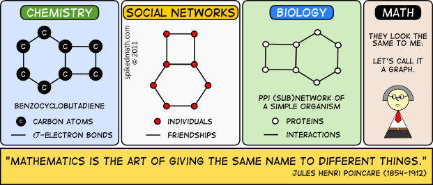

# T1.5 Graphes
{{ initexo(0) }}

{: .center} 

## 1. Notion de graphe et vocabulaire

Le concept de graphe permet de résoudre de nombreux problèmes en mathématiques comme en informatique. C'est un outil de représentation très courant, et nous l'avons déjà rencontré à plusieurs reprises, en particulier lors de l'étude de réseaux.


!!! note "Exemples de situations" 
    === "Réseau informatique"
        {: .center width=640} 
    === "Réseau de transport"

        {: .center width=640} 

    === "Réseau social"
        {: .center width=640} 

    === "Mais aussi"
        On trouve également des applications de la théorie des graphes dans bien d'autres domaines: ...

!!! abstract "Vocabulaire des graphes"
    En général, un graphe est un ensemble d'objets, appelés *sommets* ou parfois *nœuds* (*vertex* or *nodes* en anglais) reliés par des *arêtes* ou *arcs* selon que le graphe est **non orienté** ou **orienté** (*edge* en anglais).

    === "Graphe non orienté"
        {: .center width=480} 

        Dans un graphe **non orienté**, les *arêtes* peuvent être empruntées dans les deux sens, et une *chaîne* est une suite de sommets reliés par des arêtes, comme C - B - A - E par exemple.

        Les sommets B et E sont *adjacents* au sommet A, ce sont les *voisins* de A.

    === "Graphe orienté"
        {: .center width=480} 

        Dans un graphe **orienté**, les *arcs* ne peuvent être empruntés que dans le sens de la flèche, et un *chemin* est une suite de sommets reliés par des arcs, comme B → C → D → E par exemple.

        Les sommets C et D sont *adjacents* au sommet B (mais pas A !), ce sont les *voisins* de B.

    === "Graphe pondéré"
        {: .center width=480} 

        Un graphe est **pondéré** (ou valué) si on attribue à chaque arête une valeur numérique (la plupart du temps positive), qu'on appelle *mesure*, *poids*, *coût* ou *valuation*.
        
        Par exemple:
        
        - dans le protocole OSPF, on pondère les liaisons entre routeurs par le coût;
        - dans un réseau routier entre plusieurs villes, on pondère par les distances.

        

## 2. Modélisations d'un graphe

Nous allons voir les deux principales façon de représenter un graphe, c'est-à-dire par les sommets et leurs arêtes sortantes vers leur voisins (d'où le terme d'**adjacence**).

### 2.1 Représentation par matrice d'adjacence

!!! abstract "Principe"
    - On numérote les sommets de 0 à $n-1$.
    - on représente les arêtes (ou les arcs) dans une matrice, c'est-à-dire un tableau à deux dimensions où on inscrit un 1 en ligne `i` et colonne `j` si les sommets `i` et `j` sont voisins.
    
    === "Graphe et matrice"

        {: .center width=320}
        {: .center width=320} 

    === "Arête reliant deux sommets"

        {: .center width=320}
        {: .center width=320} 


!!! info "Remarques"
    - La matrice d'adjacence d'un graphe **non orienté** est symétrique.
    - Pour un graphe pondéré, on indique la *valuation* de l'arête plutôt qu'un 1.
    - Pour un graphe à $n$ sommets, la complexité spatiale (place en mémoire) est en $O(n^2)$.
    - Tester si un sommet est isolé (ou connaître ses voisins) est en $O(n)$ puisqu'il faut parcourir une ligne, mais tester si deux sommets sont adjacents (voisins) est en $O(1)$, c'est un simple accès au tableau.


!!! code "En Python"
    Une matrice se représente naturellement par une liste de listes.

    **Exemple:**

    ```python linenums='1'
    mat = [[0, 1, 1, 0, 0],
           [1, 0, 1, 1, 0],
           [1, 1, 0, 1, 1],
           [0, 1, 1, 0, 1],
           [0, 0, 1, 1, 0]] 
    ```
    


### 2.2 Représentation par listes d'adjacence


!!! abstract "Principe"
    - On associe à chaque sommet sa liste des voisins (c'est-à-dire les sommets adjacents). On utilise pour cela un dictionnaire dont les clés sont les sommets et les valeurs les listes des voisins.

    - Dans le cas d'un graphe **orienté** on associe à chaque sommet la liste des *successeurs* (ou bien des *prédécesseurs*, au choix).

    - Pour un graphe pondéré, on associera un dictionnaire (d'associations `#!py voisin: valuation`).

    Par exemple, le graphe précédent s'écrira en Python:

    ```python linenums='1'
    G = {0: [1, 2],
         1: [0, 2, 3],
         2: [0, 1, 3, 4],
         3: [1, 2, 4],
         4: [2, 3]
        }
    ```
    

## 3. Parcours de graphe


## 4. Exercices

!!! example "{{ exercice() }}"
    === "Énoncé" 
        Construire les représentations des graphes suivants:

        1. Par matrice d'adjacence.
        2. Par listes d'adjacence.

        {: .center width=240} 

        {: .center width=240} 

        {: .center width=240} 
    === "Correction" 
        {{ correction(False, 
        "
        "
        ) }}

!!! example "{{ exercice() }}"
    === "Énoncé" 
        Construire les graphes correspondants aux matrices d'adjacences suivantes:

        1. $\pmatrix{
            0&1&1&1&1\\
            1&0&1&0&0\\
            1&1&0&1&0\\
            1&0&1&0&1\\
            1&0&0&1&0\\
            }$
        2. $\pmatrix{
            0&1&1&0&1\\
            0&0&1&0&0\\
            0&0&0&1&0\\
            1&0&0&0&1\\
            0&0&0&0&0\\
            }$
        3. $\pmatrix{
            0&5&10&50&12\\
            5&0&10&0&0\\
            10&10&0&8&0\\
            50&0&8&0&100\\
            12&0&0&100&0\\
            }$
    === "Correction" 
        {{ correction(False, 
        "
        "
        ) }}