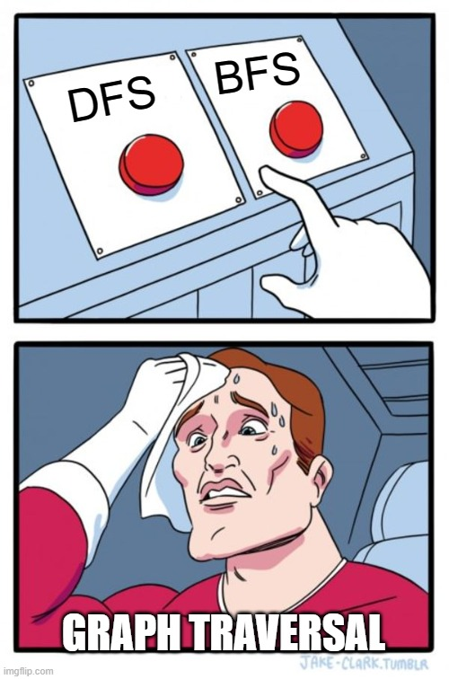
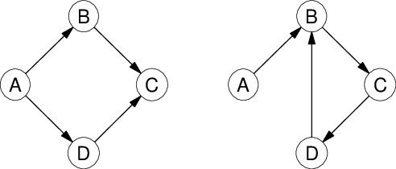

# T1.5.2 Parcours de graphes

{{ initexo(0) }}

{: .center width=480} 

!!! gear "Algorithme de parcours"
    Un parcours de graphe est un algorithme consistant à explorer les sommets d'un graphe de proche
    en proche à partir d'un sommet initial.

    :warning: Parcourir simplement le dictionnaire ou la matrice d’un
    graphe n’est pas considéré comme un
    parcours de graphe.


    Tous les parcours suivent plus ou moins le même algorithme de base :

    - On visite un sommet s1. On note S l’*ensemble* des voisins de s1.

    - Tant que S n’est pas vide :
    
        - on choisit un sommet s de S
        - on visite s
        - on ajoute à S tous les voisins de s **pas encore visités**


!!! warning "Sommets visités"
    Contrairement à un parcours d'arbre, où les fils d'un nœud ne peuvent pas avoir été visités avant le nœud, un voisin d'un sommet peut avoir déjà été visité en tant que voisin d'un sommet précédent...

    Il est donc nécessaire de mémoriser les sommets déja visités ou découverts (on dira qu'un sommet est découverts lorsqu'on l'ajoute à S).


Le choix de la structure de l'ensemble S est prépondérant:

- Si on choisit une **file** (FIFO): on visitera les sommets dans l'ordre d'arrivée, donc les plus proches du sommet précédent. On obtient donc un *parcours en largeur*.
- Si on choisit une **pile** (LIFO): on visitera d'abord les derniers sommets arrivés, donc on parcourt le graphe en visitant à chaque étape un voisin du précédent. On obtient donc un *parcours en profondeur*.

{: .center width=480} 

## 1. Parcours en largeur (BFS, Breadth First Search)

!!! gear "Algorithme BFS"
    C'est classiquement celui qu'on utilise pour trouver le chemin le plus court dans un graphe.

    **Exemple de parcours en largeur, avec B comme sommet de départ:**

    <gif-player src="https://cgouygou.github.io/TNSI/T01_StructuresDonnees/images/bfs.gif" speed="1" play></gif-player>

    On suit l'algorithme donné plus haut, en utilisant:

    - une liste `#!py visites` qui contient les sommets visités (c'est-à-dire qu'on a finit de traiter, ici après avoir ajouté ses voisins);
    - une liste `#!py decouverts` qui contient les sommets découverts au fur et à mesure du parcours;
    - une **file** `#!py file` qui contient les sommets découverts mais non encore visités. On utilisera au choix une classe `File` écrite plus tôt dans l'année ou tout simplement une `#!py list` avec les méthodes `#!py pop` (pour défiler) et `#!py append` (pour enfiler).

    En début d'algorithme, seul le sommet de départ `#!py depart` donné en paramètre est découvert. La fonction `BFS` renvoie la liste des sommets dans l'ordre de visite lors du parcours.

    ```python linenums='1' title='Parcours BFS - Code à compléter'
    def BFS(g:Graphe, depart:str) -> list:
        '''
        Effectue un parcours en largeur du graphe G en partant du sommet depart,
        et renvoie la liste des sommets visités dans l'ordre du parcours.
        '''
        visites = []
        decouverts = [...]
        file = [...]
        while file ... :
            sommet = ...
            for voisin in ...:
                if voisin not in ...:
                    ...
                    ...
            visites.append(...)
        return ...
    
    ```

!!! example "Application: existence de chemin" 
    L'objectif est de retrouver une chaine ou un chemin dans un graphe entre un sommet source et un sommet cible, s'il existe.

    L'idée est d'ajouter dans le parcours en profondeur un dictionnaire de «parentalité»: un dictionnaire dont les clés sont les sommets découverts et la valeur associée est le sommet «père», c'est-à-dire celui à partir duquel il est découvert.

    Ensuite, il faut reconstituer le chemin en remontant de la cible à la source en utilisant ce dictionnaire.

    1. Commencer par écrire une fonction `recupere_chemin` qui prend en paramètre un graphe, un sommet source et un sommet cible, et qui renvoie le chemin entre la source et la cible (par exemple sous forme d'une chaîne de caractères).

    2. Modifier la fonction BFS en ajoutant le dictionnaire `parents` et en modifiant la valeur renvoyée: le chemin s'il existe, `#!py None` (ou un message mentionnant qu'il n'existe pas) sinon.

    3. Tester sur un graphe non orienté, puis sur un graphe orienté.

??? check "Proposition de correction"
    {{ correction(True, 
    "
    ```python linenums='1'
    def recupere_chemin(dico, source, cible):
        chemin = cible
        sommet = cible
        while sommet != source:
            sommet = dico[sommet]
            chemin = sommet + chemin
        return chemin

    def trouve_chemin(g:Graphe, source:str, cible:str) -> list:
        '''
        Effectue un parcours en largeur du graphe G pour trouver
        un chemin entre les sommets source et cible
        '''
        parents = {source: None}
        decouverts = [source]
        file = [source]
        while file != []:
            sommet = file.pop(0)
            for voisin in g.voisins(sommet):
                if voisin not in decouverts:
                    parents[voisin] = sommet
                    if voisin == cible:
                        return recupere_chemin(parents, source, cible)
                    decouverts.append(voisin)
                    file.append(voisin)
        return f'pas de chemin entre {source} et {cible}'
    ```
    
    "
    ) }}


## 2. Parcours en profondeur (DFS, Depth First Search)

!!! gear "Algorithme DFS (itératif)"
    C'est classiquement celui qu'on utilise pour sortir d'un labyrinthe.

    **Exemple de parcours en profondeur, avec G comme sommet de départ:**

    <gif-player src="https://cgouygou.github.io/TNSI/T01_StructuresDonnees/images/dfs.gif" speed="1" play></gif-player>

    On adapte l'algorithme BFS, avec comme (grosses) différences:

    - on utilise cette fois-ci une **pile** `#!py file` pour les sommets découverts mais non encore visités. On utilisera au choix une classe `Pile` écrite plus tôt dans l'année ou tout simplement une `#!py list` avec les méthodes `#!py pop` (pour dépiler) et `#!py append` (pour empiler);
    - un sommet qu'on dépile peut avoir déjà été visité! Il faut donc le vérifier avant d'examiner ses voisins.

    En début d'algorithme, seul le sommet de départ `#!py depart` donné en paramètre est découvert. La fonction `DFS` renvoie la liste des sommets dans l'ordre de visite lors du parcours.

    ```python linenums='1' title='Parcours DFS itératif - Code à compléter'
    def DFS(g:Graphe, depart:str) -> list:
        '''
        Effectue un parcours en profondeur du graphe G en partant du sommet depart,
        et renvoie la liste des sommets visités dans l'ordre du parcours.
        '''
        visites = []
        decouverts = [...]
        pile = [...]
        while pile ... :
            sommet = ...
            if ... :
                for voisin in ...:
                    if voisin not in ...:
                        ...
                        ...
                visites.append(...)
        return ...

    ```


!!! gear "Algorithme DFS (récursif)"
    L'utilisation d'une pile peut inciter à chercher un algorithme récursif pour le parcours en profondeur, comme pour les arbres.
    En effet, tant qu'on peut on poursuit le parcours sur un voisin du sommet précédent... à condition que le voisin ne soit pas déjà visité!

    La différence majeure avec un parcours DFS sur un arbre réside dans le fait qu'il faut stocker les sommets visités dans une liste (qu'on passera en paramètre) qui sera modifiée à chaque appel récursif. On utilise alors le caractère mutable de ce type `#!py list` de Python...

    ```python linenums='1' title='Parcours DFS récursif - Code à compléter'
    def DFS_rec(g:Graphe, visites:list, depart:str) -> None:
        if ...:
            visites.append(depart)
            for voisin in g.voisins(depart):
                ...

    ```

    À utiliser ainsi:

    ```python
    >>> vus = []
    >>> DFS_rec(g, vus, 'G')
    >>> vus
    ['G', 'E', 'B', 'A', 'C', 'D', 'F', 'H']
    ```


!!! info "Remarque"
    L'ordre du parcours change selon l'algorithme DFS choisi:

    - avec un algorithme itératif, on utilise une pile donc le voisin choisi est **le dernier**;
    - avec un algorithme récursif, on fait un appel récursif sur chaque voisin donc le voisin choisi est **le premier**.
    
!!! example "Application: détection d'un cycle dans un graphe orienté"
    Dans un parcours DFS, on marque les sommets visités pour éviter de tourner en rond... Donc a priori on devrait être capable avec un tel parcours de détecter la présence d'un cycle si on retombe sur un sommet déjà visité.

    !!! danger "Un léger problème"
        {: .center} 

    Comme on peut le constater, retomber sur un sommet déjà visité ne suffit pas. Il faut donc différencier les sommets «visités» en deux catégories: les sommets dont le parcours DFS est en cours, et les sommets dont le parcours DFS est terminé.

    On va donc modifier le parcours DFS récursif pour lui passer **deux** listes en paramètres: une liste `#!py en_cours` et une liste `#!py termines`.

    Ainsi lorsqu'on revient sur un sommet:

    - de la liste `#!py en_cours` : on sait qu'on a trouvé un cycle;
    - de la liste `termines`: on ne fait *rien*;
    - d'aucune liste: on le passe dans la liste `#!py en_cours` puis on visite récursivement ses voisins, et enfin on le passe dans la liste `#!py termines`.


    ```python linenums='1' title='Algorithme de détection de cycle - Code à compléter'
    def detection_cycle(g:Graphe, en_cours:list, termines:list, depart:str) -> bool:
        if depart in  ... :
            return False
        elif depart in ... :
            return True
        else:
            ... .append(depart)
            for voisin in g.voisins(depart):
                if ... :
                    return True
            ... .append(depart)
            return False
    
    ```

    ??? tip "Un graphe orienté pour tester..."
        ```python linenums='1'
        go = GrapheO([])
        go.ajoute_arc('B', 'A')
        go.ajoute_arc('A', 'S')
        go.ajoute_arc('S', 'C')
        go.ajoute_arc('S', 'D')
        go.ajoute_arc('S', 'G')
        go.ajoute_arc('C', 'D')
        go.ajoute_arc('C', 'E')
        go.ajoute_arc('F', 'C')
        go.ajoute_arc('G', 'F')
        go.ajoute_arc('E', 'H')
        go.ajoute_arc('G', 'H')

        go.ajoute_arc('I', 'J')
        go.ajoute_arc('J', 'K')
        go.ajoute_arc('K', 'I')
        ```
    
    


## 3. Exercices

!!! example "{{ exercice() }}"
    === "Énoncé" 
        Écrire une fonction (ou une méthode) `#!py est_connexe` qui détermine si un graphe est connexe ou non.
    === "Correction" 
        {{ correction(False, 
        "
        def est_connexe(g:Graphe) -> bool:
            return g.ordre() == len(BFS(g, g.sommets()[0]))
        "
        ) }}

!!! example "{{ exercice() }}"
    === "Énoncé" 
        !!! info "Rappel"
            Un graphe est **eulérien** s'il est connexe et s'il possède exactement 0 ou 2 sommets de degré impair (le degré de sommet est son nombre de voisins).

        Écrire une fonction (ou une méthode) `#!py est_eulerien` qui détermine si un graphe est eulérien ou non.

    === "Correction" 
        {{ correction(False, 
        "
        ```python linenums='1'
        def est_eulerien(g:Graphe) -> bool:
            degre_impair = 0
            for s in g.sommets():
                if len(g.voisins()) % 2 == 1:
                    degre_impair +=1
            return est_connexe(g) and (degre_impair == 0 or degre_impair == 2)
        ```
        "
        ) }}


!!! example "{{ exercice() }}"
    === "Énoncé" 
        Si un graphe orienté est connexe, la fonction `#!py detection_cycle` déterminera s'il contient ou non un cycle. En revanche, si le graphe n'est pas connexe, on ne sera pas capable de détecter un cycle dans une autre composante connexe que celle à laquelle appartient le sommet de départ.

        Écrire une fonction `#!py cycle` qui prend un paramètre un graphe orienté (de classe `#!py GrapheO` ) et qui renvoie si le graphe contient un cycle.
    === "Correction" 
        {{ correction(False, 
        "
        "
        ) }}
!!! example "{{ exercice() }}: Algorithme de Dijkstra"
    === "Énoncé" 

        L'[algorithme de Dijkstra](https://cgouygou.github.io/TNSI/T09_Extras/Dijkstra/){:target="_blank"} repose sur un parcours en largeur où l'on sélectionne parmi les sommets déjà découverts celui qui a la plus petite distance au sommet *source*.

        Dans cet algorithme, on va construire un dictionnaire `#!py distances` où:

        - les clés sont les sommets du graphe;
        - les valeurs sont un couple (une liste) de deux élements: la distance au sommet *source* et le sommet «père».

            Initialement, toutes les valeurs seront initialisés à `#!py [inf, None]` (importer `#!py inf` du module `#!py math` qui permet d'avoir un nombre plus grand que tous les autres), sauf pour la clé du sommet *source* dont la valeur sera `#!py [0, None]`.
        
        On manipulera également deux listes:

        - une liste `#!py visites`, initialement vide, qui contiendra au fur et à mesure les sommets visités (c'est-à-dire finis d'être traités);
        - une liste `#!py decouverts`, qui contient initialement le sommet *source* seulement, et qui contiendra les sommets accessibles par un sommet déjà traité mais non encore visités.

        On suit ensuite l'algorithme suivant:

        - Tant que la liste `#!py decouverts` n'est pas vide:

            - on sélectionne le sommet `#!py s_min` de `#!py decouverts`  qui a la plus petite distance au sommet *source*;
            - on supprime ce sommet `#!py s_min` de `#!py decouverts` et on l'ajoute à `#!py visites`.
            - pour chaque voisin `#!py voisin` **qui n'est pas visité** de `#!py s_min` , on actualise sa distance:

                - s'il n'est pas dans `#!py decouvert`, on l'y ajoute et sa distance est la somme de la distance de `#!py s_min` à la *source* et du poids de l'arête reliant `#!py s_min` à `#!py voisin`
                - sinon on remplace sa distance actuelle par cette somme si elle est plus petite.
                - dans les deux cas on actualise (éventuellement) le sommet père à `#!py s_min`
        
        - On renvoie le dictionnaire.

        **Remarque:** on manipule un graphe de classe `#!py GrapheP`...

        ```python linenums='1' title='Algorithme de Dijkstra - à compléter'
        def dijkstra(g:Graphe, source:str) -> dict:
            '''
            Détermine et renvoie le plus court chemin entre le sommet source et les
            autres sommets du graphe g.
            Renvoie un dictionnaire dont les clés sont les sommets du graphe et les
            valeurs une liste [d, p] où d est la distance la plus courte depuis le
            sommet source et p le sommet «père».
            '''
            distances = {s: [inf, None] for s in ...}
            distances[source] = ...
            visites = []
            decouverts = [source]
            while decouverts != []:
                # On détermine le sommet de la liste decouverts qui a la plus petite
                # distance au sommet source
                d_min = inf
                ...

                decouverts.remove(s_min)
                visites.append(s_min)

                for voisin in [v for v in ... if ...]:
                    if ...:
                        decouverts.append(voisin)
                        distances[voisin] = ...
                    else:
                        if ... :
                            distances[voisin] = ...

            return distances
        ```
        
        On pourra vérifier à l'aide de l'[exemple](https://cgouygou.github.io/TNSI/T09_Extras/Dijkstra/){:target="_blank"} sur le graphe:

        ```python linenums='1'
        g = GrapheP([])

        g.ajoute_arete('A', 'B', 12)
        g.ajoute_arete('A', 'D', 14)
        g.ajoute_arete('B', 'F', 9)
        g.ajoute_arete('B', 'G', 16)
        g.ajoute_arete('B', 'H', 21)
        g.ajoute_arete('D', 'E', 10)
        g.ajoute_arete('C', 'E', 13)
        g.ajoute_arete('C', 'F', 10)
        g.ajoute_arete('E', 'F', 16)
        g.ajoute_arete('E', 'H', 10)
        g.ajoute_arete('F', 'H', 11)
        g.ajoute_arete('G', 'H', 11)
        ```
        
    === "Correction" 
        {{ correction(False, 
        "
        def dijkstra(g:Graphe, source:str) -> dict:
            '''
            Détermine et renvoie le plus court chemin entre le sommet source et les
            autres sommets du graphe g.
            Renvoie un dictionnaire dont les clés sont les sommets du graphe et les
            valeurs une liste [d, p] où d est la distance la plus courte depuis le
            sommet source et p le sommet «père».
            '''
            distances = {s: [inf, None] for s in g.sommets()}
            distances[source] = [0, None]
            visites = []
            decouverts = [source]
            while decouverts != []:
                dmin = inf
                for s in decouverts:
                    if distances[s][0] < dmin:
                        dmin = distances[s][0]
                        s_min = s

                decouverts.remove(s_min)
                visites.append(s_min)

                for voisin in [v for v in g.voisins(s_min) if v not in visites]:
                    if voisin not in decouverts:
                        decouverts.append(voisin)
                        distances[voisin] = [distances[s_min][0] + g.adj[s_min][voisin], s_min]
                    else:
                        if distances[s_min][0] + g.adj[s_min][voisin] < distances[voisin][0]:
                            distances[voisin] = [distances[s_min][0] + g.adj[s_min][voisin], s_min]

            return distances
        "
        ) }}