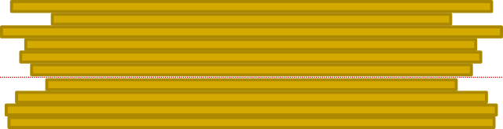

# TP d'introduction: le crêpier psycho-rigide

!!! example "Énoncé"
    À la fin de sa journée, un crêpier dispose d'une pile désordonnée de crêpes. Le crêpier étant un peu psycho-rigide, il décide de ranger sa pile de crêpes, de la plus grande (en bas) à la plus petite (en haut).

    Pour cette tâche, le crêpier peut faire une seule action : glisser sa spatule entre deux crêpes et retourner le
    **haut** de la pile.
    
    === "Pile initiale"
        {: .center} 

    === "Choix d'insertion de la spatule"
        {: .center} 

    === "Pile retournée"
        {: .center}

    Comment doit-il procéder pour trier toute la pile de crêpes?


!!! code "Rappels (?) de méthodes utiles (?) sur les listes de Python"
    - la méthode `append` permet un élément d'ajouter en fin de liste :
        ```python
        >>> lst = [1, 4, 7]
        >>> lst.append(10)
        >>> lst.append(13)
        >>> lst
        [1, 4, 7, 10, 13]
        ```
    - la méthode `pop` permet d'enlever **et** de renvoyer un élément d'une liste (par défaut le dernier):
        ```python 
        >>> lst.pop()
        13
        >>> lst.pop()
        10
        >>> lst
        [1, 4, 7]
        >>> lst.pop(0)
        1
        >>> lst
        [4, 7]
        ```


!!! tip "Indications"
    {{ correction(True, 
    "
    1. Écrire une fonction `plus_grand(lst, k)` qui renvoie l'indice du plus grand élément de la liste `lst` **après** la position `k`.

        **Exemple:**
        ```python
        >>> pile = [149, 117, 131, 142, 125]
        >>> plus_grand(pile, 0)
        0
        >>> plus_grand(pile, 1)
        3
        ```
        
    2. Écrire une fonction `retourner(lst, k)` qui renvoie la liste retournée **à partir de l'indice k**.

        **Exemple:**
        ```python
        >>> pile = [149, 117, 131, 142, 125]
        >>> retourner(pile, 3)
        [149, 117, 131, 125, 142]
        ```

    3. Écrire une fonction récursive `ordonner(lst, k)` qui ordonne la liste `lst` à partir de l'indice `k`.
    "
    ) }}

!!! check "Correction"
    ```python linenums='1'
    from random import randint

    def plus_grand(liste:list, k:int) -> int:
        '''
        renvoie l'indice du plus grand élément de la liste dont l'indice est
        supérieur à k
        '''
        imax = k
        m = 0
        for i in range(k, len(liste)):
            if liste[i] > m:
                m = liste[i]
                imax = i
        return imax

    def retourner_pile(liste:list, k:int) -> list:
        '''
        renvoie la liste retournée, c'est-à-dire consitutée des élements dans
        l'ordre inverse, à partir de l'indice k
        '''
        retour = []
        for i in range(len(liste)):
            if i < k:
                retour.append(liste[i])
            else:
                retour.append(liste.pop())
        return retour

    def ordonner_pile(liste:list, n:int):
        if n == len(liste):
            return liste
        else:
            lst1 = retourner_pile(liste, plus_grand(liste, n))
            lst2 = retourner_pile(lst1, n)
            return ordonner_pile(lst2, n+1)
    ```
    