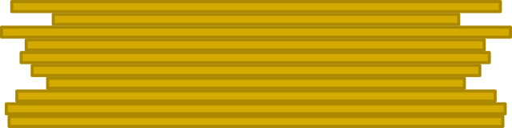

# TP

## TP1: le crêpier psycho-rigide

!!! example "Énoncé"
    À la fin de sa journée, un crêpier dispose d’une pile désordonnée de crêpes. Le crêpier étant un peu psycho-    rigide, il décide de ranger sa pile de crêpes, de la plus grande (en bas) à la plus petite (en haut).

    Pour cette tâche, le crêpier peut faire une seule action : glisser sa spatule entre deux crêpes et retourner le
    **haut** de la pile.
    
    === "Pile initiale"
        {: .center} 

    === "Choix d'insertion de la spatule"
        {: .center} 

    === "Pile retournée"
        {: .center}
        
    Comment doit-il procéder pour trier toute la pile ?