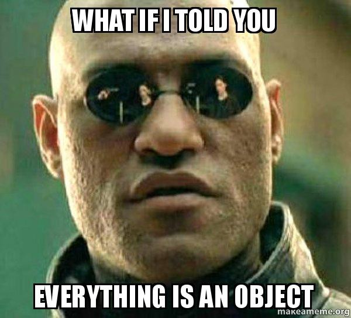

# T2.1 POO : Programmation Orientée Objet (part one)

## 2.1.1 Retour sur le TP 

Et si maintenant on doit créer 100 balles qui rebondissent?

{: .center} 


## 2.1.2 Introduction

!!! abstract "Paradigme Objet"
    La POO est un **paradigme** de programmation, au même titre que la programmation impérative (que nous pratiquons déjà) ou la programmation fonctionnelle (qui sera étudiée cette année en Terminale), ou encore d'autres paradigmes (la liste est longue).

    Un paradigme de programmation pourrait se définir comme une philosophie dans la manière de programmer : c'est un parti-pris revendiqué dans la manière d'aborder le problème à résoudre. Une fois cette décision prise, des outils spécifiques au paradigme choisi sont utilisés. 

{: .center width=480} 

Mais qu'est-ce qu'un objet? 

!!! abstract "Vocabulaire"
    En POO, une **classe** est un modèle (on parle parfois de moule) de création d’objets (en Python c’est un
    type). Un objet est une valeur (au sens large), **instance** d’une classe.
    
    La classe permet de définir quels seront les  **attributs** (ou **variables d’instance**, c’est à dire les données associées à l’objet, qui le caractérisent) et les **méthodes** (comportement de l’objet) qui sont des fonctions qui s'appliquent uniquement aux objets de cette classe.

Nous en avons déjà manipulés sans le savoir:

```python
>>> n = 42
>>> type(n)
<class 'int'>
```

`n` est une **instance de classe**  `int`. Dans l'inspecteur d'objet de Thonny, on observe que cet objet possède des **attributs** (comme `real` par exemple) ainsi que des **méthodes** (comme `bit_length` par exemple). 

{: .center} 

On manipule ces objets (attributs et méthodes) par la notation 
*pointée* spécifique à la POO...

```python
>>> n.real
42
>>> n.bit_length()
6
```

Un autre exemple avec la classe `list` bien connue:

```python 
>>> tab = [1, 2, 3]
>>> type(tab)
<class 'list'>
>>> tab.append(4)
>>> tab
[1, 2, 3, 4]
```

## 2.1.3 Création d'une classe

Créons une classe permettant de structurer l'objet «balle» du DL2.

{: .center} 

!!! code "Définition de la classe"
    On définit le nom d'une classe avec le mot-clé `class`, avec une majuscule (par convention):

    ```python linenums='1'
    class Balle:
        pass
    ```
    
On peut dès à présent créer une instance de `Balle`, mais avec une définition aussi pauvre, on ne peut pas en faire grand chose, sauf créer des attributs de façon anarchique:

```python
>>> b = Balle()
>>> type(b)
<class '__main__.Balle'>
>>> b.x = 1
>>> b.nimp = True
```

!!! code "Méthode constructeur"
    Il s'agit de munir une instance de ses attributs dès sa création, à l'aide de la méthode *spéciale* (ou *magique*) `__init__` qui comme son nom l'indique, initialise les attributs de l'objet avec les valeurs passées en paramètre. C'est **un passage obligé**.

    === "Avec paramètres"
        La façon classique de définir un objet est de donner les valeurs de ses attributs lors de la création.
        ```python linenums='1'
        class Balle:
            def __init__(self, abscisse, ordonnee, dep_h, dep_v, coul, r):
                self.x = abscisse
                self.y = ordonnee
                self.dx = dep_h
                self.dy = dep_v
                self.couleur = coul
                self.rayon = r
        ```
        On peut alors créer un objet `Balle`, de position de départ `(10, 50)`, de déplacement `(2, 3)`, rouge et de rayon 8:

        ```python
        >>> b = Balle(10, 50, 2, 3, (255, 0, 0), 8)
        ```
        
        {: .center} 
    === "Sans (tous les) paramètres"
        On peut aussi affecter des valeurs identiques pour toutes les instances d'une classe, ou bien les choisir aléatoirement.
        ```python linenums='1'
        import random
        
        width, height = 320, 240

        class Balle:
            def __init__(self, coul):
                self.x = random.randint(0, width)
                self.y = random.randint(0, height)
                self.dx = random.randint(2, 4)
                self.dy = random.randint(2, 4)
                self.couleur = coul
                self.rayon = 8
        ```

        Pour déclarer un objet, on ne donne ici que sa couleur:

        ```python 
        >>> b = Balle((255, 110, 66))
        ```

!!! warning "Paramètre `self`"
    Le premier paramètre d'une méthode de classe (comme `__init__` ci-dessus) est **toujours** `self`. Stricto sensu, ce n'est pas un mot réservé du langage Python (mais par convention oui), il sert à préciser que les variables d'instance (les attributs) et les méthodes sont propres à l'objet que l'on définit dans la classe. 

!!! code "Ajout d'une méthode"
    On définit les méthodes comme des fonctions, dans le corps de la classe (c'est-à-dire en respectant l'indentation), et avec `self` en premier paramètre.
    
    ```python linenums='1'
    class Balle:
        def __init__(self, abscisse, ordonnee, dep_h, dep_v, coul, r):
            self.x = abscisse
            self.y = ordonnee
            self.dx = dep_h
            self.dy = dep_v
            self.couleur = coul
            self.rayon = r
        
        def affiche(self):
            pygame.draw.circle(screen, self.couleur, (self.x,self.y), self.rayon) 
    ```

    Dans la fonction `circle`, on distingue donc `screen` qui est une variable globale (pas de `self`) des autres variables d'instance (préfixées par `self`).

!!! code "Appel d'une méthode"
    On peut appeler une méthode de deux façons (avec `obj` instance d'une classe `Classe` possédant une méthode `methode`):

    - `obj.methode(*args)`
    - `Classe.methode(obj, *args)`

    Bien que ces deux syntaxes sont techniquement identiques, **on n'utilise dans la pratique que la première**, mais connaître la deuxième permet de comprendre pourquoi le paramètre `self` est toujours en premier, pourquoi l’oublier peut produire des bugs difficiles à trouver, et pourquoi ce n’est pas un mot réservé (c’est un simple nom de paramètre, mais conventionnellement, on l’appelle `self`).

    **Exemple:**

    ```python
    >>> l = [1, 2, 3]
    >>> l.append(4)
    >>> list.append(l, 5)
    >>> l
    [1, 2, 3, 4, 5]
    ```
    