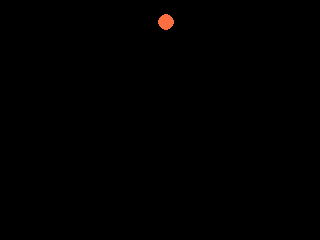

# TP : introduction à Pygame

## Introduction
Commencer par consulter les pages:

- [Introduction à Pygame](https://cgouygou.github.io/1NSI/T08_Extras/3Pygame/01-Pygame_intro/){:target="_blank"} 
- [Animation simple (sans événements)](https://cgouygou.github.io/1NSI/T08_Extras/3Pygame/02-Pygame_image/){:target="_blank"} 
- [Dessiner avec Pygame](https://cgouygou.github.io/1NSI/T08_Extras/3Pygame/04-Pygame_extras/#2-dessiner-avec-pygame){:target="_blank"} 

## Énoncé

1. À partir du code donné en exemple avec une représentation de la balle par un cercle (cf. *Dessiner avec Pygame*), terminer le programme pour faire rebondir la balle sur tous les bords de la fenêtre.
    {: .center} 
    
2. Ajouter une deuxième balle, dont la position de départ, la couleur et le déplacement seront aléatoires (utiliser le module `random`).
3. Gérer la collision entre deux balles:
    - en créant une fonction `distance` qui renvoie la distance entre les centres de deux balles;
    - en échangeant les déplacements des balles lorsqu'il y a collision.