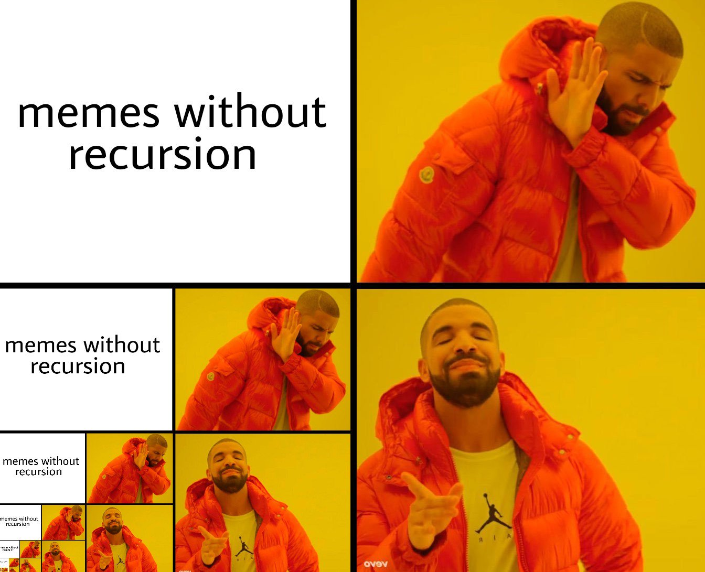
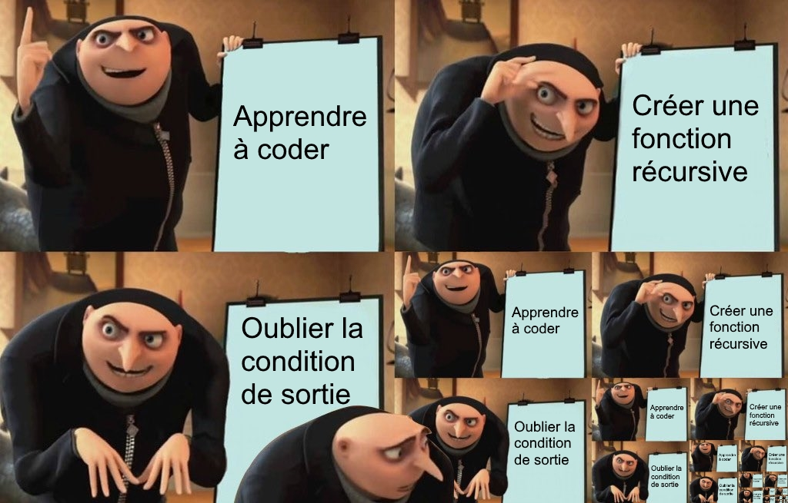
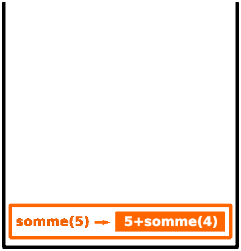
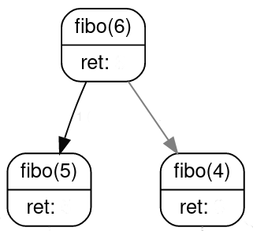
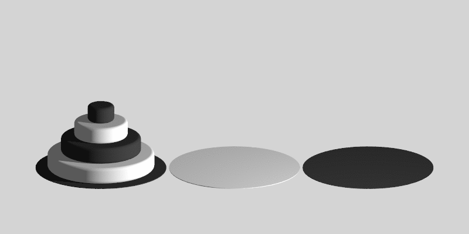
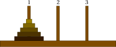
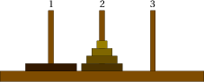
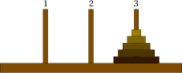

# T2.2 Récursivité

{{ initexo(0) }}

Voir [ici](https://cgouygou.github.io/TNSI/T02_Programmation/T2.2_Recursivite/T2.2_Recursivite/)


<br/>
<br/>
<br/>
<br/>
<br/>
<br/>
<br/>
<br/>
<br/>
<br/>
<br/>
<br/>
<br/>
<br/>
<br/>
<br/>
<br/>
<br/>
<br/>
<br/>
<br/>
<br/>
<br/>
<br/>
<br/>
<br/>
<br/>
<br/>
<br/>
<br/>
<br/>
<br/>
<br/>


Dans le même état d'esprit, chez Google:

{: .center} 

## 2.2.1 Principe 

En règle générale, un objet est dit récursif s'il se définit à partir de lui-même. On trouve donc des acronymes récursifs, comme GNU dans GNU/Linux (GNU is Not Unix), le logiciel d'émulation WINE (Wine Is Not an Emulator), les cartes bancaire VISA (Visa International Service Association), le moteur de recherche Bing (Bing is not Google), etc.

Mais aussi des images illustrant la mise en abîme:

{: .center width=480} 

En informatique, on parle de programme récursif ou plutôt de fonction récursive:

!!! abstract "Définition"
    Une fonction **récursive** est une fonction qui s'appelle elle-même dans sa propre définition.

    Un programme est récursif lorsqu'il fait intervenir une fonction récursive (ou plusieurs).


## 2.2.2 Premiers exemples et précautions d'usage

!!! note "No infinite recursion !"
    Voici trois premiers exemples de fonctions récursives. Dans chaque cas, repérer l'appel récursif à la fonction.
    
    Une seule de ces 3 fonctions est correcte, laquelle?

    === "Fonction 1"
        ```python linenums='1'
        def f(n):
            print(n)
            f(n-1)
            print("Hello world!")
        ```
    === "Fonction 2"
        ```python linenums='1'
        def f(n):
            if n == 0:
                print("Hello world!")
            else:
                print(n)
                f(n-1)
        ```
    === "Fonction 3"
        ```python linenums='1'
        def f(n):
            if n == 0:
                print("Hello world!")
            else:
                print(n)
                f(n)
        ```

!!! warning "Cas de base"
    Lorsqu'on écrit une fonction récursive, le piège classique est de créer une **boucle infinie**.
    
    Hormis les blaques ~~de geeks~~  d'initiés, la récursivité en informatique ne tolère pas l'auto-référence infinie: **il faut prévoir une condition d'arrêt qui traite le cas de base !!!**

    {: .center width=640} 

!!! warning "Terminaison"
    Pour s'assurer qu'une fonction récursive se termine, il faut **absolument** que la chaîne d'appel conduise au cas de base. 

    - si le paramètre de la fonction est un entier, alors l'appel doit se faire avec un **entier strictement inférieur**;
    - si le paramètre de la fonction est une liste, alors l'appel doit se faire avec une liste de **longueur strictement inférieure**;
    - etc.


!!! note "Exemples à connaître"
    === "Somme des n premiers entiers"
        On souhaite calculer la somme suivante:  $S = 0 + 1 + 2 + 3 + \dots + (n-1) + n$

        En première, on a vu comment construire une fonction *itérative* le permettant, à l'aide d'une boucle `for` (d'où le terme *itératif*) et d'une variable accumulatrice:

        ```python linenums='1'
        def somme(n):
            s = 0
            for k in range(n+1):
                s += k
            return s
        ```
        
        Une autre façon de voir le problème, c'est de se dire que cette somme peut s'écrire $S = n + (n-1) + \dots + 3 + 2 + 1 + 0$ et que c'est la somme de $n$ et **de la somme des $n-1$ premiers entiers** : $S = n + \underbrace{(n-1) + \dots + 3 + 2 + 1 + 0}_{\text{somme des entiers jusqu'à } n-1}$.

        On écrit alors de façon «assez naturelle» la fonction récursive suivante:

        ```python linenums='1'
        def somme(n):
            if n == 0:
                return 0
            else:
                return n + somme(n-1)
        ```

    === "Factorielle"
        En mathématiques, la factorielle d'un nombre entier $n$, notée $n!$, est le produit de tous les entiers positifs non nuls inférieurs ou égaux à $n$.

        Autrement dit, $n! = 1 \times 2 \times 3 \times \dots \times (n-1) \times n = n \times (n-1)  \times \dots \times 3 \times 2 \times 1$.

        !!! example "{{ exercice() }}"
            === "Énoncé" 
                S'inspirer des fonctions `somme` précédentes pour écrire deux fonctions `facto_iter` (itérative) et `facto_rec` (récursive) renvoyant la factorielle d'un nombre entier `n` strictement positif.
            === "Correction" 
                {{ correction(False, 
                "
                ```python linenums='1'
                def facto(n):
                    f = 1
                    for k in range(1, n+1):
                        f *= k
                    return f
                
                def facto_rec(n):
                    if n == 1:
                        return 1
                    else:
                        return n * facto_rec(n-1)
                ```
                
                "
                ) }}
        

## 2.2.3 Mécanisme

Maintenant qu'on a vu le principe d'une fonction récursive, il faut comprendre comment se passent les appels successifs à la fonction, pour un paramètre différent. 

Reprenons l'exemple de la fonction récursive `somme`. Si on appelle cette fonction:
```python
>>> somme(5)
```
Puisque l'argument `5` ne correspond pas au cas de base, la fonction va faire appel à `somme(4)`. Il faut retenir que l'exécution de la fonction `somme` est interrompue (avec l'argument `5`) pour rappeler la fonction `somme` (avec l'argument `4`)... 

Pour gérer ces différents appels, le système utilise une **pile d'exécution**:

<gif-player src="https://cgouygou.github.io/TNSI/T02_Programmation/images/ezgif_pile.gif" speed="1" play></gif-player>

<!-- {: .center width=480}  -->

On parle de pile, car les exécutions successives «s'empilent» les unes sur les autres. Lorsque le cas de base est atteint, on «dépile» les instructions.

D'où l'importance de l'existence du cas de base, et de s'assurer qu'il sera bien atteint... 

!!! warning "Limitation de la taille de la pile"
    Dans l'exemple précédent, la pile a une *profondeur* de 6. La profondeur de la pile n'est pas illimitée:
    ```python linenums='1'
    >>> somme(1000)
    Traceback (most recent call last):
      File "<console>", line 1, in <module>
      File "<tmp 1>", line 5, in somme
        return n + somme(n-1)
      File "<tmp 1>", line 5, in somme
        return n + somme(n-1)
      File "<tmp 1>", line 5, in somme
        return n + somme(n-1)
      [Previous line repeated 984 more times]
      File "<tmp 1>", line 2, in somme
        if n == 0:
    RecursionError: maximum recursion depth exceeded in comparison

    ```
    Vous venons de provoquer un «débordement de pile», le célèbre **stack overflow**.

De manière générale, les programmes récursifs sont souvent proches de la définition du problème à résoudre et assez naturels à écrire, mais ils sont susceptibles de générer un trop grand nombre d'appels à eux-mêmes et de nécessiter un temps d'exécution trop grand ou un débordement de pile. Il est parfois possible de les optimiser, comme nous le verrons dans le cours concernant la **programmation dynamique**. 


## 2.2.4 Exercices

!!! example "{{ exercice() }}"
    === "Énoncé" 
        Écrire une fonction récursive `puissance(x, n)` qui renvoie le nombre $x^n$.
    === "Correction" 
        {{ correction(True, 
        "
        ```python linenums='1'
        def puissance(x:float, n:int):
            '''
            calcule et renvoie la puissance n-ième de x
            '''
            if n == 0:
                return 1
            else:
                return x * puissance(x, n-1)
        ```
        "
        ) }}

!!! example "{{ exercice() }}"
    === "Énoncé" 
        1. Écrire une fonction récursive `nb_chiffres(n)` qui renvoie le nombre de chiffres du nombre entier `n` (penser à la division euclidienne par 10).
        2. Écrire une fonction récursive `nb_bits(n)` qui renvoie le nombre de bits dans l'écriture binaire du nombre entier `n` (penser à la division euclidienne par 2).
    === "Correction" 
        {{ correction(True, 
        "
        ```python linenums='1'
        def nb_chiffres(n:int) -> int:
            '''
            renvoie le nombre de chiffres d'un entier n.
            '''
            if n // 10 == 0:
                return 1
            else:
                return 1 + nb_chiffres(n//10)

        def nb_bits(n:int) -> int:
            '''
            renvoie le nombre de bits dans l'écriture binaire d'un entier n.
            '''
            if n // 2 == 0:
                return 1
            else:
                return 1 + nb_bits(n//2)
        ```
        ```
        
        "
        ) }}

!!! example "{{ exercice() }}"
    === "Énoncé" 
        Le plus grand diviseur commun de deux nombres entiers $a$ et $b$, noté $\text{pgcd}(a, b)$, vérifie les propriétés suivantes:

        - $\text{pgcd}(a, 0) = a$
        - $\text{pgcd}(a, b) = \text{pgcd}(b, c)$ où $c$ est le reste dans la division euclidienne de $a$ par $b$.


        Écrire une fonction récursive qui calcule le pgcd de deux nombres entiers.

    === "Correction" 
        {{ correction(True, 
        "
        ```python linenums='1'
        def pgcd(a:int, b:int) -> int:
            '''
            renvoie le pgcd de deux entiers a et b.
            '''
            if b == 0:
                return a
            else:
                return pgcd(b, a%b)

        ```
        
        "
        ) }}

!!! example "{{ exercice() }}"
    === "Énoncé" 
        La multiplication égyptienne, dite aussi du paysan russe, était utilisée par les scribes dès l'Antiquité. Elle ne nécessite pas de connaître les tables de multiplication (sic), seulement la division par deux et l'addition.

        Principe pour multiplier $a$ par $b$:

        - on divise $a$ par 2 tant qu'on peut en doublant $b$;
        - sinon on décrémente $a$ et on ajoute $b$ au résultat.
        

        Écrire une fonction récursive qui multiplie deux entiers donnés en paramètre par cette méthode.
    === "Indications"
        - Effectuer à la main des multiplications égyptiennes.
        - Bien réfléchir au cas de base.
    === "Correction" 
        {{ correction(True, 
        "
        ```python linenums='1'
        def multi_egpyt(a:int, b:int) -> int:
            '''
            renvoie le produit de a par b par la méthode égyptienne.
            '''
            if a == 0:
                return 0
            elif a%2 == 0:
                return multi_egypt(a//2, b*2)
            else:
                return b + multi_egypt(a-1, b)
        ```
        
        "
        ) }}
!!! example "{{ exercice() }} : récursivité double"
    === "Énoncé" 
        En mathématiques, la suite de Fibonacci est définie ainsi:

        - $F_0=1$ et $F_1=1$
        - pour tout entier $n \geqslant 2$: $F_{n+2} = F_{n+1} + F_n$.

        On a donc par exemple $F_2 = 1+1=2$, $F_3=2+1=3$, $F_4=3+2=5$, etc.

        1. Implémenter une fonction récursive `fibo` qui calcule les termes de la suite de Fibonacci.
        2. Dessiner sous forme d'un arbre les appels de `fibo(6)`.
            Début de l'arbre:
            {: .center} 

    === "Correction" 
        {{ correction(True, 
        "
        ```python linenums='1'
        def fibo(n:int) -> int:
            '''
            renvoie le n-ième nombre de la suite de Fibonacci.
            '''
            if n == 0 or n == 1:
                return 1
            else:
                return fibo(n-1) + fibo(n-2)
        ```
        
        "
        ) }}

!!! example "{{ exercice() }} : récursivité croisée"
    === "Énoncé" 
        L'objectif est d'écrire deux fonctions `est_pair` et `est_impair` qui testent la parité d'un nombre entier.
        
        Seules opérations autorisées : test de nullité et soustraire 1.

    === "Correction" 
        {{ correction(True, 
        "
        ```python linenums='1'
        def est_pair(n):
            if n == 0:
                return True
            else:
                return est_impair(n - 1)

        def est_impair(n):
            if n == 0:
                return False
            else:
                return est_pair(n - 1)
        ```
        
        "
        ) }}

!!! example "{{ exercice() }}: les tours de Hanoï"
    === "Énoncé" 
        Le problème des tours de Hanoï, inventé par le mathématicien Édouard Lucas en 1889, consiste à déplacer des disques de diamètres différents d'une tour de départ à une tour d'arrivée, en passant par une tour intermédiaire.

        On ne peut déplacer qu'un disque à la fois, et on ne peut pas placer un disque sur un plus petit que lui.

        Le but est bien entendu de minimiser le nombre de déplacements.

        {: .center width=480} 


        1. Essayer de trouver une stratégie optimale en s'entraînant par exemple [ici](https://www.mathsisfun.com/games/towerofhanoi.html){:target="_blank"} 
        2. Observer les étapes-clés suivantes:

            === "Étape 1"
                {: .center} 
            === "Étape 2"
                {: .center} 
            === "Étape 3"
                {: .center} 
            === "Étape 4"
                {: .center} 

        3. Écrire une fonction récursive `hanoi(n, depart, arrivee, inter)` **affichant** les déplacements successifs (par ex. `1 -> 3`) pour déplacer `n` disques de la tour `depart` vers la tour `arrivee` en passant par la tour intermédiaire `inter`.

    === "Correction" 
        {{ correction(True, 
        "
        ```python linenums='1'
        def hanoi(n, depart, arrivee, inter):
            if n == 1:
                print(depart, '->', arrivee)
            else:
                hanoi(n-1, depart, inter, arrivee)
                hanoi(1, depart, arrivee, inter)
                hanoi(n-1, inter, arrivee, depart)
        ```
        
        "
        ) }}

!!! example "{{ exercice() }}: rendu de monnaie, le retour"
    === "Énoncé" 
        Écrire une fonction récursive `nb_pieces(pieces, somme)` où `pieces` est une liste de valeurs de pieces (triée dans l'ordre décroissant) et `somme` un entier donnant la somme à atteindre, et qui renvoie le nombre de pièces minimal.

        Pour cela, on envisagera la stratégie suivante:

        - en notant `h` le premier élément de la liste et `t` la liste complète privée du premier élément, la liste de pièces est `[h] + t`.
        - on se retrouve face à deux options: soit on prend `h` et il reste à faire la somme `somme - h` avec la liste complète, soit on ne prend pas `h` et il reste à faire la somme `somme` avec la liste `t`
        - on choisit le minimum renvoyé par ces deux options...

    === "Indications"
        - Envisager le cas où la somme est négative ou qu'il n'y a pas de pièces à prendre.
        - Pour obtenir un nombre arbitrairement grand, on peut utiliser `math.inf` du module `math`.
        - **Slicing (hors-programme):** pour obtenir une liste privée de son premier élément, on écrit `liste[1:]`.

    === "Correction" 
        {{ correction(True, 
        "
        ```python linenums='1'
        import math

        def nb_pieces(pieces:list, somme:int):
            if somme == 0:
                return 0
            elif somme < 0 or pieces == []:
                return math.inf
            else:
                option1 = 1 + nb_pieces(pieces, somme - pieces[0])
                option2 = nb_pieces(pieces[1:], somme)
                return min(option1, option2)

        ```
        
        "
        ) }}


!!! example "{{ exercice() }}: le sac à dos, le retour"
    === "Énoncé" 
        En analysant le problème de façon similaire à l'exercice précédent, compléter la fonction récursive suivante:

        ```python linenums='1'
        def choix_recursif(poids:list, valeurs:list, M:int) -> tuple:
            '''
            Renvoie le poids, la valeur et la sélection d'objets sous forme d'un tuple (int, int, list)
            '''
            if poids == []:
                return ...
            # Cas où on ne prend pas l'objet 0
            poids1, valeur1, choix1 = choix_recursif(..., ..., ...)
            if M >= poids[0]:
                # Cas où on prend l'objet 0
                poids2, valeur2, choix2 = choix_recursif(..., ..., ...)
                poids2 += ...
                valeur2 += ...
                if valeur2 > valeur1:
                    return ...
                else:
                    return ...
            else:
                return ...
        ```
    === "Correction" 
        {{ correction(True, 
        "
        ```python linenums='1'
        def choix_recursif(poids:list, valeurs:list, M:int) -> tuple:
            '''
            Renvoie le poids, la valeur et la sélection d'objets sous forme d'un tuple (int, int, list)
            '''
            if poids == []:
                return (0, 0, [])
            # Cas où on ne prend pas l'objet 0
            poids1, valeur1, choix1 = choix_recursif(poids[1:], valeurs[1:], M)
            if M >= poids[0]:
                # Cas où on prend l'objet 0
                poids2, valeur2, choix2 = choix_recursif(poids[1:], valeurs[1:], M - poids[0])
                poids2 = poids2 + poids[0]
                valeur2 = valeur2 + valeurs[0]
                if valeur2 > valeur1:
                    return poids2, valeur2, [1] + choix2
            return poids1, valeur1, [0] + choix1
        ```
        
        "
        ) }}


!!! example "{{ exercice() }}"
    === "Énoncé"
        Les coefficients binomiaux se calculent aisément à l'aide du triangle de pascal qui permet de les représenter:

        ||p=0|p=1|p=2|p=3|p=4|p=5|
        |:-:|:-:|:-:|:-:|:-:|:-:|:-:|
        |n=0|1||||||
        |n=1|1|1|||||
        |n=2|1|2|1||||
        |n=3|1|3|3|1|||
        |n=4|1|4|6|4|1||
        |n=5|1|5|10|10|5|1|

        Le mode de calcul du coefficient $C(n, p)$ est le suivant:

        - $C(n,0)=1$ et $C(n,n)=1$
        - Dans les autres cas ($0 < p < n$), on a $C(n,p)=C(n-1,p-1)+C(n-1,p)$.

        Écrire une fonction récursive `C(n, p)` qui prend deux entiers en paramètres et renvoie le coefficient binomial correspondant.

    === "Correction"
        {{ correction(False, 
        "
        ```python linenums='1'
        
        ```
        "
        ) }}


!!! pydefi "Pydéfis"
    - [Par ici la monnaie](https://pydefis.callicode.fr/defis/ParIciLaMonnaie/txt){:target="_blank"} 
    - [Le crépier (psycho-rigide)](https://pydefis.callicode.fr/defis/Crepier/txt){:target="_blank"} 