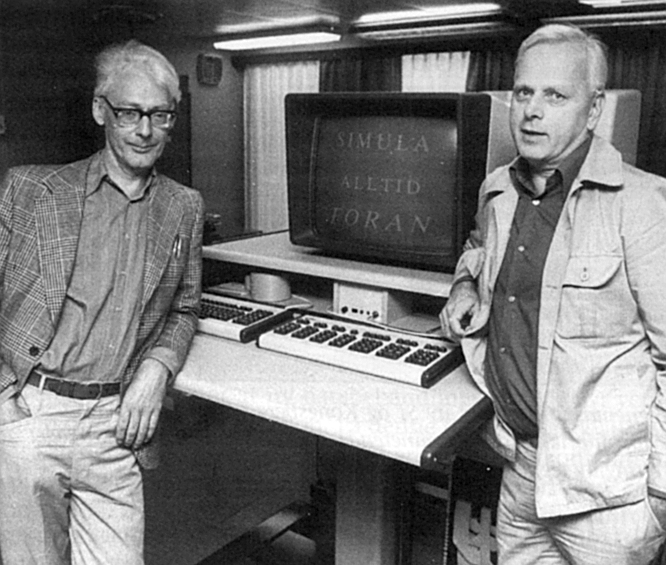
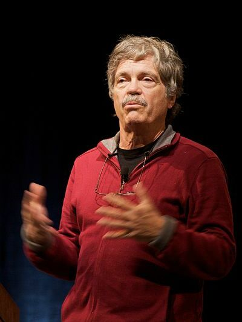
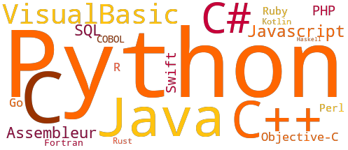

# Thème 2 : Langages et Programmation

!!! history "Histoire de l'informatique"
    {align=left width=160} 

    {align=right width=160}

    En 1962, Ole-Johan Dahl et Kristen Nygaard créent le langage Simula, premier langage à classes. 

    Au début des années 1970, Alan Kay s'inspire de Simula pour créer le langage Smalltalk, qui est le premier langage *orienté objet*.

    Aujourd'hui, il existe de nombreux langages à objets, sous forme *fonctionnelle*, *impérative*, ou les deux, comme Python par exemple.

{: .center} 
