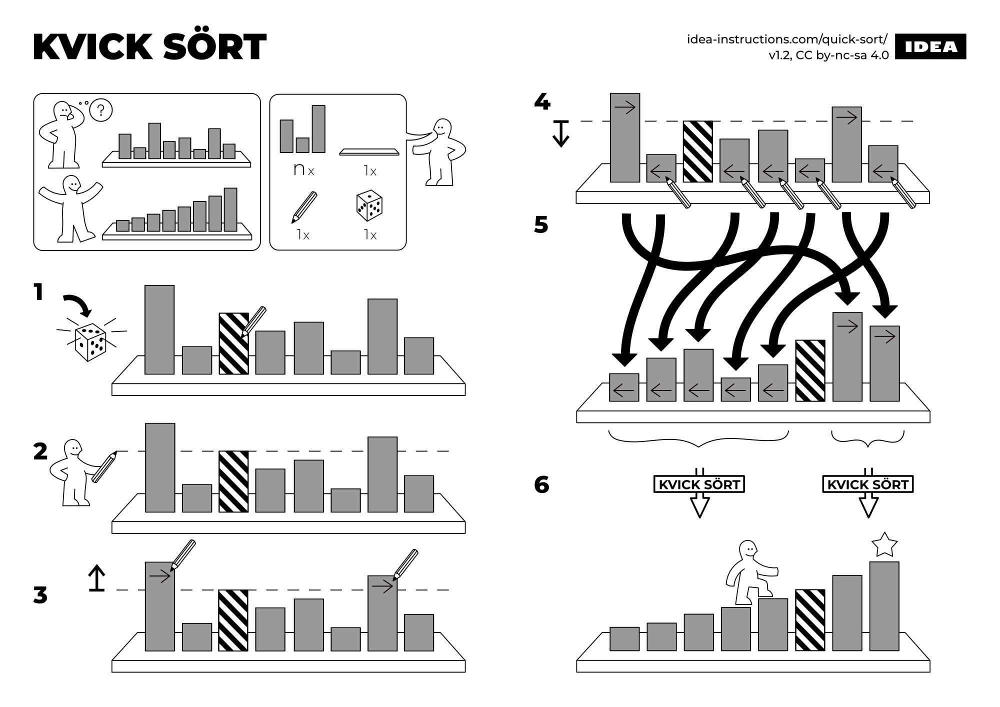
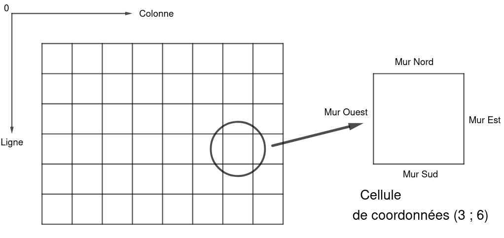
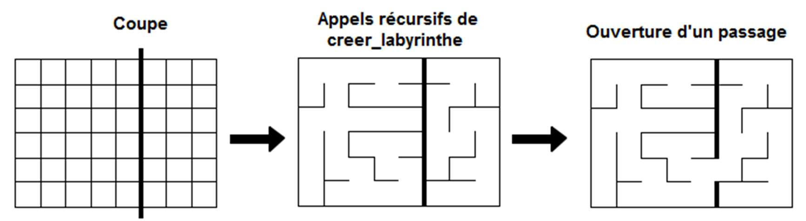

# T3.1 Diviser pour régner

{{ initexo(0) }}

{: .center} 

>L'image `gif` ci-dessus présente  différentes étapes du déroulement d'un algorithme de rotation d'images inspiré d'un travail présenté par Laurent Abbal du lycée français de Tokyo, qui utilise l'approche _diviser pour régner_.

>L'image source représente l'oeuvre _Matsuri Yatai Dragon_ du peintre japonais [Hokusai](https://en.wikipedia.org/wiki/en:Hokusai){:target="_blank"}. Elle est dans le domaine public et disponible sur [https://commons.wikimedia.org](https://commons.wikimedia.org/wiki/File:Hokusai_Dragon.jpg){:target="_blank"}.

!!! gear "Principe"
    La méthode **diviser pour régner** (en anglais *divide and conquer*) est une technique algorithmique de résolution d'un problème qui consiste à :

    1. décomposer le problème initial en (un ou) plusieurs sous-problèmes de taille
    **inférieure** et **indépendants**;
    2. résoudre chacun des sous-problèmes;
    3. combiner (éventuellement) les solutions des sous-problèmes pour obtenir la solution au problème initial.

    La plupart du temps la résolution des sous-problèmes se fait de façon **récursive**.


??? question "Une impression de «déjà-vu»?"
    Nous avons déjà utilisé cette technique. Par exemple:

    - en première en étudiant la recherche dichotomique dans une liste triée;
    {: .center width=320} 

    - en terminale en étudiant les algorithmes sur les arbres binaires.

    Un autre exemple ? Dès le DS 0001:

    ```python linenums='1' title='Exponentiation rapide'
    def puissance(x:float, n:int) -> float :
        if n == 0 :
            return  1
        else :
            if n%2 == 0:
                return puissance(x*x, n//2)
            else :
                return  x * puissance(x**2, (n-1)//2)
    ```
    
Nous allons mettre en œuvre cette méthode sur quelques problèmes classiques...

## 1. Le tri fusion

!!! gear "Algorithme du tri fusion (*merge sort*)"
    === "Principe"
        L'algorithme du tri fusion consiste à:

        1. couper le tableau à trier en deux moitiés;
        2. trier indépendammment en place chaque moitié;
        3. fusionner (*to merge*) les deux moitiés triées.

    === "Illustration en vidéo"
        <p align="center">
        <iframe width="640" height="360" src="https://www.youtube.com/embed/dENca26N6V4" title="YouTube video player" frameborder="0" allow="accelerometer; autoplay; clipboard-write; encrypted-media; gyroscope; picture-in-picture" allowfullscreen></iframe>
        </p>
        
    === "Illustration en notice"
        {: .center} 

    === "Illustration en GIF"

        <p align="center">
        <gif-player src="https://cgouygou.github.io/TNSI/T03_Algorithmique/images/gif_fusion.gif" speed="1" play></gif-player>
        </p>

        *Source: Gilles Lassus*


!!! code "Partie I: la fusion / *merge*"
    On veut pouvoir fusionner deux listes triées. Pour cela on construit une nouvelle liste, dans laquelle on ajoute successivement le minimum des plus petits éléments des deux listes. Il faut donc gérer deux indices: un pour chaque liste, où l'indice correspond à l'élément à comparer.

    ```python linenums='1'
    def fusion(tab1:list, tab2:list) -> list:
        tab_fusion = []
        i1 = 0
        i2 = 0
        # Tant qu'il reste des éléments à comparer dans les deux listes
        while ...:
            if tab1[i1] < tab2[i2]:
                tab_fusion.append( ...)
                ...
            else:
                ...
                ...

        # Une fois qu'une des deux listes est totalement traitée, on complète avec ce 
        # qu'il reste dans l'autre
        if i1 == len(tab1):
            while ...:
                ...
                ...
        else:
            while ...:
                ...
                ...        

        return 

    ```

    Pouvez-vous estimer la complexité de cette fonction?
    

!!! code "Partie II: le tri / *sort*"
    Reprenons l'algorithme du tri fusion: il faut d'abord couper le tableau en deux moitiés. On va utiliser les deux fonctions ci-dessous dont la liste renvoyée est à compléter en compréhension:

    ```python linenums='1'
    def moitie_gauche(tab:list) -> list:
        m = len(tab) // 2
        return [tab[k] for k in range(...)]

    def moitie_droite(tab:list):
        m = len(tab) // 2
        return [tab[k] for k in range(...)]
    ```
    
    Maintenant écrivons la fonction `tri_fusion` à proprement parler, qui va fusionner les deux moitiés de la liste qui ont été triées par fusion:

    ```python linenums='1'
    def tri_fusion(tab:list) -> list:
        if len(tab) <= 1:
            return ...
        else:
            tab1 = ...
            tab2 = ...
            return fusion(..., ...)
    ```

Il est à noter que cette version du tri fusion ne trie pas *en place*, c'est-à-dire que la liste initiale à trier n'est pas modifiée et qu'une nouvelle liste, triée, est créée par la fonction `tri_fusion`. Exactement comme le fait la fonction `sorted` de Python.

```python
>>> tab = [3, 4, 1, 6, 8, 7, 2]
>>> tri_fusion(tab)
[1, 2, 3, 4, 6, 7, 8]
>>> tab
[3, 4, 1, 6, 8, 7, 2]
```

On peut faire en sorte que le tri fusion trie *en place* une liste (comme la méthode `sort` de Python), c'est-à-dire qu'aucune autre liste ne sera créée, mais la liste initiale aura été triée.

On veut alors plutôt ce genre de comportement:
```python 
>>> tab = [3, 4, 1, 6, 8, 7, 2]
>>> tri_fusion(tab)
>>> tab
[1, 2, 3, 4, 6, 7, 8]
```

Pour cela, on utilise le caractère mutable d'une liste. Il faut faire en sorte de passer la liste en paramètre de la fonction `fusion` et de remplacer ses éléments un à un (plutôt que de créer une liste vide puis de la peupler), en gérant un indice de plus.

```python linenums='1' title='Fusion en place'
def fusion(tab, tab1, tab2):
    i, i1, i2 = 0, 0, 0
    while i1 < len(tab1) and i2 < len(tab2):
        if tab1[i1] < tab2[i2]:
            tab[i] = tab1[i1]
            i1 += 1
        else:
            tab[i] = tab2[i2]
            i2 += 1
        i += 1                  # indice pour tab
    if i1 == len(tab1):
        while i2 < len(tab2):
            tab[i] =  tab2[i2]
            i2 += 1
            i += 1              # indice pour tab
    else:
        while i1 < len(tab1):
            tab[i] = tab1[i1]
            i1 += 1
            i += 1              # indice pour tabt
```

La fonction `tri_fusion` se modifie alors ainsi:

```python linenums='1' title='Tri fusion en place'
def tri_fusion(tab:list):
    if len(tab) > 1:
        tab1 = moitie_gauche(tab)
        tab2 = moitie_droite(tab)
        tri_fusion(tab1)
        tri_fusion(tab2)
        fusion(tab, tab1, tab2)

```


!!! example "{{ exercice() }}"
    === "Énoncé" 
        En s'inspirant de ce qui a été fait en classe de première sur le [tri par sélection](https://cgouygou.github.io/1NSI/T07_Algorithmes/T7.1_Tri_selection/T7.1_Tri_selection/){:target="_blank"} , mesurer le temps d'exécution pour plusieurs tailles de listes construites aléatoirement (ou pas, à vous de voir) et construire un graphique pour estimer la complexité du tri fusion.
    === "Correction" 
        {{ correction(False, 
        "
        "
        ) }}

## 2. Le tri rapide

!!! gear "Algorithme du tri rapide (*quick sort*)"
    === "Principe"
        L'algorithme du tri rapide consiste à:

        1. choisir une valeur pivot (le premier élément, le dernier, au hasard...);
        2. placer tous les éléments plus petits que le pivot avant les éléments qui sont plus grands que le pivot;
        3. trier récursivement chacune des deux parties.

    === "Illustration en vidéo"
        <p align="center">
        <iframe width="640" height="360" src="https://www.youtube.com/embed/3San3uKKHgg" title="YouTube video player" frameborder="0" allow="accelerometer; autoplay; clipboard-write; encrypted-media; gyroscope; picture-in-picture" allowfullscreen></iframe>
        </p>

    === "Illustration en notice"
        {: .center} 


!!! code "Partie I : le tri"
    Un peu comme le tri fusion, la fonction de tri à proprement parler n'est pas très compliquée à écrire: elle suit l'algorithme donné à la lettre.
    
    Si on dispose d'une fonction `partition` qui procède aux échanges successifs des éléments de la liste entre deux indices et qui renvoie la position du pivot (qui est nécessairement bien placé à l'issue de ce partitionnement), on obtient le code suivant:

    ```python linenums='1'
    def tri_rapide(lst:list, indice_gauche:int, indice_droit:int):
        if indice_gauche < indice_droit:
            indice_pivot = partition(lst, indice_gauche, indice_droit)
            tri_rapide(lst, indice_gauche, indice_pivot-1)
            tri_rapide(lst, indice_pivot+1, indice_droit)
    ```
    
!!! code "Partie II: la partition"
    L'étape délicate du tri rapide est celle qui consiste à réaliser le partitionnement de la liste à trier en 3 parts:

    - les éléments inférieurs au pivot;
    - le pivot;
    - les éléments supérieurs au pivot.

    Il faut noter qu'une fois partitionnée, le pivot est nécessairement à sa position définitive, c'est l'intérêt de cet algorithme...

    Il existe plusieurs façons de réaliser ce partitionnement, et plusieurs façons de choisir le pivot. Nous choisirons systématiquement le pivot en dernière position et échangerons les valeurs inférieures au pivot en gérant leur indice d'échange. Une fois toutes les valeurs de la liste parcourues (et éventuellement échangées), cet indice d'insertion désigne celui du pivot, un dernier échange interviendra.

    Compléter le code suivant:

    ```python linenums='1'
    
    def partition(lst:list, indice_gauche:int, indice_droit:int) -> int:
        '''
        - échange les éléments de lst selon leur ordre par rapport au pivot
        - place le pivot à son indice définitif
        - renvoie l'indice du pivot
        '''
        pivot = lst[...] # on choisit comme pivot le dernier élément
        i = ...          # i est l'indice d'échange
        for j in range(indice_gauche, indice_droit):
            if lst[j] <= pivot:
                echange(lst, ..., ...)
                ...
        #Une fois tous les échanges possibles réalisés, le pivot doit se trouver en
        #position i, donc on l'échange et on renvoie cet indice
        echange(lst, ..., ...)
        return ...
    ```

    <!-- https://www.youtube.com/watch?v=MZaf_9IZCrc -->

!!! example "{{ exercice() }}"
    === "Énoncé" 
        Il manque la fonction `echange`... Écrivez-la.
    === "Correction" 
        {{ correction(False, 
        "
        "
        ) }}

!!! example "{{ exercice() }}"
    === "Énoncé" 
        Même question qu'à l'exercice 1 sur le tri fusion...
    === "Correction" 
        {{ correction(False, 
        "
        "
        ) }}

## 3. Génération d'un labyrinthe

Dans ce problème, on considèrera qu'un labyrinthe est composé initialement d'une grille de cellules possédant chacune quatre murs. La cellule en haut à gauche est de coordonnées $(0, 0)$.

{: .center width=480} 

Pour créer un labyrinthe à partir de cette grille, on va utiliser la méthode *diviser pour régner* en appliquant récursivement une méthode `creer_labyrinthe` sur des sous-grilles en coupant la grille en deux puis en reliant les deux sous-labyrinthes en créant un passage entre eux.

{: .center width=640} 


??? gear "Algorithme de génération"
    Plus précisément, voici l'algorithme à utiliser:

        creer_labyrinthe(i, j, di, dj):
            ''' génère un labyrinthe de dimension (di, dj) à partir de la case (i, j) en haut à gauche '''
            Si di = 1 ou dj = 1:
                enlever tous les murs reliant les cases situées sur la ligne droite entre (i, j) et (i+di−1, j+dj−1)
            Sinon
                Si di >= dj:
                    tirer au hasard c entre 1 et di−1
                    appeler creer_labyrinthe(i, j, c, dj)
                    appeler creer_labyrinthe(i+c, j, di−c, dj).
                Sinon
                    tirer au hasard c entre 1 et dj−1
                    appeler creer_labyrinthe(i, j, di, c)
                    creer_labyrinthe(i, j+c, di, dj−c).
                Enlever un mur aléatoirement entre les deux sous-labyrinthes créés.


??? code "Partie 1: Mise en place"
    On modélise le labyrinthe à l'aide de deux classes:
    
    - une classe `Cellule` qui contient un unique attribut `murs` de type `dict` dont les clés sont `'N'`, `'E'`, `'S'` et `'O'` et dont les valeurs sont des booléens;
    - une classe `Labyrinthe`  qui contient un unique attribut `grille` de type `list` qui contient des cellules et dont il faut compléter la méthode `construire_grille`.

    ```python linenums='1'
    class Cellule:
        def __init__(self, mur_nord, mur_est, mur_sud, mur_ouest):
            self.murs = {'N':mur_nord, 'E':mur_est, 'S':mur_sud, 'O':mur_ouest}

    class Labyrinthe:
        def __init__(self, hauteur, largeur):
            self.grille = self.construire_grille(hauteur, largeur)

        def construire_grille(self, h, l):
            grille = 
            return grille
    ```
    
    Pour contrôler notre travail, il faut un outil graphique pour dessiner les labyrinthes. On utilisera naturellement le module `pygame`.

    ```python linenums='1' title='Modèle à utiliser et à compléter au fur et à mesure'
    import pygame
    from pygame.locals import *

    ## Classes


    ## Constantes
    hauteur_laby, largeur_laby, cote_cellule = 10, 10, 10
    taille_ecran = (largeur_laby*cote_cellule, hauteur_laby*cote_cellule)

    ## Instanciation d'un labyrinthe et génération

    ## Initialisation de Pygame
    pygame.init()

    ## Écran
    screen = pygame.display.set_mode(taille_ecran)
    screen.fill([255, 255, 255])
    pygame.display.set_caption("Génération d'un labyrinthe")

    ## Boucle des événements

    # affichage du labyrinthe

    continuer = True
    while continuer:
        for evenement in pygame.event.get():
            if evenement.type == pygame.QUIT:
                continuer = False

        pygame.display.flip()

    ## Fermeture de la fenêtre
    pygame.quit()

    
    ```
    

!!! code "Partie 2: Affichage"
    Pour chaque cellule de la grille du labyrinthe, il faut tracer un segment pour chaque mur existant (valeur `True` pour les clés du dictionnaire).

    :warning: Pour passer des coordonnées $(i, j)$ d'une cellule dans la grille aux coordonnées de dessin dans la fenêtre `pygame`, il faut multiplier par la longueur choisie pour le côté des cellules (nommée `cote_cellule` dans le code précédent).
    
    :warning: L'indice de ligne `i` correspond aux ordonnées de la fenêtre de dessin et l'indice de colonne `j` aux abscisses...
    
    Par exemple pour tracer le mur nord d'une cellule de coordonnées $(i, j)$ dans la grille, il faut tracer un segment entre les points de coordonnées `[cote_cellule*j, cote_cellule*i]` et `[cote_cellule*(j+1), cote_cellule*i]`.

    Compléter la méthode `afficher` (de `Labyrinthe`):

    ```python linenums='1'
    def afficher(self, c):
        '''
        affiche le labyrinthe, avec c qui désigne la longueur du côté d'une cellule
        '''
        for i in range(...):
            for j in range(...):
                if self.grille[i][j].murs[...]:
                    pygame.draw.line(screen, [0, 0, 0], [..., ...], [..., ...], 2)
                ...
    ```
    

!!! code "Partie 3: création d'un passage"
    Il s'agit de passer les valeurs à `False` pour les murs correspondant au passage entre deux cellules. Tout d'abord il faut repérer si le passage est horizontal ou vertical...

    Compléter la méthode `creer_passsage` (de `Labyrinthe`) :

    ```python linenums='1'
    def creer_passage(self, i1, j1, i2, j2):
        '''
        crée une ouverture entre les cellules d'adresses (i1, j1) et (i2, j2)
        '''
        if ... : #ouverture horizontale
            if ... :
                self.grille[i1][j1].murs['E'] = False
                self.grille[i2][j2].murs['O'] = False
            else:
                ...
        else:
            ...
    ```
    

!!! code "Partie 4: création du labyrinthe"
    Utiliser l'algorithme établi en début d'activité pour écrire la méthode `creer_labyrinthe`.

    ```python linenums='1'
    def creer_labyrinthe(self, i, j, di, dj):
        '''
        générère un labyrinthe de dimension (di, dj) à partir de la case (i, j) en haut à gauche.
        '''
    ```
    
