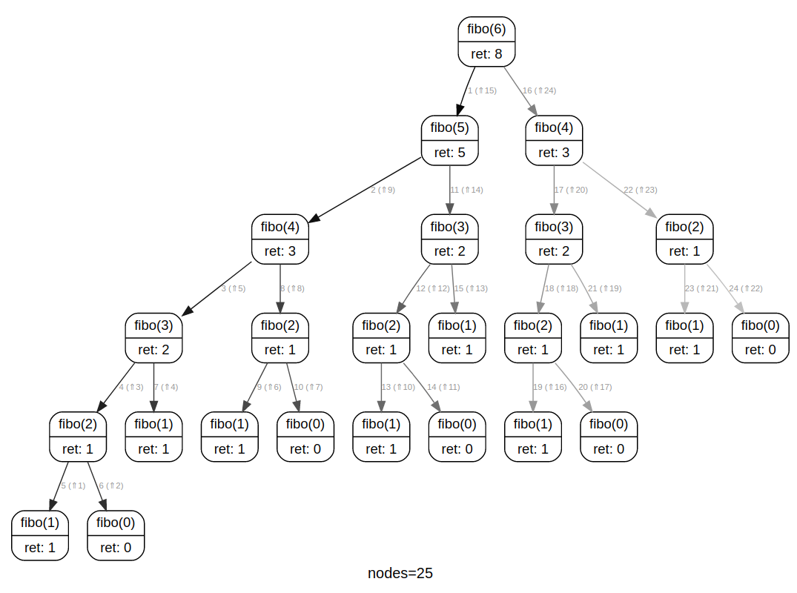
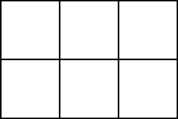
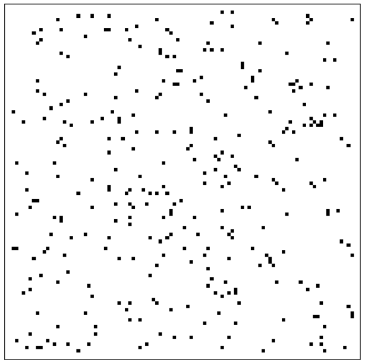
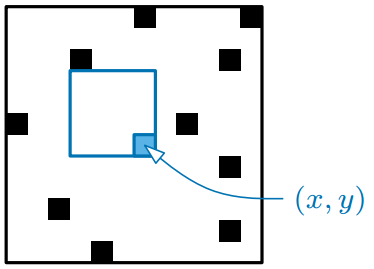
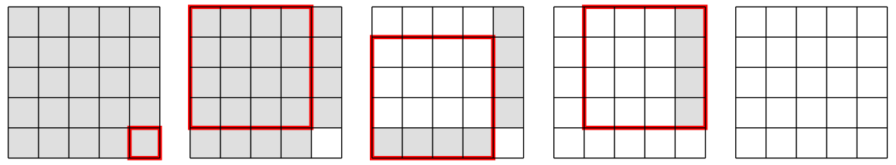

# T3.2 Programmation dynamique

{{ initexo(0) }}

{: .center width=320} 


On a déjà rencontré plusieurs paradigmes algorithmiques:

- l'[algorithme glouton](https://cgouygou.github.io/1NSI/T07_Algorithmes/T7.4_Algos_gloutons/T7.4_Gloutons/){:target="_blank"} : il construit de façon itérative une solution en optimisant un critère de manière locale, sans assurance de construire une solution globale optimale;
- la méthode [«diviser pour régner»](https://cgouygou.github.io/TNSI/T03_Algorithmique/T3.1_Diviser/T3.1_Diviser/){:target="_blank"} : on divise un problème en sous-problèmes **indépendants** qu'on résout récursivement, puis on combine les solutions des sous-problèmes pour construire une solution globale.

Mais que se passe-t-il lorsque les sous-problèmes se chevauchent, c'est-à-dire qu'ils ne sont pas indépendants, comme dans le calcul (naïf) des termes de la suite de Fibonacci (exercice 6 du [T2.2](https://cgouygou.github.io/TNSI/T02_Programmation/T2.2_Recursivite/T2.2_Recursivite/#224-exercices){:target="_blank"})?

{: .center width=480} 


!!! gear "Principe"
    La **programmation dynamique** consiste à diviser un problème en sous-problèmes **indépendants** puis à résoudre chaque sous-problème du plus petit au plus grand en **stockant** au fur et à mesure les résultats afin de ne pas avoir à les recalculer.

Cette technique  a été développée par Richard Bellman dans les années 1950 chez [RAND Corporation](https://fr.wikipedia.org/wiki/RAND_Corporation){:target="_blank"} et permet de résoudre de nombreux problèmes d'optimisation de façon très performante.

Nous illustrerons cette technique par deux procédés: la mémoïsation et la méthode «bottom-up».


## 1. Principe de mémoïsation

La mémoïsation consiste tout simplement à stocker les valeurs déjà calculées par une fonction pour des «petits» arguments. On peut pour cela utiliser un tableau ou un dictionnaire.

!!! example "{{ exercice() }}"
    === "Énoncé" 
        Écrire une fonction `fibo` récursive et mémoïsée: on commence par consulter le dictionnaire pour savoir si la valeur est connue, auquel cas on se contente de la renvoyer, sinon on la calcule comme naïvement.

        **Rappel de la fonction naïve:**
        ```python linenums='1'
        def fibo(n):
            if n < 2:
                return 1
            else:
                return fibo(n-2) + fibo(n-1)
        ```
        
    === "Correction" 
        {{ correction(False, 
        "
        ```python linenums='1'
        def fibo(n):
            dict_fibo = {}
            def f(n):
                if n < 2:
                    dict_fibo[n] = 1
                elif n in dict_fibo:
                    return dict_fibo[n]
                else:
                    dict_fibo[n] = f(n-2) + f(n-1)
                return dict_fibo[n]
            return f(n)
            
        ```
        
        "
        ) }}
??? code "Python's corner"
    En Python il existe un [décorateur](https://zestedesavoir.com/tutoriels/954/notions-de-python-avancees/2-functions/3-decorators/){:target="_blank"} qui permet de mémoïser automatiquement une fonction:

    ```python linenums='1'
    from functools import lru_cache

    @lru_cache()
    def fibo(n):
        if n < 2:
            return 1
        else:
            return fibo(n-2) + fibo(n-1)
    ```


!!! example "{{ exercice() }}"
    === "Énoncé" 
        La fonction suivante donne le nombre minimal de pièces pour payer la somme demandée (cf. le problème du rendu de monnaie):

        ```python linenums='1'
        def rendu_monnaie(somme: int, pieces: list) -> int:
            '''
            Détermine le nombre minimal de pièces pour payer la somme demandée.
            La liste pieces est supposée triée dans l'ordre croissant.
            '''
            if somme == 0:
                return 0
            rendu = somme 
            for p in pieces:
                if p <= somme:
                    rendu = min(rendu, 1 + rendu_monnaie(somme - p, pieces))
            return rendu
        ```

        1. Tester la fonction avec les appels:

            - `#!py rendu_monnaie(12, [1, 2, 5, 10, 20, 50, 100])` 
            - `#!py rendu_monnaie(28, [1, 2, 5, 10, 20, 50, 100])` 
            - `#!py rendu_monnaie(37, [1, 2, 5, 10, 20, 50, 100])` 
        2. Mémoïser la fonction `#!py rendu_monnaie`:
            - initialiser correctement un dictionnaire `memo_rendu`;
            - consulter d'abord le dictionnaire pour voir si `#!py somme` lui appartient;
            - sinon calculer la valeur `#!py rendu` de la même façon et l'ajouter au dictionnaire `memo_rendu` avant de la renvoyer.
    === "Correction" 
        {{ correction(False, 
        "
        ```python linenums='1'
        def rendu_monnaie(somme: int, pieces: list) -> int:
            memo_rendu = {0:0}
            def rm(somme: int, pieces: list) -> int:
                '''
                Détermine le nombre minimal de pièces pour payer la somme demandée.
                La liste pieces est supposée triée dans l'ordre croissant.
                '''
                if somme in memo_rendu:
                    return memo_rendu[somme]
                rendu = somme 
                for p in pieces:
                    if p <= somme:
                        rendu = min(rendu, 1 + rm(somme - p, pieces))
                memo_rendu[somme] = rendu
                return rendu
            return rm(somme, pieces)
        ```
        
        "
        ) }}
## 2. Méthode «bas-haut» («bottom-up»)

Dans la méthode «bottom-up» on va construire un tableau (1D ou 2D) comme dans la méthode de mémoïsation, mais en commençant par les «petits» résultats pour aller vers la solution globale. On peut alors (parfois) transformer un programme récursif en un programme itératif.

!!! example "Exemple avec Fibonacci"
    ```python linenums='1'
    def fibo_bottom_up(n):
        lst_fibo = [1] * (n+1)
        for i in range(2, n+1):
            lst_fibo[i] = lst_fibo[i-2] + lst_fibo[i-1]
        return lst_fibo[n]
    ```
    

!!! example "{{ exercice() }}"
    === "Énoncé" 
        Adapter la méthode «bottom-up» pour la fonction `rendu_monnaie` précédente en complétant le code suivant:

        ```python linenums='1'
        def rendu_monnaie_bu(somme: int, pieces: list) -> int:
            '''
            Détermine le nombre minimal de pièces pour payer la somme demandée.
            La liste pieces est supposée triée dans l'ordre croissant.
            '''
            rendu = [0] * ...
            for s in range(1, somme+1):
                rendu[s] = ... # on initialise avec le nombre de pieces dans le pire des cas
                for p in pieces:
                    if p <= s:
                        rendu[s] = min(..., ...)
            return rendu[...]
        ```
        
    === "Correction" 
        {{ correction(False, 
        "
        ```python linenums='1'
        def rendu_monnaie_bu(somme: int, pieces: list) -> int:
            '''
            Détermine le nombre minimal de pièces pour payer la somme demandée.
            La liste pieces est supposée triée dans l'ordre croissant.
            '''
            rendu = [0] * (somme+1)
            for s in range(1, somme+1):
                rendu[s] = s
                for p in pieces:
                    if p <= s:
                        rendu[s] = min(rendu[s], 1 + rendu[s-p])
            return rendu[-1]
        ```
        
        "
        ) }}


!!! example "{{ exercice() }}"
    === "Énoncé" 
        Sur une grille rectangulaire, combien de chemins mènent du coin supérieur gauche au coin inférieur droit, en se déplaçant uniquement le long des traits horizontaux vers la droite et le long des traits verticaux vers le bas?

        {: .center } 

        1. Écrire une fonction récursive `nb_chemins_rec` qui répond au problème puis la «mémoïser».
        2. Écrire une fonction itérative `nb_chemins` selon la méthode «bottom-up» qui utilise un tableau 2D.

    === "Indication"
        On remarquera:
        
        - qu'un déplacement uniquement vertical ou uniquement horizontal ne donne qu'un seul chemin.
        - que pour arriver en bas à droite, on ne peut arriver que de deux endroits: juste au-dessus ou juste à gauche.

    === "Correction" 
        {{ correction(False, 
        "
        "
        ) }}


## 3. Un problème pour finir en beauté

Dans l'image ci-dessous, quel est la taille du plus grand carré blanc, c'est-à-dire qui ne contient aucun pixel noir?

{: .center width=320} 


??? help "Indication"
    === "Sous-problème"
        On détermine la taille $PGCB(x, y)$ du plus grand carré blanc dont le pixel **en bas à droite** a pour coordonnées $(x, y)$.

        {: .center width=320} 
    
    === "Observation clé"
        Un carré $m\times m$ de pixels est blanc **si et seulement si**:

        - son pixel en bas à droite est blanc;
        - les trois carrés de dimensions $(m-1)\times(m-1$ en haut à gauche, en haut à droite et en bas à droite sont tous blancs.

        {: .center } 
    
    === "Correction" 
        {{ correction(False, 
        "
        ```python linenums='1'
        import imageio.v2 as io
        import time

        carre = io.imread('pgcb.png')

        def is_white(pix:list) -> bool:
            return pix[0] == 255

        '''Relation de récurrence

        - si le pixel (x, y) est noir, alors PGCB(x, y) = 0
        - si le pixel (x, y) est blanc et dans la première ligne ou la première colonne, alors PGCB(x, y) = 1
        - sinon PGCB(x,y) = 1 + min(PGCB(x-1, y-1), PGCB(x, y-1), PGCB(x-1, y)).
        '''

        # algo récursif avec mémoïsation

        def pgcb_rec(img):
            memo = {}
            def pgcb(x, y):
                if (x, y) in memo:
                    return memo[(x, y)]
                if not is_white(img[x][y]):
                    return 0
                elif x == 0 or y == 0:
                    return 1
                else:
                    memo[(x, y)] = 1 + min(pgcb(x-1, y-1), pgcb(x, y-1), pgcb(x-1, y))
                    return memo[(x, y)]

            for x in range(img.shape[0]):
                for y in range(img.shape[1]):
                    pgcb(x, y)

            return max(memo.values())

        # algo «bottom-up»

        def pgcb_bup(img):
            pgcb = [[0 for _ in range(img.shape[1])]  for _ in range(img.shape[0])]
            for x in range(img.shape[0]):
                for y in range(img.shape[1]):
                    if not is_white(img[x][y]):
                        pgcb[x][y] = 0
                    elif x == 0 or y == 0:
                        pgcb[x][y] = 1
                    else:
                        pgcb[x][y] = 1 + min(pgcb[x-1][y-1], pgcb[x][y-1], pgcb[x-1][y])
            return max([max(pgcb[x]) for x in range(img.shape[0])])


        t0 = time.time()
        print(pgcb_rec(carre))
        t1 = time.time()
        print(pgcb_bup(carre))
        t2 = time.time()
        print(t1-t0, t2-t1)

        ```
        
        "
        ) }}