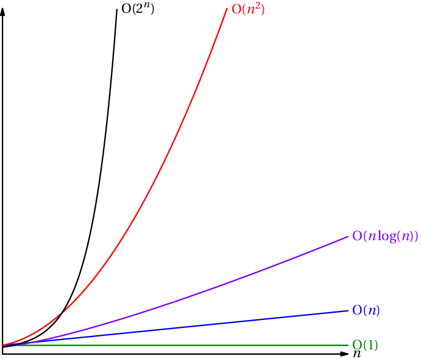

# Thème 3 : Algorithmique

<iframe width="640" height="360" src="https://www.youtube.com/embed/AgtOCNCejQ8" title="YouTube video player" frameborder="0" allow="accelerometer; autoplay; clipboard-write; encrypted-media; gyroscope; picture-in-picture" allowfullscreen></iframe>

!!! info "Comparatif des algorithmes de tri étudiés en NSI"
    | Nom du tri       | Meilleur cas | Pire cas     | En moyenne   |
    |:----------------:|:------------:|:------------:|:------------:|
    | Sélection        | $O(n^2)$     | $O(n^2)$     | $O(n^2)$     |
    | Insertion        | $O(n)$       | $O(n^2)$     | $O(n^2)$     |
    | Fusion           | $O(n\log n)$ | $O(n\log n)$ | $O(n\log n)$ |
    | Rapide           | $O(n\log n)$ | $O(n\log n)$ | $O(n^2)$     |
    | Timsort (Python) | $O(n)$       | $O(n\log n)$ | $O(n\log n)$ |

    Source : [https://fr.wikipedia.org/wiki/Algorithme_de_tri](https://fr.wikipedia.org/wiki/Algorithme_de_tri){:target="_blank"} 

    {: .center width=480} 