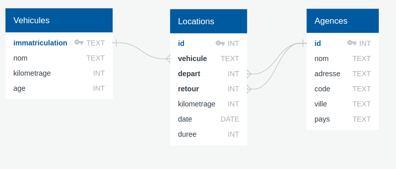

# Exercices interactifs

{{ initexo(0) }}

!!! example "{{ exercice() }}"
    === "Énoncé" 
        *Questions interactives à réaliser sur le site sqlzoo.net.*

        1. Travail sur SELECT, (base de données Nobel) : [ici](https://sqlzoo.net/wiki/SELECT_from_Nobel_Tutorial){. target="_blank"}.

        2. Travail sur SUM et COUNT, (base de données World) : [ici](https://sqlzoo.net/wiki/SUM_and_COUNT){. target="_blank"}. (jusqu'à la question 5.)

        3. Travail sur JOIN, (base de données Euro2012) : [ici](https://sqlzoo.net/wiki/The_JOIN_operation){. target="_blank"}.

    === "Correction" 
        {{ correction(True, 
        "
        À consulter ici : [https://github.com/jisaw/sqlzoo-solutions](https://github.com/jisaw/sqlzoo-solutions){. target="_blank"}.
        "
        ) }}


!!! example "{{ exercice() }}"
    Gestion d'un réseau d'agences de location de voitures.   
    *D'après le travail de J. Le Coupanec (Académie de Rennes)*

    La base de données [locations.db](../data/locations.db) contient les tables ```Agences```,```Locations```, ```Vehicules```.
    

    ??? note "Questions sur la relation ```Agences```"

        **Q1**. Visualisez toute la relation ```Agences```

        {{
        correction(True,
        """
        ??? success \"Correction\" 
            ```sql
            SELECT * 
            FROM Agences
            ```            
        """
        )
        }}


        **Q2**. Listez uniquement les noms des agences et de leur ville.

        {{
        correction(True,
        """
        ??? success \"Correction\" 
            ```sql
            SELECT nom, ville 
            FROM Agences
            ```           
        """
        )
        }}


        **Q3**. Listez les noms des agences de la ville de Lorient


        {{
        correction(True,
        """
        ??? success \"Correction\" 
            ```sql
            SELECT nom 
            FROM Agences
            WHERE ville = 'Lorient'
            ```            
        """
        )
        }}


        **Q4**. Listez les noms des agences du département du Morbihan (code postal 56***) ainsi que les codes postaux en utilisant par exemple un ```WHERE LIKE```.


        {{
        correction(True,
        """
        ??? success \"Correction\" 
            ```sql
            SELECT nom 
            FROM Agences
            WHERE code LIKE '56%'
            ```            
        """
        )
        }}


    ??? note "Questions sur la relation ```Vehicules```"

        **Q5**. Déterminez le nombre de voitures que vous possédez. 

        {{
        correction(True,
        """
        ??? success \"Correction\" 
            ```sql
            SELECT COUNT(*) 
            FROM Vehicules
            ```       
        """
        )
        }}


        **Q6**. Déterminez l'âge minimum et maximum de vos véhicules.
        {{
        correction(True,
        """
        ??? success \"Correction\" 
            ```sql
            SELECT MAX(age), MIN(age) 
            FROM Vehicules
            ```        
        """
        )
        }}


        **Q7**. Quels sont la marque et le modèle de votre dernière acquisition qui date de trois mois ?
        {{
        correction(True,
        """
        ??? success \"Correction\" 
            ```sql
            SELECT nom 
            FROM Vehicules
            WHERE age = 3
            ```           
        """
        )
        }}


        **Q8**.  Quel est le kilométrage maximum des véhicules ?
        {{
        correction(True,
        """
        ??? success \"Correction\" 
            ```sql
            SELECT MAX(kilometrage) 
            FROM Vehicules
            ```            
        """
        )
        }}


        **Q9**.  Quel est le kilométrage moyen des véhicules ?
        {{
        correction(True,
        """
        ??? success \"Correction\" 
            ```sql
            SELECT AVG(kilometrage) 
            FROM Vehicules
            ```            
        """
        )
        }}


        **Q10**. Afficher toute la flotte de véhicules par ordre décroissant de kilométrage.

        {{
        correction(True,
        """
        ??? success \"Correction\" 
            ```sql
            SELECT * 
            FROM Vehicules
            ORDER BY kilometrage DESC
            ```   
        """
        )
        }}


    ??? note "Questions sur la relation ```Locations```"

        **Q11**. Visualisez toute la relation Locations. 
        {{
        correction(True,
        """
        ??? success \"Correction\" 
            ```sql
            SELECT * 
            FROM Locations
            ```            
        """
        )
        }}


        **Q12**. Déterminez le nombre de locations effectuées avec changement d'agence
        {{
        correction(True,
        """
        ??? success \"Correction\" 
            ```sql
            SELECT COUNT(*) 
            FROM Locations
            WHERE depart != retour
            ```            
        """
        )
        }}


        **Q13**. Déterminez le nombre total de kilomètres effectués durant les locations
        {{
        correction(True,
        """
        ??? success \"Correction\" 
            ```sql
            SELECT SUM(distance) 
            FROM Locations
            ```            
        """
        )
        }}


        **Q14**. Listez toutes les locations en y associant les caractéristiques du véhicule
        {{
        correction(True,
        """
        ??? success \"Correction\" 
            ```sql
            SELECT * 
            FROM Locations
            JOIN Vehicules ON Locations.vehicule = Vehicules.immatriculation
            ```            
        """
        )
        }}


        **Q15**. Affichez le nom et l'immatriculation du véhicule ainsi que la date de la location et le kilométrage réalisé pour chacune des locations
        {{
        correction(True,
        """
        ??? success \"Correction\" 
            ```sql
            SELECT Vehicules.nom, Vehicules.immatriculation, Locations.date, Locations.kilometrage 
            FROM Locations
            JOIN Vehicules ON Locations.vehicule = Vehicules.immatriculation
            ```            
        """
        )
        }}


        **Q16**. Affichez une seule fois le nom et l'immatriculation des véhicules ayant déjà été loués.
        {{
        correction(True,
        """
        ??? success \"Correction\" 
            ```sql
            SELECT DISTINCT nom, immatriculation 
            FROM Locations
            JOIN Vehicules ON Locations.vehicule = Vehicules.immatriculation
            ```            
        """
        )
        }}
 


        **Q17**. Affichez les locations du véhicule immatriculé AB-224-BA en précisant le nom de l'agence de départ ainsi que la ville de départ dans l'ordre chronologique des locations.
        {{
        correction(True,
        """
        ??? success \"Correction\" 
            ```sql
            SELECT Agences.nom, Agences.ville, Locations.* 
            FROM Locations
            JOIN Agences ON Locations.depart = Agences.id
            WHERE vehicule = 'AB-224-BA'
            ORDER BY Locations.date
            ```            
        """
        )
        }}


    

!!! example "{{ exercice() }} : The SQL Murder Mystery "

    Cet exercice en ligne est proposé par le Knight Lab de l'université américaine Northwerstern University.


    {: .center width=50%}

    **Le point de départ de l'histoire** : un meurtre a été commis dans la ville de SQL City le 15 janvier 2018.

    À partir de ce point de départ et d'une base de données dont le diagramme est donné ci-dessous, il s'agit de trouver le meurtrier.

    {: .center width=100%}

    Rendez-vous sur [cette page](https://mystery.knightlab.com/walkthrough.html){:target="_blank"}, et bonne enquête à coups de requêtes !

    Vous pouvez travailler en ligne ou bien dans votre SGBD préféré, avec la base [sql-murder-mystery.db](../data/sql-murder-mystery.db). Attention pour valider votre réponse, il faudra vous rendre en bas de la page officielle.


