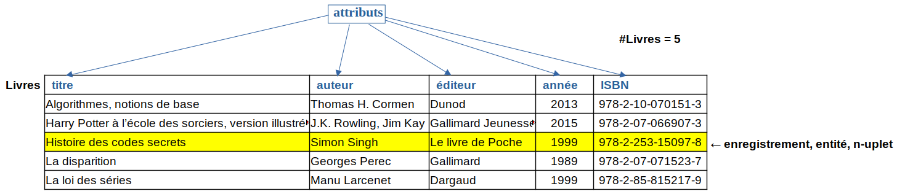
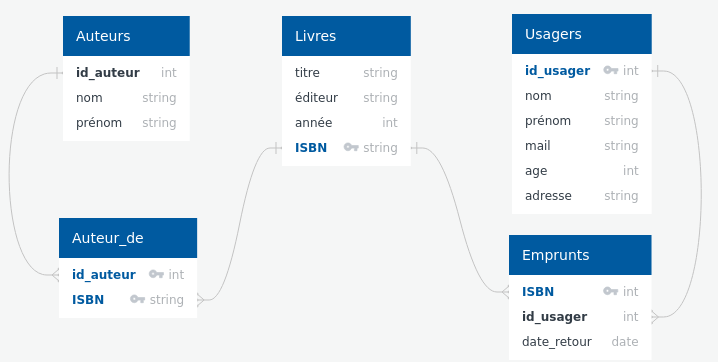

# T4.1 Modèle relationnel
{{ initexo(0) }}

En classe de première nous avons commencé à [appréhender les tables de données](https://cgouygou.github.io/1NSI/T03_TraitementDonnees/T3.1_Manipulation/T3.1_Manipulation/#311-donnees-tabulees){:target="_blank"} , sous forme (plate) d'une liste de dictionnaires.

Nous avons également vu que la manipulation de ces données ainsi structurées n'est pas toujours pratique. Aujourd'hui, on doit stocker et manipuler rapidement des données de tailles gigantesques et il faut donc adopter un modèle plus efficace  : le **modèle relationnel**.

{align=right width=150}
!!! history "Histoire de l'informatique"
    Théorisé en 1970 par le Britannique Edgar F. Codd, le modèle relationnel est à ce jour le modèle de base de données le plus utilisé, même si l'ère actuelle du Big Data tend à mettre en avant d'autres modèles non relationnels.

## 4.1.1 Le modèle relationnel

!!! note "Exemple-type: la base de donnée «Bibliothèque»"
    Pour illustrer ce chapitre, on s'intéressera à l'exemple classique de la gestion des emprunts dans une bibliothèque. Ce *système d'information* - système technique (informatique) permettant de gérer de l'information - contient plusieurs catégories d'«objets»:

    - des **livres**: par exemple «Algorithmes, notions de base», Thomas H. Cormen, Dunod, 2013, 978-2-10-070151-3
    - des **usagers**: Alice Martin, amartin@protonmail.fr, n° abonné 125
    - des **emprunts**: «Algorithmes, notions de base», Alice Martin, 14/11/2022

!!! abstract "Vocabulaire"
    Dans le modèle relationnel, on décrit chaque objet - appelé plutôt *entité* ou *enregistrement* - de chaque catégorie - appelée *relation* - par un n-uplet de valeurs (qui peuvent être des chaines de caractères, des nombres, etc.) associées à des *attributs*.
    
    Une *relation* est donc un ensemble de n-uplets dont les valeurs appartiennent aux *domaines* des attributs, qu'on représente sous forme de *table* (on confond parfois les termes de *table* et de *relation*).

    Le *cardinal* d'une relation R est le nombre d'éléments (ou enregistrements ou entités) qu'elle contient.  On le note #R.

Dans l'exemple-type, on a donc trois relations. Dans la première relation, les «livres», on décrit une entité par 5 attributs:

- le titre, domaine : `String`
- l'auteur (ou les auteurs), domaine : `String`
- l'éditeur, domaine : `String`
- l'année de parution, domaine : `Int`
- l'ISBN, domaine : `String`

??? info "Domaines"
    Les domaines sont des ensembles de valeurs que peut prendre une donnée (comme les types en Python): chaines de caractères, entiers, flottants, booléens, dates, temps...

**Table/relation «Livres»**

{: .center} 

Dans cette table, `('Histoire des codes secrets', 'Simon Singh', 'Le livre de poche', 1999, '978-2-253-15097-8')` est un élément/enregistrement/entité de la relation sous forme d'un n-uplet.

!!! abstract "Schéma d'une relation / schéma relationnel"
    - On appelle *schéma* d'une relation l'ensemble **ordonné** de ses attributs sous la forme : nom `domaine`.

        **Exemple:**

        **Livres** (titre `String`, auteur `String`, éditeur `String`, année `Int`, ISBN `String`)

    - Lorsqu'une base de données contient plusieurs relations, l'ensemble des schémas des relations constitue le *schéma relationnel* de la base de données.

!!! example "{{ exercice() }}"
    === "Énoncé" 
        Écrire ce que pourraient être les schémas des relations **Usagers** et **Emprunts** de la base de données «Bibliothèque».

    === "Correction" 
        {{ correction(True, 
        "
        **Usagers** (nom `String`, prenom `String`, mail `String`, id_usager `Int`)

        **Emprunts** (ISBN `String`, id_usager `Int`, retour `Date`)
        "
        ) }}

!!! abstract "Modélisation et contraintes d'une base de données"
    Modéliser des données avec pour but de construire une base de données se fait en plusieurs étapes:

    1. Déterminer les entités que l'on souhaite manipuler;
    2. Regrouper les entités en relations/tables en choisissant les domaines adéquats pour les attributs;
    3. Définir les *contraintes* (d'intégrité) de la base de données, c'est-à-dire les règles qui assurent la cohérence logique des données.
    
## 4.1.2 Clés primaires et étrangères

!!! abstract "Clé primaire"
    Une des premières contraintes dont il faut s'occuper, c'est la **contrainte de relation**: les données doivent pouvoir être identifiées de manière unique.

    Pour cela, chaque relation doit posséder un attribut (ou parfois un ensemble d'attributs) dont la valeur va permettre d'identifier chaque entité de manière unique. On l'appelle *clé primaire* de la relation, et on la souligne dans le schéma de la relation.

    Si lors de la modélisation on ne dispose pas d'attribut pouvant servir de clé primaire, on crée la plupart du temps une valeur numérique servant de clé primaire: un numéro d'identifiant.

    ??? check "Schéma de la relation «Livres»"
        Le seul attribut de cette relation pouvant servir de clé primaire est l'ISBN  (c'est d'ailleurs [sa raison d'être](https://fr.wikipedia.org/wiki/International_Standard_Book_Number){:target="_blank"}...)

        On écrit donc le schéma en soulignant la clé primaire:

        **Livres** (titre `String`, auteur `String`, éditeur `String`, année `Int`, ^^ISBN `String`^^)

    
!!! example "{{ exercice() }}"
    === "Énoncé" 
        Quelles sont les clés primaires des relations **Usagers** et **Emprunts** ?
    === "Correction" 
        {{ correction(True, 
        "
        La clé primaire de la relation **Usagers** est l'attribut *id_usager* et celle de la relation **Emprunts** est *ISBN*.
        "
        ) }}

Les clés primaires servent également à créer des références entre différentes tables. Par exemple, l'utilisation d'un attribut «nom» dans la relation **Emprunts** peut causer une erreur ou anomalie dans la base de données si deux personnes homonymes figurent dans la relation **Usagers**. Il est donc préférable d'utiliser la clé primaire de la table **Usagers** pour identifier l'emprunteur dans la relation **Emprunts**.

!!! abstract "Clé étrangère"
    Une *clé étrangère* d'une relation est un attribut qui sert à caractériser une entité et qui est une clé primaire dans une relation liée.

    Dans le schéma d'une relation, on indique les clés étrangères en les soulignant en pointillés ou précédées d'un `#`.

    Les clés étrangères servent à vérifier les *contraintes d'intégrité référentielles*.

    ??? note "Exemple"

        Une clé étrangère peut être également clé primaire.
        
        **Emprunts** (#ISBN `String`, #id_usager `Int`, retour `Date`)
    
## 4.1.3 Normalisation des bases de données : redondance et atomicité des données

Outre les contraintes d'intégrité, on souhaite respecter certains principes pour éviter les anomalies dans une base de données: on parle de normalisation de la base. Parmi ces principes, il faut s'assurer de la *non-redondance des données* (les données ne doivent pas apparaître plusieurs fois) et de l'*atomicité des données* (les données doivent être insécables, pas de listes par exemple).

### Exemple de redondance des données

Considérons une autre conception de la relation **Emprunts**:

| id_usager     | date_retour| Nom    | Prénom | titre                      | auteur        | ISBN              |
|---------------|------------|--------|--------|----------------------------|---------------|-------------------|
| 845           | 27/11/2022 | DURAND | Bob    | Histoire des codes secrets | Simon Singh   | 978-2-253-15097-8 |
| 125           | 03/12/2022 | MARTIN | Alice  | La disparition             | Georges Perec | 978-2-07-071523-7 |
| 125           | 03/12/2022 | MARTIN | Alice  | La loi des séries          | Manu Larcenet | 978-2-85-815217-9 |

En quoi cette relation contredit le principe de non-redondance des données?

### Atomicité des données

Comme on l'a vu en introduction, il est plutôt compliqué de devoir faire des recherches dans des données composées (comme des listes par exemple). Si l'on veut faire une requête dans notre base de données sur les ouvrages écrits par J.K. Rowling par exemple, on constate que dans la relation **Livres** apparaît un livre comportant plusieurs auteurs, dont J.K. Rowling. Pour améliorer les performances de la base de données, il faut éviter cela : on parle d'*atomicité des données*.

Pour y remédier, on va simplifier la relation **Livres** en supprimant les auteurs:

|titre                                               	| 	  éditeur	     |année	| ISBN              |
|-------------------------------------------------------|--------------------|------|-------------------|
|Algorithmes, notions de base                           | Dunod	             | 2013	| 978-2-10-070151-3 |
|Harry Potter à l’école des sorciers, version illustrée	| Gallimard Jeunesse | 2015	| 978-2-07-066907-3 |
|Harry Potter et la coupe de feu                    	| Gallimard Jeunesse | 2017	| 978-2-07-058520-4 |
|Histoire des codes secrets                             | Le livre de Poche	 | 1999	| 978-2-253-15097-8 |
|La disparition                                         | Gallimard          | 1989	| 978-2-07-071523-7 |
|La loi des séries                                      | Dargaud            | 1999	| 978-2-85-815217-9 |

Puis construire une relation **Auteurs** et une relation **Auteur_de** qui relie les auteurs à leurs ouvrages.

!!! example "{{ exercice() }}"
    === "Énoncé" 
        Proposer un schéma de chacune de ces relations, puis construire les tables.

    === "Correction" 
<!--
        **Auteurs**(id_auteur `Int`, nom `String`, prénom `String`)

        |id_auteur|nom|prénom|
        |-|-|-|
        |1|Cormen|Thomas H.|
        |2|Rowling| J.K.|
        |3|Kay|Jim|
        |4|Singh|Simon|
        |5|Pérec|Georges|
        |6|Larcenet|Manu|

        **Auteur_de**(#id_auteur `Int`, #ISBN `String`)

        |id_auteur|ISBN|
        |-|-|
        |1|978-2-10-070151-3|
        |2|978-2-07-066907-3|
        |2|978-2-07-058520-4|
        |3|978-2-07-066907-3|
        |4|978-2-253-15097-8|
        |5|978-2-07-071523-7|
        |6|978-2-85-815217-9|

        -->

<!-- ??? check "Schéma relationnel de la base de données «Bibliothèque»"
    {: .center}  -->

## 4.1.4 Contraintes d'intégrité

Pour terminer, récapitulons les différentes contraintes d'intégrité, c'est-à-dire les règles qui assurent la cohérence des données au sein de la base de données.

- **Contrainte de relation**: chaque entité est identifiée de manière unique, à l'aide d'une clé primaire.
- **Contrainte de domaine**: les valeurs d'un attribut sont restreintes à un domaine, ce qui évite qu'on puisse donner une valeur illégale.
- **Contrainte de référence**: dans deux relations associées, la clé étrangère permet de garantir l'existence d'une entité dans la relation primaire. En particulier:
    
    - une clé étrangère est impérativement une clé primaire dans la relation à laquelle elle se réfère;
    - une entité de la relation primaire ne peut pas être supprimée si elle possède des entités liées;
    - si des entités sont liés, la clé primaire ne peut pas être changée .

## 4.1.5 Exercices

!!! example "{{ exercice() }}"
    === "Énoncé" 
        Deux relations modélisent la flotte de voitures d'un réseau de location de voitures.
        
        **Agences**
        
        | id_agence | Ville | Département |
        |-|-|-|
        |1| Poitiers | 86|
        |2| La Rochelle | 17 |
        |3| Angoulême | 16|
        |4| Cognac |16|
        
        **Voitures**
        
        |id_voiture| Marque | Modèle | Kilométrage | Couleur | id_agence |
        |-|-|-|-|-|-|
        |1|Renault|Clio|12000|Rouge|2|
        |2|Peugeot|206|22000|Noir|3|
        |3|Toyota|Yaris|33500|Rouge|3|

        1. Quelle relation a pour cardinal 3 ?
        2. Peut-on ajouter une entité `(2, 'Rochefort', 17)` à la relation **Agences**? Pourquoi?
        2. Donner le schéma de chaque relation.
        3. Quelle table peut contenir des données redondantes? Comment y remédier?

    === "Correction" 
        {{ correction(False, 
        "
        "
        ) }}
!!! example "{{ exercice() }}"
    === "Énoncé" 
        On souhaite modéliser un annuaire téléphonique dans lequel chaque personne est représentée par son nom, son prénom et son numéro de téléphone. 

        Proposer un schéma de cette relation, en précisant la clé primaire.
    === "Correction" 
        {{ relation('Annuaire', 'numéro STRING', 'nom STRING', 'prénom STRING')}}
        

!!! example "{{ exercice() }}"
    === "Énoncé" 
        Donner la modélisation relationnelle d'un bulletin scolaire. Préciser les clés primaires et étrangères.

        On doit pouvoir représenter:

        - des élèves, possédant un numéro d'étudiant alphanumérique (INE);
        - des matières;
        - au plus une note sur 20, par matière et par élève.
    === "Correction" 
        {{ correction(False, 
        "
        {: .center} 
        "
        ) }}

!!! example "{{ exercice() }}"
    === "Énoncé" 
        Donner une modélisation relationnelle correspondant à la situation du «Prequel». 

        Peupler chaque table de quelques enregistrements pour illustrer.
    === "Correction" 
        {{ correction(False, 
        "
        "
        ) }}

<!-- 
La relation {{ relation("individu", "id_ind", "nom", "prenom", "naissance") }}

{{ relation("Emprunts", "idEmprunt (INT)", "#idEleve (INT)", "#isbn (CHAR 13)", "dateEmprunt (DATE)", "dateRetour (Date)") }} -->
