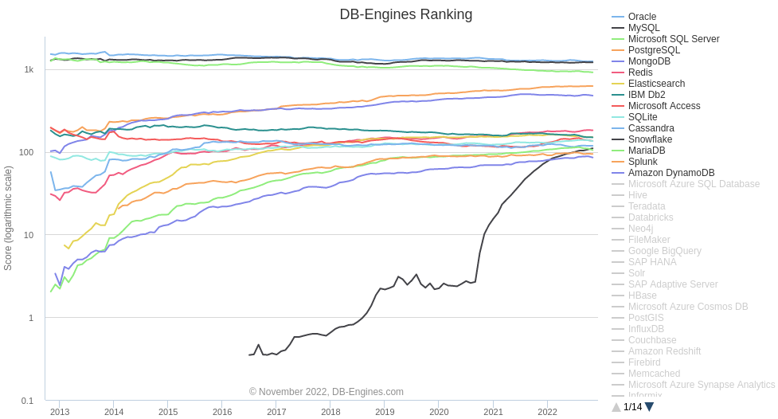
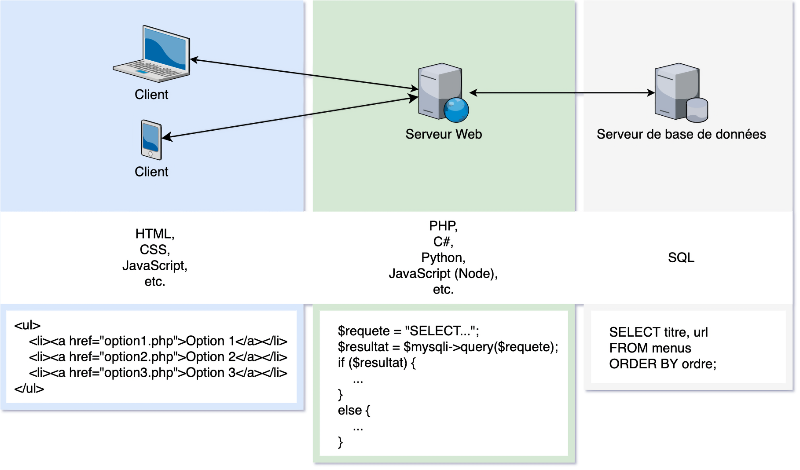
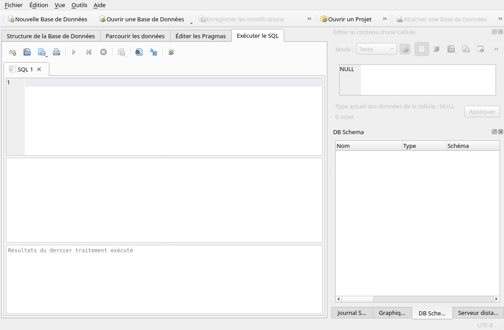
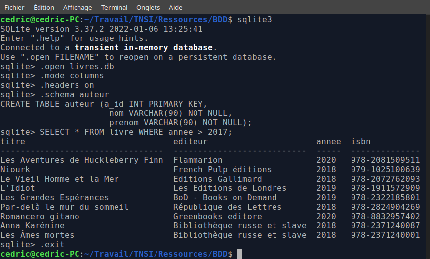

# T4.2 SGBD

## 4.2.1 Différents SGBD

Comme son nom l'indique, un **SGBD** - pour Système de Gestion de Bases de Données - est un logiciel qui permet de gérer les bases de données, c'est-à-dire:

- créer et supprimer des relations (ou tables);
- mettre à jour les tables (création, modification, suppression d'enregitrements dans les tables);
- rechercher des données particulières selon plusieurs critères...

Ces actions sur les  bases de données s'appellent des **requêtes** et on utilise le langage **SQL** (pour Structured Query Language) pour communiquer ces requêtes au SGBD, qui s'assure de préserver l'intégrité de la base de données.

La majorité des SGBD les plus utilisés s'appuient sur le modèle relationnel : Oracle, MySQL, Microsoft SQL Server, PostgreSQL, Microsoft Access, SQLite, MariaDB...

{: .center width=640} 

Mais de plus en plus de SGBD non-relationnels sont utilisés, spécialement adaptés à des données plus diverses et moins structurées. On les retrouve sous l'appelation **NoSQL** (pour Not only SQL). Citons parmi eux MongoDB, Cassandra (Facebook), BigTable (Google)...

La plupart des SGBD sont basés sur le schéma {:target="_blank"} : les bases de données et le SGBD sont situés sur un serveur et le client est un programme qui effectue les requêtes en se connectant au serveur.

{: .center width=640} 

En NSI, nous utiliserons **SQLite** qui ne reproduit pas ce schéma et qui sera plus simple d'utilisation, à travers une interface graphique **DB Browser for SQLite** (ou Capytale).

## 4.2.2 Utilisation de SQLite

!!! info "Avec DB Browser for SQLite"
    1. Ouvrir un terminal puis entrer la ligne de commande (mot de passe `nsi`):

            sudo apt-get update
    
    2. Installer le logiciel par:

            sudo apt-get install sqlitebrowser

    On pourra ensuite créer une nouvelle base de données ou en ouvrir une (au format `.db`), consulter la structure (le schéma relationnel), parcourir les données (visualiser le contenu des tables) et éxécuter du code SQL (lancer des ordres).

    {: .center width=640} 
    
!!! info "Dans le terminal, sans environnement graphique"
    On utilise l'interpréteur `sqlite3`, dont les commandes sont toutes préfixées par un point, sans `;` en fin de ligne. Les commandes que l'on peut utiliser (voir [ici](https://www.sqlite.org/cli.html){:target="_blank"} pour plus de commandes) sont `.open`, `.import`, `.mode`, `.headers`, `.schema`, `.exit`.

    {: .center} 

