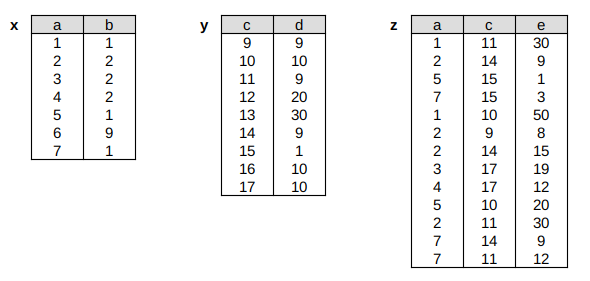

# T4.3 Langage SQL (partie 2)
{{ initexo(0) }}


## 4.3.3 La manipulation des données (LMD) : Requêtes d'interrogation avec SELECT

`#!sql SELECT` est le mot-clé le plus important et le plus utilisé en SQL : il permet de sélectionner des lignes, des colonnes d'une ou plusieurs tables, mais aussi transformer des données par l'utilisation de fonction ou encore réaliser des calculs.

{: .center} 


!!! info "Exemple-type"
    Tous les exemples de ce chapitre sont à tester à partir de la base de données [livres.db](../data/livres.db){:target="_blank"} issue de l'ouvrage paru chez Ellipses, cité en bibliographie dans les sources du site, qui reprend (à peu-près) le schéma de la base *bibliothèque* étudiée aux chapitres précédents.


!!! abstract "Syntaxe générale"
    ```sql 
    SELECT colonnes ou éléments d'extraction
        FROM table(s)
        WHERE condition(s) - optionnel
        ORDER BY tri(s) - optionnel
    ;
    ```
    

### 1. Sélection et projection

!!! gear "Sélectionner des lignes"
    === "Sans condition"
        On obtient alors l'intégralité de la table. On utilise l'astérisque `#!sql *` pour indiquer qu'on souhaite **toutes** les colonnes.

        ```sql title="Sélectionner tous les usagers"
        SELECT * FROM usager;
        ```
    === "Avec une condition"
        On utilise la clause `#!sql WHERE` pour indiquer une condition sur la sélection des lignes.

        ```sql title="Sélectionner les usagers vivant dans le 15e arrondissement de Paris"
        SELECT * FROM usager WHERE cp = '75005';
        ```
    === "Avec des conditions"
        On peut utiliser des opérateurs booléens dans l'écriture de la condition.

        ```sql title="Sélectionner les livres parus entre 2000 et 2005"
        SELECT * FROM livre WHERE annee >= 2000 AND annee <= 2005;
        ```
    === "Avec un tri"
        On peut ajouter un tri sur les résultats, en précisant l'attribut sur lequel s'effectue le tri et éventuellement l'ordre de tri par les mots-clés `#!sql ASC` (par défaut) ou `#!sql DESC` .

        ```sql title="Sélectionner les livres parus entre 2000 et 2005 et les trier par editeur"
        SELECT * FROM livre
            WHERE annee >= 2000 AND annee <= 2005
            ORDER BY editeur
        ;
        ```
    
    === "Requête approchée"
        Si la condition de recherche porte sur une chaîne de caractères, l'opérateur `#!sql =` peut ne pas être approprié. On utilise alors plutôt le mot-clé `#!sql LIKE`, avec une chaîne de caractère composée d'un *motif* utilisant des jokers `#!sql %` pour remplacer une chaîne de caractères quelconque.

        ```sql title="Sélectionner les lignes dont le titre contient la chaîne `Astérix`"
        SELECT * FROM livre WHERE titre LIKE '%Astérix%';
        ```
        


!!! example "{{ exercice() }}"
    === "Énoncé" 
        Effectuer les requêtes suivantes:

        1. Sélectionner les livres qui ne sont pas parus en 2008, classés du plus récent au plus vieux.
        2. Sélectionner les usagers dont le prénom est JULIEN ou DAVID.
        3. Sélectionner les auteurs dont le prénom commence par un M.

    === "Correction" 
        {{ correction(False, 
        "
        1. `#!sql SELECT * FROM livre WHERE annee != 2008 ORDER BY annee DESC;` 
        2. `#!sql SELECT * FROM usager WHERE prenom = 'JULIEN' OR Prenom = 'DAVID';` 
        3. `#!sql SELECT * FROM auteur WHERE prenom LIKE 'M%' ORDER BY prenom;` 
        "
        ) }}

!!! gear "Sélectionner des colonnes (projection)"
    Plutôt que de sélectionner toutes les colonnes avec le joker `#!sql *` on peut préciser quels attributs on souhaite afficher dans les résultats de la requête. On nomme cette opération *projection*.

    === "Une colonne"
        ```sql title="Sélectionner uniquement les titres des livres parus en 2000"
        SELECT titre FROM livre WHERE annee = 2000;
        ```
    === "Plusieurs colonnes"
        ```sql title="Sélectionner les titres et l'année de parution des livres parus avant 2000"
        SELECT titre, annee FROM livre WHERE annee < 2000;
        ```
    === "Gestion des doublons"
        Si on sélectionne la colonne (l'attribut) *editeur* de la table **livre** par la requête suivante, on s'aperçoit qu'on obtient plusieurs fois les mêmes noms d'éditeur.

        ```sql 
        SELECT editeur FROM livre;
        ```
        
        Pour obtenir uniquement les valeurs différentes de cette colonne, on utilise le mot-clé `#!sql DISTINCT` (le tri est facultatif, il est présent ici pour bien visualiser l'absence des doublons):

        ```sql 
        SELECT DISTINCT editeur FROM livre ORDER BY editeur;
        ```
        
!!! example "{{ exercice() }}"
    === "Énoncé" 
        Effectuer les requêtes suivantes sur la table **livre**:

        1. Sélectionner les titres et les ISBN des livres parus à partir de 1990.
        2. Sélectionner les années (sans doublon) pour lesquelles un livre est paru chez Flammarion, triées dans l'ordre croissant.

    === "Correction" 
        {{ correction(False, 
        "
        
        1. `#!sql SELECT titre, isbn FROM livre WHERE annee >= 1990;` 
        2. `#!sql SELECT DISTINCT annee FROM livre WHERE editeur = 'Flammarion' ORDER BY annee;` 
        "
        ) }}

### 2. Agrégation

Une autre utilisation de la clause `#!sql SELECT` est d'appeler une *fonction d'agrégation*, c'est-à-dire une fonction que l'on applique à l'ensemble des valeurs d'une colonne et qui renvoie une table réduite à une cellule contenant le résultat du calcul. On peut par exemple compter le nombre de valeurs (mot-clé `#!sql COUNT`), faire une somme (`#!sql SUM`), calculer une moyenne (`#!sql AVG`) ou encore trouver un minimum/maximum (`#!sql MIN` , `#!sql MAX`).

!!! gear "Agrégation"
    === "`#!sql COUNT`"
        ```sql title="Compter le nombre d'usagers"
        SELECT COUNT(*) FROM usager;
        ```

        **Remarque:** on peut utiliser un **alias** avec `#!sql AS` pour nommer le résultat:

        ```sql title="Avec utilisation d'un alias"
        SELECT COUNT(*) AS total FROM usager;
        ```
        
        
    === "`#!sql SUM`, `#!sql AVG`"
        Les fonctions `#!sql SUM` et `#!sql AVG` s'utilisent de la même façon, ici un exemple (totalement dénué de sens) pour illustrer `#!sql AVG` :

        ```sql title="Calculer l'année moyenne de parution"
        SELECT AVG(annee) FROM livre;
        ```

    === "`#!sql MIN`, `#!sql MAX` "
        ```sql title="Déterminer l'année de parution la plus récente parmi les livres édités par Dargaud"
        SELECT MAX(annee) FROM livre WHERE editeur LIKE 'Dargaud';
        
        ```
        
!!! example "{{ exercice() }}"
    === "Énoncé" 
        1. Écrire une requête SQL qui permet de récupérer le nombre de livres parus en 2012.
        2. Écrire une requête SQL qui permet de récupérer la date de retour la plus ancienne en la nommant `'retard_max'`
    === "Correction" 
        {{ correction(False, 
        "
        1.
        ```sql 
        SELECT COUNT(*) FROM livre WHERE annee = 2012;
        ```
        
        2.
        ```sql 
        SELECT MIN(retour) AS 'retard_max' FROM emprunt;
        ```
        "
        ) }}

### 3. Jointures

Jusqu'à présent les requêtes effectuées sont *relativement* simples puisqu'elles ne concernent qu'une seule table à la fois. Mais intéressons-nous par exemple à une requête - pertinente - de savoir qui est en retard dans son emprunt. L'interrogation de la table **emprunt** permet de récupérer les valeurs de l'attribut *code_barre*, mais ce n'est pas très parlant pour un être humain, le nom de la personne serait plus judicieux. Or ce nom se situe dans une autre table, la table **usager**... Il faut donc croiser les données situées dans deux tables différentes.

Cette manipulation de fusion de plusieurs tables se nomme une *jointure* et s'effectue à l'aide du mot-clé `#!sql JOIN ... ON ...`.

!!! gear "Jointure"

    ```sql title="Exemple de jointure sur l'attribut commun *code_barre*"
    SELECT * FROM usager JOIN emprunt ON usager.code_barre = emprunt.code_barre;
    ```
    **Remarques:**

    - On constate que la table renvoyée par cette requête contient autant de fois la ligne correspondant à un usager que ce dernier a emprunté de ligne. De même un usager n'ayant pas fait d'emprunt ne figure pas dans le résultat de la requête.
    - On doit préfixer les attributs de la table à laquelle ils appartiennent.


    Il suffit maintenant d'ajouter un filtre sur la date de retour, et de n'afficher que le nom de l'usager, l'isbn et la date de retour.

    === "Sans alias"
        ```sql 
        SELECT usager.nom, emprunt.isbn, emprunt.retour
            FROM usager
            JOIN emprunt ON usager.code_barre = emprunt.code_barre
            WHERE emprunt.retour < '2022-12-01'
        ;
        ```
    === "Avec alias"
        ```sql 
        SELECT u.nom, e.isbn, e.retour
            FROM usager AS u
            JOIN emprunt AS e ON u.code_barre = e.code_barre
            WHERE e.retour < '2022-12-01'
        ;
        ```

    On peut également effectuer une jointure sur plus de deux tables, par exemple si on souhaite afficher le titre du livre emprunté plutôt que son isbn...

    ??? check "On réfléchit d'abord..."
        ```sql 
        SELECT u.nom, l.titre, e.retour
            FROM usager AS u
            JOIN emprunt AS e ON u.code_barre = e.code_barre
            JOIN livre AS l ON l.isbn = e.isbn
            WHERE e.retour < '2022-12-01'
        ;
        ```
    
!!! example "{{ exercice() }}"
    === "Énoncé" 
        Écrire les requêtes SQL suivantes:

        1. Le `titre` des `livres` empruntés.
        2. Le `nom` et le `prénom` de l'auteur du livre `1984`.
        3. Les `titre` des `livres` publiés strictement avant `Dune` (penser d'abord à écrire une requête donnant l'année de parution de `Dune`).
        4. Les `noms` et `prénoms` des auteurs des `livres` trouvés à la requête précédente.
        5. Même requête que précédemment, sans doublon.
        6. Le nombre de résultats trouvés à la question précédente.

    === "Correction" 
        {{ correction(False, 
        "
        "
        ) }}

!!! example "{{ exercice() }}"
    === "Énoncé" 
        On considère les trois tables décrites ci-dessous.
        
        {: .center} 

        Pour chaque requête SQL suivantes, calculer son résultat (à la main).

        1. `#!sql SELECT * FROM x WHERE b > 3;` 
        2. `#!sql SELECT DISTINCT e FROM z WHERE e > 10 AND e < 50;` 
        3. `#!sql SELECT * FROM y WHERE c % 2 = 0 ORDER BY d ASC;` 
        4. `#!sql SELECT x.a, x.b FROM x JOIN z ON z.a = x.a WHERE z.e < 9;` 
        5. `#!sql SELECT DISTINCT x.b, z.c FROM x JOIN z ON z.a = x.a;` 

    === "Correction" 
        {{ correction(False, 
        "
        "
        ) }}
