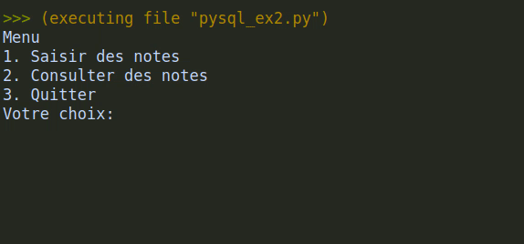

# TP Python et SQL

{{ initexo(0) }}

Dans ce TP, nous allons voir comment utiliser Python pour créer une base de données, créer des tables et effectuer des requêtes en SQL sur cette base de données.

Exécuter le code suivant et contrôler en même temps avec **DB Browser**.

!!! code "Modèle-type d'un script Python-SQL"
    === "Module `sqlite3`"

        ```python linenums='1' hl_lines="1"
        import sqlite3
     
        #Connexion
        connexion = sqlite3.connect('mabase.db')

        #Récupération d'un curseur
        c = connexion.cursor()

        # ---- début des instructions SQL
        #Création d'une table
        c.execute("""
            CREATE TABLE IF NOT EXISTS prof(
            id INTEGER,
            nom TEXT,
            matière TEXT);
            """)

        #Insertion de valeurs
        c.execute("INSERT INTO prof VALUES (1, 'Gouygou', 'NSI');")

        autre_profs = [(2, 'Morel', 'Maths'),
                       (3, 'Philippe', 'Maths'),
                       (4, 'Atingdobe', 'Philosophie'),
                       (5, 'Renault', 'Arts Plastiques'),
                       (6, 'Sartorel', 'Histoire-Géographie'),
                       (7, 'Touchais', 'Anglais'),
                       (8, 'Gouygou', 'Maths')]
        c.executemany("INSERT INTO prof VALUES (?, ?, ?)", autre_profs)

        requete = c.execute("SELECT id, nom FROM prof WHERE matière = 'Maths';")
        print(requete.fetchone())
        print(requete.fetchall())
        # ---- fin des instructions SQL

        #Validation
        connexion.commit()

        #Déconnexion
        connexion.close()
        ```
    === "Connexion à la base de données"
        - La ligne 4 permet d'ouvrir une base de données, ou d'en créer une si le fichier `.db` n'existe pas, et de créer une *connexion* à cette base de données.
        - La ligne 39 met fin à cette connexion.

        ```python linenums='1' hl_lines="4 39"
        import sqlite3

        #Connexion
        connexion = sqlite3.connect('mabase.db')

        #Récupération d'un curseur
        c = connexion.cursor()

        # ---- début des instructions SQL
        #Création d'une table
        c.execute("""
            CREATE TABLE IF NOT EXISTS prof(
            id INTEGER,
            nom TEXT,
            matière TEXT);
            """)

        #Insertion de valeurs
        c.execute("INSERT INTO prof VALUES (1, 'Gouygou', 'NSI');")

        autre_profs = [(2, 'Morel', 'Maths'),
                    (3, 'Philippe', 'Maths'),
                    (4, 'Atingdobe', 'Philosophie'),
                    (5, 'Renault', 'Arts Plastiques'),
                    (6, 'Sartorel', 'Histoire-Géographie'),
                    (7, 'Touchais', 'Anglais'),
                    (8, 'Gouygou', 'Maths')]
        c.executemany("INSERT INTO prof VALUES (?, ?, ?)", autre_profs)

        requete = c.execute("SELECT id, nom FROM prof WHERE matière = 'Maths';")
        print(requete.fetchone())
        print(requete.fetchall())
        # ---- fin des instructions SQL

        #Validation
        connexion.commit()

        #Déconnexion
        connexion.close()
        ```
        
    === "Curseur"
        On crée ensuite ligne 7 un objet de type `cursor` qui va permettre d'envoyer des requêtes sur la base données.

        ```python linenums='1' hl_lines="7"
        import sqlite3

        #Connexion
        connexion = sqlite3.connect('mabase.db')

        #Récupération d'un curseur
        c = connexion.cursor()

        # ---- début des instructions SQL
        #Création d'une table
        c.execute("""
            CREATE TABLE IF NOT EXISTS prof(
            id INTEGER,
            nom TEXT,
            matière TEXT);
            """)

        #Insertion de valeurs
        c.execute("INSERT INTO prof VALUES (1, 'Gouygou', 'NSI');")

        autre_profs = [(2, 'Morel', 'Maths'),
                       (3, 'Philippe', 'Maths'),
                       (4, 'Atingdobe', 'Philosophie'),
                       (5, 'Renault', 'Arts Plastiques'),
                       (6, 'Sartorel', 'Histoire-Géographie'),
                       (7, 'Touchais', 'Anglais'),
                       (8, 'Gouygou', 'Maths')]
        c.executemany("INSERT INTO prof VALUES (?, ?, ?)", autre_profs)

        requete = c.execute("SELECT id, nom FROM prof WHERE matière = 'Maths';")
        print(requete.fetchone())
        print(requete.fetchall())
        # ---- fin des instructions SQL

        #Validation
        connexion.commit()

        #Déconnexion
        connexion.close()
        ```

    === "Requêtes"
        === "Requête simple"
            La méthode `execute` permet d'effectuer une requête, que l'on passe en argument sous forme d'une chaîne de caractères. Si on souhaite l'écrire sur plusieurs lignes, on l'écrit entre **triples double-quotes**.

            À noter l'option `#!sql IF NOT EXISTS` qui permet de ne pas écraser une table déjà existante.

        === "Requête multiple"
            La méthode `executemany` permet d'effectuer plusieurs requêtes, une par élément d'une liste passée en argument. On utilise des *placeholders* `?` pour indiquer où remplacer par les valeurs des éléments de la liste.

        === "Récupérer des résultats d'une requête `#!sql SELECT`"
            On stocke la table des résultats d'une requête `#!sql SELECT` dans une variable, sur laquelle on peut ensuite itérer:
            
            - `fetchone` renvoie la première ligne, et passe à la suivante.
            - `fetchall` renvoie l'ensemble des lignes, sous forme d'une liste.

        ```python linenums='1' hl_lines="10-32"
        import sqlite3

        #Connexion
        connexion = sqlite3.connect('mabase.db')

        #Récupération d'un curseur
        c = connexion.cursor()

        # ---- début des instructions SQL
        #Création d'une table
        c.execute("""
            CREATE TABLE IF NOT EXISTS prof(
            id INTEGER,
            nom TEXT,
            matière TEXT);
            """)

        #Insertion de valeurs
        c.execute("INSERT INTO prof VALUES (1, 'Gouygou', 'NSI');")

        autre_profs = [(2, 'Morel', 'Maths'),
                       (3, 'Philippe', 'Maths'),
                       (4, 'Atingdobe', 'Philosophie'),
                       (5, 'Renault', 'Arts Plastiques'),
                       (6, 'Sartorel', 'Histoire-Géographie'),
                       (7, 'Touchais', 'Anglais'),
                       (8, 'Gouygou', 'Maths')]
        c.executemany("INSERT INTO prof VALUES (?, ?, ?)", autre_profs)

        requete = c.execute("SELECT id, nom FROM prof WHERE matière = 'Maths';")
        print(requete.fetchone())
        print(requete.fetchall())
        # ---- fin des instructions SQL

        #Validation
        connexion.commit()

        #Déconnexion
        connexion.close()
        ```

    === "Validation"
        On valide ligne 36 les requêtes pour exécution sur la base de données.

        ```python linenums='1' hl_lines="36"
        import sqlite3

        #Connexion
        connexion = sqlite3.connect('mabase.db')

        #Récupération d'un curseur
        c = connexion.cursor()

        # ---- début des instructions SQL
        #Création d'une table
        c.execute("""
            CREATE TABLE IF NOT EXISTS prof(
            id INTEGER,
            nom TEXT,
            matière TEXT);
            """)

        #Insertion de valeurs
        c.execute("INSERT INTO prof VALUES (1, 'Gouygou', 'NSI');")

        autre_profs = [(2, 'Morel', 'Maths'),
                       (3, 'Philippe', 'Maths'),
                       (4, 'Atingdobe', 'Philosophie'),
                       (5, 'Renault', 'Arts Plastiques'),
                       (6, 'Sartorel', 'Histoire-Géographie'),
                       (7, 'Touchais', 'Anglais'),
                       (8, 'Gouygou', 'Maths')]
        c.executemany("INSERT INTO prof VALUES (?, ?, ?)", autre_profs)

        requete = c.execute("SELECT id, nom FROM prof WHERE matière = 'Maths';")
        print(requete.fetchone())
        print(requete.fetchall())
        # ---- fin des instructions SQL

        #Validation
        connexion.commit()

        #Déconnexion
        connexion.close()
        ```


!!! example "Exercice"
    === "Énoncé" 
        1. Écrire un programme qui crée une table **devoir**(nom `String`, note `Int`) et qui demande ensuite en boucle un nom et une note en les ajoutant à la table. Le programme stoppe dès qu'on entre comme nom `q` ou `Q`.

        2. Améliorer le programme précédent pour permettre de rentrer des notes ou des consulter des notes.

        {: .center} 

    === "Aide"

        Pour la gestion des choix, on pourra utiliser le code suivant:

        ```python linenums='1'
        go = True

        while go:
            choix = input("Menu \n1. Saisir des notes\n2. Consulter des notes\n3. Quitter\nVotre choix: ")
            if choix == '1':
                saisie()
            elif choix == '2':
                consultation()
            else:
                go = False
        ```

        Il vous faut donc écrire les fonctions `#!py saisie` et `#!py consultation` et à insérer ce code dans l'*architecture* de l'exemple donné.
        
    === "Correction" 
        {{ correction(True, 
        "
        ```python
        import sqlite3

        #Connexion
        connexion = sqlite3.connect('mondevoir.db')
        
        #Récupération d'un curseur
        c = connexion.cursor()
        
        # ---- début des instructions SQL
        #Création d'une table
        c.execute(\"\"\"
            CREATE TABLE IF NOT EXISTS devoir(
            nom TEXT,
            note INTEGER);
            \"\"\")
        
        def saisie():
            go = True
            while go:
                nom = input('Nom ? ')
                if nom.lower() == 'q':
                    go = False
                else:
                    note = int(input('Note ? '))
                    c.execute(\"INSERT INTO devoir VALUES (?, ?);\", [nom, note])
        
        def consultation():
            go = True
            while go:
                nom = input('Nom ? ')
                if nom.lower() == 'q':
                    go = False
                else:
                    rq = c.execute(\"SELECT note FROM devoir WHERE nom = ?;\", [nom]).fetchone()
                    if rq is None:
                        print(\"Elève inconnu\")
                    else:
                        print(\"Note: \", rq[0])
        
        go = True
        
        while go:
            choix = input(\"Menu \n1. Saisir des notes\n2. Consulter des notes\n3. Quitter\nVotre choix: \")
            if choix == '1':
                saisie()
            elif choix == '2':
                consultation()
            else:
                go = False
                
                
        # ---- fin des instructions SQL
        
        #Validation
        connexion.commit()
        
        #Déconnexion
        connexion.close()
        
        ```
        "
        ) }}


        
        

