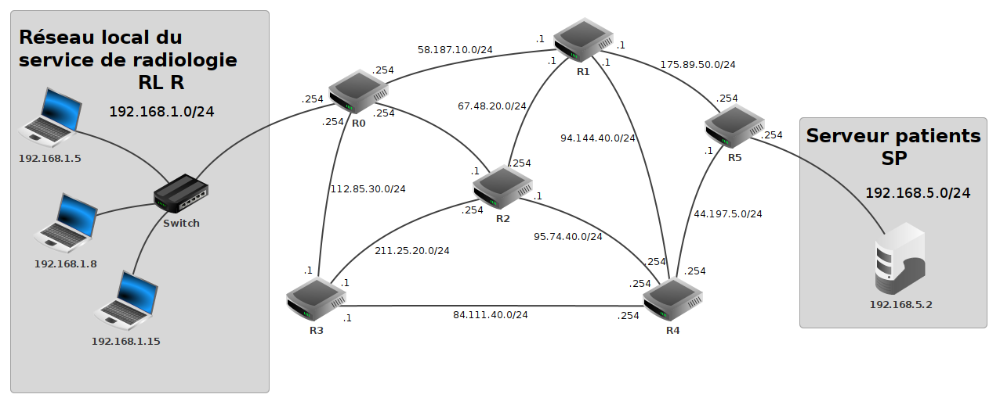
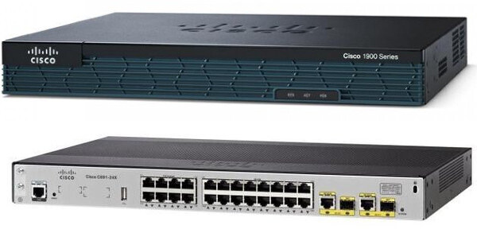

# T5.1 Protocoles de routage
{{ initexo(0) }}

## 1. Problématique du routage

On prend exemple sur le réseau (du moins un extrait) d'un hôpital:

{: .center} 

Dans ce réseau les différentes machines doivent communiquer entre elles.

**Cas n°1**

La machine A d'adresse IP `192.168.1.5` veut communiquer avec la machine B d'adresse IP `192.168.1.15`. Grâce au masque de sous-réseau, A comprend que B fait partie du même réseau local: les paquets de données seront acheminés par le switch du réseau `192.168.1.0/24`.

**Cas n°2**

La machine A d'adresse IP `192.168.1.5` veut communiquer avec le serveur SP qui ne fait pas partie du même sous-réseau. Les paquets de données vont donc être envoyés à la passerelle du réseau `192.168.1.0/24` : le routeur R0, via son interface `192.168.1.254`.

!!! abstract "Routeur, interface et passerelle"
    === "Routeur"
        Les réseaux locaux peuvent être reliés entre eux par l'intermédiaire de **routeurs**. Il ne faut jamais perdre de vue qu'Internet résulte de l'interconnexion de réseaux par des routeurs.

        Un routeur est composé d’un nombre plus ou moins important d’interfaces réseau (cartes réseau). Les routeurs les plus simples que l’on puisse rencontrer permettent de relier ensemble deux réseaux (ils possèdent alors 2 interfaces réseau), mais il existe des routeurs capables de relier ensemble une dizaine de réseaux. N'importe quel ordinateur peut jouer le rôle de routeur (à partir du moment où il possède au moins 2 interfaces réseau), mais on rencontre souvent des «machines» dédiées (par exemple de marque CISCO):

        {: .center width=480} 
    
    === "Interface et passerelle"
        Chaque carte réseau d'un routeur possède une adresse IP propre : par exemple le routeur **R0** possède 4 cartes réseau d'adresses `192.168.1.254`, `58.187.10.254`, `112.85.30.254` et `54.25.20.254`. Selon le sens de transmission des paquets, on parle d'*interface* ou de *passerelle*:

        - **interface** : c'est l'adresse IP de la carte réseau du routeur **par où va sortir** le paquet à envoyer. Il y a donc toujours une adresse d'interface à renseigner (car un paquet sort bien de quelque part !). Parfois cette interface sera juste nommée interface1 ou interface2., ou bien encore `eth0`, `eth1`, etc.

        - **passerelle** : c'est l'adresse IP de la carte réseau du routeur **à qui on va confier** le paquet, si on n'est pas capable de le délivrer directement (donc si l'adresse IP de destination n'est pas dans notre propre sous-réseau). Cette adresse de passerelle n'est donc pas systématiquement mentionnée. Quand elle l'est, elle donne le renseignement sur le prochain routeur à qui le paquet est confié.

Reprenons le cas n°2 : comment le routeur **R0** va-t-il faire pour envoyer le paquet au serveur SP? Puisque le réseau du serveur SP ne fait pas partie du même réseau que **R0**, il faut que celui-ci le confie à un autre routeur, et ainsi de suite jusqu'à  un routeur qui soit dans le réseau local du serveur SP, c'est-à-dire le routeur **R5**.

Pour savoir à quel routeur il faut envoyer les paquets de données, un routeur possède une **table de routage**: c'est un tableau qui va contenir des informations permettant au routeur d'envoyer le paquet de données dans la "bonne direction".

!!! note "Exemple de table de routage"

    Voici ce qui pourrait être un **extrait** de la table de routage du routeur **R0**.

    |Réseau (destination) |   Interface    |  Passerelle  |
    |:-------------------:|:--------------:|:------------:|
    | `192.168.1.0`       | `192.168.1.254`|              |
    | `112.85.30.0`       | `112.85.30.254`|              |
    | `84.111.10.0`       | `112.85.30.254`| `112.85.30.1`|

    Les deux réseaux `192.168.1.0` et `112.85.30.0` sont directement accessibles au routeur **R0**, puisqu'il en fait partie : il n'a donc pas besoin d'adresse passerelle pour communiquer avec ces réseaux.

    Par contre, la communication avec le réseau `84.111.10.0` nécessite de confier le paquet au routeur **R3** (c'est le choix de cette table de routage). Il faut donc mentionner l'adresse IP de ce routeur **R3** (`112.85.30.1`), qu'on appelle adresse de passerelle.

    Notons que cette table est simplifiée, on peut préciser également le masque de sous-réseau (*netmask*) ainsi qu'une *métrique* qui désigne le coût de la liaison.

**Comment sont construites les tables de routage ?**

- Soit à la main par l'administrateur réseau, quand le réseau est petit : on parle alors de table **statique**.
- Soit de manière **dynamique** : les réseaux s'envoient eux-mêmes des informations permettant de mettre à jour leurs tables de routages respectives. Des algorithmes de détermination de meilleur chemin sont alors utilisés : nous allons en découvrir deux, le protocole RIP et le protocole OSPF.

!!! info "Tables de routage simplifiées"
    Dans certains exercices de BAC, les tables de routage seront réduites au strict minimum et contiendront plutôt des noms de routeurs plutôt que des adresses IP (voir exercice 2 par exemple).

## 2. Le protocole RIP

!!! abstract " Principe du protocole RIP"
    Le Routing Information Protocol (RIP) est basé sur l'échange des tables de routage de chaque routeur.

    Au début, chaque routeur ne connaît que les réseaux auquel il est directement connecté, associé à la distance 1.

    Ensuite, chaque routeur va recevoir périodiquement (toutes les 30 secondes) la table des routeurs auquel il est connecté, et mettre à jour sa propre table  en ne retenant que les informations les plus pertinentes : une simple comparaison permet de ne garder que **le chemin le plus avantageux**. Il transmettra à son tour ces informations à ses voisins et ainsi de suite.

    Le protocole RIP cherche donc à **minimiser** le nombre de routeurs traversés, ce qu'on appelle le nombre de sauts et qui correspond à la *métrique* utilisée.

    Si le réseau n'évolue pas (panne ou ajout de nouveau matériel), les tables de routage *convergent* vers une valeur stable : elles n'évoluent plus.

    Si un routeur ne reçoit pas pendant 3 minutes d'information de la part d'un routeur qui lui avait auparavant communiqué sa table de routage, ce routeur est considéré comme en panne, et toutes les routes passant par lui sont affectées de la distance infinie : 16.

**Remarques et inconvénients:**

- Le protocole RIP n'admet qu'une distance maximale égale à 15 (ceci explique que 16 soit considéré comme la distance infinie), ce qui le limite aux réseaux de petite taille.
- Chaque routeur n'a jamais connaissance de la topologie du réseau tout entier : il ne le connaît que par ce que les autres routeurs lui ont raconté. On dit que ce protocole de routage est du *routing by rumor*.

!!! example "{{ exercice() }} : RIP débranché"
    === "Énoncé" 
        
        [PDF réseau](../data/reseau_hopital.pdf){.center .md-button }
        

        1. Construire pas à pas les tables de routage du réseau de l'hôpital.
        2. Le serveur SP doit transmettre des données au service de radiologie en effectuant le moins de sauts possibles. Citer les routeurs parcourus par le paquet.
        3. Suite à une opération de maintenance, le routeur R1 est déconnecté. Plus aucun paquet ne peut transiter par ce routeur. 

            Déterminer une nouvelle route empruntée par les paquets en citant les routeurs dans l'ordre.
    === "Correction" 
        {{ correction(False, 
        "
        "
        ) }}

!!! example "{{ exercice() }}"
    === "Énoncé" 
        On donne les tables de routage d'un réseau informatique composé de 5 routeurs (appelés A, B, C, D et E), chacun associé directement à un réseau du même nom, obtenues avec le protocole RIP :
        === "Routeur A"

            | Destination | Métrique |
            |---|---|
            | A | 0 |
            | B | 1 |
            | C | 1 |
            | D | 1 |
            | E | 2 |

        === "Routeur B"

            | Destination | Métrique |
            |---|---|
            | A | 1 |
            | B | 0 |
            | C | 2 |
            | D | 1 |
            | E | 2 |

        === "Routeur C"

            | Destination | Métrique |
            |---|---|
            | A | 1 |
            | B | 2 |
            | C | 0 |
            | D | 1 |
            | E | 2 |

        === "Routeur D"

            | Destination | Métrique |
            |---|---|
            | A | 1 |
            | B | 1 |
            | C | 1 |
            | D | 0 |
            | E | 1 |

        === "Routeur E"

            | Destination | Métrique |
            |---|---|
            | A | 2 |
            | B | 2 |
            | C | 2 |
            | D | 1 |
            | E | 0 |

        1. Donner la liste des routeurs avec lesquels le routeur A est directement relié.
        2. Représenter graphiquement et de manière sommaire les 5 routeurs ainsi que les liaisons existantes entre ceux-ci.
        3. On établit désormais une liaison entre les routeurs C et E. Actualiser les tables de routages des 5 routeurs.
        4. Le routeur D tombe en panne. Actualiser les tables de routages des routeurs restants.

    === "Correction" 
        {{ correction(False, 
        "
        "
        ) }}
## 3. Le protocole OSPF

Le protocole RIP ne  tient pas compte de la qualité de la liaison, contrairement au protocole OSPF.

!!! abstract "Principe du protocole OSPF"
    Le protocole OSPF (Open Shortest Path First) propose une approche tout à fait différente : au lieu de s'intéresser au nombre de sauts, on va chercher à optimiser le débit des liaisons empruntées. Pour cela, chaque routeur va devoir acquérir (par succession de messages envoyés et reçus) la connaissance de  **l'intégralité du réseau** avec le débit associé à chaque lien afin d'appliquer un algorithme de recherche de chemin optimal.

    L'idée du protocole OSPF est de pondérer chaque trajet entre routeurs (comptant simplement pour «1» dans le protocole RIP) par une valeur de **coût** inversement proportionnelle à la bande passante de la liaison.

    Par exemple, si la bande passante $BP$ est exprimée en bits/s, on peut calculer le coût $C$ de chaque liaison par la formule :
    
    $$C = \frac{10^8}{BP}$$

!!! info "Les différents types de liaison et leur coût"
    On peut, approximativement, classer les types de liaison suivant ce tableau **théorique** :

    | Technologie | BP descendante | BP montante |
    |-|-|-|
    | Modem | 56 kbit/s | 48 kbit/s |
    | Bluetooth | 3 Mbit/s | 3 Mbit/s |
    | Ethernet | 10 Mbit/s | 10 Mbit/s |
    | Wi-Fi |  10 Mbit/s ~ 10 Gbits/s | 10 Mbit/s ~ 10 Gbits/s |
    | ADSL | 13 Mbit/s | 1 Mbit/s |
    | 4G | 100 Mbit/s | 50 Mbit/s |
    | Satellite | 50 Mbit/s | 1 Mbit/s |
    | Fast Ethernet | 100 Mbit/s | 100 Mbit/s |
    | FFTH (fibre) | 10 Gbit/s | 10 Gbit/s |
    | 5G | 20 Gbit/s | 10 Gbit/s |

=== "Exemple"
    Dans le réseau suivant, selon le protocole RIP, pour que l'ordinateur joigne le serveur, il faut emprunter le chemin R1 → R3... 
    
    Est-ce toujours le cas avec le protocole OSPF?

    {: .center width=480} 

=== "Solution"
    Non, il faut désormais emprunter le chemin R1 → R2 → R4. Avec OSPF, le plus court n'est pas forcément le plus rapide...

    {: .center width=480} 

!!! gear "Déterminer le chemin le plus court"

    {: .center width=320} 

    Avec l'algorithme de Dijkstra, c'est par [ici](https://cgouygou.github.io/TNSI/T09_Extras/Dijkstra/){:target="_blank"}.

!!! example "{{ exercice() }}: calculs de coûts"
    === "Énoncé" 
        Dans cet exercice, on utilise la formule précédente pour calculer le coût $C$ d'une liaison en fonction de la bande passante ($BP$) exprimée en bit par seconde:

        $$C = \frac{10^8}{BP}$$

        Compléter le tableau suivant :

        |Bande passante|250 Kbits/s| 500 Kbits/s |      |    |100 Mbits/s|     |
        |:------------:|:---------:|:-----------:|:----:|:--:|:---------:|:---:|
        | Coût         |           |             | 1000 | 10 |           | 2.5 |

    === "Correction"  
        {{ correction(False, 
        "
        "
        ) }}

!!! example "{{ exercice() }}"
    === "Énoncé" 
        On reprend le réseau de l'hôpital, où l'on va appliquer le protocole OSPF. On donne les bandes passantes et les coûts des différentes liaisons dans le tableau suivant:

        |Liaison | BP | Coût ||Liaison | BP | Coût |
        |:-:|:-:|:-:|:-:|:-:|:-:|:-:|
        |R0-R1| 500 Mbits/s | 2 ||R1-R5| 100 Mbits/s|10|
        |R0-R2| 100 Mbits/s | 10||R2-R4| 300 Mbits/s|4 |
        |R0-R3| 300 Mbits/s | 4 ||R2-R3| 400 Mbits/s|  |
        |R1-R2| 10 Gbits/s  | 1 ||R4-R3|            |5 |
        |R1-R4| 100 Mbits/s |10 ||R4-R5| 1 Gbits/s  |1 |

        Pour calculer le coût d'une liaison, on utilise la formule 

        $$C = \frac{10^9}{BP}$$

        où $BP$ est la bande passante de la liaison en bits/s.

        Si le résultat du calcul n'est pas un entier, **le coût est la valeur entière immédiatement supérieure**.

        1. Calculer le coût de la liaison entre R2 et R3.
        2. Donner une bande passante possible de la connexion entre R3 et R4.
        3. Déterminer le chemin parcouru par un paquet partant du serveur patient SP vers le service de radiologie en utilisant le protocole OSPF. Préciser le coût de ce chemin.
        4. Suite à une opération de maintenance, la liaison R0-R1 est déconnectée: plus aucun paquet ne peut transiter par cette liaison. Déterminer une nouvelle route empruntée par les paquets en citant les routeurs dans l'ordre.

    === "Correction" 
        {{ correction(False, 
        "
        "
        ) }}

!!! example "{{ exercice() }}"
    === "Énoncé" 
        On représente ci-dessous un réseau dans lequel R1, R2, R3, R4, R5, R6, R7 et R8 sont des routeurs. Le réseau local L1 est relié au routeur R1 et le réseau local L2 au routeur R8.

        {: .center width=480} 

        Les liaisons sont de trois types :

        - Eth : Ethernet, dont la bande passante est de 10 Mb/s ;
        - V1 : VDSL, dont la bande passante est de 50 Mb/s ;
        - V2 : VDSL2, dont la bande passante est de 100 Mb/s.

        On rappelle que la bande passante d’une liaison est la quantité d’information qui peut être
        transmise en bits/s.

        Le tableau ci-dessous précise les types des liaisons entre les routeurs.

        |Liaison| R1-R2 |R1-R3| R1-R4 |R2-R4| R3-R4| R3-R6 |R3-R7 |
        |-|:-:|:-:|:-:|:-:|:-:|:-:|:-:|
        |Type |Eth| V2 |Eth |V2 |Eth |V2 |Eth |

        |Liaison| R4-R5| R4-R7 |R4-R8| R5-R8 |R6-R7| R7-R8|
        |-|:-:|:-:|:-:|:-:|:-:|:-:|
        |Type |V1 |V2 |Eth |V1 |V2 |Eth|

        Pour tenir compte du débit des liaisons, on décide d’utiliser le protocole OSPF (distance
        liée au coût minimal des liaisons) pour effectuer le routage.

        Le coût  $C$ d'une liaison est donné par la formule 

        $$C = \frac{10^9}{BP}$$

        où $BP$ est la bande passante de la liaison en bits/s.

        1. Vérifier que le coût d’une liaison VDSL est égal à 20.
        2. Recopier le graphe en inscrivant les coûts des liaisons.

        3. Déterminer le chemin parcouru par un paquet partant du réseau L1 et arrivant au réseau L2, en utilisant le protocole OSPF.

        4. La liaison R1-R4 est remplacée par une liaison de type ADSL avec une bande passante intermédiaire entre celles de type Ethernet et VDSL.
            
            Quel devrait être le coût maximal de cette liaison pour que des paquets issus du réseau L1 à destination du réseau L2 transitent par celle-ci ? En déduire la bande passante minimale de cette liaison.

    === "Correction" 
        {{ correction(False, 
        "
        "
        ) }}

## 4. Exercices BAC

!!! example "Exercices Type BAC"
    
    [Énoncé 1 :material-download:](../data/22NSIJ1AN1_ex2.pdf){.center .md-button }
    [Énoncé 2 :material-download:](../data/22NSIJ2G11_ex5.pdf){.center .md-button }
    [Énoncé 3 :material-download:](../data/23A_ex2.pdf){.center .md-button }
    

!!! example "{{ exercice() }}"
    === "Énoncé" 
        
        [Énoncé :material-download:](../data/25NSIJ1ME3.pdf){.center .md-button }
                
    === "Correction" 
        {{ correction(False, 
        "
        "
        ) }}