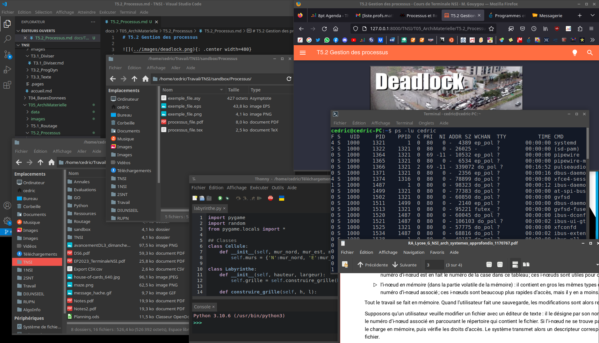
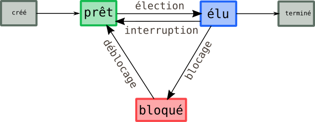

# T5.2 Gestion des processus

{{ initexo(0) }}


{: .center width=480} 

## 1. Notion de processus

Au moment où j'écris ce cours sur mon PC de bureau, j'ai plusieurs fenêtres d'ouvertes (petite sélection ci-dessous).

{: .center width=640} 


Chaque fenêtre est l'affichage graphique d'un programme que j'ai «lancé» ou plutôt exécuté, par exemple:

- un éditeur pour écrire le cours
- un navigateur pour le visualiser, lire mes mails, consulter des pages web pour trouver des ressources, écouter de la musique...
- un éditeur Python resté ouvert après avoir trouvé l'erreur du code de vendredi sur les labyrinthes
- un visionneur de documents PDF
- un terminal pour tester les commandes de ce thème
- deux gestionnaires de fichiers


 Pour chaque exécution d'un programme sur l'ordinateur, le système d'exploitation copie le programme dans la RAM à une adresse inscrite dans les registres du processeur.  Cette **instance d'exécution** du programme s'appelle un **processus**.

!!! abstract "Processus"
    Un processus est identifé par un PID, numéro attribué à sa création par le système d'exploitation.

    Un processus est caractérisé par :

    - l'ensemble des instructions qu'il va devoir accomplir (écrites dans le fichier exécutable obtenu par la compilation du code-source du programme)
    - les ressources que le programme va mobiliser (fichier en ouverture, carte son, connexion réseau...)
    - l'état des registres du processeur (voir [l'architecture de Von Neumann](https://fr.wikipedia.org/wiki/Architecture_de_von_Neumann){:target="_blank"} )

Plusieurs processus peuvent être associés à un même programme (c'est le cas du gestionnaire de fichiers sur mon PC), ils occupent alors des espaces mémoire différents.

!!! code "Observation des processus sous Linux"
    === "La commande `ps`"
        La commande `ps` (comme *process status*) permet d'afficher dans un terminal la liste des processus actifs. On l'utilise avec les option `l` pour obtenir tous les renseignements et `u` pour préciser l'utilisateur propriétaire des processus.

        !!! example "{{ exercice() }}"
            Dans un terminal, tapez la commande `ps -lu nsi` et retrouver le sens des colonnes `S`, `PID`, `PPID` et `CMD`
            

        ??? note "Exemple et signification"

            - `PID` est le *process identifier* : un entier attribué par le système d'exploitation
            - `PPID` est le *parent process identifier* : l'identifiant du parent qui a engendré le processus
            - `S` indique le statut du processus (`S` pour *stopped* et `R` pour *running*)
            - `CMD` est le nom de la commande qui a créé le processus
            ```console
            cedric@cedric-PC:~$ ps -lu cedric
            F S   UID     PID    PPID  C PRI  NI ADDR SZ WCHAN  TTY          TIME CMD
            4 S  1000    1310       1  0  80   0 -  4389 ep_pol ?        00:00:00 systemd
            5 S  1000    1311    1310  0  80   0 - 42400 -      ?        00:00:00 (sd-pam)
            0 S  1000    1317    1310  0  69 -11 - 10532 ep_pol ?        00:00:00 pipewire
            0 S  1000    1318    1310  0  80   0 -  6534 ep_pol ?        00:00:00 pipewire-m
            0 S  1000    1319    1310  0  69 -11 - 142331 do_pol ?       00:00:00 pulseaudio
            0 S  1000    1324    1310  0  80   0 -  2258 ep_pol ?        00:00:00 dbus-daemo
            4 S  1000    1326    1305  0  80   0 - 78896 do_pol ?        00:00:00 xfce4-sess
            1 S  1000    1429       1  0  80   0 - 115692 do_pol ?       00:00:00 ibus-daemo
            0 S  1000    1439    1310  0  80   0 - 77383 do_pol ?        00:00:00 at-spi-bus
            0 S  1000    1450    1310  0  80   0 - 60851 do_pol ?        00:00:00 gvfsd
            0 S  1000    1453    1439  0  80   0 -  2142 ep_pol ?        00:00:00 dbus-daemo
            0 S  1000    1457    1310  0  80   0 - 57778 do_pol ?        00:00:00 xfconfd
            0 S  1000    1466    1310  0  80   0 - 40704 do_pol ?        00:00:00 at-spi2-re
            0 S  1000    1468    1310  0  80   0 - 95221 futex_ ?        00:00:00 gvfsd-fuse
            0 S  1000    1474    1429  0  80   0 - 60045 do_pol ?        00:00:00 ibus-dconf
            0 S  1000    1478    1429  0  80   0 - 106103 do_pol ?       00:00:00 ibus-ui-gt
            0 S  1000    1481    1429  1  80   0 - 68816 do_pol ?        00:00:01 ibus-exten
            0 S  1000    1485       1  0  80   0 - 49190 do_pol ?        00:00:00 ibus-x11
            0 S  1000    1487    1310  0  80   0 - 58199 do_pol ?        00:00:00 xfce4-scre
            0 S  1000    1491    1310  0  80   0 - 60024 do_pol ?        00:00:00 ibus-porta
            0 S  1000    1528    1310  0  80   0 - 101344 do_pol ?       00:00:00 xdg-deskto
            1 S  1000    1538       1  0  80   0 - 97827 do_pol ?        00:00:00 gnome-keyr
            0 S  1000    1541    1326  1  80   0 - 117383 do_pol ?       00:00:00 xfwm4
            0 S  1000    1563    1310  0  80   0 - 116509 do_pol ?       00:00:00 xdg-docume
            0 S  1000    1570    1310  0  80   0 - 59709 do_pol ?        00:00:00 xdg-permis
            0 S  1000    1579    1310  0  80   0 - 86782 do_pol ?        00:00:00 xdg-deskto
            0 S  1000    1592    1429  0  80   0 - 41586 do_pol ?        00:00:00 ibus-engin
            0 S  1000    1609    1326  0  80   0 - 58769 do_pol ?        00:00:00 xfsettings
            0 S  1000    1647    1326  0  80   0 - 118593 do_pol ?       00:00:00 xfce4-pane
            0 S  1000    1651    1326  0  80   0 - 86365 do_pol ?        00:00:00 Thunar
            0 S  1000    1656    1326  0  80   0 - 123972 do_pol ?       00:00:00 xfdesktop
            0 S  1000    1666    1326  0  80   0 - 87346 do_pol ?        00:00:00 xfce4-clip
            0 S  1000    1670    1310  0  99  19 - 142146 do_pol ?       00:00:00 tumblerd
            1 S  1000    1671       1  0  80   0 -  3225 do_pol ?        00:00:00 xcape
            0 S  1000    1674    1326  0  80   0 - 124064 do_pol ?       00:00:00 update-not
            0 S  1000    1676    1326  0  80   0 - 47524 do_pol ?        00:00:00 polkit-gno
            0 S  1000    1680    1326  0  80   0 - 15702 do_pol ?        00:00:00 applet.py
            0 S  1000    1685    1326  0  80   0 - 126155 do_pol ?       00:00:00 nm-applet
            0 S  1000    1686    1326  0  80   0 - 59959 do_pol ?        00:00:00 agent
            0 S  1000    1689    1326  0  80   0 - 49261 do_pol ?        00:00:00 xfce4-powe
            0 S  1000    1698    1326  0  80   0 - 126367 do_pol ?       00:00:00 kdeconnect
            0 S  1000    1712    1326  0  80   0 - 195837 do_pol ?       00:00:00 xiccd
            0 S  1000    1735    1326  0  80   0 - 63761 do_pol ?        00:00:00 ayatana-in
            0 S  1000    1737    1310  0  80   0 - 66229 do_pol ?        00:00:00 xfce4-noti
            0 S  1000    1765    1310  0  80   0 - 79720 do_pol ?        00:00:00 gvfs-udisk
            0 S  1000    1782    1310  0  80   0 - 59848 do_pol ?        00:00:00 gvfs-goa-v
            0 S  1000    1787    1310  0  80   0 - 79491 do_pol ?        00:00:00 gvfs-afc-v
            0 S  1000    1792    1310  0  80   0 - 59797 do_pol ?        00:00:00 gvfs-mtp-v
            0 S  1000    1798    1310  0  80   0 - 60069 do_pol ?        00:00:00 gvfs-gphot
            0 S  1000    1809    1647  0  80   0 - 101142 do_pol ?       00:00:00 panel-12-i
            0 S  1000    1810    1647  0  80   0 - 149060 do_pol ?       00:00:00 panel-30-p
            0 S  1000    1811    1647  0  80   0 - 86407 do_pol ?        00:00:00 panel-31-s
            4 S  1000    2068    1647  4  80   0 - 9593857 do_pol ?      00:00:01 code
            0 S  1000    2071    2068  0  80   0 - 8439921 do_pol ?      00:00:00 code
            4 S  1000    2072    2068  0  80   0 - 8439919 do_wai ?      00:00:00 code
            1 S  1000    2074    2072  0  80   0 - 8439919 do_pol ?      00:00:00 code
            0 S  1000    2087       1  0  80   0 - 8393934 ep_pol ?      00:00:00 chrome_cra
            1 S  1000    2102    2071  4  80   0 - 8489213 do_pol ?      00:00:01 code
            1 S  1000    2111    2102  0  80   0 - 8455671 skb_wa ?      00:00:00 code
            0 S  1000    2118    2068  0  80   0 - 8454311 futex_ ?      00:00:00 code
            0 S  1000    2139    2068 19  80   0 - 14278157 futex_ ?     00:00:08 code
            0 S  1000    2175    2068  6  80   0 - 9542674 ep_pol ?      00:00:02 code
            0 S  1000    2189    2068  7  80   0 - 11655640 futex_ ?     00:00:02 code
            0 S  1000    2203    2189  1  80   0 - 9542663 ep_pol ?      00:00:00 code
            0 S  1000    2240    2189  0  80   0 - 9542629 ep_pol ?      00:00:00 code
            4 S  1000    2248    1647 18  80   0 - 761314 do_pol ?       00:00:07 firefox
            4 S  1000    2318    2248  0  80   0 - 50981 do_pol ?        00:00:00 Socket Pro
            4 S  1000    2363    2248  0  80   0 - 601385 do_pol ?       00:00:00 Privileged
            4 S  1000    2404    2248  3  80   0 - 4857744 do_pol ?      00:00:01 WebExtensi
            4 S  1000    2448    2248  2  80   0 - 618721 do_pol ?       00:00:00 Isolated W
            0 S  1000    2513    2203  0  80   0 -  3492 do_sel pts/0    00:00:00 bash
            0 S  1000    2530    2203  0  80   0 -  3492 do_wai pts/1    00:00:00 bash
            0 S  1000    2581    2530 35  80   0 - 180036 futex_ pts/1   00:00:09 mkdocs
            4 S  1000    2607    2248  0  80   0 - 601744 do_pol ?       00:00:00 Web Conten
            4 S  1000    2610    2248  9  80   0 - 1729401 do_pol ?      00:00:02 Isolated W
            4 S  1000    2692    2248  0  80   0 - 599832 do_pol ?       00:00:00 Web Conten
            4 S  1000    2722    2248  0  80   0 - 599832 do_pol ?       00:00:00 Web Conten
            0 S  1000    2767    2175  1  80   0 - 9530216 ep_pol ?      00:00:00 code
            0 S  1000    2785    1310  1  80   0 - 155025 do_pol ?       00:00:00 gcr-prompt
            4 S  1000    2904    2248  2  80   0 - 599832 do_pol ?       00:00:00 Web Conten
            0 S  1000    2928       1  0  80   0 - 10643 hrtime ?        00:00:00 xfce4-mime
            0 R  1000    2929    2928  6  80   0 - 137689 -     ?        00:00:00 xfce4-term
            0 S  1000    2952    2929  0  80   0 -  3486 do_wai pts/2    00:00:00 bash
            4 R  1000    2958    2952  0  80   0 -  3827 -      pts/2    00:00:00 ps
            ```
        
        
    === "La commande `pstree`"
        La commande `pstree` permet d'afficher dans un terminal la liste des processus actifs sous forme d'arborescence.

        !!! example "{{ exercice() }}"
            Testez.
    === "La commande `top`"
        La commande `top` permet de connaître en temps réel la liste des processus, classés par ordre décroissant de consommation de CPU (en pourcentage).

        On ferme `top` par la combinaison de touches `Ctrl-C`.

        !!! example "{{ exercice() }}"
            Testez.

    === "La commande `kill`"
        Lorsqu'un programme ne répond plus, ou bien qui consomme beaucoup trop de ressources, on peut forcer son arrêt à l'aide de la commande `kill` (avec éventuellement l'option `-9` si vraiment besoin).

        {: .center width=320} 

        !!! example "{{ exercice() }}"
            Combien de processus ai-je arrêté avec `kill 2248` ? 

<!-- ## 2. L'ordonnancement

{: .center width=480} 


## 3. Interblocage (deadlock)
 -->
