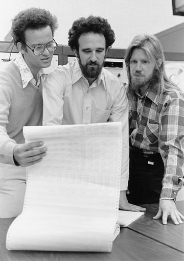

# T5.3 Cryptographie

{{ initexo(0) }}


{: .center width=480} 


## 1. Chiffrement symétrique

!!! history "Brève historique de la cryptographie"
    La *cryptographie* est la discipline qui consiste à chiffrer et déchiffrer des messages afin de les protéger en les rendant secrets. La *cryptanalyse* est la discpline qui analyse les messages chiffrés (appelés aussi *cryptogrammes*) afin de les déchiffrer.

    {: .center width=320} 

    On trouve des utilisations de cryptographie depuis l'antiquité, comme par exemple l'utilisation d'une [scytale](https://fr.wikipedia.org/wiki/Scytale){:target="_blank"} ou encore le célèbre  [chiffre de César](https://fr.wikipedia.org/wiki/Chiffrement_par_d%C3%A9calage){:target="_blank"} vu en classe de première qui consiste à effectuer un décalage des lettres du message, d'un nombre de lettres fixé à l'avance qui constitue la **clé** du système.

    Bien d'autres procédés ont été inventés par la suite (lire à ce sujet l'excellent *Histoire des codes secrets*, de Simon Singh, Le Livre de Poche, disponible à la médiathèque du lycée) à des fins bien souvent militaires qui nécessitaient une grande confidentialité...

    {: .center width=160} 

    En 1586 [Blaise de Vigènere](https://fr.wikipedia.org/wiki/Chiffre_de_Vigen%C3%A8re){:target="_blank"}  met au pont un chiffrement *polyalphabétique* qui résistera près de 3 siècles. Le principe est de choisir une clé (par exemple NSI) et d'utiliser successivement un chiffre de César avec N pour la première lettre, puis un chiffre de César avec S pour la deuxième lettre, puis avec I pour la troisième, puis avec N pour la quatrième, puis avec S pour la cinquième, etc.

    Au XX-ème siècle, l'avènement de l'ordinateur et de sa puissance de calcul a motivé de nombreuses recherches et découvertes dans le domaine de la cryptographie pour réussir à sécuriser non seulement les secrets militaires, mais également les transactions bancaires et plus généralement l'échange de nos données personnelles sur le web...


!!! abstract "Principe d'un chiffrement"
    Un **chiffrement** est la transformation - à l'aide d'un algorithme - d'un texte clair en un texte incompréhensible, dit *chiffré*, à l'aide d'une **clé** de chiffrement.

    {: .center width=640} 

    L'algorithme est la plupart du temps connu, et la sécurité du chiffrement doit résider dans le secret de la clé ( [Principe de Kerckhoffs](https://fr.wikipedia.org/wiki/Principe_de_Kerckhoffs){:target="_blank"}).

    Cette clé peut être la même pour chiffrer et déchiffrer: on parle alors de **chiffrement  symétrique**. Si la clé de chiffrement et la clé de déchiffrement sont différentes, on parle de **chiffrement asymétrique**.

    En pratique la clé est un nombre ou une fonction mathématique. Mais c'est parfois un texte ou une image...


!!! example "{{ exercice() }}: chiffre de César"
    === "Énoncé" 
        1. Combien de clés différentes existe-t-il pour le chiffre de César?
        2. Compléter le code suivant (utiliser les fonctions `#!py ord` et `#!py chr` pour la fonction `#!py decale` :

            ```python linenums='1'
            def decale(lettre:str, cle:int) -> str:
                '''
                Décale une lettre majuscule de cle rangs dans l'alphabet.
                '''
                rang = ...(lettre) - ...(...)
                rang = (rang + ...) % ...
                return ...(rang)


            def chiffre_cesar(phrase:str, cle:int) -> str:
                '''
                Chiffre le texte phrase avec la clé cle et renvoie le texte chiffré
                '''
                texte_chiffre = ""
                for ... in ...:
                    texte_chiffre += ...
                return texte_chiffre

            ```
      
        3. Déchiffrer le message suivant:

            `#!py 'PRZRFFNTRARPBAGVRAGEVRAQVAGRERFFNAGZNVFVYRFGFHSSVFNZRAGYBATCBHEDHRPRFBVGCRAVOYRQRYRQRPUVSSERENYNZNVA'` 

    === "Correction" 
        {{ correction(False, 
        "
        "
        ) }}


!!! example "{{ exercice() }}: masque jetable ou chiffre de Vernam"
    === "Énoncé" 
        Dans le [DL 0001](https://cgouygou.github.io/TNSI/T07_Evaluations/Devoirs_Libres/DL1/){:target="_blank"}, on a vu le principe du chiffre de Vernam, plus communément appelé masque jetable.

        On y avait établi les fonctions:

        ```python linenums='1'
        def xor(a:str, b:str) -> str:
            '''
            revoie le résultat d'un XOR (ou exclusif) entre les caractères
            a et b, après conversion en code Unicode
            '''
            return chr(ord(a) ^ ord(b))

        def masque_jetable(chaine:str, cle:str) -> str:
            '''
            Chiffre la chaine de caractère chaine selon le chiffre de
            Vernam avec la clé cle.
            '''
            texte_chiffre = ''
            for k in range(len(chaine)):
                texte_chiffre += xor(chaine[k], cle[k%len(cle)])
            return texte_chiffre
        ```

        Déchiffrer le message : `#!py "\x0c!(8<en\x12%/=i\x1a&;'=.n ,<2 :s/'6;n7,n%&; h"` sachant que la clé comporte trois lettres majuscules et que c'est moi qui l'ai choisie...
        
    === "Correction" 
        {{ correction(False, 
        "
        "
        ) }}

Dans le cas du masque jetable, si la clé (le masque) est aussi longue que le texte clair, alors il est **impossible** de retrouver le texte initial! En revanche, il faut impérativement changer le masque à chaque utilisation (d'où le terme jetable).


!!! info "Avantage et inconvénient d'un chiffrement symétrique"
    - **Avantage**: Les chiffrements symétriques sont souvent rapides, consommant peu de ressources et donc adaptés au chiffrement de flux important d'informations.

        Comme nous le verrons, la sécurisation des données transitant par le protocole https est basée sur un chiffrement symétrique.

    - **Inconvénient**: La clé ! Si deux personnes (Alice et Bob dans la suite du cours) ont besoin d'utiliser un chiffrement pour se parler, comment peuvent-ils échanger leurs clés puisque leur canal de transmission n'est pas sûr ?

        Le chiffrement symétrique impose qu'Alice et Bob aient pu se rencontrer physiquement au préalable pour convenir d'une clé secrète, ou bien qu'ils aient réussi à établir une connexion sécurisée pour s'échanger cette clé.


#### Quels sont les chiffrements symétriques modernes ?
L'algorithme de chiffrement symétrique le plus utilisé actuellement est le chiffrement [AES](https://fr.wikipedia.org/wiki/Advanced_Encryption_Standard){:target="_blank"}, pour Advanced Encryption Standard.

- chiffrement par bloc de 128 bits, répartis dans une matrice de 16 octets (matrice carrée de taille 4).
- ces 128 bits sont transformés par des rotations, multiplications, transpositions, [...] de la matrice initiale, en faisant intervenir dans ces transformations une clé de 128, 192 ou 256 bits.
- pour l'AES-256 (avec une clé de 256 bits), l'attaque par force brute nécessiterait $2^{256}$ opérations, soit un nombre à 78 chiffres...
- il n'existe pas d'attaque connue efficace à ce jour. Les seules attaques sont des attaques sur des faiblesses d'implémentation, ou par [canal auxiliaire](https://fr.wikipedia.org/wiki/Attaque_par_canal_auxiliaire){:target="_blank"}.


## 2. Chiffrement asymétrique

Bien que certains chiffrements symétriques sont efficaces, ils sont vulnérables si la clé est connue puisqu'elle sert également à déchiffrer. Parfois la clé de déchiffrement n'est pas exactement la même (comme dans le chiffre de César, où si $n$ est la clé pour chiffrer alors on déchiffre avec $-n$ ou $26-n$) mais elle se déduit de façon très simple de la clé de chiffrement.

Pour résoudre le problème de l'échange des clés, Whitfield Diffie et Martin Hellman (chercheurs à Stanford) proposent en 1976 un protocole qui repose en partie sur une information connue de tous et en partie sur une information gardée secrète par Alice et Bob...

{: .center width=320} 

<center>
Photo de Whitfield Diffie (à droite), Martin Hellman (au centre) et Ralph Merkle (à gauche) prise en 1977
<br/>
Crédit: Stanford News Service
</center>


### 2.1 Échange de clés de Diffie-Hellman

!!! gear "Principe"
    L'analogie la plus courante pour illustrer le protocole d'échange de clés de Diffie-Hellman est celui des pots de peinture: il est facile de mélanger deux peintures de couleurs différentes mais le contraire est impossible.

    {: .center width=320} 

    === "Étape 1"
        Alice et Bob s'entendent sur une couleur (le jaune) et se la partagent publiquement.

    === "Étape 2"
        Alice et Bob choisissent secrètement chacun une couleur: le magenta pour Alice et le cyan pour Bob, puis ils mélangent leur couleur avec la couleur commune.

    === "Étape 3"    
        Ils s'échangent publiquement les couleurs obtenues (orange et bleu). Même si Ève intercepte ces couleurs, elle ne peut pas les séparer!

    === "Étape 4"
        Alice mélange sa couleur secrète (magenta) avec le mélange de Bob, et Bob fait de même avec la sienne et le mélange d'Alice. Au final, ils obtiennent le même mélange: c'est la clé !

En pratique, on n'utilise pas des pots de peinture (ça ne passe pas par la fibre ou la wifi) mais des fonctions mathématiques et des nombres entiers (très grands). L'idée de Diffie-Hellman est d'utiliser des fonctions de la forme $x \rightarrow k^x \ (\text{mod}\ p)$ et utilisent les propriétés de l'*arithmétique modulaire*.

!!! info "Arithmétique modulaire"
    Faire des calculs *modulo* un entier $n$, c'est ne garder que le reste de la division euclidienne par $n$.

    Le fait que 15 soit égal à 1 modulo 7 (car $15=2 \times 7+1$) s'écrira $15 \equiv 1 \ (\text{mod}\ 7)$.

    De même, $10 \equiv  3 \ (\text{mod}\ 7)$, $25 \equiv 4 \ (\text{mod}\ 7)$, $32 \equiv 2 \ (\text{mod}\ 10)$, etc.

En effet, s'il est assez simple de calculer une puissance «modulo p», il est en revanche compliqué de faire l'inverse (prendre le logarithme discret) car on ne connaît pas d'algorithme efficace pour certaines grandes valeurs de p. Cette arithmétique fournit donc d'assez bonnes fonctions «à sens unique» ([fontion à trappe](https://fr.wikipedia.org/wiki/Fonction_%C3%A0_trappe){:target="_blank"}).


!!! example "{{ exercice() }}"
    === "Énoncé" 
        Alice et Bob choisissent d'utiliser la fonction $f(x) = 7^x \ (\text{mod}\ 11)$. C'est le jaune.

        1. Alice choisit un nombre $A=3$ et le garde secret (c'est le magenta). Elle calcule $\alpha = f(A)$ (le orange) et l'envoie à Bob. Que reçoit Bob?
        2. Bob choisit un nombre $B=6$ et le garde secret (c'est le cyan). Il calcule $\beta = f(B)$ (le bleu) et l'envoie à Alice. Que reçoit Alice?
        3. Alice reçoit $\beta$ de Bob et calcule $\beta^A \ (\text{mod}\ 11)$. Bob reçoit $\alpha$ d'Alice et calcule $\alpha^B \ (\text{mod}\ 11)$. Quelle est la clé échangée?
    === "Correction" 
        {{ correction(False, 
        "
        "
        ) }}

Deux inconvénients majeurs résident cependant dans ce protocole:

- il nécessite plusieurs échanges entre Alice et Bob;
- il faut qu'ils soient tous les deux disponibles pour faire ces échanges, ce qui peut empêcher un chiffrement immédiat.

### 2.2 Cryptographie à clé publique

Pour pallier à ces inconvénients, Diffie et Hellman imaginent un chiffrement où les clés servant à chiffrer et déchiffrer un message sont différentes: on parle alors de chiffrement asymétrique ou bien de **chiffrement à clé publique**. De plus ces clés ne doivent pas se déduire facilement l'une de l'autre: il faut utiliser une sorte de fonction à sens unique, qui soit simple à utiliser pour chiffrer, mais très difficile à inverser pour déchiffrer.

Le principe de base est l'existence d'une clé *publique*, appelée à être distribuée largement, et d'une clé *privée*, qui ne quitte jamais son propriétaire. 

{: .center width=320}     

!!! gear "Principe"
    === "Étape 1"
        Alice fabrique une clé publique (le cadenas) et une clé privée (la clé du cadenas). Elle diffuse la clé à Bob (en réalité, à tout le monde, d'où le terme *clé publique*).

        {: .center width=480} 

    === "Étape 2"
        À l'aide de la clé publique d'Alice, Bob peut chiffrer son message et l'envoyer à Alice. Une fois son message chiffré, Bob lui-même ne peut pas revenir en arrière et déchiffrer son propre message puisqu'il ne connaît pas la clé privée d'Alice.


        {: .center width=480}

    === "Étape 3"
        Grâce à sa clé privée, Alice peut déchiffrer et ouvrir le message qui lui est adressé.

        {: .center width=320}


!!! question "Pourquoi ça marche?"
    <!-- On peut se demander quelle est la différence avec un chiffrement symétrique. -->

    Les clés sont des fonctions mathématiques (ou même simplement des nombres très grands): une fonction $P$ qui permet de chiffrer les messages et sa fonction *inverse* $S$ qui permet de déchiffrer, c'est-à-dire que $S(P(\text{message})) = \text{message}$.
    
    On peut fabriquer simultanément un couple $(P,S)$, mais connaissant uniquement $P$, il est impossible (ou au moins très difficile) de retrouver $S$. Et réciproquement.

    La connaissance de $P$ par un tiers ne compromet donc pas la sécurité de l'envoi des messages codés, puisqu'elle ne permet pas de retrouver $S$. Il est possible de donner librement $P$, qui mérite bien son nom de clé publique. 

    Enfin, il faut comprendre que ces clés ont un **rôle interchangeable**: on peut très bien chiffrer avec la clé privée et déchiffrer avec la clé publique (on verra plus loin dans le cours une utilisation de cette inversion).


### 2.3 Authentification: le double cadenas

Dans la situation du 2.2, Alice (qui a distribué largement sa clé publique) ne peut pas s'assurer que le message vient bien de Bob. Il peut avoir été créé par Ève, qui signe «Bob» et usurpe ainsi son identité. 

Le protocole - appelé signature électronique - que nous allons décrire ci-dessous permet :

- d'empêcher qu'un message intercepté soit déchiffré (ce qui était déjà le cas dans le 2.1)
- mais aussi de s'assurer que chaque personne est bien celle qu'elle prétend être : on résout le **problème d'authentification**.

!!! gear "Principe"

    Alice possède le couple clé publique/clé privée $(P_A, S_A)$ et Bob le couple $(P_B, S_B)$. Alice veut envoyer à Bob le message M.

    - **Phase d'envoi:** Alice chiffre M avec sa **clé privée** $S_A$, c'est-à-dire qu'elle calcule $M'=S_A(M)$. Puis elle chiffre $M'$ avec la clé publique de Bob: elle envoie à Bob $M''=P_B(M') = P_B(S_A(M))$.

    - **Phase de réception:** À l'aide de sa clé privée S_B, Bob déchiffre $M''$, c'est-à-dire qu'il calcule $S_B(M'') =S_B(P_B(M')) = M'$. **Seul lui peut effectuer ce calcul**, d'où la sécurité de l'envoi, Ève ne peut rien faire du message $M''$ envoyé par Alice.

        Il calcule ensuite $P_A(M')=P_A(S_A(M))=M$. **Il est alors sûr que c'est Alice** qui lui a envoyé ce message, car elle seule a pu calculer $S_A(M)$.

    {: .center width=480} 

    **En résumé :**

    - Alice est sûre que seul Bob pourra déchiffrer le message qu'elle envoie.
    - Bob est sûr que le message qu'il reçoit vient bien d'Alice.


Ce protocole, s'il est fiable, est lent puisque deux fois plus lent qu'un algorithme à clé publique (lui-même déjà très lent!). En outre, il ne garantit pas l'intégrité du message, c'est-à-dire que celui-ci n'est pas altéré par des erreurs de transmission. L'utilisation des fonctions de hachage résout ces problèmes.

Supposons qu'Alice et Bob disposent d'une fonction de hachage $h$ (SHA-256 par exemple):

- **Phase d'envoi:** Alice calcule $h(M)$ - le condensé - et envoie à Bob $P_B(M)$ (calculé à l'aide de la clé publique de Bob) accompagné de $S_A(h(M))$. 

- **Phase de réception:** Bob calcule $S_B(P_B(M))=M'$. Puis il calcule $P_A(S_A(h(M)))$, qu'il compare à $h(M')$. Si les quantités sont égales, il est sûr que c'est bien Alice qui a envoyé le message, et que celui-ci a été correctement transmis. 


## 3. Chiffrement RSA

Lorsqu'en 1976 Diffie et Hellman présentent le concept de chiffrement asymétrique, ils en proposent uniquement un modèle théorique, n'ayant pas trouvé une réelle implémentation de leur protocole.

Trois chercheurs du MIT (Boston), Ron Rivest, Adi Shamir et Len Adleman se penchent alors sur ce protocole, convaincus qu'il est en effet impossible d'en trouver une implémentation pratique. En 1977, au cours de leurs recherches, ils démontrent en fait l'inverse de ce qu'ils cherchaient : ils créent le premier protocole concret de chiffrement asymétrique : le chiffrement **RSA**.


{: .center width=480}
<center>
De gauche à droite: Adi Shamir, Ron Rivest, Len Adleman
</center>

Au même moment à Londres, Clifford Cocks, (chercheur au très secret [GCHQ](https://fr.wikipedia.org/wiki/Government_Communications_Headquarters){:target="_blank"}) apprend que Rivest Shamir et Adleman viennent de découvrir ce que lui-même a découvert **3 ans auparavant** mais qui est resté classé Secret Défense.

Il est le véritable inventeur du RSA... mais le reste du monde ne l'apprendra qu'en 1997 au moment de la déclassification de cette information. 

{: .center width=480}

!!! gear "Principe"

    Le chiffrement RSA est basé sur *l'arithmétique modulaire*. 


    === "Étape 1"
        Alice choisit 2 grands nombres premiers $p$ et $q$. Dans la réalité ces nombres seront vraiment très grands (plus de 100 chiffres). Dans notre exemple, nous prendrons $p = 3$ et $q = 11$.

    === "Étape 2"
        Alice multiplie ces deux nombres $p$ et $q$ et obtient ainsi un nombre $n$.

        > Il est très facile pour Alice de calculer $n$ en connaissant $p$ et $q$, mais il  extrêmement difficile pour Ève de faire le travail inverse car trouver $p$ et $q$ en connaissant $n$ prend un temps **exponentiel** avec la taille de $n$.  
        C'est sur cette difficulté (appelée difficulté de *factorisation*) que repose la robustesse du système RSA.
    
    === "Étape 3"
        Alice choisit un nombre $e$ qui doit être premier avec $(p-1)(q-1)$.  On note $\phi(n)$ le nombre $(p-1)(q-1)$.

        Dans notre exemple, $(p-1)(q-1) = 20$, Alice choisit donc $e = 3$. (mais elle aurait pu aussi choisir 7, 9, 13...).

        Le couple $(e, n)$ sera **la clé publique** d'Alice. Elle la diffuse à qui veut lui écrire.

        Dans notre exemple, la clé publique d'Alice est $(3, 33)$.

    === "Étape 4"
        Alice calcule maintenant sa clé privée : elle doit trouver un nombre *d* qui vérifie l'égalité $e \times d \equiv 1 \ (\text{mod}\ \phi(n))$.

        Dans notre exemple, comme $7 \times 3  \equiv 1 \ (\text{mod}\ 20)$, ce nombre $d$ est égal à 7.

        En pratique, il existe un algorithme simple (algorithme d'[Euclide étendu](https://fr.wikipedia.org/wiki/Algorithme_d%27Euclide_%C3%A9tendu){:target="_blank"}) pour trouver cette valeur $d$, appelée *inverse de e* modulo $\phi(n)$.

        Le couple $(d, n)$ sera **la clé privée** d'Alice. Elle ne la diffuse à personne.

        Dans notre exemple, la clé privée d'Alice est $(7, 33)$.

    === "Étape 5"
        Supposons que Bob veuille écrire à Alice pour lui envoyer le nombre 4. 
        Il possède la clé publique d'Alice, qui est $(3, 33)$.

        Il calcule donc $4^3$ modulo 33, qui vaut 31. C'est cette valeur 31 qu'il transmet à Alice.

        $$4^3 \equiv 31 \ (\text{mod}\ 33)$$

        > Si Ève intercepte cette valeur 31, même en connaissant la clé publique d'Alice (3,33), elle ne peut pas résoudre l'équation $x^3 \equiv 31 \ (\text{mod}\ 33)$ de manière efficace.

    === "Étape 6"
        Alice reçoit la valeur 31.  
        Il lui suffit alors d'élever 31 à la puissance 7 (sa clé privée), et de calculer le reste modulo 33 :

        $31^7 = 27512614111$

        $27512614111 \equiv 4 \ (\text{mod}\ 33)$

        Elle récupère la valeur 4, qui est bien le message original de Bob.

!!! question "Comment ça marche ?"
    Grâce au [Petit Théorème de Fermat](https://fr.wikipedia.org/wiki/Petit_th%C3%A9or%C3%A8me_de_Fermat){:target="_blank"}, on démontre (voir [ici](https://fr.wikipedia.org/wiki/Chiffrement_RSA){:target="_blank"}) assez facilement que $M^{ed} \equiv M [n]$.
    Il faut remarquer que $M^{ed} = M^{de}$. On voit que les rôles de la clé publique et de la clé privée sont **symétriques** : un message chiffré avec la clé publique se déchiffrera en le chiffrant avec la clé privée, tout comme un message chiffré avec la clé privée se déchiffrera en le chiffrant avec la clé publique.

**Animation interactive**
voir [https://animations.interstices.info/interstices-rsa/rsa.html](https://animations.interstices.info/interstices-rsa/rsa.html){:target="_blank"}


#### RSA, un système inviolable ?
Le chiffrement RSA a des défauts (notamment une grande consommation des ressources, due à la manipulation de très grands nombres). C'est pourquoi on l'utilise plutôt pour sécuriser l'échange d'une clé d'un chiffrement symétrique (comme AES par exemple).
Mais le choix d'une clé publique de grande taille (actuellement 1024 ou 2048 bits) le rend pour l'instant inviolable. 

Actuellement, il n'existe pas d'algorithme efficace pour factoriser un nombre ayant plusieurs centaines de chiffres.

Deux évènements pourraient faire s'écrouler la sécurité du RSA :

- la découverte d'un algorithme efficace de factorisation, capable de tourner sur les ordinateurs actuels. Cette annonce est régulièrement faite, et tout aussi régulièrement contredite par la communauté scientifique. (voir, le 05/03/2021,  [https://www.schneier.com/blog/archives/2021/03/no-rsa-is-not-broken.html](https://www.schneier.com/blog/archives/2021/03/no-rsa-is-not-broken.html){:target="_blank"})
- l'avènement d'[ordinateurs quantiques](https://fr.wikipedia.org/wiki/Calculateur_quantique){:target="_blank"}, dont la vitesse d'exécution permettrait une factorisation rapide. Il est à noter que l'algorithme de factorisation destiné à tourner sur un ordinateur quantique existe déjà : [l'algorithme de Schor](https://fr.wikipedia.org/wiki/Algorithme_de_Shor){:target="_blank"}.


## 4. HTTPS


## 5. Exercices

!!! example "{{ exercice() }}: Chiffrement affine"
    === "Énoncé" 
        !!! info "Principe"
            - Chaque lettre est codée par son rang dans l'alphabet: A → 0, B → 1, etc.
            - On applique à chaque rang la transformation affine $f(x)=(ax+b)\%26$ où $a$ et $26$ sont deux nombres entiers, **premiers entres eux** (c'est-à-dire n'admettant pas de diviseur commun autre que 1).
        
        1. Écrire une fonction `#!py affine`.
        2. Décoder la phrase `#!py UCGXLODCMOXPMFMSRJCFQOGTCRSUSXC`, sachant qu'elle contient le mot `TRAVAIL` et que $a$ et $b$ sont inférieurs à 20.
    === "Correction" 
        {{ correction(True, 
        "
        ```python linenums='1'
        # 1.
        def affine(msg:str, a:int, b:int) -> str:
            '''
            Renvoie le texte msg chiffré avec la méthode du chiffrement affine avec a, b comme clé.
            '''
            msg_chiffre = ''
            for caractere in msg:
                rang = ord(caractere) - 65
                rang_chiffre = (a*rang + b) % 26
                caractere_chiffre = chr(rang_chiffre + 65)
                msg_chiffre += caractere_chiffre
            return msg_chiffre
        
        # 2.
        def trouve_cle(msg:str, mot:str) -> tuple:
            '''
            Renvoie la clé a, b si le mot chiffré est dans le message msg.
            '''
            for a in range(1, 21):
                for b in range(21):
                    mot_chiffre = affine(mot, a, b)
                    if mot_chiffre in msg:
                        return a, b

        def dico_dechiffrement(a:int, b:int):
            '''
            Construit un dictionnaire de déchiffrement dont les clés sont les lettres
            chiffrées et les valeurs les lettres claires.
            '''
            dico = {}
            for k in range(26):
                caractere = chr(65 + k)
                dico[affine(caractere, a, b)] = caractere
            return dico

        def dechiffre_affine(msg:str, mot:str) -> str:
            '''
            Déchiffre un message chiffré msg connaissant un mot du texte clair.
            '''
            a, b = trouve_cle(msg, mot)
            msg_clair = ''
            d = dico_dechiffrement(a, b)
            for caractere in msg:
                msg_clair += d[caractere]
            return msg_clair
        ```
        
        "
        ) }}
