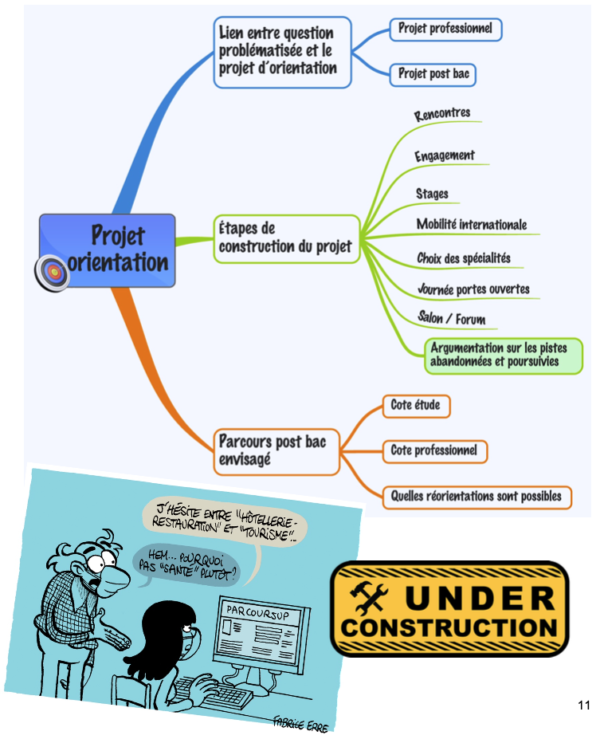

# BAC NSI

## Épreuve écrite

- L'épreuve **écrite** de spécialité NSI dure 3h30.
- Elle comporte **trois** exercices notés chacun sur 4 points, pour un total donc de 12 points.
- Les exercices portent sur les chapitres du programme signalés par **→ BAC** sur la page d'accueil.

## Épreuve pratique

- L'épreuve **pratique** de spécialité NSI dure 1h.
- Elle comporte **deux** exercices de **programmation** notés chacun sur 4 points, pour un total donc de 8 points.
- Vous pouvez retrouver en libre accès tous les sujets de la session 2022 à l'épreuve pratique de NSI: [https://eduscol.education.fr/2661/banque-des-epreuves-pratiques-de-specialite-nsi](https://eduscol.education.fr/2661/banque-des-epreuves-pratiques-de-specialite-nsi){:target="_blank"}.

Ou bien tous les télécharger en [un seul fichier pdf](BNS_2022_total_V2.pdf) (718 ko).

## Grand Oral

=== "Qu'est-ce que c'est?"
    - Vous devez préparer deux sujets, dont au moins un a un rapport avec le programme de NSI. 
    - Ce sujet peut être croisé avec l'autre spécialité.
    - L'oral dure 20 minutes (5 minutes d'exposé et 15 minutes d'échanges avec le jury) après une préparation de 20 minutes.

    {: .center} 

=== "Déroulement de l'épreuve"

    Le support réalisé pendant la préparation (vous avez le droit à 2 feuilles de brouillon) peut être conservé par l’élève et donné au jury (schéma, carte mentale, croquis, etc.).

    {: .center} 

=== "Élaboration de la question"
    ## L’analyse du sujet

    C’est une étape indispensable à la préparation de la recherche documentaire mais aussi pour élaborer votre
    futur plan de votre oral et votre introduction. Pour cela, vous devez :

    - définir les termes et les limites (chrono-spatiales) de votre sujet
    - noter les notions en lien avec votre sujet et auxquelles il faudra faire référence au cours de votre oral
    - noter les idées-clés, dates essentielles, acteurs, etc.

    ## Les références bibliographiques

    La recherche bibliographique est indispensable pour trouver les arguments et exemples nécessaires à votre oral.
    Les outils à disposition :
    
    - Le moteur de recherche E-Sidoc, disponible depuis Lycée connecté qui vous permet ensuite d’avoir accès aux
    richesses de la médiathèque, à l’Encyclopédia Universalis et aux vidéos sélectionnées pour leur fiabilité par l’INA.

        Petit tutoriel pour comprendre comment utiliser E-sidoc : [https://youtu.be/EXnNfcqGT7M](https://youtu.be/EXnNfcqGT7M){:target="_blank"} 
    
    - La médiathèque du lycée : livres, périodiques, usuels (encyclopédies, dictionnaires etc)
    - Médiathèque ou bibliothèque municipale
    - Web : préférez les sites institutionnels aux blogs, les sites de journaux spécialisés, ceux donnés en page d'accueil par ex. (onglet **Liens utiles**).
    

    ## Conseils

    - Varier les sources
    - Vérifier la fiabilité de vos sources
    - Noter vos références afin de retrouver les informations

=== "J'organise mon argumentaire"
    ## Introduction

    Elle doit être soignée car elle donne la 1ère impression sur votre prestation orale. Elle doit
    comporter les éléments suivants :

    - une accroche (ex : un fait d’ actualité en lien avec le sujet etc.)
    - définir les enjeux de votre Question et justifier le choix de votre sujet
    - La QUESTION
    - L’annonce du plan

    ## Conclusion

    Ne pas la négliger car c’est la dernière impression que vous laissez à votre jury. Elle doit
    comporter 
    
    - la réponse claire à votre QUESTION
    - Le bilan de votre argumentation (elle peut comporter une ouverture)
    
    ## Développement
    - Il est composé de parties (2 ou 3) qu’il faut rappeler pour que votre jury puisse suivre votre
    exposé.
    - Chaque partie comporte des sous-parties, chacune d’elles présentant un argument et un
    exemple pour appuyer votre démonstration
    
    
    ### Ne pas oublier qu’il s’agit d’un oral. Penser aussi aux éléments suivants (voir grille d’évaluation) :

    - la voix : être audible avec un débit adapté et fluide
    - le regard : dirigé vers le jury (se détacher de ses notes)
    - la respiration : faire de courtes pauses
    - la posture : debout lors des 5 premières mn (puis vous pouvez vous assoir), droit , souriant
    - la gestuelle : éviter les gestes parasites
    - le vocabulaire/niveau de langue adapté
    - respecter le temps imparti (+/- 30 s)

    {: .center} 

=== "Projet d'orientation"
    Le jury mesure la capacité du candidat à conduire et à exprimer une réflexion personnelle témoignant de sa curiosité
    intellectuelle et de son aptitude à exprimer ses motivations.
    {: .center} 
    
=== "Grille d'évaluation"
    {: .center} 