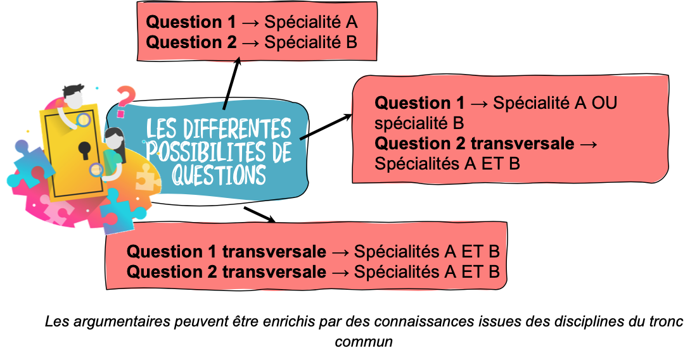
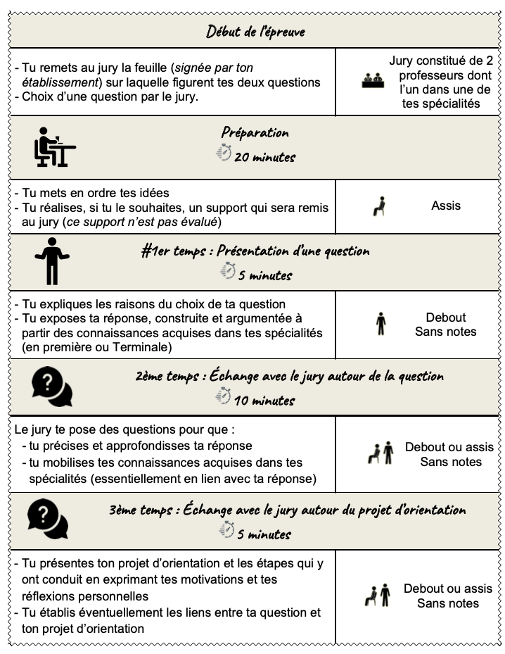
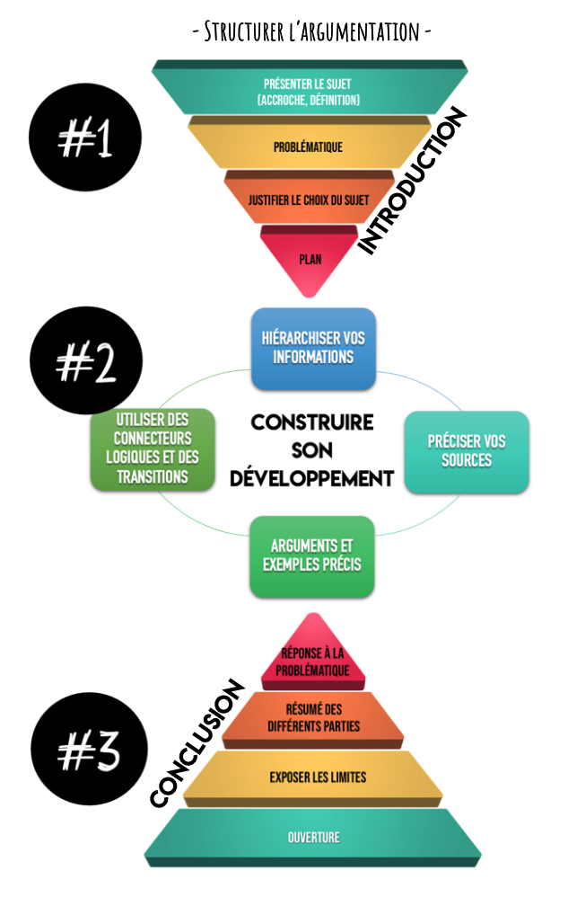
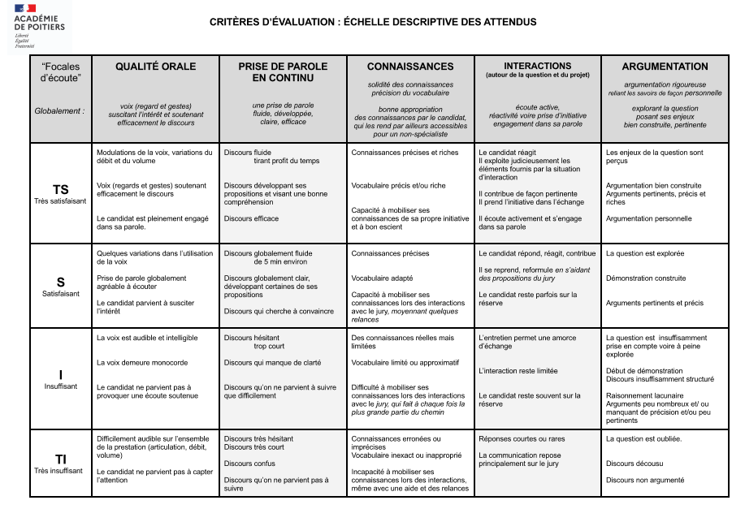

# BAC NSI

!!! info "Nature de l'épreuve"
    L'épreuve terminale obligatoire de spécialité est composée de deux parties : une partie écrite et une partie
    pratique, chacune notée sur 20. La note de la partie écrite a un coefficient de 0,75 et celle de la partie pratique
    a un coefficient de 0,25. La note globale de l’épreuve est donnée sur 20 points.

    ```python linenums='1'
    def note_bac_nsi(note_ecrit:int, note_pratique:int) -> int:
        """
        Calcule la note de spécialité NSI au bac à partir des notes obtenues aux épreuves écrite
        et pratique.
        """
        assert note_ecrit >=0 and note_ecrit <= 20, "note non valide"
        assert note_pratique >=0 and note_pratique <= 20, "note non valide"
        return int(0.75*note_ecrit + 0.25*note_pratique)
    ```
    


## Épreuve écrite

- L'épreuve **écrite** de spécialité NSI dure 3h30.
- Elle comporte **trois** exercices indépendants les uns des autres, portant sur l'intégralité du programme de première et de terminale.

!!! warning "Sujets 2024"
    <span class='centre'>
    [Amérique du Nord Jour 1 :material-download:](data/24_Am_Nord_J1.pdf){.center .md-button }
    [Amérique du Nord Jour 2 :material-download:](data/24_Am_Nord_J2.pdf){.center .md-button }
    </span>
    
    <span class='centre'>
    [Centres étrangers Jour 1 :material-download:](data/24_NSIJ1G1.pdf){.center .md-button }
    [Centres étrangers Jour 2 :material-download:](data/24_NSIJ2G1.pdf){.center .md-button }
    </span>

    <span class='centre'>
    [Asie Jour 1 :material-download:](data/24_Asie_J1.pdf){.center .md-button }
    [Asie Jour 2 :material-download:](data/24_Asie_J2.pdf){.center .md-button }
    </span>


## Épreuve pratique

=== "Qu'est-ce que c'est?"
    - L'épreuve **pratique** de spécialité NSI dure 1h.
    - Elle comporte **deux** exercices de **programmation** sur ordinateur, notés chacun sur 10 points, pour un total donc de 20 points.


=== "Déroulement de l'épreuve"
    Le candidat est évalué sur la base d’un **dialogue** avec un professeur-examinateur. Un examinateur évalue au maximum quatre élèves. L’examinateur ne peut pas évaluer un élève qu’il a eu en classe durant l’année en cours. L’évaluation de cette partie se déroule au cours du deuxième trimestre pendant la période de l’épreuve écrite de spécialité.

    !!! example "Premier exercice"

        Le premier exercice consiste à programmer un algorithme figurant explicitement au programme, ne présentant pas de difficulté particulière, dont on fournit une spécification. Il s’agit donc de restituer un algorithme rencontré et travaillé à plusieurs reprises en cours de formation. Le sujet peut proposer un jeu de test avec les réponses attendues pour permettre au candidat de vérifier son travail.

    !!! example "Deuxième exercice"

        Pour le second exercice, un programme est fourni au candidat. Cet exercice ne demande pas l’écriture complète d’un programme, mais permet de valider des compétences de programmation suivant des modalités variées : le candidat doit, par exemple, compléter un programme « à trous » afin de répondre à une spécification donnée, ou encore compléter un programme pour le documenter, ou encore compléter un programme en ajoutant des assertions, etc.

=== "Banque de sujets"
    
    :new: Vous pouvez retrouver en libre accès les 47 sujets de la session **2024** à l'épreuve pratique de NSI: [https://sujets.examens-coucours.gouv.fr/delos/public/bgt/nsi](https://sujets.examens-coucours.gouv.fr/delos/public/bgt/nsi){:target="_blank"}. **Attention, certains sujets peuvent comporter des erreurs.**

    - Les sujets **2022** à télécharger en [un seul fichier pdf](data/BNS_2022_total_V2.pdf).
    - Les sujets **2023** à télécharger en [un seul fichier pdf](data/BNS_2023_pdf_unique.pdf).
    - Les sujets **2024** à télécharger en [un seul fichier pdf](data/BNS_2024_pdf_unique.pdf).

    ??? info "Exemple: Sujets 2022 par thème"

        |Sujet |Exercice 1 |Exercice 2|
        |:---:|:---:|:---:|
        | sujet 1 |nombre d'occurences |rendu monnaie, algo glouton récursif|
        |sujet 2 |moyenne pondérée |triangle de Pascal|
        |sujet 3 |codage par différence |arithmétique grâce à un arbre binaire|
        |sujet 4 |recherche d'entiers consécutifs |composante d'image binaire|
        |sujet 5 |minimum et maximum d'un tableau |paquet de carte, poo|
        |sujet 6 |indice du maximum et maximum d'un tableau |recherche sous-chaine, ADN|
        |sujet 7 |conversion décimal vers binaire |tri à bulle|
        |sujet 8 |recherche élément dans un tableau |insertion d'un élément dans un tableau trié|
        |sujet 9 |problème 3n+1, suite |mots parfaits|
        |sujet 10 |occurence de caractères dans une phrase |fusion de liste triées|
        |sujet 11 |recherche dichotomique |codage de César|
        |sujet 12 |moyenne d'un tableau |tri tableau de 0 et 1|
        |sujet 13 |rendu monaie, algorithme glouton |file avec liste chainée|
        |sujet 14 |mots à trou |envois de messages, cycles|
        |sujet 15 |nombre de répétitions (occurences) dans un tableau |conversion décimale vers binaire|
        |sujet 16 |indice du maximum et maximum d'un tableau |extraction des entiers positifs d'une pile|
        |sujet 17 |nombre de mots dans une phrase |parcours et recherche dans un ABR|
        |sujet 18 |minimum de deux tableaux liés |nombre palindrome|
        |sujet 19 |multiplication avec addition et soustraction |recherche dans un sous-tableau trié|
        |sujet 20 |ou exclusif de deux tableaux |carré magique|
        |sujet 21 |multiplication avec addition et soustraction |recherche par dichotomie|
        |sujet 22 |renverser une chaîne de caractères |nombres premiers, crible d'Ératosthène|
        |sujet 23 |likes dans un réseau social, dictionnaires |notation postfixe des expression arithmétiques|
        |sujet 24 |maximum d'un tableau |parenthésage, piles|
        |sujet 25 |animaux dans un refuge, dictionnaires |trouver l'intrus dans un tableau|
        |sujet 26 |indice du minimum d'un tableau |tri d'un tableau de 0 et 1|
        |sujet 27 |taille d'un arbre binaire, dictionnaires |tri par sélection (itératif)|
        |sujet 28 |moyenne d'un tableau |conversion décimal vers binaire|
        |sujet 29 |suite de Fibonnaci sans récursivité |listes liées de notes et d'élèves, maximum|
        |sujet 30 |fusion de deux tableaux triés |conversion chiffres romains vers décimal|
        |sujet 31 |nombre d'occurrence dans un tableau (float ou int) |rendu monaie, algorithme glouton|
        |sujet 32 |indice d'un élément dans un tableau |adresses IP, POO|
        |sujet 33 |conversion binaire vers décimal, tableaux |tri par insertion|
        |sujet 34 |maximum d'occurences dans une chaine de caractères |image, pixels, négatif|
        |sujet 35 |moyenne d'un tableau avec assertions |recherche par dichotomie dans un tableau trié|
        |sujet 36 |indice de dernière occurence d'un entier dans un tableau |distance entre points|
        |sujet 37 |vérification du tri d'un tableau |comptage des votes dans un tableau|
        |sujet 38 |tri par sélection |jeu du plus ou moins|
        |sujet 39 |moyenne d'un tableau |zoom sur dessin|
        |sujet 40 |recherche dans un tableau, tableau d'indices |moyenne pondérée, dictionnaires |


=== "Grille d'évaluation"
    |Critères d'évaluation |	Définition du critère |	Très insuffisant |	Insuffisant |	Satisfaisant |	Très satisfaisant|
    |:------|:------|:------|:------|:------|:------|
    |Connaissance des savoir-faire techniques |	Connaissance des concepts de base |	Besoin permanent d'assistance | 	A besoin de consignes complémentaires et d'assistance ponctuelle |	A rarement besoin de consignes complémentaires 	|Travaille de façon autonome|
    |Qualité de mise en œuvre 	|Niveau de conformité des opérations réalisées |	Fait fréquemment des erreurs, exige une surveillance permanente 	|Produit un travail qu'il faut contrôler régulièrement |	Fait des erreurs minimes qu'il ou elle parvient à verbaliser et propose des solutions |	Travaille sans erreur|
    |Qualité du dialogue 	|Justification |	Pas de réponse |	Pas clair 	|Relativement clair mais manque parfois de précision |	Démontre une capacité à reformuler pour bien se faire comprendre|

## Grand Oral

=== "Qu'est-ce que c'est?"
    - Vous devez préparer deux sujets, dont au moins un a un rapport avec le programme de NSI. 
    - Ce sujet peut être croisé avec l'autre spécialité.
    - L'oral dure 20 minutes (10 minutes d'exposé et 10 minutes d'échanges avec le jury) après une préparation de 20 minutes. Le candidat a la possibilité d’utiliser un tableau durant le second temps de l’épreuve.
    - L'épreuve représente un coefficient 10 au bac général.

    {: .center} 

=== "Déroulement de l'épreuve"

    Le support réalisé pendant la préparation (vous avez le droit à plusieurs feuilles de brouillon) peut être conservé par l’élève et donné au jury (schéma, carte mentale, croquis, etc.).

    {: .center} 

=== "Élaboration de la question"
    !!! gear "L’analyse du sujet"

        C’est une étape indispensable à la préparation de la recherche documentaire mais aussi pour élaborer votre
        futur plan de votre oral et votre introduction. Pour cela, vous devez :

        - définir les termes et les limites (chrono-spatiales) de votre sujet
        - noter les notions en lien avec votre sujet et auxquelles il faudra faire référence au cours de votre oral
        - noter les idées-clés, dates essentielles, acteurs, etc.

    !!! link "Les références bibliographiques"

        La recherche bibliographique est indispensable pour trouver les arguments et exemples nécessaires à votre oral.
        Les outils à disposition :
        
        - Le moteur de recherche E-Sidoc, disponible depuis Lycée connecté qui vous permet ensuite d’avoir accès aux
        richesses de la médiathèque, à l’Encyclopédia Universalis et aux vidéos sélectionnées pour leur fiabilité par l’INA.

            Petit tutoriel pour comprendre comment utiliser E-sidoc : [https://youtu.be/EXnNfcqGT7M](https://youtu.be/EXnNfcqGT7M){:target="_blank"} 
        
        - La médiathèque du lycée : livres, périodiques, usuels (encyclopédies, dictionnaires etc)
        - Médiathèque ou bibliothèque municipale
        - Web : préférez les sites institutionnels aux blogs, les sites de journaux spécialisés, ceux donnés en page d'accueil par ex. (onglet **Liens utiles**).
    

    !!! tip "Conseils"

        - Varier les sources
        - Vérifier la fiabilité de vos sources
        - Noter vos références afin de retrouver les informations

=== "J'organise mon argumentaire"
    !!! note "Introduction"
        Elle doit être soignée car elle donne la 1ère impression sur votre prestation orale. Elle doit
        comporter les éléments suivants :

        - une accroche (ex : un fait d’ actualité en lien avec le sujet etc.)
        - définir les enjeux de votre Question et justifier le choix de votre sujet
        - La QUESTION
        - L’annonce du plan

    !!! note "Développement"
        - Il est composé de parties (2 ou 3) qu’il faut rappeler pour que votre jury puisse suivre votre
        exposé.
        - Chaque partie comporte des sous-parties, chacune d’elles présentant un argument et un
        exemple pour appuyer votre démonstration
    
    !!! note "Conclusion"
        Ne pas la négliger car c’est la dernière impression que vous laissez à votre jury. Elle doit
        comporter 
        
        - la réponse claire à votre QUESTION
        - Le bilan de votre argumentation (elle peut comporter une ouverture)
    
    
    !!! info "Ne pas oublier qu’il s’agit d’un oral !"
        Penser aussi aux éléments suivants (voir grille d’évaluation) :

        - la voix : être audible avec un débit adapté et fluide
        - le regard : dirigé vers le jury (se détacher de ses notes)
        - la respiration : faire de courtes pauses
        - la posture : debout lors des 10 premières mn (puis vous pouvez vous assoir), droit , souriant
        - la gestuelle : éviter les gestes parasites
        - le vocabulaire/niveau de langue adapté
        - respecter le temps imparti (+/- 30 s)

    {: .center} 


    
=== "Grille d'évaluation"
    {: .center} 
