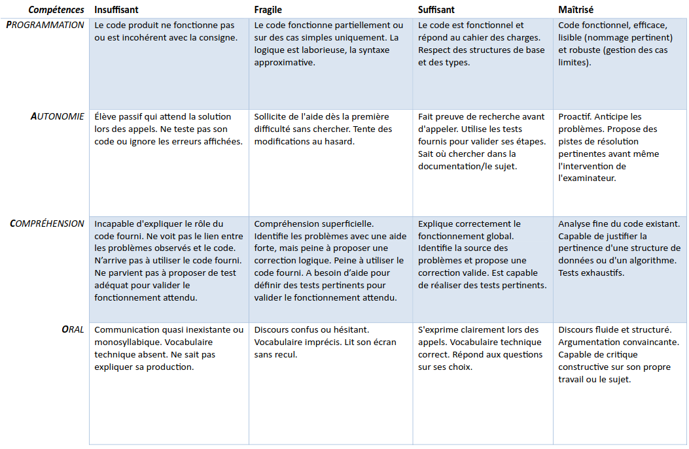
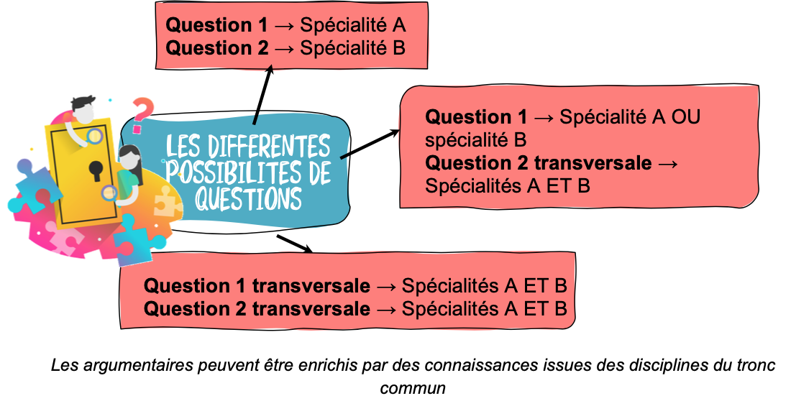
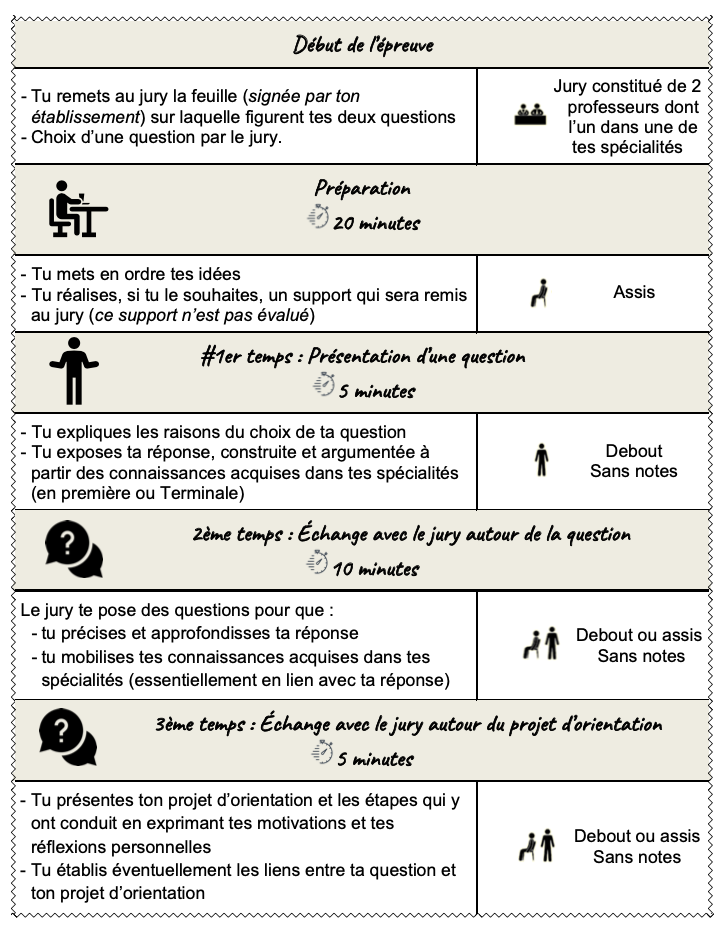
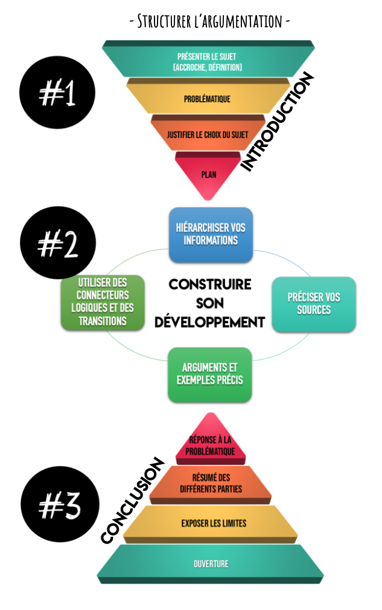
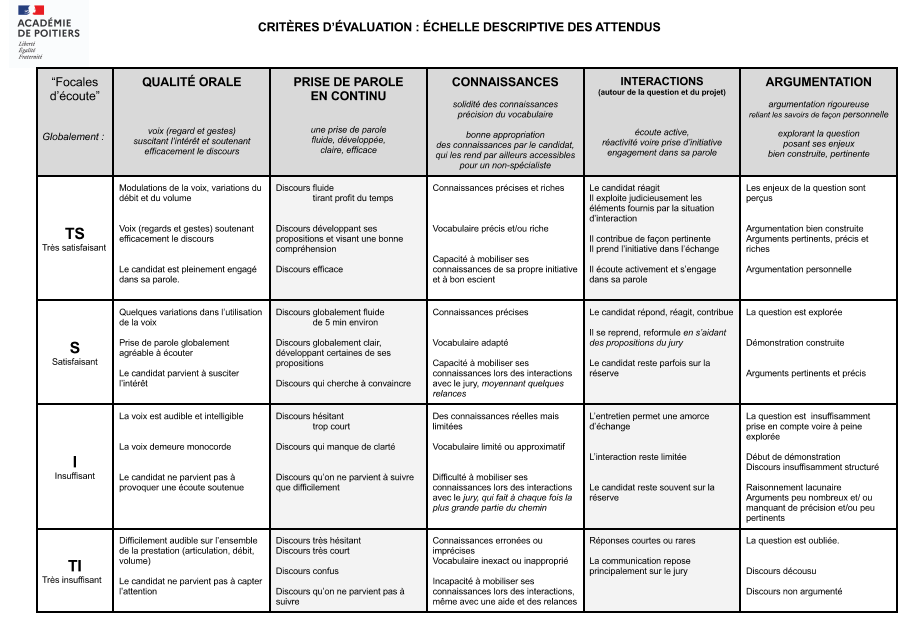

# BAC NSI

!!! info "Nature de l'épreuve"
    L'épreuve terminale obligatoire de spécialité est composée de deux parties : une partie écrite et une partie
    pratique, chacune notée sur 20. La note de la partie écrite a un coefficient de 0,75 et celle de la partie pratique
    a un coefficient de 0,25. La note globale de l’épreuve est donnée sur 20 points.

    ```python linenums='1'
    def note_bac_nsi(note_ecrit:float, note_pratique:float) -> int:
        """
        Calcule la note de spécialité NSI au bac à partir des notes obtenues aux épreuves écrite
        et pratique.
        """
        assert note_ecrit >= 0 and note_ecrit <= 20, "note d'écrit non valide"
        assert note_pratique >= 0 and note_pratique <= 20, "note de pratique non valide"
        return int(0.75*note_ecrit + 0.25*note_pratique)
    ```
    


## Épreuve écrite

- L'épreuve **écrite** de spécialité NSI dure 3h30.
- Elle comporte **trois** exercices indépendants les uns des autres, portant sur **l'intégralité** du programme de première **et** de terminale.

<span class='centre'>
[Sujet Métropole 2026 - J2 :material-download:](data/26-NSIJ2ME1.pdf){.center .md-button }
</span>

## Épreuve pratique


=== "Déroulement de l'épreuve"
    L'épreuve **pratique** de spécialité NSI dure 1h et se déroule généralement la première semaine de juin.

    Le candidat est évalué sur un sujet (voir la banque ci-dessous) comportant environ quatre questions, qui peuvent traiter des thèmes suivants (à titre indicatif):

    - l'écriture d'une fonction/méthode qui doit satisfaire une spécification;
    - l'écriture de jeux de tests pour contrôler le résultat d'une fonction;
    - l'analyse d'erreurs;
    - la proposition d'une correction de code.

    Après chaque question (ou pendant), un **dialogue** a lieu avec le professeur-examinateur, qui évalue au maximum quatre élèves sur une session d'une heure (plutôt trois en général). L’examinateur ne peut pas évaluer un élève qu’il a eu en classe durant l’année en cours, c'est donc un·e intervenant·e d'un autre lycée.

=== "Banque de sujets"
    
    :link: Vous pouvez retrouver en libre accès les 23 sujets de la session précédente à l'épreuve pratique de NSI:
    
    [https://sujets.examens-concours.gouv.fr/delos/public/bgt/nsi](https://sujets.examens-concours.gouv.fr/delos/public/bgt/nsi){:target="_blank"}.
    
    **Attention, certains sujets peuvent comporter des erreurs.**

   


=== "Grille d'évaluation"
    Quatre compétences sont évaluées lors de cette épreuve: Programmation (35% de la note), Autonomie (20%), Compréhension (25%) et Oral (20%).

    {: .center width=640} 

## Grand Oral

=== "Qu'est-ce que c'est?"
    - Vous devez préparer deux sujets, dont au moins un a un rapport avec le programme de NSI. 
    - Ce sujet peut être croisé avec l'autre spécialité.
    - L'oral dure 20 minutes (10 minutes d'exposé et 10 minutes d'échanges avec le jury) après une préparation de 20 minutes. Le candidat a la possibilité d’utiliser un tableau durant le second temps de l’épreuve.
    - L'épreuve représente un coefficient 10 au bac général.

    {: .center} 

=== "Déroulement de l'épreuve"

    Le support réalisé pendant la préparation (vous avez le droit à plusieurs feuilles de brouillon) peut être conservé par l’élève et donné au jury (schéma, carte mentale, croquis, etc.).

    {: .center} 

=== "Élaboration de la question"
    !!! gear "L’analyse du sujet"

        C’est une étape indispensable à la préparation de la recherche documentaire mais aussi pour élaborer votre
        futur plan de votre oral et votre introduction. Pour cela, vous devez :

        - définir les termes et les limites (chrono-spatiales) de votre sujet
        - noter les notions en lien avec votre sujet et auxquelles il faudra faire référence au cours de votre oral
        - noter les idées-clés, dates essentielles, acteurs, etc.

    !!! link "Les références bibliographiques"

        La recherche bibliographique est indispensable pour trouver les arguments et exemples nécessaires à votre oral.
        Les outils à disposition :
        
        - Le moteur de recherche E-Sidoc, disponible depuis Lycée connecté qui vous permet ensuite d’avoir accès aux
        richesses de la médiathèque, à l’Encyclopédia Universalis et aux vidéos sélectionnées pour leur fiabilité par l’INA.

            Petit tutoriel pour comprendre comment utiliser E-sidoc : [https://youtu.be/EXnNfcqGT7M](https://youtu.be/EXnNfcqGT7M){:target="_blank"} 
        
        - La médiathèque du lycée : livres, périodiques, usuels (encyclopédies, dictionnaires etc)
        - Médiathèque ou bibliothèque municipale
        - Web : préférez les sites institutionnels aux blogs, les sites de journaux spécialisés, ceux donnés en page d'accueil par ex. (onglet **Liens utiles**).
    

    !!! tip "Conseils"

        - Varier les sources
        - Vérifier la fiabilité de vos sources
        - Noter vos références afin de retrouver les informations

=== "J'organise mon argumentaire"
    !!! note "Introduction"
        Elle doit être soignée car elle donne la 1ère impression sur votre prestation orale. Elle doit
        comporter les éléments suivants :

        - une accroche (ex : un fait d’ actualité en lien avec le sujet etc.)
        - définir les enjeux de votre Question et justifier le choix de votre sujet
        - La QUESTION
        - L’annonce du plan

    !!! note "Développement"
        - Il est composé de parties (2 ou 3) qu’il faut rappeler pour que votre jury puisse suivre votre
        exposé.
        - Chaque partie comporte des sous-parties, chacune d’elles présentant un argument et un
        exemple pour appuyer votre démonstration
    
    !!! note "Conclusion"
        Ne pas la négliger car c’est la dernière impression que vous laissez à votre jury. Elle doit
        comporter 
        
        - la réponse claire à votre QUESTION
        - Le bilan de votre argumentation (elle peut comporter une ouverture)
    
    
    !!! info "Ne pas oublier qu’il s’agit d’un oral !"
        Penser aussi aux éléments suivants (voir grille d’évaluation) :

        - la voix : être audible avec un débit adapté et fluide
        - le regard : dirigé vers le jury (se détacher de ses notes)
        - la respiration : faire de courtes pauses
        - la posture : debout lors des 10 premières mn (puis vous pouvez vous assoir), droit , souriant
        - la gestuelle : éviter les gestes parasites
        - le vocabulaire/niveau de langue adapté
        - respecter le temps imparti (+/- 30 s)

    {: .center} 


    
=== "Grille d'évaluation"
    {: .center} 
