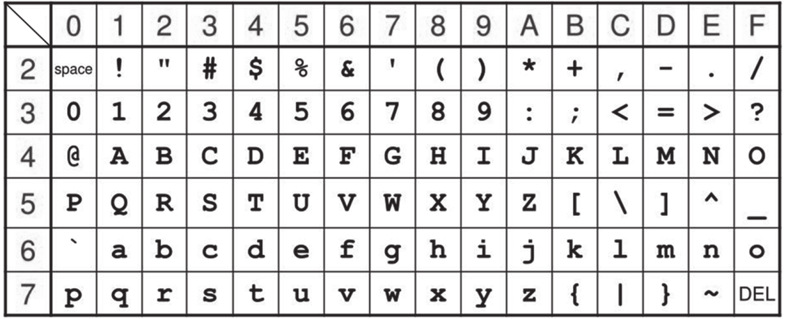

# DL 0001 : le masque jetable

!!! history "Histoire de l'informatique"
    L'algorithme de cryptographie du masque jetable est le seul qui offre une sécurité théorique absolue. Cela a été prouvé en 1949 par [Claude Shannon](https://fr.wikipedia.org/wiki/Claude_Shannon){:target="_blank"}. Cependant pour que cet algorithme soit parfaitement sûr, il faut respecter 3 règles:

    - la clé doit être **aussi longue** que le message à chiffrer;
    - la clé doit être générée de façon **aléatoire**;
    - la clé doit être **à usage unique**.

    Ces règles empêchent un usage pratique de cette méthode, car il est très compliqué de communiquer les clés. Certains gouvernements l'utilisent parfois, en faisant passer les clés par [valise diplomatique](https://fr.wikipedia.org/wiki/Valise_diplomatique){:target="_blank"}.


*Pour une meilleure lisibilité, des espaces sont placées dans les écritures binaires des nombres. Il ne faut pas les prendre en compte dans les calculs.*

## Introduction

Pour chiffrer un message, une méthode, dite du masque jetable, consiste à le combiner avec une chaîne de caractères de longueur comparable.

Une implémentation possible utilise l’opérateur `XOR` (ou exclusif) dont voici la table de vérité :

|x|y|x XOR y|
|:-:|:-:|:-:|
|F|F|F|
|F|V|V|
|V|F|V|
|V|V|F|

Dans la suite, les nombres écrits en binaire seront précédés du préfixe `0b`.

Pour chiffrer un message, on convertit chacun de ses caractères en binaire (à l’aide du format Unicode), et on réalise l’opération `XOR` bit à bit avec la clé.

On fournit pour cela la table ci-dessous qui associe à l’écriture hexadécimale
d’un octet le caractère correspondant (figure 2). Exemple de lecture : le caractère
correspondant à l’octet codé 4A en hexadécimal est la lettre J.

{: .center width=480} 

**Exemple:** On souhaite chiffrer le message `'nsi'` avec la clé `'BAC'`.

* On convertit chaque caractère en binaire:

    ||n|s|i|
    |:-:|:-:|:-:|:-:|
    |Unicode (décimal) |110|115|105|
    |Unicode (hexadécimal) |6E|73|69|
    |Binaire| `0b 0110 1110` | `0b 0111 0011` | `0b 0110 1001`|

    ||B|A|C|
    |:-:|:-:|:-:|:-:|
    |Unicode (décimal) |66|65|67|
    |Unicode (hexadécimal) |42|41|43|
    |Binaire|`0b 0100 0010`|`0b 0100 0001`|`0b 0100 0011`|

* On obtient donc en binaire : `'nsi'` → `0b 0110 1110 0111 0011 0110 1001` et `'BAC'` → `0b 0100 0010 0100 0001 0100 0011`.

* On effectue un `XOR` bit à bit : `'nsi' XOR 'BAC'` → `0b 0010 1100 0011 0010 0010 1010`

* On récupère les codes Unicode des 3 caractères: `2C 32 2A`, donc le message chiffré est : `',2*'`

## Énoncé

### Partie 1
Après conversion en binaire, et avant que l’opération `XOR` bit à bit avec la clé n’ait été effectuée, Alice obtient le message suivant :

`m = 0b 0110 0011 0100 0110`

1. Le message `m` correspond à deux caractères codés sur 8 bits: déterminer quels sont ces caractères.

2. Pour chiffrer le message d’Alice, on réalise l’opération `XOR` bit à bit avec la clé suivante :
    `k = 0b 1110 1110 1111 0000`
    
    Donner l’écriture binaire du message obtenu.

3. Dresser la table de vérité de l’expression booléenne suivante : `(x XOR y) XOR y`.

4. Bob connaît la chaîne de caractères utilisée par Alice pour chiffrer le message. Quelle opération doit-il réaliser pour déchiffrer son message ? Le vérifier.

### Partie 2 - Python

En Python, l'opérateur `XOR` est `^`. On peut faire un `XOR` directement sur deux nombres entiers, le `XOR` bit à bit se fait implicitement:

```python
>>> 110 ^ 66
44
>>> hex(44)
'0x2c'
```
Cet exemple montre que le ou exclusif sur `'n'` et `'B'` donne bien `','` (cf. introduction).

Les fonctions Python permettant d'obtenir le code Unicode d'un caractère et réciproquement sont `ord` et `chr`:
```python 
>>> ord('n')
110
>>> chr(66)
'B'
```

1. Écrire une fonction `xor` qui prend deux caractères en paramètre et renvoie le caractère correspondant au **ou exclusif** sur leurs codes Unicode.
2. Écrire une fonction `masque_jetable` qui correspond à la spécification ci-dessous:

    ```python linenums='1'
    def masque_jetable(message:str, cle:str) -> str:
        '''
        renvoie la chaîne chiffrée par la méthode du masque jetable.
        message: chaîne à chiffrer
        cle: clé de chiffrement

        Si la longueur de cle est inférieure à celle de message, on revient au début de cle.
        '''
        pass
    ```
    
### Partie 3 - Bonus

Résoudre le pydéfi suivant : [La clé endommagée](https://pydefis.callicode.fr/defis/MasqueJetable/txt){:target="_blank"} 

