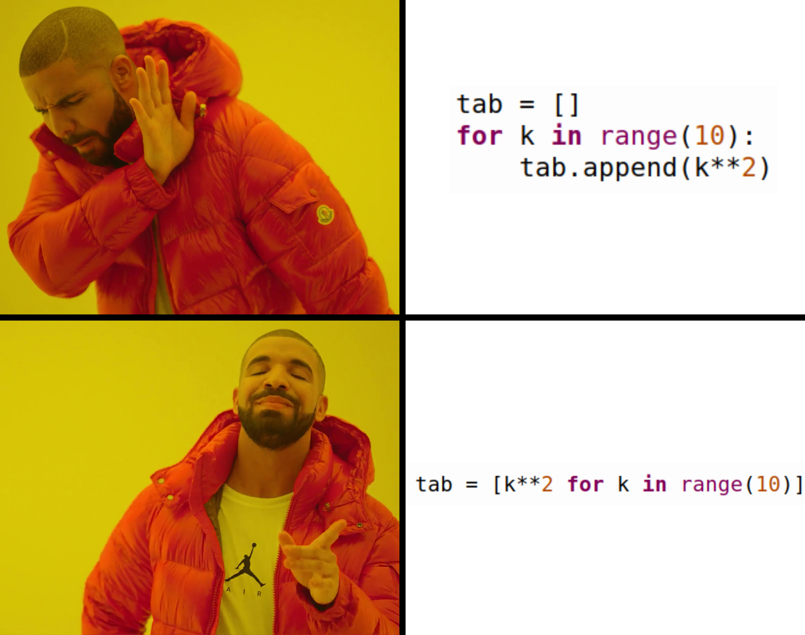

# DL 0010 : listes en compréhension

{{ initexo(0) }}

## Rappels (?)

En Python, une liste en compréhension permet de créer rapidement une nouvelle liste à partir d'un *iterable* (une autre liste, un objet `#!py range`, une chaîne de caractères, etc.) en précisant l'expression décrivant les élements de la liste.

Ce mode de création d'une liste suit le langage naturel (?). Admettons qu'on souhaite créer la liste `#!py tab`  des carrés des nombres (`#!py k`) entiers naturels inférieurs ou égaux à 9:

```python 
tab = [k**2 for k in range(10)]
```

On aurait très bien pu créer la liste par ajouts successifs dans une liste vide, mais bon...

{: .center width=320}


Il est également possible d'insérer un filtre à l'aide d'un expression conditionnelle `#!py if` dans la création de la liste.

Par exemple, créons la liste `#!py temp_pos`  des valeurs strictement positives de la liste `#!py temp` suivante:

```python 
temp = [11, 28, -16, -18, -10, 0, 16, 10, 16, 2, 7, 23, 22, -4, -2, 19, 16, 22, -8, 18, -14]

temp_pos = [t for t in temp if t>0]
```

Remarquons que dans cet exemple, l'expression est tout simplement la variable de boucle puisqu'on veut les mêmes valeurs.

Mais cette expression peut également très bien ne pas dépendre de la variable de boucle:

```python title='Liste de 10 valeurs aléatoires entre 1 et 100'
import random as rd
alea = [rd.randint(1, 100) for k in range(10)]
```

Ce qui peut être très pratique pour initialiser une liste à une dimension...

```python title='Liste de cent valeurs égales à 0'
zeros = [0 for _ in range(100)]
```

Ou à deux dimensions:

```python title='Tableau 5x3 rempli de 0'
tab = [[0 for _ in range(3)] for _ in range(5)]
```

## Exercices
!!! example "Exercice 0 (non évalué)"
    Dans chaque cas, écrire la liste produite par l'instruction donnée puis vérifier en exécutant le code dans un terminal:

    1. `#!py [3*i for i in range(1, 6)]` 
    2. `#!py [k**2 + 1  for k in range(5)]` 
    3. `#!py [k**3  for k in range(20) if k%5 == 0]`
    3. `#!py [2*m for m in ['bla', 'to', 'pa', 'tut']` 
    4. `#!py [3*c for c in 'nsi']` 
    4. `#!py [n%2 for n in [7, 16, 9, 5, 8, 18, 15]]` 
    5. `#!py [k for k in [3, -1, 7, 0, 8, -5, 23, 12, -42, 1001, 78, -98, 72, 50] if k%7 == 0]` 


!!! example "{{ exercice() }}"
    === "Énoncé" 
        Écrire en compréhension les listes suivantes:

        1. liste des puissances de 2 d'exposant compris entre 2 et 12 (inclus).
        2. liste des initiales (c'est-à-dire à l'indice `#!py 0`) des éléments de la liste `#!py ['Sonia', 'Ibrahim', 'Xavier', 'Sandro', 'Estelle', 'Valentine', 'Enzo', 'Naomi']`.
        2. liste des longueurs (`#!py len`) des éléments de la liste `#!py ['nsi', 'programmation', 'algorithme']`.
        3. liste des nombres premiers inférieurs ou égaux à 1000 (utilier la fonction `#!py isprime` du module `#!py scipy`).

    === "Correction" 
        {{ correction(False, 
        "
        "
        ) }}

!!! example "{{ exercice() }}"
    === "Énoncé" 
        `#!py tab` est un tableau à deux dimensions (c'est-à-dire une liste de listes).
        
        Écrire en compréhension la liste contenant «la première colonne», c'est-à-dire les éléments d'indice `#!py 0`  de chaque élément de `#!py tab`.

    === "Correction" 
        {{ correction(False, 
        "
        "
        ) }}
    
!!! example "{{ exercice() }}"
    === "Énoncé" 
        On considère la liste suivante:
        ```python
        lst = [51, 52, 66, 91, 92, 82, 65, 53, 86, 42, 79, 95]
        ```
        Seuls les nombres entre 65 et 90 ont une signification : ce sont des codes Unicode de lettres (récupérables par la fonction `chr`).

        Créer une liste `sol` qui contient les lettres correspondants aux nombres ayant une signification.

        **Bonus:** utiliser la méthode `#!py join` pour concaténer les éléments de la liste `#!py sol`.

    === "Correction" 
        {{ correction(False, 
        "
        ```python linenums='1'
        sol = [chr(code) for code in lst if code >= 65 and code <= 90]
        ```

        "
        ) }}
