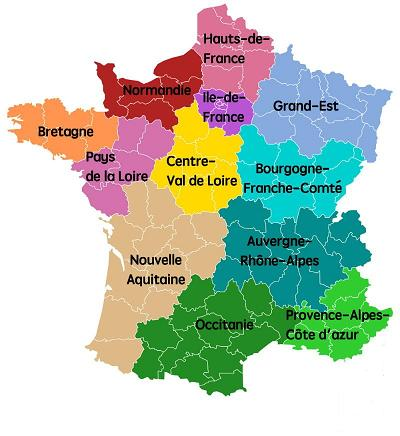
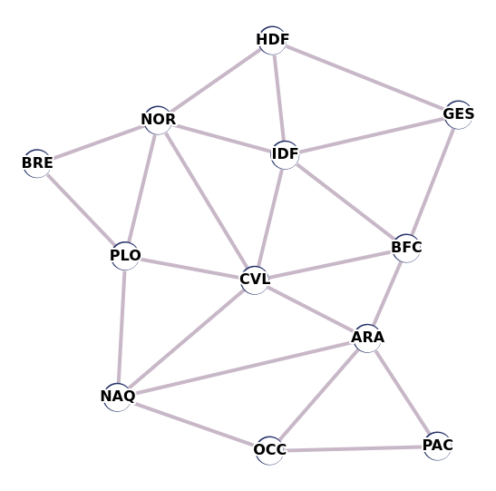
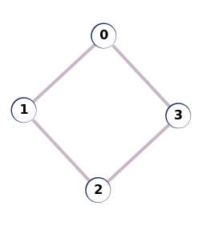
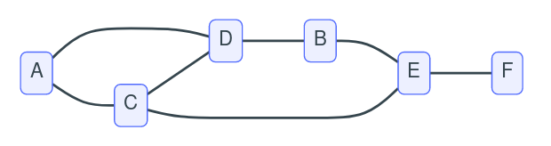
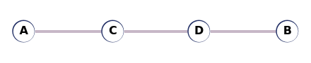

# DL 0011 : Coloration de graphe

Sur la carte de France ci-dessus sont représentées les 12 régions métropolitaines (sans la Corse pour des raisons de simplification du problème).

{: .center}

!!! info "Objectif"

    On se demande s'il est possible de colorier la carte en respectant les contraintes suivantes :

    - utiliser un minimum de couleurs ;
    - faire en sorte que deux régions limitrophes (ayant une frontière commune) soient coloriées de deux couleurs différentes.

    La figure ci-dessus utilise 12 couleurs, une par région ; on peut faire mieux. Il y a des solutions optimales à 4 couleurs (voir le théorème des quatre couleurs), d'autres qui s'en approchent. Nous allons voir plusieurs algorithmes.

## Modélisation

Pour tenter de résoudre ce problème, nous n'allons pas travailler directement sur la carte, mais sur un graphe associé à celle-ci.

Chaque région sera un sommet du graphe et, si deux régions sont limitrophes, il existera alors une arête entre ces deux sommets. Pour nommer les sommets nous utiliserons les codes suivants :

| Étiquette | Identifiant | Région |
|:---------:|:-----------:|:------:|
| 0         | BRE         | Bretagne                   |
| 1         | PLO         | Pays de Loire              |
| 2         | NAQ         | Nouvelle Aquitaine         |
| 3         | OCC         | Occitanie                  |
| 4         | PAC         | Provence-Alpes-Côte d'Azur |
| 5         | ARA         | Auvergne-Rhône-Alpes       |
| 6         | BFC         | Bourgogne Franche-Comté    |
| 7         | CVL         | Centre-Val de Loire        |
| 8         | IDF         | Île de France              |
| 9         | GES         | Grand-Est                  |
| 10        | HDF         | Hauts-de-France            |
| 11        | NOR         | Normandie                  |

## Partie A : Implémentation du graphe

1. Représenter le graphe correspondant à la carte "Régions de France" en utilisant les identifiants pour les sommets.

    ??? success "Correction"
        {: .center width=320} 

2. Une des possibilités pour représenter un graphe $G$ en machine est d'utiliser une  matrice d'adjacence (pour rappel, dans ce type de représentation, les sommets sont ordonnés et considérés comme étiquetés par des entiers de $0$ à $n - 1$, où $n$ est l'*ordre* du graphe).
    1. Quel est l'ordre du graphe "Régions de France" ?

        ??? success "Correction"
            L'ordre du graphe est 12.

    2. On considère un graphe dont la matrice d'adjacence est modélisée en Python par la liste de listes donnée ci-dessous :
		
        ```python
        M = [
            [0, 1, 0, 1],
            [1, 0, 1, 0],
            [0, 1, 0, 1],
            [1, 0, 1, 0],
            ]
		```
		
		Dessiner ce graphe. Les sommets sont étiquetés dans cet ordre par $0$, $1$, $2$, $3$.
		
        ??? success "Correction"
            {: .center width=240} 

	3. Écrire en Python une fonction `voisins` telle que `voisins(M, k)` renvoie une liste contenant les voisins du sommet `k`  dans le graphe $G$ modélisé par la matrice d'adjacence `M`. Par exemple avec la matrice définie ci-dessus, on a :

        ```python
        >>> voisins(M, 2)
        [1, 3]
        ```

        ??? success "Correction"
            ```python linenums='1'
            def voisins(M, k):
                v = []
                for i in range(len(M[k]):
                    if M[k][i] == 1:
                        v.append(i)
                return v
            ```
            ou mieux, en compréhension:
            ```python linenums='1'
            def voisins(M, k):
                return [i for i in range(len(M[k]) if M[k][i] == 1]
            ```
            

		
	
3. On peut également modéliser un graphe par listes d'adjacence en Python grâce à un dictionnaire contenant pour chaque clé (un sommet) la valeur associée : une liste de ses voisins, sans se soucier de l'ordre.

    1. En considérant le graphe représenté ci-dessous, donner un dictionnaire `G` modélisant ce graphe avec un dictionnaire de listes de voisins.

        {: .center}
    
        ??? success "Correction"
            ```python 
            G = {'A': ['C', 'D'],
                 'B': ['D', 'E'],
                 'C': ['A', 'D', 'E'],
                 'D': ['A', 'B', 'C'],
                 'E': ['B', 'C', 'F'],
                 'F': ['E']}
            ```
            
	2. Écrire en Python une fonction `voisins` telle que `voisins(G, k)` renvoie une liste contenant les voisins du sommet `k`  dans le graphe qui est modélisé par le dictionnaire `G` de listes de voisins. On aura, avec l'exemple précédent, et sans tenir compte de l'ordre:
		
		```python
        >>> voisins(G, 'C')
        ['A', 'D', 'E']		
		```
		
        ??? success "Correction"
            ```python linenums='1'
            def voisins(G, k):
                return G[k]
            ```
            

## Partie B : Coloration séquentielle ; un premier algorithme

Une première approche pour colorer le graphe est de prendre ses sommets les uns après les autres afin de leur affecter une couleur, tout en veillant à ce que deux sommets adjacents n'aient jamais la même couleur : c'est l'algorithme de coloration séquentielle.

Nous modéliserons le graphe par listes d'adjacence avec un dictionnaire Python en listes de voisins. On propose le code ci-dessous qui utilise la fonction `voisins` programmée à la question précédente :

```python
# Code 1
def coloration(G) :
    """
    Renvoie une coloration du graphe G. Version séquentielle avec 6 couleurs.
	"""
    couleur = ['Rouge', 'Bleu', 'Vert', 'Jaune', 'Noir', 'Blanc']
    coloration_sommets = {s: None for s in G}
    for s in G:
        couleurs_voisins = [coloration_sommets[v] for v in voisins(G, s)]
        k = 0
        while couleur[k] in couleurs_voisins:
            k = k + 1
        coloration_sommets[s] = couleur[k]
    return coloration_sommets
```

1. À Quelle famille d'algorithme appartient le Code 1 ci-dessus ? Justifier brièvement.

    ??? success "Correction"
        Il s'agit d'un algorithme glouton, car pour chaque sommet on choisit la «meilleure» couleur, c'est-à-dire une couleur non attribuée à ses voisins.

2. Quelle erreur pourrait éventuellement provoquer l'exécution de cette fonction?

    ??? success "Correction"
        Il pourrait y avoir une `#!py IndexError`  si la liste des couleurs n'est pas suffisante.

3. Donner les couleurs que va attribuer ce code à chaque sommet si l'on considère le graphe de la question **3.a**. On considère que la boucle principale va envisager les sommets dans l'ordre lexicographique : tout d'abord A, puis B, puis C ...

    ??? success "Correction"
        On obtiendrait : A → rouge, B → rouge, C → bleu, D → vert, E → vert, F → rouge.

4. On modélise maintenant un nouveau graphe avec le dictionnaire `G_2` ci-dessous, et on appelle la fonction `coloration`  avec ce graphe en argument. Représenter ce graphe puis montrer qu'il existe une solution avec moins de couleurs.

    ```python
    >>> G_2 = {"A": ["C"], "B": ["D"], "C": ["A", "D"], "D": ["B", "C"]}
    >>> coloration(G_2)
    {'A': 'Rouge', 'B': 'Rouge', 'C': 'Bleu', 'D': 'Vert'}
    ```

    ??? success "Correction"
        On peut obtenir sur le graphe suivant une coloration avec seulement deux couleurs au lieu de 3 : A → rouge, B → bleu, C → bleu, D → rouge.

        {: .center width=240} 


## Partie C : L'algorithme de Welsh et Powell

Il s'agit maintenant d'utiliser l'algorithme de coloration séquentielle avec un ordre judicieux, en vue d'obtenir une coloration valide la plus «acceptable» possible. L'algorithme de Welsh et Powell consiste ainsi à colorer séquentiellement le graphe en visitant les sommets **par ordre de degré décroissant**. L'idée est que les sommets ayant beaucoup de voisins sont plus difficiles à colorer : il faut les colorier en premier.

On rappelle que le *degré* d'un sommet est le nombre d'arêtes issues de ce sommet, c'est-à-dire son nombre de voisins.

1. On souhaite implémenter en Python une fonction `tri_sommets`  telle que `tri_sommets(G)` renvoie la liste des étiquettes des sommets du graphe `G`  passé en paramètre triés par degrés **décroissants**.
	
	Recopier les lignes incomplètes du Code 2 ci-après en les complétant.
	
    ```python
    # Code 2
    def tri_sommets(G) :
        """
        Renvoie la liste des sommets, triée par degré décroissant.
        """
        sommets = [sommet for sommet in G]
        for i in range(...):
            i_sommet_max = i
            degre_sommet_max = len(G[sommets[i]])
            for j in range(..., len(sommets)):
                if len(G[sommets[j]]) > degre_sommet_max:
                    i_sommet_max = ...
                    degre_sommet_max = ...
            tmp = sommets[i]
            sommets[i] = sommets[i_sommet_max]
            sommets[i_sommet_max] = ...
        return sommets

    ```

    ??? success "Correction"
        ```python linenums='1'
        def tri_sommets(G) :
            """
            Renvoie la liste des sommets, triee par degre decroissant.
            """
            sommets = [sommet for sommet in G]
            for i in range(len(G)):
                i_sommet_max = i
                degre_sommet_max = len(G[sommets[i]])
                for j in range(i, len(sommets)):
                    if len(G[sommets[j]]) > degre_sommet_max:
                        i_sommet_max = j
                        degre_sommet_max = len(G[sommets[j]])
                tmp = sommets[i]
                sommets[i] = sommets[i_sommet_max]
                sommets[i_sommet_max] = tmp
            return sommets
        ```
        
1. Quel type de tri est implémenté dans la fonction `tri_sommets` dans le Code 2 ci-dessus ? Donner sa complexité en temps (en moyenne).

    ??? success "Correction"
        C’est un tri par sélection, sa complexité est en $O(n^2)$.

2. Citer un exemple de tri plus efficace en temps que celui du Code 2. Donner sa complexité en temps (en moyenne).  

    ??? success "Correction"
        On peut citer le tri fusion ou le tri rapide, dont les complexités sont en $O(n\log(n))$.

3. Quelle sera la liste renvoyée par l'appel de fonction `tri_sommets(R)` où on passe en argument le dictionnaire `R`  suivant: pour chaque région, la liste des régions voisines, réalisé à la question 1 de la partie A (cf. code ci-dessous) ?
	
	```python
    R = {}
    R["BRE"] = ["PLO", "NOR"]
    R["PLO"] = ["BRE", "NAQ", "CVL", "NOR"]
    R["NAQ"] = ["PLO", "OCC", "ARA", "CVL"]
    R["OCC"] = ["NAQ", "PAC", "ARA"]
    R["PAC"] = ["OCC", "ARA"]
    R["ARA"] = ["NAQ", "OCC", "PAC", "BFC", "CVL"]
    R["BFC"] = ["ARA", "CVL", "IDF", "GES"]
    R["CVL"] = ["PLO", "NAQ", "ARA", "BFC", "IDF", "NOR"]
    R["IDF"] = ["BFC", "CVL", "GES", "HDF", "NOR"]
    R["GES"] = ["BFC", "IDF", "HDF"]
    R["HDF"] = ["IDF", "GES", "NOR"]
    R["NOR"] = ["BRE", "PLO", "CVL", "IDF", "HDF"]
	
	```
	
	**Remarque:** À partir de Python 3.7, lorsque l'on itère sur les clés d'un dictionnaire, l'itération se fait dans l'ordre de création des clés. On se placera dans ce cadre de travail.
	
    ??? success "Correction"
        ```python 
        ["CVL", "ARA", "IDF", "NOR", "PLO", "NAQ", "BFC", "OCC", "GES", "HDF",  "BRE", "PAC"]
        ```
        

4. Quelles modifications doit-on apporter à l'algorithme séquentiel (Code 1) pour implémenter l'algorithme de Welsh-Powell ? Ne pas recopier toute la fonction, mais signaler les lignes à insérer et/ou celles à modifier.

    ??? success "Correction"
        Il suffit simplement de modifier la ligne:

        ```python linenums='1'
        for s in G:
        ```
        en
        ```python linenums='1'
        for s in tri_sommets(G):
        ```
        
5. Donner alors la couleur attribuée à chaque région par la fonction modifiée.

    ??? success "Correction"
        ```python
        >>> coloration(R)
        {'BRE': 'Rouge', 'PLO': 'Bleu', 'NAQ': 'Vert', 'OCC': 'Rouge',
         'PAC': 'Vert', 'ARA': 'Bleu', 'BFC': 'Vert', 'CVL': 'Rouge',
         'IDF': 'Bleu', 'GES': 'Rouge', 'HDF': 'Jaune', 'NOR': 'Vert'}
        ```
        
## Bonus track

Les professeurs d'un lycée ont décidé d’organiser un bac blanc pour tous les élèves de terminale. Au programme, il y aura la philosophie ainsi que les enseignements de spécialité.

Pour la philosophie, pas de problème elle aura lieu le mercredi matin, tous les élèves composent sur cette épreuve.

Par contre, il faudrait optimiser les autres épreuves sur le moins de temps possible. Chacune des
épreuves sera organisée sur une demi-journée, et par souci d’équité un seul sujet pour chaque enseignement de spécialité sera proposé pour tous les élèves suivant cet enseignement.

**Vous devez proposer une organisation qui utilise le moins de demi-journées possibles.**

| Spécialités | Doublettes  |
|:-----------:|:-----------:|
| MATH        | MATH + SPCH |
| HGGSP       | MATH + NSI  |
| SES         | MATH + SES  |
| SPCH        | SPCH + SVT  |
| LLCE        | SPCH + NSI  |
| NSI         | NSI + AMC   |
| SVT         | NSI + SES   |
| HLP         | HLP + HGGSP |
| AMC         | HGGSP + AMC |
|             | HLP + LLCE  |
|             | SES + HGGSP |

??? success "Correction"
    Il s'agit ici d'associer la couleur d'un sommet à une demi-journée dans le graphe constitué des spécialités comme sommets et des doublettes comme arêtes. On obtient une coloration avec seulement 3 couleurs, soit 3 demi-journées.

    ```python linenums='1'
    graphe_spes = {'MATH': ['SPCH', 'NSI', 'SES'],
                   'HGGSP': ['HLP', 'AMC'],
                   'SES': ['MATH', 'NSI', 'HGGSP'],
                   'SPCH': ['MATH', 'SVT', 'NSI'],
                   'LLCE': ['HLP'],
                   'NSI': ['MATH', 'SPCH', 'AMC', 'SES'],
                   'SVT': ['SPCH'],
                   'HLP': ['HGGSP', 'LLCE'],
                   'AMC': ['NSI', 'HGGSP']
                   }
    ```

    ```python
    >>> coloration(graphe_spes)
    {'MATH': 'Rouge', 'HGGSP': 'Rouge', 'SES': 'Bleu', 'SPCH': 'Bleu', 'LLCE': 'Rouge', 'NSI': 'Vert', 'SVT': 'Rouge', 'HLP': 'Bleu', 'AMC': 'Bleu'}
    ```
    
    On aura donc l'organisation possible:

    - Lundi matin (rouge): Maths, HGGSP, LLCE et SVT;
    - Mardi matin (bleu): SES, Sciences Physique et Chimie, HLP et AMC;
    - Mercredi matin (vert): NSI (on garde le meilleur pour la fin).