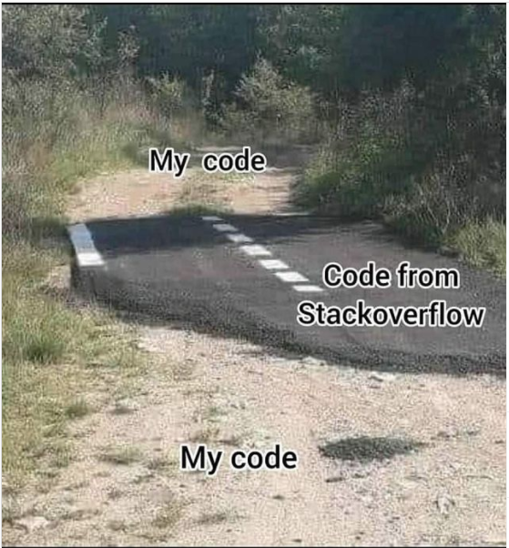

# Devoirs en temps libre

Ces devoirs ont plusieurs objectifs:

- réviser un ancien chapitre;
- préparer un nouveau chapitre pour gagner du temps en classe;
- s'exercer et progresser en vue des épreuves finales.

Vous devez donc les **travailler** (ce qui ne signifie pas tout réussir à chaque fois) de façon **personnelle**.

Ce que je ne veux pas voir dans votre travail:

{: .center width=480} 