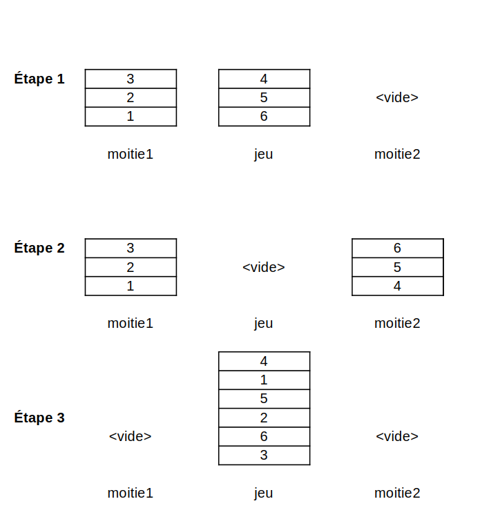
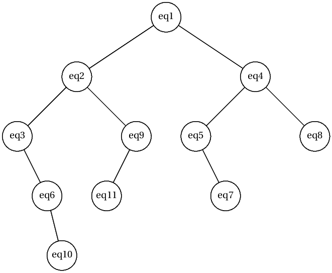
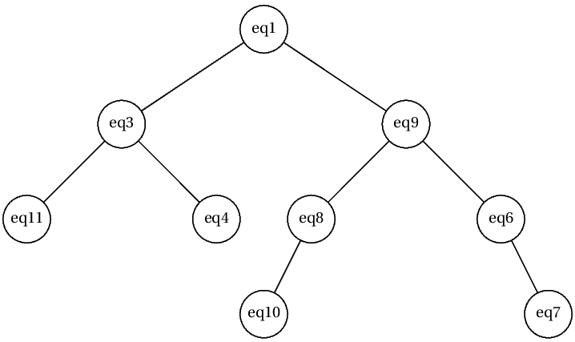

# Corrigé du bac blanc

## Exercice 1

1. {: .center width=480} 
2. Il faut empiler `n` valeurs décroissantes de `n` à `1`.

    ```python
    def produire_jeu(n):
        resultat = Pile()
        for i in range(n):
            resultat.empile(n-i)
        return resultat
    ```

3. Ligne 3 il manque les parenthèses `m2 = Pile()`. Ligne 4 et 6 il n'y a seulement que `n // 2` valeurs dans chaque moitié, donc il faut rectifier en `for i in range(n // 2)`.

4. 

    ```python
    def recombiner(m1, m2):
        resultat = Pile()
        while not m1.est_vide():
            resultat.empile(m1.depile())
            resultat.empile(m2.depile())
        return resultat
    ```

5. 

    ```python
    def faro(p, n):
        m1, m2 = scinder_jeu(p, n)
        return recombiner(m1, m2)
    ```

6. Par exemple:

    ```python
    p1 = Pile()
    p1.empile(1)
    p2 = Pile()
    assert not identiques(p1, p2)

    p2.empile(2)
    assert not identiques(p1, p2)

    p2.depile()
    p2.empile(1)
    assert identiques(p1, p2)
    ```

7. 
    
    ```python
    def ordre_faro(n):
        jeu = produire_jeu(n)
        jeu_melange = faro(produire_jeu(n), n)
        ordre = 1
        while not identiques(jeu, jeu_melange):
            jeu_melange = faro(jeu_melange, n)
            ordre += 1
        return ordre
    ```

## Exercice 2

1. `chien40 = Chien(40, 'Duke', 'wheel dog', 10)`
2. 

    ```python
    def changer_role(self, nouveau_role):
        self.role = nouveau_role
    ```

3. `chien40.changer_role('leader')`
4. On obtient `4.6`.
5. 

    ```python
    def temps_course(equipe):
        cumul = 0
        for temps in equipe.liste_temps:
            cumul += convert(temps)
        return cumul
    ```

6. On obtient l'arbre suivant:
    {: .center width=480} 


7. C'est le parcours infixe.
8. C'est une fonciton récursive car elle fait un appel à elle-même ligne 10.
9. Ligne 8 : `arb.gauche = Noeud(eq)`
    Ligne 10 : `inserer(arb.gauche, eq)`
    Ligne 15 : `inserer(arb.droit, eq)`

10. 

    ```python
    def est_gagnante(arbre):
        if arbre.gauche == None:
            return arbre.racine.nom_equipe
        else:
            return est_gagnante(arbre.gauche)
        
    ```

11. On obtient l'arbre suivant:

    {: .center width=480} 


12. 

    ```python
    def rechercher(arbre, equipe):
        if arbre.racine == equipe:
            return True
        elif convert(equipe.temps_etape) < convert(arbre.racine.temps_etape):
            if arbre.gauche == None:
                return False
            else:
                return rechercher(arbre.gauche, equipe)
        else:
            if arbre.droit == None:
                return False
            else:
                return rechercher(arbre.droit, equipe)
    ```

## Exercice 3

1. Une adresse IPv4 est composée de 4 octets.
2. Le serveur Web a pour adresse IP `172.16.0.1` et le serveur BDD `172.16.0.2`.
3. PC_A1 → Routeur A  → Routeur B → Routeur C → Routeur D → serveur_impression.
4. PC_A1 → Routeur A  → Routeur B → Routeur C . Les paquets n'arrivent donc pas.
5. Table de routage du routeur C:

    |Destination | Prochain saut | Métrique |
    |:----------:|:-------------:|:--------:|
    | 192.168.1.0|    10.0.2.2   |     2    | 
    | 192.168.2.0|    10.0.3.2   |     1    |
    | 192.168.3.0|    10.0.4.2   |     1    |
    |  10.0.1.0  |    10.0.2.2   |     1    |
    |  10.0.5.0  |    10.0.4.2   |     1    |

6. PC_A1 → Routeur A  → Routeur B → Routeur C → Routeur D → serveur_impression.
7. La liaison entre les routeurs C et D possède une bande passante faible. Il vaudrait mieux, en utilisant le protocole OSPF, passer par le routeur E entre les routeurs C et D.
8. On modifiera la ligne :

    |Destination | Prochain saut | Métrique |
    |:----------:|:-------------:|:--------:|
    | 192.168.2.0|    10.0.4.2   |     2    | 

    Le trajet est alors PC_A1 → Routeur A  → Routeur B → Routeur C → Routeur E → Routeur D → serveur_impression.


9. 

    ```sql
    SELECT titre_parution FROM parution;
    ```

10. On obtient le numéro de parution et le numéro des pages qui ont police Arial, 12 et classés par ordre de numéro de parution.

11. 

    ```sql
    SELECT num_image, titre_image, poids
    FROM image
    WHERE poids >= 1000;
    ```

12. 

    ```sql
    SELECT num_parution
    FROM parution
    JOIN page ON parution.num_parution = page.num_parution
    JOIN comporte_image ON page.id_page = comporte_page.id_page
    JOIN image ON comporte_image.num_image = image.num_image
    WHERE image.titre_image LIKE "%Apollo%";
    ```

13. 

    ```sql
    INSERT INTO image
    VALUES (2923, "Volcans du massif central", '', 400, 400, 1430);
    ```

14. La requête supprime de la table **texte** le texte ayant pour numéro 2034. La contrainte de référence pourrait être enfreinte, on ne peut pas supprimer une valeur d'une clé primaire d'une autre table.


