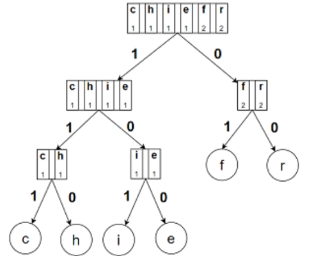

# Corrigé du bac blanc du 17 mars 2026

## Exercice 1

1. Par exemple:

    ```python
    #a)
    dossard_pj = participants['PHILIPSEN Jasper']
    #b)
    classement_pj = classement_general[dossard_pj]
    #c)
    dossard_tp = participants['PINOT Thibaut']
    temps_tp = temps_etapes[dossard_tp][3]
    ```

2. 

    ```python linenums='1'
    def calcul_temps_total(d):
        temps_total = 0
        for temps in temps_etapes[d]:
            temps_total += temps
        return temps_total
    ```
    
3. ligne 8 : `#!py element[1] < classement[pos][1]`

    ligne 9 : `#!py classement[pos + 1] = classement[pos]`

    ligne 14 : `#!py classement_general[classement[i][0]] = i+1`

4. ligne 16 : `#!py difference_temps = ligne[2] - temps_premier`
    
    ligne 17 : `#!py coureur.append(difference_temps)`
    
    ligne 18 : `#!py tableau_final.append(coureur)`

5. La clé primaire doit être unique pour chaque entrée. Dans la table **Temps**, on aura
plusieurs fois le même numéro de dossard, `numDossard` ne peut donc pas jouer le
rôle de clé primaire. Même chose pour l’attribut `numEtape`. En revanche, le couple
`(numDossard, numEtape)` sera unique pour chaque entrée, c’est donc une clé
primaire correcte.


6. La requête renvoie tous les noms des coureurs de l’équipe Cofidis.

7. 

    ```sql
    SELECT Date
    FROM Etapes
    WHERE Type = 'contre-la-montre'
    ```

8. 

    ```sql
    SELECT directeurSportif
    FROM Equipes
    JOIN Coureurs ON Coureurs.Equipe = Equipes.nomEquipe
    WHERE Coureurs.nomCoureur = 'BARDET Romain'
    ```

9. La première requête fait appel à un attribut `numEtape = 5`, alors que cette étape n’a
pas encore été créée dans la table Etapes, ce qui va provoquer une erreur.

10. Il suffit d’inverser l’ordre des requêtes.

11. 

    ```sql
    SELECT SUM(tempsRéalisé)
    FROM Temps
    JOIN Coureurs ON Coureurs.numDossard = Temps.numDossard
    WHERE Coureurs.nomCoureur = 'BARDET Romain'
    ```


## Exercice 2

1. Un masque sur 16 bits s'écrit `255.255.0.0` en notation décimale pointée.
2. L'adresse du réseau L2 est `172.16.0.0`.
3. L'adresse de diffusion de L2 est `172.16.255.255`.
4. Il y a $2^{16}-2=65534$ adresses possibles.
5. S1 -> A -> H -> D -> S2
6. S1 -> A-> H -> C -> D -> S2 ou S1 -> A -> B -> C -> D -> S2
7. Pour AHCD:

    | Routeur | Réseau destinataire | Passerelle | Interface |
    |:-------:|:-------:|:-------:|:-------:|
    |H | L2 | `53.10.10.10` | `53.10.10.9` |

    Pour ABCD:

    | Routeur | Réseau destinataire | Passerelle | Interface |
    |:-------:|:-------:|:-------:|:-------:|
    |A | L2 | `195.55.24.1` | `193.55.24.2` |

8. Pour 100 Mbit/s = $10^8$ bit/s le coût est de 10.

    Pour 1 Gbit/s = $10^9$ bit/s le coût est de 1.

    Pour 10 Gbit/s = $10^{10}$ bit/s le coût est de 0,1.

9. S1 -> A -> G -> F -> E -> D -> S2 avec un coût = 1 + 0,1 + 0,1 + 0,1 = 1,3

10. S1 -> A -> H -> F -> E -> D -> S2 avec un coût = 1 + 1 + 0,1 + 0,1 = 2,2


## Exercice 3

1. 010
2. Le texte est «espion».
3. Il s'agit d'un parcours en largeur.
4. La somme des nombres d'occurences à gauche est 1 + 1 + 1 + 1 + 1 + 1 + 1 + 2 + 2 = 11 et celle à droite est 3 + 4 + 4 = 11. Comme elles sont égales, il n'y a pas de meilleure séparation possible.
5. La hauteur de l'arbre est 5: c'est la longueur maximale (en bits) du code d'un caractère.
6. Le texte comporte 22 caractères, donc le codage ASCII nécessite 22 octets, soit $22\times 8 = 176$ bits.

    Avec le codage de Shannon-Fano:

    | Caractère | Code | Longueur du code (en bits) | Nombre d'occurences |
    |:---------:|:----:|:--------------------------:|:-------------------:|
    | i | 1111 | 4 | 1 |
    | u | 1110 | 4 | 1 |
    | c | 1101 | 4 | 1 |
    | o | 11001| 5 | 1 |
    | d | 11000| 5 | 1 |
    | , | 1011 | 4 | 1 |
    | p | 1010 | 4 | 1 |
    | n | 1001 | 4 | 2 |
    | j | 1000 | 4 | 2 |
    | s | 011  | 3 | 3 |
    | _ | 010  | 3 | 4 |
    | e | 00   | 2 | 4 |

    En multipliant les longueurs par leur nombre d'occurences, on obtient un total de 75 bits. On a donc bien un gain d'environ 2 fois moins (2,35 en fait).

7. {: .center} 
8. Ligne 8 : `#!py dico[symbole] = dico[symbole] + 1` 

    Ligne 10 : `#!py dico[symbole] = 1` 

9. 

    ```python linenums='1'
    def somme_occ(tab):
        s = 0
        for elt in tab:
            s += elt[1]
        return s
    ```

10. Ligne 8 : `#!py tab1 = [tab[k] for k in range(0, i)]` 

    Ligne 9 : `#!py tab2 = [tab[k] for k in range(i, len(tab))]` 

11. Ligne 9 : `#!py return "1" + shannon(symbole, t1)` 

    Ligne 11 : `#!py return "0" + shannon(symbole, t2)`

12. Grâce au cas d'arrêt ligne 4, les appels récursifs s’arrêtent quand `#!py tab`  contient un seul caractère.

13. 

    ```python linenums='1'
    def encode_shannon(texte):
        dico = creer_dico_occ(texte)
        tab = creer_tab_trie(dico)
        code = ''
        for caractere in texte:
            code += shannon(caractere, tab)
        return code
    ```
    