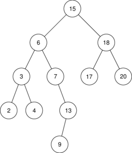

# DS 0110 - Corrigé

**Devoir du 17/01/2023**


Dans tout le test, on considère l'arbre A représenté ci-dessous:

{: .center} 

1. Justifier que cet arbre est un arbre binaire.

    Chaque nœud possède au plus deux fils, donc c'est un arbre binaire.

2. Donner la taille de l'arbre A.

    Cet arbre a une taille de 11, c'est-à-dire son nombre de nœuds.

2. Donner la hauteur (définie comme dans le cours) de l'arbre A.

    Cet arbre a une hauteur de 5 (la plus grande profondeur de l'un de ses nœuds).

3. Donner un nœud interne et une feuille de l'arbre A.

    Par exemple, 6 est un nœud internet et 20 est une feuille.

4. Donner l'ordre des nœuds visités en effectuant un parcours en largeur d'abord de l'arbre.

    On obtient 15 - 6 - 18 - 3 - 7 - 17 - 20 - 2 - 4 - 13 - 9.

5. Donner l'ordre des nœuds visités en effectuant un parcours préfixe de l'arbre.

    On obtient 15 - 6 - 3 - 2 - 4 - 7 - 13 - 9 - 18 - 17 - 20.

6. Expliquer pourquoi l'arbre A est un arbre binaire de recherche (ABR).

    Par exemple, si on effectue un parcours **infixe** de cet arbre, on obtient les valeurs des nœuds classées dans l'ordre croissant.

    Ou bien, c'est un arbre binaire de recherche car **pour tous les nœuds** de l'arbre, **toutes** les valeurs contenues dans **son sous-arbre gauche** sont inférieures à sa valeur, et **toutes** les valeurs contenues dans **son sous-arbre droit** lui sont supérieures.

7. Quelle(s) autre(s) valeur(s) aurait-on pu attribuer au nœud qui contient la valeur 9 ?
    
    On aurait pu attribuer toutes les valeurs supérieures à 7 et strictement inférieures à 13, c'est-à-dire 8, 10, 11 ou 12.
    
8. Ajouter successivement (en construisant de nouveaux nœuds) les valeurs 5, 16 et 12 en faisant en sorte que A conserve les propriétés d'un ABR.

    5 est à droite de 4, 16 est à gauche de 17 et 12 à droite de 9.

9. On dispose d'une classe `AB` permettant de représenter un arbre binaire en Python.

    **a.** Compléter la méthode `est_feuille` qui permet de déterminer si un arbre est une feuille (c'est-à-dire qu'il est réduit à un nœud, sans sous-arbres).

    Un arbre est une feuille s'il n'est pas vide et si ses deux sous-arbres sont vides.

    **b.** Compléter la méthode récursive `nb_feuilles` qui renvoie le nombre de feuilles d'un arbre binaire.

    **Cas de base:** Un arbre vide possède 0 feuille. Si l'arbre est une feuille, il posssède 1 feuille.

    **Cas général:** un arbre possède la somme des feuilles de ses deux sous-arbres.
    
    ```python linenums='1'
    class AB:
        def __init__(self, racine=None):
            self.racine = racine
            if self.racine is not None:
                self.gauche = AB()
                self.droit = AB()

        def est_vide(self):
            return self.racine is None
        
        def est_feuille(self) -> bool:
            return not self.ets_vide() \
                    and self.gauche.est_vide() \
                    and self.droit.est_vide()

        def nb_feuilles(self) -> int:
            if self.est_vide():
                return 0
            elif self.est_feuille():
                return 1
            else:
                return self.gauche.nb_feuilles() + self.droit.nb_feuilles()
    ```


    