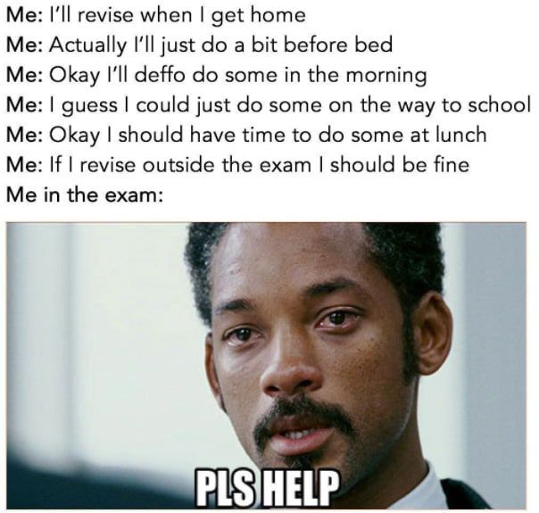

# Devoirs surveillés

Vous trouverez ici les corrigés des devoirs surveillés. Pour rappel, un devoir ne se termine pas au moment où on reçoit sa note, il faut reprendre le devoir avec le corrigé pour comprendre ses erreurs. Il est bon également de refaire un exercice du devoir quelques temps après pour vérifier qu'on a bien assimilé les notions et la correction.

{: .center width=480} 