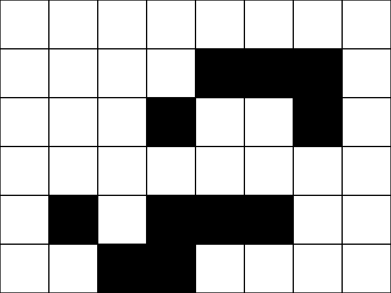
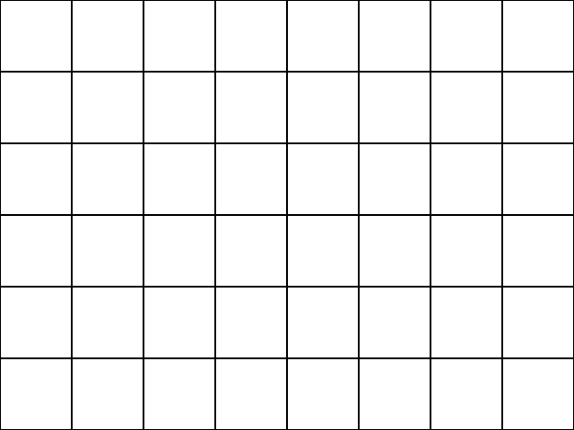

# Projet 1

## Sujet 1 : Life & Death

!!! example "Énoncé"
    On considère une grille - théoriquement infinie - dont les cases appellées *cellules* peuvent prendre deux états distincts : «vivante» ou «morte».

    Une cellule possède huit voisins : les cellules adjacentes horizontalement, verticalement et diagonalement.

    À chaque génération, les cellules peuvent changer d'état ou conserver leur état selon les règles suivantes:

    - si une cellule **morte** possède *exactement* 3 cellules voisines vivantes, alors elle devient **vivante** (elle naît);
    - si une cellule **vivante** possède 2 ou 3 cellules vivantes, alors elle reste vivante, **sinon elle meurt**.

    L'objectif est de simuler, génération après génération, l'état de la grille.

    **Exemple:**

    === "1"
        {: .center} 
    === "2"
        {: .center}
    === "3"
        {: .center}
    === "4"
        {: .center} 
    === "5"
        {: .center}
    === "6"
        {: .center}
    === "7"
        {: .center} 
    === "8"
        {: .center}
    === "9"
        {: .center}
    === "10"
        {: .center} 
    === "11"
        {: .center}
    === "12"
        {: .center}


!!! abstract "Consignes"
    - Utiliser le module `pygame` pour animer la grille génération après génération.
    - L'état initial de la grille sera choisi aléatoirement.
    - Le programme principal devra contenir deux classes: `Grille` et `Cellule`.
    - La classe `Grille` contiendra une méthode `actualisation` (ou `update`) qui consistera à actualiser l'état de la grille (c'est à dire de chacune de ses cellules) ainsi qu'à afficher la grille.

        La boucle des événements sera donc réduite à (avec par exemple `G` instance de la classe `Grille`):
        ```python linenums='1'
        continuer = True
        while continuer:
            for evenement in pygame.event.get(): 
                if evenement.type == QUIT:
                    continuer = False

            G.actualisation()
            pygame.display.flip()
            pygame.time.delay(100)
        ```
<!-- !!! code "Proposition de correction"
    ```python linenums='1'
    import pygame
    import random as rd

    ## Classes

    class Cellule():
        def __init__(self, t, l, c, e):
            self.s = t
            self.ligne = l
            self.colonne = c
            self.x = self.s * c
            self.y = self.s * l
            self.etat = e
            self.etat_suivant = 0
            self.nb_voisins = 0

        def actualise_suivant(self):
            if (self.etat == 0 and self.nb_voisins==3) or (self.etat == 1 and self.nb_voisins in {2, 3}):
                self.etat_suivant = 1
            else:
                self.etat_suivant = 0

        def actualise_cellule(self):
            self.etat = self.etat_suivant

        def affiche_cellule(self, ecran):
            if self.etat:
                pygame.draw.rect(ecran, (0, 0, 0), (self.x, self.y, self.s, self.s))
            else:
                pygame.draw.rect(ecran, (255, 255, 255), (self.x, self.y, self.s, self.s))


    class Grille():
        def __init__(self, l, h, t, e):
            self.longueur = l
            self.hauteur = h
            self.taille_cellule = t
            self.ecran = e
            self.cellules = [[Cellule(self.taille_cellule, r, c, rd.randint(0, 1)) for c in range(self.longueur)] for r in range(self.hauteur)]

        def actualisation(self):
            for r in range(self.hauteur):
                for c in range(self.longueur):
                    self.cellules[r][c].nb_voisins = self.compte_voisins(r, c)
                    self.cellules[r][c].actualise_suivant()
            for r in range(self.hauteur):
                for c in range(self.longueur):
                    self.cellules[r][c].actualise_cellule()
                    self.cellules[r][c].affiche_cellule(self.ecran)

        def compte_voisins(self, r, c):
            n = 0
            for d in [(-1, -1), (-1, 0), (-1, 1), (0, -1), (0, 1), (1, -1), (1, 0), (1, 1)]:
                try:
                    n += self.cellules[r + d[0]][c + d[1]].etat
                except:
                    pass
            return n

    ## initialisation
    pygame.init()


    ## Constantes
    longueur_grille, hauteur_grille = 640, 480
    taille_cellule = 10
    taille = (longueur_grille, hauteur_grille)

    ## Écran
    fenetre = pygame.display.set_mode(taille)
    pygame.display.set_caption("Jeu de la vie de John Conway")

    ## Grille
    G = Grille(longueur_grille // taille_cellule , hauteur_grille // taille_cellule, taille_cellule, fenetre)

    ## Boucle des événements
    continuer = False
    while not continuer:
        for evenement in pygame.event.get():
            if evenement.type == pygame.QUIT:
                continuer = True

        G.actualisation()
        pygame.display.flip()
        pygame.time.delay(200)

    ## Fermeture de la fenêtre
    pygame.quit()


    ``` -->
    


## Sujet 2: Promenade d'une puce

!!! example "Énoncé"
    Une puce se promène sur une grille dont les cases appellées *cellules* peuvent être blanches ou noires. Au départ, toutes les cellules sont blanches et la puce se trouve au centre de la grille.

    La puce peut se déplacer horizontalement ou verticalement sur la grille de la façon suivante:

    - si la puce se situe sur une cellule blanche, elle tourne de 90° vers la droite, change la couleur de la case en noir et avance d'une case.
    - si la puce se situe sur une cellule noire, elle tourne de 90° vers la gauche, change la couleur de la case en blanc et avance d'une case.

    {: .center} 

!!! abstract "Consignes"
    - Utiliser le module `pygame` pour animer la grille génération après génération.
    - Le programme principal devra contenir deux classes: `Grille` et `Puce`.
    - La classe `Grille` contiendra une méthode `actualisation` (ou `update`) qui consistera à actualiser l'état de la grille (c'est à dire de la cellule où la puce est passée) ainsi qu'à afficher la grille.

        La boucle des événements sera donc réduite à (avec par exemple `G` instance de la classe `Grille`):
        ```python linenums='1'
        continuer = True
        while continuer:
            for evenement in pygame.event.get(): 
                if evenement.type == QUIT:
                    continuer = False

            G.actualisation()
            pygame.display.flip()

        ```

<!-- !!! code "Proposition de correction"
    ```python linenums='1'
    import pygame
    from pygame.locals import *


    class Grille:
        def __init__(self, l:int, h:int):
            self.longueur = l
            self.hauteur = h
            self.cellules = [self.longueur*[1] for _ in range(self.hauteur)]
            self.puce = Puce(self.longueur//2, self.hauteur//2)
            self.go = True

        def actualisation(self):
            l, c = self.puce.ligne, self.puce.colonne

            try:
                self.puce.avance(self.cellules[l][c])        
                self.cellules[l][c] = 1 - self.cellules[l][c]
                pygame.draw.rect(fenetre, [255*self.cellules[l][c]]*3, [l, c, 1, 1])
                pygame.draw.rect(fenetre, [255, 0, 0], [self.puce.ligne, self.puce.colonne, 1, 1])
            except:
                pass


    class Puce:
        directions = [(-1, 0), (0, 1), (1, 0), (0, -1)]

        def __init__(self, l, c):
            self.ligne = l
            self.colonne = c
            self.dir = 0

        def avance(self, cellule):
            if cellule == 1:
                self.dir = (self.dir+1) % 4
            else:
                self.dir = (self.dir-1) % 4

            self.ligne += Puce.directions[self.dir][0]
            self.colonne += Puce.directions[self.dir][1]


    pygame.init()

    longueur, hauteur = 320, 240
    fenetre = pygame.display.set_mode((longueur, hauteur))
    fenetre.fill([255, 255, 255])
    pygame.display.flip()


    G = Grille(longueur, hauteur)

    continuer = True
    while continuer:

        for evenement in pygame.event.get():
            if evenement.type == QUIT:
                continuer = False

        G.actualisation()

        pygame.display.flip()


    pygame.quit()


    ```
     -->