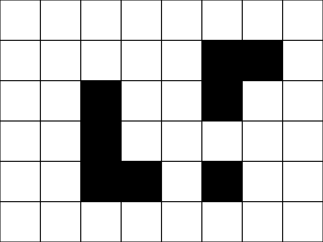
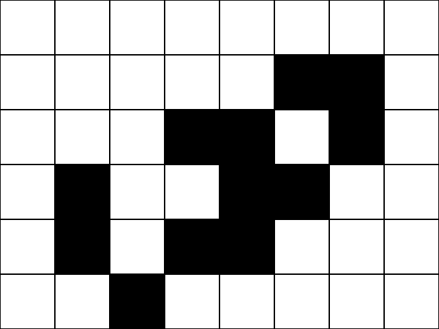
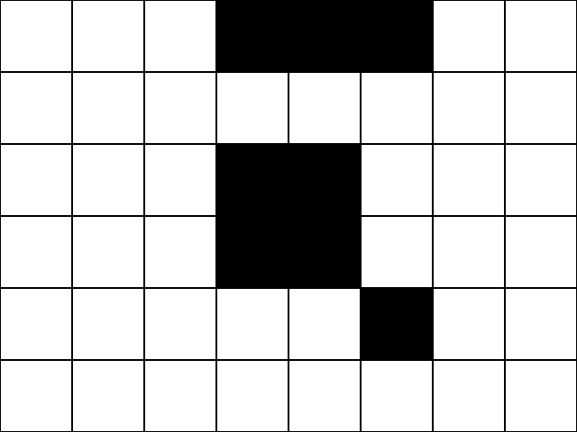

# Projet 1 : Life & Death

!!! example "Énoncé"
    On considère une grille - théoriquement infinie - dont les cases appellées *cellules* peuvent prendre deux états distincts : «vivante» ou «morte».

    Une cellule possède huit voisins : les cellules adjacentes horizontalement, verticalement et diagonalement.

    À chaque génération, les cellules peuvent changer d'état ou conserver leur état selon les règles suivantes:

    - si une cellule **morte** possède *exactement* 3 cellules voisines vivantes, alors elle devient **vivante** (elle naît);
    - si une cellule **vivante** possède 2 ou 3 cellules vivantes, alors elle reste vivante, **sinon elle meurt**.

    L'objectif est de simuler, génération après génération, l'état de la grille.

    **Exemple:**

    === "1"
        {: .center} 
    === "2"
        {: .center}
    === "3"
        {: .center}
    === "4"
        {: .center} 
    === "5"
        {: .center}
    === "6"
        {: .center}
    === "7"
        {: .center} 
    === "8"
        {: .center}
    === "9"
        {: .center}
    === "10"
        {: .center} 
    === "11"
        {: .center}
    === "12"
        {: .center}


!!! abstract "Consignes"
    - Utiliser le module `pygame` pour animer la grille génération après génération.
    - L'état initial de la grille sera choisi aléatoirement.
    - Le programme principal devra contenir deux classes: `Grille` et `Cellule`.
    - La classe `Grille` contiendra une méthode `actualisation` (ou `update`) qui consistera à actualiser l'état de la grille (c'est à dire de chacune de ses cellules) ainsi qu'à afficher la grille.

        La boucle des événements sera donc réduite à (avec par exemple `G` instance de la classe `Grille`):
        ```python linenums='1'
        continuer = True
        while continuer:
            for evenement in pygame.event.get(): 
                if evenement.type == QUIT:
                    continuer = False

            G.actualisation()
            pygame.display.flip()

        ```
        

