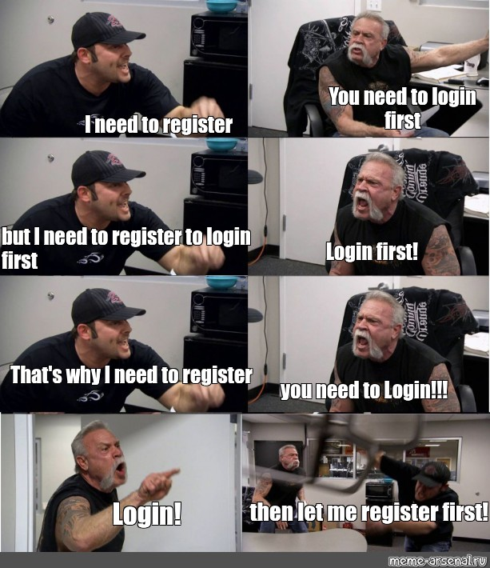

# (Mini-) Projet 2

{: .center width=320} 


!!! example "Authentification"
    === "Énoncé" 
        Dans ce mini-projet, vous devez écrire un système d'authentification par login/mot de passe à un service qui permet de stocker une phrase secrète. Comme précédemment le menu doit contenir trois choix:

        - **login** : s'authentifier puis afficher la phrase secrète. Proposer de changer cette phrase.
        - **register**: s'enregistrer puis saisir la phrase secrète à stocker.
        - **quit**: pour ... quitter le programme.

        **Remarques:**

        - les données doivent bien entendu être stockées dans une base de données.
        - on ne doit pas pouvoir choisir un login déjà utilisé.
        - les mots de passe doivent être hachés. Voir [ici](https://fr.wikipedia.org/wiki/Fonction_de_hachage){:target="_blank"}  pour le principe et [ici](https://docs.python.org/fr/3/library/hashlib.html){:target="_blank"} pour la fonction de hachage à utiliser.

        **Ouvertures:**

        - Proposer de changer le mot de passe.
        - Vérifier la force du mot de passe proposé (calcul d'entropie).

    === "Proposition de correction (a minima)" 

        ```python linenums='1'
        import sqlite3
        import hashlib

        def hachage(chaine:str) -> str:
            '''
            renvoie le condensé de chaine en utilisant la fonction de
            hachage md5 du module hashlib.
            '''
            return hashlib.md5(chaine.encode()).hexdigest()

        def register():
            go = True
            while go:
                nom = input("Choix de l'identifiant : ")
                rq = c.execute("SELECT * FROM users WHERE pseudo = ?;", [nom])
                resultat = rq.fetchone()
                if resultat is None:
                    mdp = input("Choix du mdp : ")
                    ps = input("Saisissez votre phrase secrète : ")
                    c.execute("INSERT INTO users VALUES (?, ?, ?);", [nom, hachage(mdp), ps])
                    go = False
                else:
                    print("Identifiant déjà attribué. Veuillez recommencer.")


        def login():
            nom = input('Identifiant ? ')
            rq = c.execute("SELECT * FROM users WHERE pseudo = ?;", [nom])
            resultat = rq.fetchone()
            if resultat is None:
                print("Identifiant inconnu")
            else:
                mdp = input('Mot de passe ? ')
                mdp_hash = hachage(mdp)
                if mdp_hash == resultat[1]:
                    print('Authentification réussie')
                    menu_login(nom)
                else:
                    print('Mot de passe erroné')

        def menu_login(user):
            go = True
            while go:
                print(15 * "-" + "\n1. Consulter la phrase secrète\n2. Modifier la phrase secrète\n3. Quitter\n" + 15 * "-")
                choix = input("Votre choix: ")
                if choix == '1':
                    consulter(user)
                elif choix == '2':
                    modifier(user)
                else:
                    go = False

        def consulter(user):
            rq = c.execute("SELECT content FROM users WHERE pseudo = ?;", [user])
            print(f"Phrase secrète: {rq.fetchone()[0]}")

        def modifier(user):
            ps = input("Saisissez votre nouvelle phrase secrète : ")
            c.execute("UPDATE users SET content = ? WHERE pseudo = ?;", [ps, user])
            print("Modification effectuée")

        #Connexion
        connexion = sqlite3.connect('miniprojet.db')

        #Récupération d'un curseur
        c = connexion.cursor()

        # ---- début des instructions SQL

        #Création d'une table
        c.execute("""
            CREATE TABLE IF NOT EXISTS users(
            pseudo TEXT PRIMARY KEY,
            mdp INTEGER,
            content TEXT);
            """)

        #c.execute("DELETE FROM users;")

        go = True

        while go:
            print(15 * "-"+"\nMenu \n1. login\n2. register\n3. quit\n" + 15 * "-")
            choix = input("Votre choix: ")
            if choix == '1':
                login()
            elif choix == '2':
                register()
            else:
                go = False

        # ---- fin des instructions SQL

        #Validation
        connexion.commit()

        #Déconnexion
        connexion.close()


        ```
        
