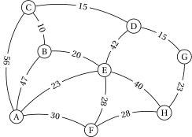
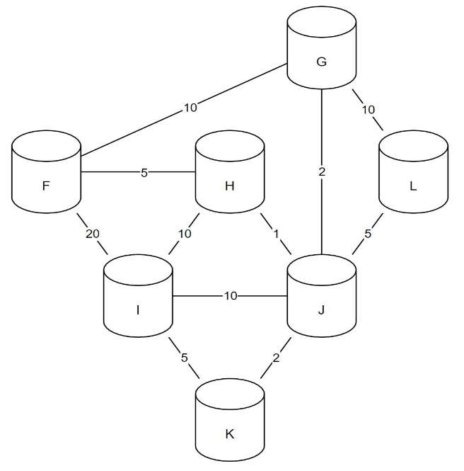

# Algorithme de Dijkstra

{{ initexo(0) }}

L'[algorithme de Dijkstra](https://fr.wikipedia.org/wiki/Algorithme_de_Dijkstra){:target="_blank"} est un algorithme qui permet de trouver le plus court chemin dans un graphe pondéré.

{: .center} 

Cet algorithme (ou plutôt son optimisation A*) est utilisé par exemple par les logiciels de cartographie ou applications GPS pour vous indiquer le plus court chemin d'un point à un autre, en tenant compte en temps réel des conditions de parcours.

Il peut être également utilisé pour déterminer le parcours le plus efficace dans le protocole de routage OSPF.

!!! gear "Principe de l'algorithme"
    L'idée est de calculer à chaque étape la distance la plus courte de chaque sommet à **un sommet de départ**, en notant de quel sommet on arrive pour obtenir cette plus courte distance.

    En pratique:

    - On commence par choisir un sommet de départ, qu'on place dans un tableau avec une distance de 0, et on note $\infty$ la distance de tous les autres sommets au sommet de départ;
    - pour chaque sommet adjacent au sommet de départ on note (dans un tableau) les distances qui les séparent;
    - pour le sommet le plus proche, on recommence l'opération **pour les sommets adjacents non déjà visités** en additionnant les distances précédentes;
    - on recommence jusqu'à avoir épuisé tous les sommets.

!!! note "Exemple"
    Dans le graphe ci-dessous on souhaite déterminer le plus court chemin entre le sommet A et le sommet H.

    {: .center width=320} 

    === "Tableau"
        On commence par construire un tableau avec une colonne par sommet, et une colonne indiquant le sommet choisi à chaque étape. On initialise la colonne du sommet de départ (distance de 0 de A) et les croix indiquent que ce sommet est visité, on ne le visite plus durant le reste de l'algorithme.

        |A|B|C|D|E|F|G|H|Choix|
        |:-:|:-:|:-:|:-:|:-:|:-:|:-:|:-:|:-:|
        |0|∞|∞|∞|∞|∞|∞|∞|A(0)|
        |x|||||||||
        |x|||||||||
        |x|||||||||
        |x|||||||||
        |x|||||||||
        |x|||||||||
        |x|||||||||
    
    === "De A"
        Les sommets adjacents de A sont B et D, on actualise le tableau avec leur distance de A, en précisant qu'on provient de A.

        |A|B|C|D|E|F|G|H|Choix|
        |:-:|:-:|:-:|:-:|:-:|:-:|:-:|:-:|:-:|
        |0|12-A|∞|14-A|∞|∞|∞|∞|A(0)|
        |x|||||||||
        |x|||||||||
        |x|||||||||
        |x|||||||||
        |x|||||||||
        |x|||||||||
        |x|||||||||

    === "Choix suivant"
        On choisit alors le sommet le plus proche de A, ici B, et on indique qu'on ne le visitera plus.

        |A|B|C|D|E|F|G|H|Choix|
        |:-:|:-:|:-:|:-:|:-:|:-:|:-:|:-:|:-:|
        |0|**12-A**|∞|14-A|∞|∞|∞|∞|A(0)|
        |x|x|||||||B(12-A)|
        |x|x||||||||
        |x|x||||||||
        |x|x||||||||
        |x|x||||||||
        |x|x||||||||
        |x|x||||||||

    === "De B"
        Depuis B, on peut désormais joindre les sommets F, G, et H dont on obtient les distances depuis A en additionnant leurs distances de B à la distance de B à A, soit par exemple 9+12=21 pour F. Les autres sommets ne sont pas encore atteints, on laisse ∞.

        On recommencera ensuite avec le sommet D, qui possède la plus courte distance depuis A.

        |A|B|C|D|E|F|G|H|Choix|
        |:-:|:-:|:-:|:-:|:-:|:-:|:-:|:-:|:-:|
        |0|**12-A**|∞|14-A|∞|∞|∞|∞|A(0)|
        |x|x|∞|14-A|∞|21-B|28-B|33-B|B(12-A)|
        |x|x||||||||
        |x|x||||||||
        |x|x||||||||
        |x|x||||||||
        |x|x||||||||
        |x|x||||||||
    
    === "De D"
        De D on ne peut visiter que E, les autres distances sont inchangées. On recommence avec F.

        |A|B|C|D|E|F|G|H|Choix|
        |:-:|:-:|:-:|:-:|:-:|:-:|:-:|:-:|:-:|
        |0|**12-A**|∞|14-A|∞|∞|∞|∞|A(0)|
        |x|x|∞|**14-A**|∞|21-B|28-B|33-B|B(12-A)|
        |x|x|∞|x|24-D|21-B|28-B|33-B|D(14-A)|
        |x|x||x||||||
        |x|x||x||||||
        |x|x||x||||||
        |x|x||x||||||
        |x|x||x||||||
    
    === "De F"
        De F on peut visiter C, et on trouve un meilleur chemin vers H, dont on actualise la distance. Les autres distances sont inchangées. On recommence avec E.

        |A|B|C|D|E|F|G|H|Choix|
        |:-:|:-:|:-:|:-:|:-:|:-:|:-:|:-:|:-:|
        |0|**12-A**|∞|14-A|∞|∞|∞|∞|A(0)|
        |x|x|∞|**14-A**|∞|21-B|28-B|33-B|B(12-A)|
        |x|x|∞|x|24-D|**21-B**|28-B|~~33-B~~|D(14-A)|
        |x|x|31-F|x|24-D|x|28-B|32-F|F(21-B)|
        |x|x||x||x||||
        |x|x||x||x||||
        |x|x||x||x||||
        |x|x||x||x||||

    === "De E"
        De E, rien d'intéressant. On recommence avec G, puis C et enfin FH pour lesquels aucune meilleure distance n'est trouvée.

        |A|B|C|D|E|F|G|H|Choix|
        |:-:|:-:|:-:|:-:|:-:|:-:|:-:|:-:|:-:|
        |0|**12-A**|∞|14-A|∞|∞|∞|∞|A(0)|
        |x|x|∞|**14-A**|∞|21-B|28-B|33-B|B(12-A)|
        |x|x|∞|x|24-D|**21-B**|28-B|~~33-B~~|D(14-A)|
        |x|x|31-F|x|**24-D**|x|28-B|32-F|F(21-B)|
        |x|x|31-F|x|x|x|28-B|32-F|E(24-D)|
        |x|x||x|x|x||||
        |x|x||x|x|x||||
        |x|x||x|x|x||||
    
    === "Fin"
        Une fois tous les sommets du graphe visités, on obtient le tableau suivant.
        On obtient alors que la plus courte distance de A vers H est 32, mais on obtient aussi:

        - le chemin à emprunter en remontant les choix : H ← F ← B ← A
        - la plus courte distance de n'importe quel sommet à A.

        |A|B|C|D|E|F|G|H|Choix|
        |:-:|:-:|:-:|:-:|:-:|:-:|:-:|:-:|:-:|
        |0|**12-A**|∞|14-A|∞|∞|∞|∞|A(0)|
        |x|x|∞|**14-A**|∞|21-B|28-B|33-B|B(12-A)|
        |x|x|∞|x|24-D|**21-B**|28-B|~~33-B~~|D(14-A)|
        |x|x|31-F|x|**24-D**|x|28-B|32-F|F(21-B)|
        |x|x|31-F|x|x|x|**28-B**|32-F|E(24-D)|
        |x|x|**31-F**|x|x|x|x|32-F|G(28-B)|
        |x|x|x|x|x|x|x|**32-F**|C(31-F)|
        |x|x|x|x|x|x|x|x|H(32-F)|

!!! example "{{ exercice() }}"
    === "Énoncé" 
        Déterminer le chemin le plus court entre les sommets A et G dans le graphe donné en exemple en haut de la page.
        
    === "Correction" 
        {{ correction(False, 
        "
        "
        ) }}
!!! example "{{ exercice() }}"
    === "Énoncé" 
        Voici la représentation d'un réseau avec les coûts de liaison. Compléter la table de routage du routeur F

        {: align=left width=480} 

        | Destination | Coût |
        |:-----------:|:----:|
        |F            |   0  |
        |G            |   8  |
        |H            |   5  |
        |I            |      |
        |J            |      |
        |K            |      |
        |L            |      |

    === "Correction" 
        {{ correction(False, 
        "
        "
        ) }}