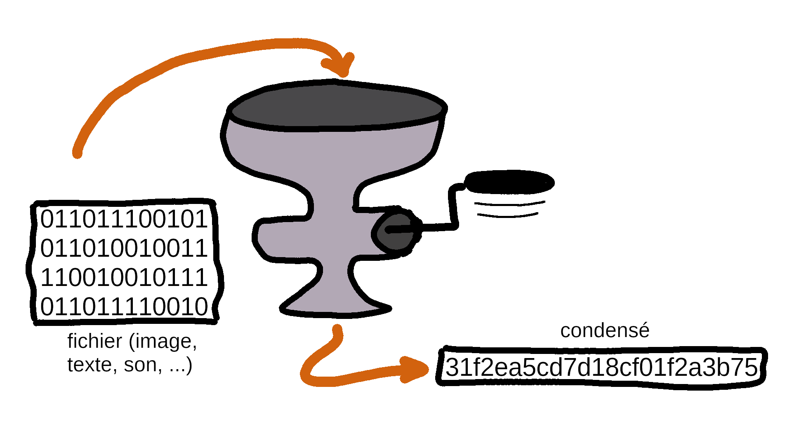

# Fonctions de hachage

{: .center width=640} 

!!! info "Principe"
    Une fonction de hachage a pour but de transformer une donnée informatique en un condensé (ou *hash*) de sorte que:

    - une même donnée donne toujours le même condensé;
    - le procédé est irréversible;
    - deux données différentes ne doivent pas donner le même condensé (sinon on parle de **collision**).

{: .center width=640} 

!!! gear "À quoi ça sert?"
    Le condensé d'une donnée/d'un fichier sert à le caractériser , avec beaucoup moins de bits!

    - signatures électroniques
    - vérifier l'intégrité
    - sécuriser 
    - créer une blockchain...


!!! code "En ligne de commande"

    ```bash
    ~$ echo -n "la NSI, c'est de l'eau" | md5sum
    194f05d7fb42018fb798a395039e778c  -
    ~$ echo -n "la NSI, c'est de l'eau!" | md5sum
    b8229a03e391dfc901a2e6c2f3a6e3cd  -
    ~$ echo -n "la NSI, c'est de l'eau!" | sha256sum 
    1dae53cba7ff51a81d6a8a3a6c23935dcc9040f0c6a33058d8e12f025a4d7d29  -

    ```
    


!!! code "Avec Python"
    On utilise le module `hashlib` qui contient les principaux algorithmes de hachage : MD5, SHA-1, SHA-256, etc.

    ```python linenums='1'
    import hashlib

    def hachage(chaine:str) -> str:
        '''
        renvoie le condensé de chaine en utilisant la fonction de
        hachage md5 du module hashlib.
        '''
        return hashlib.md5(chaine.encode()).hexdigest()
    ```
    