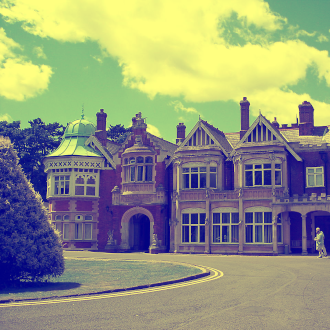

# Manipulation d'images avec PIL (pillow)


!!! note "Exemple"
    Pour illustrer la manipulation d'images, nous allons résoudre (ou tenter de résoudre) un des problèmes du concours Codémoi 2022-2023: «[Le ciel de Bletchley Park](https://iremsinfo.callicode.fr/ressources/chal/2023/CielBletchley/){:target="_blank"}».

    En voici l'énoncé:


    *Vous venez tout juste de récupérer une photo de Bletchley Park. Le ciel n’est pas toujours bleu dans le Buckingamshire, mais il a vraiment une couleur curieuse sur cette photo, tout comme les nuages.*

    {: .center} 

    *En allant jusqu’au bout... vous trouverez un mot de passe.*


Le module `#!py PIL` (Python Imaginig Library) ou son *fork* pillow est un puissant module Python permettant la création et la manipulation d'images.

Pour l'installer en ligne de commande, ouvrir un terminal et taper:

```bash
pip install pillow
```

## 1- Instructions de base

Dans le code ci-dessous:

- **ligne 1:** on importe le module (ligne 1)
- **ligne 3:** on charge une image existante (dans le même dossier que le fichier `#!py .py` !) dans une variable qui sera un tableau (à deux dimensions) de tuples contenant les composantes RGB des pixels
- **ligne 5:** on affiche l'image 
- **ligne 6:** on sauvegarde l'image (sous un nouveau nom de fichier). 


```python linenums='1'
from PIL import Image

img = Image.open("image.png")

img.show()
img.save("monimage.png")
```

!!! example "À vous de jouer"
    Enregistrer l'image ci-dessus dans un de vos dossier, puis enregistrer le code ci-dessus dans un fichier **dans le même dossier**.
    Éxécuter le code, puis récupérer en console les dimensions de l'image par:

    ```python
    >>> img.width, img.height
    ```
    


## 2- Gestion des pixels

Les deux méthodes fondamentales sont `#!py getpixel()`  pour accéder à un pixel de l'image, et `#!py putpixel()` pour modifier un pixel de l'image. Attention, les coordonnées du pixel doivent être données sous forme d'un tuple.

Par exemple:

```python 
img.getpixel((50, 100))              # récupère un tuple correspondant au pixel de coordonnées (50, 100)
img.putpixel((50, 100), (255, 0, 0)) # affecte la couleur rouge au pixel de coordonnées (50, 100)
```

!!! example "À vous de jouer"
    En console, afficher plusieurs pixels dont les coordonnées seront choisies au hasard.

    Que remarquez-vous à propos de la composante bleue?

Maintenant, pour traiter une image, il faut travailler pixel par pixel... pour tous les pixels de l'image. Il faut donc utiliser les méthodes `#!py getpixel()` et/ou `#!py putpixel()` pour toutes les coordonnées `#!py (x, y)` possibles.

On utilisera donc une *double boucle imbriquée* sur les dimensions de l'image (à compléter dans le code ci-dessous.

```python
for x in range(img.    ):
    for y in range(img.    ):
        # traitement du pixel
```

!!! example "À vous de jouer"
    Écrire un programme qui résout le problème, c'est-à-dire qui met en relief ce qu'on a remarqué précédemment sur les composantes bleues. On pourra soit modifier en place la variable `#!py img` soit créer une nouvelle image (voir ci-dessous).


## 3- Compléments

Créer une image vierge (de 200 pixels sur 300 par exemple), avec un fond blanc:

```python linenums='1'
img = Image.new("RGB", (200, 300), (255, 255, 255))
```


