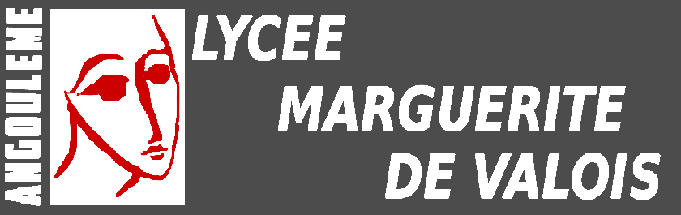

# Cours de Terminale NSI - M. Gouygou

{: .center width=640} 

[Lien vers le site de Première.](https://cgouygou.github.io/1NSI/){:target="_blank"}

 

=== "Programme"
    Le [programme](data/Tle_NSI_Specialite_Voie_G_1126614.pdf) de terminale NSI est articulé autour de cinq thèmes.

    Nous traiterons les différentes entrées du programme dans les chapitres suivants, où la mention  **→ BAC** indique les chapitres pouvant être évalués lors de l'épreuve écrite terminale de mars 2023.

    === "Thème 1"
        **[Thème 1: Structures de données](https://cgouygou.github.io/TNSI/T01_StructuresDonnees/accueil/)**

        1.1 Listes chaînées **→ BAC**
        
        1.2 Piles et Files **→ BAC**

        1.3 Dictionnaires **→ BAC**

        1.4 Arbres **→ BAC**
        
        1.5 Graphes

    
    === "Thème 2"
        **[Thème 2:  Langages et programmation](https://cgouygou.github.io/TNSI/T02_Programmation/accueil/)**

        2.1 Programmation orientée objet **→ BAC**

        2.2 Récursivité **→ BAC**

        2.3 Calculabilité et décidabilité

        2.4 Paradigmes de programmation

    === "Thème 3"
        **[Thème 3: Algorithmique](https://cgouygou.github.io/TNSI/T03_Algorithmique/accueil/)**

        3.1 Diviser pour régner **→ BAC**

        3.2 Programmation dynamique

        3.3 Recherche textuelle

    === "Thème 4"
        **[Thème 4: Bases de données](https://cgouygou.github.io/TNSI/T04_BasesDonnees/accueil/)**

        4.1 Modèle relationnel **→ BAC**

        4.2 Langage SQL **→ BAC**

    === "Thème 5"
        **[Thème 5: Architectures matérielles, systèmes d'exploitation et réseaux](https://cgouygou.github.io/TNSI/T05_ArchiMaterielle/accueil/)**

        5.1 Système sur puce

        5.2 Gestion des processus **→ BAC**

        5.3 Protocoles de routage **→ BAC**

        5.4 Sécurisation des communications

=== "Progression"
    <!-- - [Architecture Von Neumann (1ère)](https://glassus.github.io/premiere_nsi/T3_Architecture_materielle/3.2_Architecture_Von_Neumann/cours/)
    - [Systèmes sur puce](T5_Architecture_materielle/5.1_Systemes_sur_puce/cours/) 
    - [Gestion des processus](T5_Architecture_materielle/5.2_Gestion_des_processus/cours/)  
    - [Cryptographie](T5_Architecture_materielle/5.4_Cryptographie/cours/)
    - [Diviser pour régner](T3_Algorithmique/3.1_Diviser_pour_regner/cours/)
    - [Arbres](T1_Structures_de_donnees/1.3_Arbres/cours/)
    - [Protocoles de routage](T5_Architecture_materielle/5.3_Protocoles_de_routage/cours/)
    - [Dictionnaires](T1_Structures_de_donnees/1.2_Dictionnaires/cours/)  
    - [Langage SQL](T4_Bases_de_donnees/4.2_Langage_SQL/cours/)
    - [Modèle relationnel](T4_Bases_de_donnees/4.1_Modele_relationnel/cours/)
    - [Listes / piles / files](T1_Structures_de_donnees/1.1_Listes_Piles_Files/cours/)  
    - [Récursivité](T2_Programmation/2.2_Recursivite/cours/)  
    - [Programmation Orientée Objet](T2_Programmation/2.1_Programmation_Orientee_Objet/cours/)  -->
    
=== "Liens utiles"

    **À propos de la spécialité NSI**

    - [Le site Eduscol](https://eduscol.education.fr/2068/programmes-et-ressources-en-numerique-et-sciences-informatiques-voie-g){:target="_blank"} 
    - [Les trophées NSI](https://trophees-nsi.fr/){:target="_blank"} 

    **À propos de la culture des sciences de l'informatique**

    - [Interstices](https://interstices.info/){:target="_blank"} 

    - [Inria](https://www.inria.fr/fr){:target="_blank"} 

    **À propos de Python**

    - Une [interview](https://www.lemonde.fr/pixels/article/2018/07/25/je-n-imaginais-pas-que-python-connaitrait-un-tel-succes_5335917_4408996.html){:target="_blank"} de [Guido van Rossum](https://fr.wikipedia.org/wiki/Guido_van_Rossum){:target="_blank"} , le créateur de Python

    **À propos de l'orientation**

    - [Talents du numérique](https://talentsdunumerique.com/){:target="_blank"} 
    - Une [brochure](data/Infographie_TN.pdf){:target="_blank"} intéressante sur les métiers du numérique.
    - Un [podcast](https://pixees.fr/podcast/pod-nsi-orientation-post-bac/){:target="_blank"} sur les poursuites d'études (CPGE MPI, IUT, Université) après avoir choisi NSI comme spécialité au lycée.
    - [Zoom sur les métiers des mathématiques et de l'informatique](data/Zoom_metiers_maths.pdf){:target="_blank"} 
    - [Onisep](https://www.onisep.fr/Decouvrir-les-metiers/Actus-2022/Journee-nationale-NSI-numerique-et-sciences-informatiques){:target="_blank"} 

    **Pour se creuser la tête**

    Quelques sites de challenges/énigmes/défis de programmation:

    - [PyDéfis](https://pydefis.callicode.fr/){:target="_blank"} 
    - [Codémoi](https://iremsinfo.callicode.fr/concours/infos/){:target="_blank"}
    - [Advent of Code](https://adventofcode.com/){:target="_blank"} 
    - [MicroContest](http://www.microcontest.com/){:target="_blank"} 
    - [Hackinscience](https://www.hackinscience.org/){:target="_blank"} 

    **Pour se former en autonomie**

    Au cas où vous vous ennuieriez...

    - [France-IOI](http://www.france-ioi.org/){:target="_blank"} 
    - [CheckIO](https://checkio.org/){:target="_blank"} 
    - [CodinGame](https://www.codingame.com/start){:target="_blank"} 

=== "Sources"
    L'essentiel des sources des contenus de ce site:

    - L'excellentissime site de Gilles Lassus : [https://glassus.github.io/terminale_nsi/](https://glassus.github.io/terminale_nsi/){:target="_blank"} 
    - Le site de David Roche, [https://pixees.fr/informatiquelycee](https://pixees.fr/informatiquelycee){:target="_blank"} 
    - *Prépabac NSI, Tle générale*, C. Adobet, G. Connan, G. Rozsavolgyi, L. Signac, Hatier
    - *NSI Tle, 24 leçons avec exercices corrigés*, T. Balabonski, S. Conchon, J-C. Filiâtre, K. Nguyen, Ellipses
    - *Informatique et Sciences du Numérique*, G. Dowek, Eyrolles
    - Les ressources disponibles sur [https://gitlab.com/eskool/profs-info](https://gitlab.com/eskool/profs-info){:target="_blank"} et sur le [forum NSI - INRIA](https://mooc-forums.inria.fr/moocnsi/){:target="_blank"}
  
=== "Légende du site"
    !!! abstract "Cours/À savoir"

    !!! info "Remarque"

    !!! note "Exemple"

    !!! gear "Méthode/algorithme"

    !!! code "Code/Programme"
    
    !!! example "Exercice/TP"

    !!! tip "Astuce/conseil"

    !!! check "Solution/Correction"

    !!! warning "Attention/Remarque importante"

    !!! quote "Citation"

    !!! history "Histoire de l'informatique"

    !!! video "Video"

    !!! lien "Lien externe"

    !!! capytale "Lien vers activité Capytale"

    !!! pydefi "Pydéfi - c0d1ng UP"
    
<!-- === "Progression"
    Cette progression est découpée selon les 5 périodes entre les vacances.

    === "Période 1"

        6.1 Prise en main de Python

        1.1 Écriture d'un entier positif dans une base $b \geqslant 2$ (2, 10 ou 16).
        
        6.2 Utilisation de bibliothèques

        1.2 Valeurs et expressions booléennes

        1.3 Représentation binaire d'un entier relatif
    
    === "Période 2"

        6.3 Jeux de tests

        6.4 Spécification

        2.1 Tableaux et listes

        7.1 Parcours séquentiel d'un tableau

        1.4 Codage des caractères

        4.1 Pages Web et interactions

    === "Période 3"

        5.1 Modèle de Von Neumann

        2.2 Dictionnaires

        3.1 Manipulation, recherche et tri de tables

        3.2 Fusion et jointure de tables

        5.2 Systèmes d'exploitation

        7.2 Algorithmes de tri
    
    === "Période 4"

        4.2 Protocole HTTP

        4.3 Requêtes GET/POST et formulaires d'une page Web

        7.3 Recherche dichotomique dans un tableau trié

        5.3 Architecture d'un réseau

        1.5 Représentation des réels: nombres flottants
    
    === "Période 5"

        7.4 Algorithmes gloutons

        5.4 IHM, capteurs (Microbit)

        7.5 Algorithme des $k$ plus proches voisins

    {: .center} 

    <!-- https://cgouygou.github.io/1NSI/index.html -->
 

